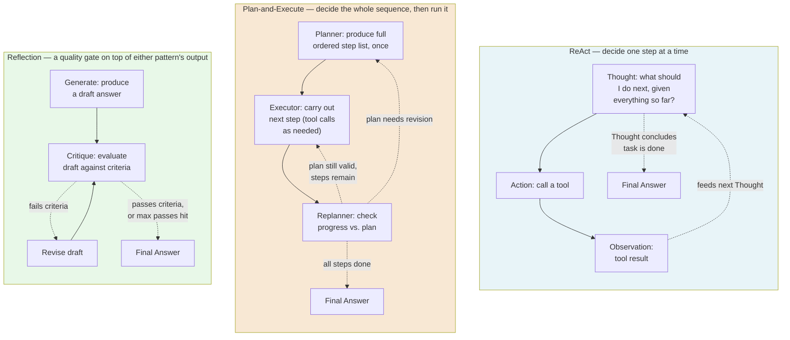
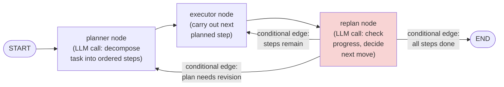
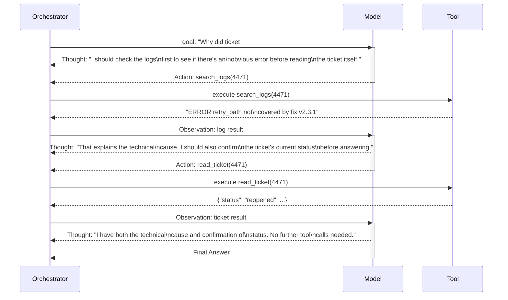
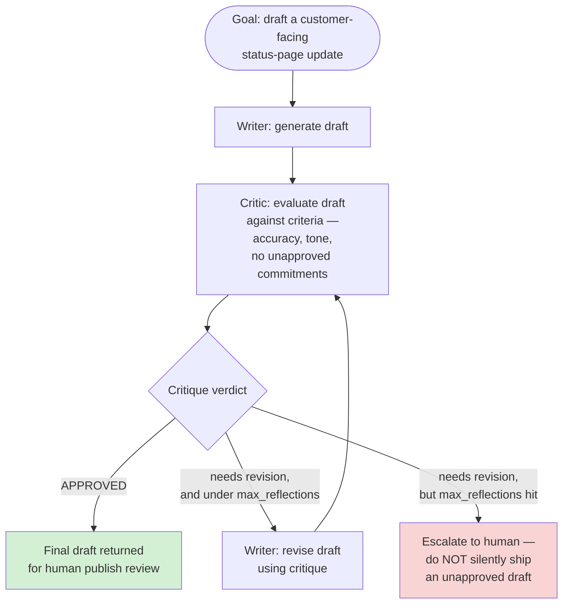
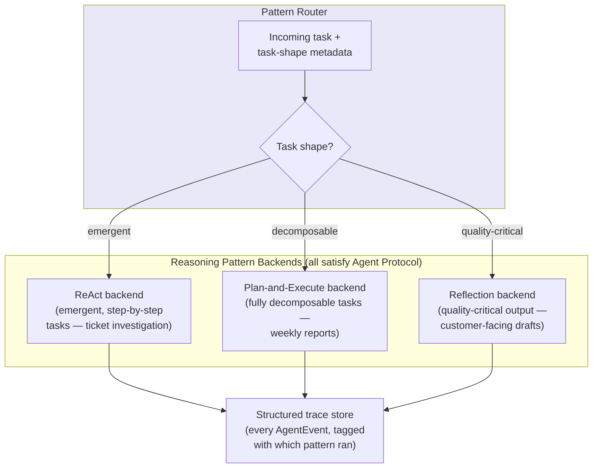
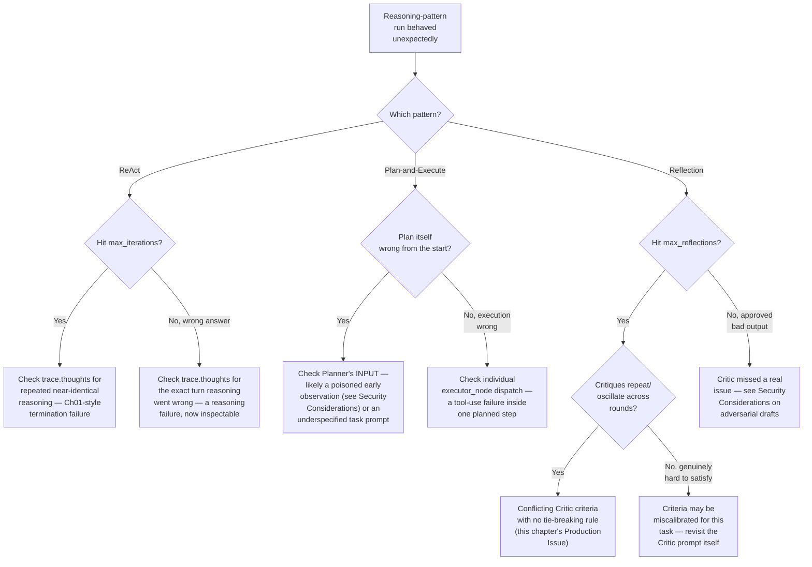

# Chapter 02 — Reasoning and Planning Patterns: ReAct, Plan-and-Execute, and Reflection

## Learning Objectives

By the end of this chapter, you will be able to:

- Explain the ReAct pattern precisely — the Thought → Action → Observation loop — and why capturing the model's reasoning as an explicit, inspectable trace matters beyond "the model thinking out loud."
- Build a ReAct loop that logs its own reasoning as a first-class, auditable artifact, and identify when ReAct's step-at-a-time structure becomes a liability rather than a strength.
- Implement the Plan-and-Execute pattern — Planner, Executor, and Replanner working together — using LangGraph's `StateGraph`, and articulate its concrete cost and latency advantage over ReAct for fully-decomposable tasks.
- Implement a Reflection pass in both its single-model and dual-role (Writer/Critic) forms, and reason about how many reflection iterations are actually worth their cost.
- Choose the right reasoning pattern for a given task's shape using a concrete decision framework, instead of defaulting to whichever pattern you learned first.
- Connect Chapter 01's failure taxonomy — specifically termination and reasoning failure — to pattern-specific failure modes that are now backed by this chapter's own worked examples, not just named in the abstract.
- Get oriented on Tree of Thoughts and Graph of Thoughts as the current frontier one level beyond this chapter's three core patterns, without needing to implement either yet.
- Recognize that a captured, structured reasoning trace (not just a final answer) is the raw material any future trajectory evaluator needs — the same principle Chapter 12 builds its own trajectory-recording pattern on.

## Prerequisites

- **Chapters completed:** Chapter 01 (Agent Architecture Deep Dive) — this chapter assumes you can already build a bounded agentic loop, understand blast radius and bounded autonomy, and are comfortable with this course's five-category failure taxonomy and its `Agent` / `AgentEvent` Protocol pattern.
- **Tools installed:**
  - Everything from Chapter 01 (`anthropic`, `claude-agent-sdk==0.2.115`)
  - `pip install langgraph==1.2.9` (this chapter's first hands-on LangGraph code — Chapter 01 only named it in comparison tables)
  - An Anthropic API key

## Estimated Reading Time

65–80 minutes

## Estimated Hands-on Time

2.5–3.5 hours

---

## ⚡ Fast Read

> **Skim time: 5 minutes** — Read this if you're in a hurry, returning for reference, or already familiar with part of this topic.

- **What it is:** Three named, distinct shapes for the "reason" half of Chapter 01's agentic loop — ReAct (decide one step at a time), Plan-and-Execute (decide the whole sequence up front, then run it), and Reflection (produce an answer, then critique and revise it before it ships).
- **Why it matters:** Chapter 01 taught you *that* an agent loops; it deliberately didn't tell you *how* the model should think inside that loop. Picking the wrong shape for a given task doesn't just cost a little efficiency — it produces measurably worse plans, wasted tool calls, or answers that ship without ever being checked.
- **Key insight:** These three patterns aren't competing for the same job. ReAct is for tasks where each step's outcome changes what the *next* step should be. Plan-and-Execute is for tasks where the whole sequence is knowable before you start. Reflection isn't a control-flow pattern at all — it's a quality gate you can bolt onto the output of either of the other two. Most production agents end up using more than one, chosen per task, not one pattern for everything.
- **What you build:** A ReAct loop with its reasoning captured as an auditable trace, a LangGraph Plan-and-Execute graph with a real Planner/Executor/Replanner cycle, and a dual-role Writer/Critic Reflection pass — all three built as interchangeable pieces behind Chapter 01's `Agent` Protocol.
- **Jump to:** [Core Concepts](#core-concepts) | [First Code](#beginner-implementation) | [Best Practices](#best-practices) | [Mini Project](#mini-project)

---

## Why This Topic Exists

Go back to Chapter 01's Diagram 3 — the sequence diagram of one ReAct-shaped loop iteration. It showed the model deciding, on each turn, whether to call a tool or stop. That's a completely valid way to build an agent. It is also not the *only* way, and for a meaningful slice of real tasks, it's not even the best way.

Here's the concrete problem. Chapter 01's Aperture Cloud support-insights agent investigated one ticket at a time — each tool call's result genuinely changed what the next sensible action was, so deciding step-by-step made sense. Now imagine Aperture Cloud also wants a **weekly engineering health report**: pull last week's reopened-ticket count, pull last week's deploy count, pull last week's incident count, and synthesize a summary. Every one of those steps is knowable *before you start* — you don't need the reopened-ticket count back before you know you're also going to need the deploy count. Running that task through a step-at-a-time ReAct loop works, but it re-derives "what do I do next?" from scratch on every single turn, paying a full model call each time to arrive at a decision that was actually knowable up front. That's real, measurable, avoidable cost — and it's the first reason this chapter exists: **matching the reasoning pattern to the task's actual shape is an engineering decision with a real cost consequence, not a stylistic preference.**

The second problem ReAct alone doesn't solve: neither ReAct nor Plan-and-Execute puts anything in the loop that specifically double-checks the *quality* of the final answer before it ships. A ReAct loop stops the moment the model decides it's done; a Plan-and-Execute pipeline stops the moment the last planned step completes. Neither one asks "is this actually good?" If Aperture Cloud wants an agent to draft a customer-facing status-page update, "the loop terminated successfully" is not the same thing as "the loop produced something safe to publish." That's what Reflection is for — and it's why this chapter treats it as a genuinely separate pattern, not a footnote on the other two.

## Real-World Analogy

Picture three different ways a senior engineer might approach three different requests from their manager.

**Request one: "Figure out why the payments service alerted at 3am last night."** The engineer doesn't write a plan first — they can't. They check the alert, see what it points to, check that thing, see what *that* points to, and keep following the trail one link at a time until they find the cause. Each step genuinely depends on what the last one revealed. This is **ReAct**: reason, act, observe, and let the observation shape the next reasoning step.

**Request two: "Prepare the quarterly infrastructure cost report."** The engineer already knows, before touching anything, exactly what data they need: compute spend, storage spend, network spend, and last quarter's numbers for comparison. They write that list down first, then go get each number — and if pulling compute spend doesn't change what data they need for storage spend, there's no reason to re-derive the plan after every single lookup. This is **Plan-and-Execute**: decide the whole sequence up front, then work through it, only replanning if something breaks an assumption.

**Request three: "Draft the message we're sending to every customer about the outage."** The engineer writes a first draft quickly — then doesn't send it. They reread it, or better, hand it to a colleague, specifically looking for what's wrong: too technical, missing an apology, an implied promise legal wouldn't approve. They revise based on that critique, and maybe do one more pass, before it goes out. This is **Reflection**: the *drafting* task might use either of the other two patterns internally, but a distinct critique-and-revise step sits on top of it before the result is trusted.

Notice: the same engineer used all three approaches in one day, chosen by the shape of the request, not by habit. That's the discipline this chapter is teaching.

---

## Core Concepts

### Thought (Explicit Reasoning Trace)

**Technical definition:** A natural-language statement of the model's own reasoning, produced and captured as a distinct, inspectable artifact — separate from the tool call or final answer it leads to — before an action is taken.

**Plain English:** The model writing down *why* it's about to do something, not just doing it.

**Analogy:** A doctor who says "I'm ordering this blood test because the symptoms suggest X, and this test would confirm or rule it out" out loud, versus one who silently orders tests with no stated reasoning — the first is auditable by a colleague later; the second isn't, even if both doctors reach the same correct diagnosis.

> Current guidance (verified for this chapter) treats this out loud, explicit-Thought property as more than a debugging nicety — in regulated or trust-sensitive contexts, an explicit reasoning trace is what lets a human reviewer verify *why* an agent acted, not just *what* it did. This directly extends Chapter 01's "trace every step, not just the final answer" best practice: a Thought is the specific artifact that makes a trace explain itself.

### The ReAct Loop

**Technical definition:** An agentic reasoning pattern in which the model alternates, turn by turn: **Thought** (reason about the current state and decide the next action) → **Action** (a tool call) → **Observation** (the tool's result), feeding each observation back into the next Thought, until the model's Thought concludes the task is complete.

**Plain English:** Chapter 01's generic agentic loop, specifically instrumented so the model's reasoning at each step is captured as text you can read, not just inferred from which tool it called.

**Analogy:** The 3am payments-alert investigation above — each Thought is the engineer narrating what they're checking next and why, out loud, as they follow the trail.

### Plan-and-Execute

**Technical definition:** A reasoning pattern that separates *deciding the sequence of steps* from *carrying them out*: a **Planner** produces an ordered list of steps for the whole task up front; one or more **Executor** steps carry out each planned step (including any needed tool calls) without re-consulting the planner after every individual action; a **Replanner** step periodically reviews progress against the plan and decides whether to continue, revise the remaining plan, or conclude.

**Plain English:** Write the whole to-do list first, then work through it — checking in to revise the list only if something along the way makes the original plan wrong.

**Analogy:** The quarterly cost report — the engineer's up-front list of "compute, storage, network, prior-quarter comparison" is the plan; pulling each number is execution; only if, say, storage spend turns out to include a one-time migration cost that needs its own follow-up line item does the engineer stop and revise the list (replan).

### Reflection (and Reflexion, More Precisely)

**Technical definition:** A quality-control pattern layered on top of a generated output: **generate** a draft, **critique** it against explicit criteria, and **revise** based on that critique — optionally repeated until the critique passes a quality threshold or a maximum number of passes is reached. **Reflexion**, specifically, is Reflection augmented with *persisted* memory of past critiques — a text summary of what went wrong (or right) on a prior, similar task, retrieved and used to inform future attempts, rather than critique-and-revise happening fresh within a single task every time.

**Plain English:** Reflection is "write it, then check your own work before you turn it in." Reflexion is that same habit, plus actually remembering what you got dinged for last time so you don't repeat it.

**Analogy:** Reflection is proofreading your own email before sending it. Reflexion is keeping a running list of mistakes your manager has caught in past emails, and checking new drafts against that list specifically — not just rereading with fresh eyes each time.

> Because Reflexion's defining feature is *persisted* memory across tasks, this chapter builds and demonstrates plain Reflection (critique-and-revise within a single task) in full — Reflexion's persistence layer is a direct extension you'll have the tools to build once Chapter 04 (Agent Memory Systems) covers long-term memory. Flagging that connection now is deliberate; don't be surprised when Chapter 04 picks this exact thread back up.

### Single-Model vs. Dual-Role Reflection

**Technical definition:** Two implementation patterns for Reflection. **Single-model reflection** uses one model, prompted differently for the generation step and the critique step (two calls, same underlying model, different instructions). **Dual-role reflection** uses two distinct roles — commonly named **Writer** and **Critic** — which may be separately configured (different system prompts, different tool access, even different models), with the Critic's entire job being to find fault, never to draft.

**Plain English:** Single-model is you rereading your own work. Dual-role is handing it to someone whose job is specifically to poke holes in it.

**Analogy:** Editing your own essay (single-model) versus giving it to a peer reviewer who never wrote a word of it and has no attachment to defending it (dual-role) — the second tends to catch things the first misses, precisely because the Critic has no incentive to rationalize the Writer's choices.

### Task Shape

**Technical definition:** This chapter's working term for the property of a task that determines which reasoning pattern fits it: specifically, whether the task's steps are **knowable up front** (favors Plan-and-Execute), **only knowable as you go** (favors ReAct), or **quality-critical enough that the output itself needs verification before it's trusted** (favors adding Reflection on top of whichever of the first two produced it).

**Plain English:** What kind of task is this, structurally — and does that structure tell you which reasoning pattern actually fits?

**Analogy:** You wouldn't use a road-trip itinerary (a plan) for a search-and-rescue operation where each discovery changes where you look next, and you wouldn't improvise step-by-step (ReAct) for a well-understood, repeatable checklist task — matching the tool to the shape of the problem is the entire discipline this chapter teaches.

### Tree of Thoughts (ToT) and Graph of Thoughts (GoT)

**Technical definition:** Reasoning patterns that generalize beyond ReAct's single linear chain of Thought → Action → Observation steps. **Tree of Thoughts** has the model propose multiple candidate next-steps at each point (not just one), evaluate each candidate, and search across the resulting tree (commonly via beam search or breadth-first search) toward a solution, pruning weak branches. **Graph of Thoughts** generalizes further still — branches can merge and recombine into an arbitrary graph, not just split into a tree — for problems where a good solution genuinely draws on combining multiple partial lines of reasoning rather than picking the single best one.

**Plain English:** ReAct commits to one idea per step and moves on. ToT tries several ideas at each step and picks the most promising branch to continue. GoT goes further and lets good partial ideas from *different* branches combine into a better one.

**Analogy:** ReAct is one detective following one lead at a time. ToT is a small team of detectives each chasing a different lead in parallel, reporting back so the strongest lead gets more resources. GoT is that same team, except two detectives' partial findings can be combined into a new, stronger lead neither had alone.

> **Currency Note:** ToT and GoT are confirmed, current (2026), named patterns — genuinely useful for tasks with branching or interdependent reasoning (constrained multi-step planning, theorem proving, complex strategy). This chapter's title and scope (per `COURSE_INDEX.md`) commit to ReAct, Plan-and-Execute, and Reflection as the three patterns you'll actually *build* here — ToT and GoT get this conceptual introduction and a comparison row in the [Technology Comparison](#technology-comparison-reasoning-patterns-at-a-glance) table below, not a full implementation tier. Treat them as the next rung up in reasoning sophistication once you've internalized the three foundational patterns this chapter builds.

---

## Architecture Diagrams

### Diagram 1 — Three Patterns, Side by Side



Notice the dotted line inside Reflection isn't optional the way it might look — it's exactly Chapter 01's bounded-loop lesson applied to a new pattern. A Reflection loop with no cap on revision passes is just as capable of a termination failure as an unbounded ReAct loop was in Chapter 01.

### Diagram 2 — Plan-and-Execute as a LangGraph State Machine

This is the exact shape you'll build in the [Intermediate Implementation](#intermediate-implementation) section below — the first chapter in this course to write real LangGraph code, not just name it in a comparison table.



The **conditional edge** out of `replan` is the load-bearing piece of this graph — it's the mechanism that decides, based on the current state, which of three destinations comes next. Without it, this would just be a fixed three-step pipeline, not a reasoning pattern with any adaptive capacity at all.

## Flow Diagrams

### Diagram 3 — ReAct, With the Thought Made Explicit

This continues Chapter 01's Aperture Cloud ticket-investigation scenario, but now shows the reasoning trace this chapter's Beginner Implementation actually captures — Chapter 01's Diagram 3 showed the same mechanics without surfacing the model's stated reasoning at each turn.



Every `Thought:` line in this diagram is data your orchestrator can log, store, and show a human reviewer — that's the entire architectural payoff of treating ReAct's reasoning as an explicit artifact instead of an implicit byproduct of which tool got called.

### Diagram 4 — Reflection's Generate → Critique → Revise Cycle



The `Escalate` branch is not an edge case you can skip. A Reflection loop that hits its iteration cap without ever reaching `APPROVED` has failed exactly the way an unbounded ReAct loop fails in Chapter 01 — the difference is that here, silently returning the best-so-far draft is actively worse than raising, because "best-so-far" for a customer-facing message that never passed its own quality bar is not a safe default.

---

## Beginner Implementation

This builds directly on Chapter 01's hand-rolled loop, with one deliberate change: the system prompt now requires an explicit `Thought:` before every action, and the orchestrator captures that Thought as a distinct, logged field — not just inferred from which tool got called.

```python
# Learning example — ReAct with an explicit, captured reasoning trace.
# Builds on Chapter 01's Beginner Implementation; same Aperture Cloud
# ticket-investigation scenario, same tools.
import json
from dataclasses import dataclass, field
from anthropic import Anthropic

client = Anthropic()

FAKE_TICKETS = {"4471": {"status": "reopened", "product": "billing-service"}}
FAKE_LOGS = {"4471": "ERROR retry_path not covered by fix v2.3.1"}


def read_ticket(ticket_id: str) -> str:
    ticket = FAKE_TICKETS.get(ticket_id)
    if ticket is None:
        return json.dumps({"status": "not_found", "ticket_id": ticket_id})
    return json.dumps({"status": "ok", **ticket})


def search_logs(ticket_id: str) -> str:
    entry = FAKE_LOGS.get(ticket_id)
    if entry is None:
        return json.dumps({"status": "no_entries_found"})
    return json.dumps({"status": "ok", "entry": entry})


TOOLS = [
    {
        "name": "read_ticket",
        "description": "Look up a support ticket's status and product area.",
        "input_schema": {
            "type": "object",
            "properties": {"ticket_id": {"type": "string"}},
            "required": ["ticket_id"],
        },
    },
    {
        "name": "search_logs",
        "description": "Search recent error logs associated with a ticket ID.",
        "input_schema": {
            "type": "object",
            "properties": {"ticket_id": {"type": "string"}},
            "required": ["ticket_id"],
        },
    },
]
TOOL_IMPLEMENTATIONS = {"read_ticket": read_ticket, "search_logs": search_logs}

# This system prompt is the entire mechanism that turns Chapter 01's
# generic loop into a ReAct loop specifically: it requires the model
# to state a Thought, as plain text, before every tool call.
REACT_SYSTEM_PROMPT = """You are a support-insights assistant. For every
action you take, first write a line starting with "Thought:" explaining
your reasoning, THEN make the tool call. Only stop calling tools once
your Thought concludes you have enough information to answer fully."""


@dataclass
class ReActTrace:
    """The captured reasoning trace for one run — this IS the audit
    trail current guidance treats as a trust/debugging asset, not
    just a nice-to-have."""
    thoughts: list[str] = field(default_factory=list)
    actions: list[dict] = field(default_factory=list)


def run_react_agent(goal: str, max_iterations: int = 6) -> tuple[str, ReActTrace]:
    trace = ReActTrace()
    messages = [{"role": "user", "content": goal}]

    for iteration in range(max_iterations):
        response = client.messages.create(
            model="claude-sonnet-5",
            max_tokens=1024,
            system=REACT_SYSTEM_PROMPT,
            tools=TOOLS,
            messages=messages,
        )

        # Capture the Thought: any text block emitted this turn is,
        # by construction of the system prompt, the model's stated
        # reasoning for whatever it does next.
        for block in response.content:
            if block.type == "text" and block.text.strip():
                trace.thoughts.append(block.text.strip())

        tool_calls = [b for b in response.content if b.type == "tool_use"]
        if not tool_calls:
            final_answer = "\n".join(trace.thoughts[-1:])  # last Thought is the answer
            return final_answer, trace

        messages.append({"role": "assistant", "content": response.content})

        tool_results = []
        for call in tool_calls:
            trace.actions.append({"iteration": iteration, "tool": call.name, "args": call.input})
            output = TOOL_IMPLEMENTATIONS[call.name](**call.input)
            tool_results.append(
                {"type": "tool_result", "tool_use_id": call.id, "content": output}
            )
        messages.append({"role": "user", "content": tool_results})

    raise RuntimeError(f"ReAct loop exceeded {max_iterations} iterations without concluding")


if __name__ == "__main__":
    answer, trace = run_react_agent("Why did ticket #4471 reopen?")
    print("ANSWER:", answer)
    print("\nREASONING TRACE:")
    for i, thought in enumerate(trace.thoughts):
        print(f"  Thought {i}: {thought}")
    print("\nACTIONS TAKEN:")
    for action in trace.actions:
        print(f"  {action['tool']}({action['args']})")
```

**What's actually different from Chapter 01, and why it matters:**

- `REACT_SYSTEM_PROMPT` is the whole mechanism. Chapter 01's loop was already structurally a ReAct-shaped loop — Thought → Action → Observation — but it never *required* the model to externalize the Thought as text you could capture. This version does, which is the difference between "ReAct happens to be what's going on under the hood" and "ReAct is what you can prove happened, after the fact."
- `ReActTrace` exists as its own small object specifically so the reasoning trace is a first-class return value, not something you'd have to reconstruct by re-reading raw API request/response logs after something goes wrong.
- This still has Chapter 01's bound (`max_iterations`) and its `RuntimeError` on exceeding it — nothing about adding an explicit Thought changes the bounded-autonomy discipline from Chapter 01. If anything, a captured trace makes diagnosing *why* a bound tripped faster, since you can read the model's own stated reasoning at each step instead of inferring it from tool calls alone.

> **Common mistake:** it's tempting to skip capturing `trace.thoughts` and just log tool calls, on the theory that "the tool calls are what actually happened, the reasoning is just flavor text." Revisit the Production Issue in this chapter's [Production Architecture](#production-architecture) section — the failure it describes is only diagnosable *because* the reasoning trace was captured, not just the actions.

## Intermediate Implementation

Now the task shape changes. Aperture Cloud's weekly engineering health report doesn't need step-by-step improvisation — every data point it needs is knowable before the first tool call. This is Plan-and-Execute's exact use case, and it's this course's first real LangGraph code.

```python
# Learning example — Plan-and-Execute using LangGraph's StateGraph.
# Pinned version verified 2026-07-11: langgraph==1.2.9
import json
from typing import Optional, TypedDict
from langgraph.graph import StateGraph, START, END
from anthropic import Anthropic

client = Anthropic()


class PlanExecuteState(TypedDict):
    task: str
    plan: list[str]
    completed_steps: list[dict]
    response: Optional[str]


# --- Stubbed data sources for the weekly report -----------------------
def fetch_reopened_ticket_count() -> str:
    return "14 tickets reopened this week"

def fetch_deploy_count() -> str:
    return "23 deploys shipped this week, 2 rolled back"

def fetch_incident_count() -> str:
    return "1 P2 incident, 0 P1 incidents this week"

STEP_EXECUTORS = {
    "reopened tickets": fetch_reopened_ticket_count,
    "deploys": fetch_deploy_count,
    "incidents": fetch_incident_count,
}


def execute_step(step_description: str) -> str:
    """Dispatches a planned step to the right data source. In
    production this would route to real tools/MCP servers per step;
    here it's a simple keyword match to keep the graph's mechanics
    the focus."""
    for keyword, executor in STEP_EXECUTORS.items():
        if keyword in step_description.lower():
            return executor()
    return f"No data source available for: {step_description}"


# --- The three nodes ----------------------------------------------------
def planner_node(state: PlanExecuteState) -> dict:
    prompt = f"""Break this task into an ordered list of concrete,
independent data-gathering steps. Respond with ONLY a JSON array of
short step descriptions, nothing else.

Task: {state['task']}"""
    response = client.messages.create(
        model="claude-sonnet-5", max_tokens=512,
        messages=[{"role": "user", "content": prompt}],
    )
    plan = json.loads(response.content[0].text)
    return {"plan": plan, "completed_steps": []}


def executor_node(state: PlanExecuteState) -> dict:
    next_step = state["plan"][0]
    result = execute_step(next_step)
    return {
        "plan": state["plan"][1:],
        "completed_steps": state["completed_steps"] + [{"step": next_step, "result": result}],
    }


def replan_node(state: PlanExecuteState) -> dict:
    if state["plan"]:
        # Steps remain — nothing to decide yet, executor continues.
        return {}

    # All planned steps are done. Synthesize the final report from
    # everything gathered, in one call, instead of one call per step.
    findings = "\n".join(f"- {c['step']}: {c['result']}" for c in state["completed_steps"])
    prompt = f"""All data has been gathered for the weekly engineering
health report. Write a concise summary.

Findings:
{findings}"""
    response = client.messages.create(
        model="claude-sonnet-5", max_tokens=1024,
        messages=[{"role": "user", "content": prompt}],
    )
    return {"response": response.content[0].text}


def route_after_replan(state: PlanExecuteState) -> str:
    """The conditional edge's routing function — reads state, returns
    a destination name. Per current LangGraph guidance, this function
    must stay read-only: no LLM calls, no state mutation, no side
    effects — just a decision."""
    return "end" if state.get("response") else "executor"


# --- Assemble the graph --------------------------------------------------
graph = StateGraph(PlanExecuteState)
graph.add_node("planner", planner_node)
graph.add_node("executor", executor_node)
graph.add_node("replan", replan_node)

graph.add_edge(START, "planner")
graph.add_edge("planner", "executor")
graph.add_edge("executor", "replan")
graph.add_conditional_edges("replan", route_after_replan, {"executor": "executor", "end": END})

app = graph.compile()

if __name__ == "__main__":
    result = app.invoke({
        "task": "Generate this week's engineering health report: reopened tickets, deploys, incidents",
        "plan": [], "completed_steps": [], "response": None,
    })
    print(result["response"])
```

**Why this is architecturally different from the Beginner Implementation, not just a bigger version of it:**

- The planner is called **once** (barring a genuine replan), not once per step. Compare this to the ReAct loop above, which pays for one full model call *per Thought*, every iteration. For a three-step, fully-knowable task like this one, Plan-and-Execute needs a planner call, three cheap deterministic dispatches through `execute_step` (no model call at all for routing — the step descriptions are matched directly), and one synthesis call. That's the concrete cost/latency advantage this chapter's research confirmed: fewer LLM calls for multi-step tasks whose steps don't need to be decided one at a time.
- `route_after_replan` is deliberately a pure function — it reads `state`, returns a string, and does nothing else. This isn't a style preference; current LangGraph guidance is explicit that a conditional edge's routing function shouldn't itself call an LLM or mutate state, because doing so muddies exactly which node is responsible for which side effect, making the graph harder to reason about and debug.
- If `execute_step` needed genuine judgment per step (not just a keyword dispatch), each step would itself become a small ReAct loop invoked *inside* the executor node — this is the concrete answer to "can these patterns nest?" Yes, routinely: Plan-and-Execute at the top level, ReAct inside an individual step that turns out to need it.

## Advanced Implementation

The weekly report above needed correct data, not persuasive writing. Aperture Cloud's third scenario is the opposite: a draft customer-facing status-page update, where being *correct* isn't enough — tone, unintended commitments, and clarity all matter, and a human still reviews it before it publishes (this stays Module-1-appropriate: read-only investigation and low-stakes drafting, never automated posting). This is Reflection's exact use case, built here as a dual-role Writer/Critic pattern, wrapped behind Chapter 01's `Agent` Protocol so it's swappable with the other two patterns at the call site.

```python
# Production example — dual-role Reflection, satisfying Chapter 01's
# Agent Protocol so it's interchangeable with the ReAct and
# Plan-and-Execute implementations above at any calling code's level.
from __future__ import annotations
from dataclasses import dataclass
from typing import AsyncIterator
from anthropic import AsyncAnthropic

# Reused from Chapter 01's Advanced Implementation:
#   AgentEvent(kind: str, payload: str)
#   Agent(Protocol) — async def run(self, goal) -> AsyncIterator[AgentEvent]

client = AsyncAnthropic()

WRITER_SYSTEM_PROMPT = """You draft customer-facing status-page updates
for Aperture Cloud. Be clear, honest about impact, and never promise a
specific fix timeline unless one was explicitly provided."""

CRITIC_SYSTEM_PROMPT = """You review a DRAFT status-page update, never
write one yourself. Check specifically for: (1) any timeline promise
not explicitly supported by the input facts, (2) overly technical
language a non-engineer customer wouldn't understand, (3) a missing
acknowledgment of customer impact. Respond with "APPROVED" if none of
these issues are present, or a numbered list of exactly what to fix."""


@dataclass
class ReflectionAgent:
    """Dual-role Writer/Critic reflection, bounded exactly like every
    other loop in this course — max_reflections plays the same role
    Chapter 01's max_iterations and this chapter's Plan-and-Execute
    graph both play: a hard, code-enforced cap the model cannot
    reason its way past."""
    max_reflections: int = 2

    async def run(self, goal: str) -> AsyncIterator["AgentEvent"]:
        draft = await self._write(goal)
        yield AgentEvent(kind="tool_call", payload=f"draft v1:\n{draft}")

        for reflection_pass in range(self.max_reflections):
            critique = await self._critique(goal, draft)
            yield AgentEvent(kind="tool_result", payload=f"critique:\n{critique}")

            if critique.strip().startswith("APPROVED"):
                yield AgentEvent(kind="final_answer", payload=draft)
                return

            draft = await self._revise(goal, draft, critique)
            yield AgentEvent(kind="tool_call", payload=f"draft v{reflection_pass + 2}:\n{draft}")

        # Reflection never reached APPROVED within the bound — per
        # Diagram 4, this escalates rather than silently shipping an
        # unapproved draft. A customer-facing message that never
        # passed its own quality bar is not a safe default output.
        raise RuntimeError(
            f"Draft did not reach APPROVED within {self.max_reflections} reflection passes — "
            f"escalate to a human editor, do not publish"
        )

    async def _write(self, goal: str) -> str:
        response = await client.messages.create(
            model="claude-sonnet-5", max_tokens=512,
            system=WRITER_SYSTEM_PROMPT,
            messages=[{"role": "user", "content": goal}],
        )
        return response.content[0].text

    async def _critique(self, goal: str, draft: str) -> str:
        response = await client.messages.create(
            model="claude-sonnet-5", max_tokens=512,
            system=CRITIC_SYSTEM_PROMPT,
            messages=[{"role": "user", "content": f"Task: {goal}\n\nDraft:\n{draft}"}],
        )
        return response.content[0].text

    async def _revise(self, goal: str, draft: str, critique: str) -> str:
        response = await client.messages.create(
            model="claude-sonnet-5", max_tokens=512,
            system=WRITER_SYSTEM_PROMPT,
            messages=[{
                "role": "user",
                "content": f"Task: {goal}\n\nYour previous draft:\n{draft}\n\n"
                            f"Editor's critique:\n{critique}\n\nRevise accordingly.",
            }],
        )
        return response.content[0].text
```

**Why the dual-role split matters here specifically, not just as an abstraction exercise:**

- `CRITIC_SYSTEM_PROMPT` explicitly forbids the Critic from writing — "never write one yourself." This is the entire point of the dual-role pattern over single-model reflection: a model prompted to both write *and* critique its own work has a documented tendency to rationalize its own choices rather than genuinely finding fault, the same failure mode a human has reviewing their own writing. Separating the roles — even though it's the *same underlying model* behind both calls here — measurably changes what gets caught, because the Critic's prompt gives it no stake in defending the draft.
- Because `ReflectionAgent` satisfies the same `Agent` Protocol as Chapter 01's `HandRolledAgent` and `SDKBackedAgent`, and this chapter's own ReAct and Plan-and-Execute implementations could be wrapped the same way, a real Aperture Cloud pipeline can choose *which reasoning pattern* to run per task at the call site — exactly the [Production Architecture](#production-architecture) pattern below.
- The `RuntimeError` on exhausting `max_reflections` is deliberately not a silent fallback to "just return the last draft anyway." Compare this to Chapter 01's bound-trip exception on its `run_agent` function — same discipline, applied to a pattern where silently shipping the unapproved output is actively dangerous rather than merely wasteful.

---

## Production Architecture

Here's how Aperture Cloud actually wires these three patterns together into one service, choosing per task rather than committing to a single pattern platform-wide.



The `Decide` step doesn't need to be another LLM call — for most production systems it's a simple, deterministic classification based on which endpoint or task template was invoked (Aperture Cloud's "investigate a ticket" button always routes to ReAct; its "generate weekly report" cron job always routes to Plan-and-Execute). Task-shape classification only needs to become its own reasoning problem if the system is generic enough that task shape genuinely isn't known ahead of time — a harder problem this course doesn't need to solve in Module 1.

### Production Issue: Reflection Loop Oscillates Between Two Drafts, Never Converges

**Symptoms**
A status-page-update Reflection run hits its `max_reflections` bound and raises, every time, for a specific class of incident update. Reading the trace, draft v1 gets critiqued as "too technical, simplify the error description." Draft v2 simplifies it — and gets critiqued as "too vague, customers need to know what actually broke." Draft v3 re-adds detail — and gets critiqued as "too technical" again, nearly word-for-word the same critique as round one.

**Root Cause**
The Critic's two stated criteria — plain language and technical specificity — are in direct tension for this particular incident (a database failover), and the Critic was never given guidance on how to *balance* that tension, only a checklist to apply independently each round. The Writer, with no memory of the fact that round one's "too vague" critique and round three's "too technical" critique are pulling in opposite directions, keeps overcorrecting toward whichever single critique it saw most recently. This is a termination failure by Chapter 01's taxonomy — structurally identical to the runaway `search_logs` loop from Chapter 01's own Production Issue, but happening inside a Reflection pattern instead of a ReAct one, and caused by conflicting quality criteria instead of an ambiguous tool result.

**How to Diagnose It**
- Pull the full sequence of drafts and critiques from the trace (this is only possible because `ReflectionAgent.run` yields an `AgentEvent` for every draft and every critique, not just the final one).
- Look for a critique on a later pass that substantially repeats a critique from an earlier pass — that's the oscillation signature, the Reflection-pattern equivalent of ReAct's repeated-identical-tool-call signature from Chapter 01.
- Confirm whether the criteria being invoked across the oscillating critiques are genuinely in tension for this specific input, or whether the Critic is just being inconsistent given the same draft twice — the fix differs depending on which it is.

**How to Fix It**
```python
# Before: criteria applied independently, no guidance on how to
# balance them when they conflict.
CRITIC_SYSTEM_PROMPT = """You review a DRAFT status-page update...
Check specifically for: (1) timeline promises... (2) overly technical
language... (3) missing impact acknowledgment..."""

# After: explicit tie-breaking guidance for the documented conflict.
CRITIC_SYSTEM_PROMPT = """You review a DRAFT status-page update...
Check specifically for: (1) timeline promises... (2) overly technical
language... (3) missing impact acknowledgment...

If a fix for one criterion would worsen another (for example,
simplifying language enough to satisfy "not overly technical" would
remove detail needed to satisfy "not too vague"), do not flag both —
pick the ONE most important issue for THIS draft and flag only that,
explicitly naming the tradeoff you're prioritizing."""
```
Giving the Critic an explicit tie-breaking rule for a *documented, real* conflict between its own criteria stops it from issuing contradictory feedback across rounds — which is what was actually driving the oscillation, not any flaw in the Writer's revisions.

**How to Prevent It in Future**
- Whenever a Critic's prompt lists more than one criterion, ask explicitly: can any two of these conflict for a plausible input? If yes, write the tie-breaking rule into the prompt before shipping, not after the first oscillating run.
- Log a same-critique-recurrence check the same way Chapter 01 recommended logging a same-tool-call-recurrence check — an early-warning metric that fires before the hard `max_reflections` bound does.
- Consider giving the Writer visibility into the *history* of critiques, not just the most recent one, for tasks where round-over-round consistency matters — this is a lightweight, in-task version of exactly the persisted-memory idea that separates full Reflexion from plain Reflection, previewed in this chapter's Core Concepts and built out properly in Chapter 04.

---

## Best Practices

1. **Classify task shape before choosing a pattern, and write that decision down.** Don't let "which pattern does this agent use" be an implicit consequence of whoever wrote the first version — the [Decision Framework](#decision-framework-choosing-a-reasoning-pattern-by-task-shape) below exists so this is a deliberate, revisitable choice.
2. **Capture the reasoning trace as structured data, not just log lines.** `ReActTrace`'s `thoughts` and `actions` lists, and `ReflectionAgent`'s per-round `AgentEvent`s, are what make both the Debugging Guide below and Chapter 12's evaluation work possible.
3. **Keep conditional-edge routing functions pure.** No LLM calls, no state mutation, no side effects inside a LangGraph routing function — it should only read state and return a destination name, exactly as `route_after_replan` does above.
4. **Give a Critic explicit tie-breaking guidance whenever it has more than one criterion.** This chapter's Production Issue exists because two individually-reasonable criteria conflicted with no guidance on which should win.
5. **Bound every pattern, not just ReAct.** Plan-and-Execute's replan loop and Reflection's revision loop both need the same hard iteration cap Chapter 01 established for the generic agentic loop — a pattern being "smarter" than plain ReAct doesn't make it exempt from bounded autonomy.
6. **Let patterns nest when a task genuinely needs it.** A Plan-and-Execute step that turns out to need step-by-step improvisation can invoke a ReAct loop internally; a ReAct-investigated finding can be run through Reflection before it's surfaced to a customer. Don't force a single pattern to do a job it's structurally wrong for just to avoid composing two patterns.

## Security Considerations

- **Reasoning traces are data, and can leak.** A captured `Thought` may reference internal system details, other customers' data glimpsed during investigation, or reasoning a company wouldn't want surfaced externally. If any part of this chapter's `ReActTrace` or `AgentEvent` stream ever reaches a customer-facing surface (a support chat transcript, a public-facing debugging tool), it needs the same untrusted-content discipline Chapter 01 applied to tool results — except here, the trace is *your own* agent's output, which makes it easy to mistakenly treat as automatically safe to show. It isn't, by default.
- **A poisoned early observation can bake a bad plan in for an entire Plan-and-Execute run.** Because the Planner runs once, up front, a prompt-injection payload hidden in a tool result the Planner sees (or in the task description itself) has outsized leverage compared to the same payload in a ReAct loop, where each step is re-reasoned independently — one bad plan can misdirect every subsequent Executor step, all working faithfully off a compromised plan. Treat the Planner's inputs with at least as much suspicion as Chapter 01 asked you to treat any tool result.
- **A Critic with no adversarial awareness can be talked out of flagging a real problem**, the same way any single model call can be — a dual-role split raises the bar (the Critic isn't defending its own prior work) but does not make Reflection immune to a sufficiently well-crafted draft that argues its own case persuasively. Treat this the same way Chapter 13 treats any evaluator or judge in the loop generally: as a trust boundary that itself deserves scrutiny, not an automatically-reliable check.

## Cost Considerations

| Task | Pattern | Approx. model calls | Why |
|---|---|---|---|
| Investigate one ticket (Ch01/Ch02 scenario) | ReAct | 3 (one per Thought/Action turn) | Each step's necessity is only knowable after the last step's result |
| Weekly report, 3 data points | ReAct (hypothetically) | ~4 (one decision per data point, plus synthesis) | Re-derives "what's next" every turn even though it was knowable up front |
| Weekly report, 3 data points | Plan-and-Execute | 2 (one planner call, one synthesis call) — data fetches are deterministic dispatches, no model call | Steps decided once; execution doesn't re-consult the planner |
| Status-page draft, reaches APPROVED on pass 1 | Reflection | 2 (write, critique) | Best case — draft is good immediately |
| Status-page draft, needs 2 revisions | Reflection | 6 (write, critique, revise, critique, revise, critique) | Each additional reflection pass costs a full write-or-critique cycle |

The Plan-and-Execute row is the concrete version of this chapter's opening claim: for a task whose steps are genuinely knowable up front, running it through ReAct instead isn't just architecturally mismatched, it's roughly double the model calls for identical output. The Reflection rows make the opposite point — Reflection's cost is directly proportional to how many passes it takes to reach `APPROVED`, which is exactly why [Performance Optimisation](#performance-optimisation) below treats "reduce passes needed" as the highest-leverage lever, not "make each pass cheaper."

## Common Mistakes

```python
# WRONG — using ReAct for a task whose steps are fully knowable up
# front. Works, but pays a full model call to "decide" something
# that was never actually in question.
def run_weekly_report_via_react(goal):
    # ... one Thought/Action/Observation cycle per data point,
    # re-deciding "what's next" every single time despite the fact
    # that the three data points needed were always the same three.
    ...
```

```python
# RIGHT — Plan-and-Execute: decide the three steps once, dispatch
# each deterministically.
result = app.invoke({
    "task": "Generate this week's engineering health report",
    "plan": [], "completed_steps": [], "response": None,
})
```

```python
# WRONG — a conditional edge's routing function doing more than
# routing. This makes debugging the graph much harder: is this
# side effect happening in "replan" or in the routing function
# LangGraph calls afterward?
def route_after_replan(state):
    log_to_database(state)          # side effect — don't do this here
    state["reviewed"] = True         # mutation — don't do this here
    return "end" if state.get("response") else "executor"
```

```python
# RIGHT — routing function only reads state and returns a string.
# Side effects and mutation belong inside a node, not the router.
def route_after_replan(state):
    return "end" if state.get("response") else "executor"
```

```python
# WRONG — Reflection with no bound. Exactly Chapter 01's unbounded-
# loop mistake, reintroduced in a new pattern.
async def run(self, goal):
    draft = await self._write(goal)
    while True:
        critique = await self._critique(goal, draft)
        if critique.startswith("APPROVED"):
            return draft
        draft = await self._revise(goal, draft, critique)
```

```python
# RIGHT — bounded, and escalates rather than silently shipping an
# unapproved draft when the bound is hit.
async def run(self, goal):
    draft = await self._write(goal)
    for _ in range(self.max_reflections):
        critique = await self._critique(goal, draft)
        if critique.startswith("APPROVED"):
            return draft
        draft = await self._revise(goal, draft, critique)
    raise RuntimeError("max reflections exceeded — escalate, don't ship")
```

## Debugging Guide



| Symptom | Likely Cause | Where to Look |
|---|---|---|
| ReAct loop hits `max_iterations`, thoughts repeat | Termination failure (Chapter 01 category), same root cause pattern as Chapter 01's Production Issue | `trace.thoughts` for repeated reasoning text |
| Plan-and-Execute produces a plan referencing data that doesn't exist | Planner working from bad/incomplete task framing, or a poisoned early observation | The exact prompt/state the Planner node received |
| Executor step fails silently, final report has a gap | Tool-use failure inside `execute_step`, swallowed rather than surfaced | `completed_steps` entries for a suspiciously generic or empty `result` |
| Reflection critique text nearly repeats an earlier round's critique | Conflicting Critic criteria, no tie-breaking guidance | Compare critique text across all rounds in the trace, not just the latest |
| Reflection approves a draft with a real, obvious flaw | Critic prompt too permissive, or draft is adversarially persuasive | Tighten Critic criteria; treat the Critic itself as a trust boundary worth auditing, the same discipline Chapter 12 applies to any judge model |

## Performance Optimisation

- **Reduce reflection passes needed, don't just make each pass cheaper.** Per the Cost Considerations table, a draft needing 2 revisions costs 3x a draft that's approved immediately — the highest-leverage optimization is a better Writer prompt (fewer issues on v1) or a more specific Critic prompt (catches everything in one pass instead of dribbling out one issue per round), not trimming tokens from any individual call.
- **Batch Plan-and-Execute's independent steps where the executor allows it.** In this chapter's weekly-report example, `reopened tickets`, `deploys`, and `incidents` don't depend on each other — nothing requires the executor to fetch them strictly one at a time. Chapter 03 (Tool Use at Scale) goes deep on exactly this: issuing independent tool calls in parallel instead of sequentially, which is a direct, compounding optimization on top of the Plan-and-Execute structure you just built here.
- **Cache a Planner's output for structurally identical recurring tasks.** Aperture Cloud's weekly report has the *same* plan every week — only the data changes. Caching the plan itself (not just prompt-caching the system prompt) avoids paying for a planner call your task doesn't actually need repeated.

---

## Technology Comparison — Reasoning Patterns at a Glance

> **Currency Note:** Verified 2026-07-11. This is a *pattern* comparison, not a framework comparison (see reference doc 02, the Reasoning Pattern Cheat Sheet, for the quick-lookup version) — every pattern below can be implemented hand-rolled, in LangGraph, or in the Claude Agent SDK; none of them is exclusive to one framework.

| Pattern | Best for | Model-call cost shape | Key risk (this course's taxonomy) |
|---|---|---|---|
| **ReAct** | Emergent tasks — next step genuinely depends on the last result | One call per step, cost scales with steps taken | Termination failure (loop divergence, repetitive reasoning) |
| **Plan-and-Execute** | Fully decomposable tasks — steps knowable before starting | One planner call + cheap/deterministic execution + one synthesis call | Reasoning failure concentrated at the Planner — one bad plan misdirects every subsequent step |
| **Reflection** | Quality-critical output — correctness of the final answer isn't guaranteed just because the loop terminated | 2x to Nx the base generation cost, proportional to passes needed | Termination failure (oscillating critiques), or a Critic that approves a flawed draft |
| **Tree of Thoughts** | Branching problems needing exploration of multiple candidate paths (previewed, not built, in this chapter) | Multiplies cost by branching factor × search depth | Cost/latency runaway if branching factor or depth isn't bounded — this course's bounded-autonomy discipline applies here too |
| **Graph of Thoughts** | Problems where combining partial solutions beats picking one best path (previewed, not built, in this chapter) | Highest of the group — cost scales with graph complexity | Same runaway risk as ToT, compounded by merge-step complexity |

## Decision Framework — Choosing a Reasoning Pattern by Task Shape

Ask, in order:

1. **Are the steps this task needs knowable before you start, or does each step's outcome change what the next one should be?** Knowable up front → Plan-and-Execute. Only knowable as you go → ReAct.
2. **Does the final output's correctness depend on more than "did the loop terminate successfully"?** If a wrong, poorly-toned, or over-committal answer is a real risk even from a structurally correct loop, add Reflection on top of whichever pattern step 1 pointed to — Reflection isn't a competitor to ReAct or Plan-and-Execute, it's a layer you add when the stakes of the output warrant the extra cost.
3. **Does the task have genuinely interdependent or branching reasoning paths** — where a single linear chain of steps (ReAct) or a single up-front plan (Plan-and-Execute) would force a premature commitment to one path when several are worth exploring? That's the specific signal for Tree of Thoughts or Graph of Thoughts — a signal this course expects you to recognize, even though building either is out of this chapter's scope.
4. **Whatever you chose, did you bound it?** Every pattern in this chapter, and both patterns you didn't build (ToT/GoT), needs the same hard iteration/pass cap Chapter 01 established as non-negotiable. A smarter reasoning pattern is not a safer one by default.

## Real Client Scenario — Aperture Cloud's Three Agents, Three Patterns

This chapter's three worked examples are one connected story, not three unrelated demos. Aperture Cloud's engineering org ends up running all three, chosen deliberately per task:

- **Ticket investigation** (Beginner Implementation): genuinely emergent — you don't know whether you need the logs, the ticket history, or both until you've seen the first result. ReAct, with a captured reasoning trace so a human can audit *why* the agent concluded what it did.
- **Weekly health report** (Intermediate Implementation): fully decomposable — the three data points needed are the same every week. Plan-and-Execute, at roughly half the model-call cost ReAct would have paid for the same output.
- **Customer-facing status update** (Advanced Implementation): the drafting itself could use either pattern internally, but the real requirement is a quality gate before anything reaches a customer, with an explicit "don't ship if it never passes" rule. Reflection, dual-role, with mandatory human review as the final step regardless — the Autonomy Thread's Module 1 constraint (nothing customer-facing publishes without a human) holds even though this chapter's agent can now produce a genuinely vetted draft.

Notice what stayed constant across all three: read-only or draft-only outputs, a human still in the loop for anything customer-facing, and a hard bound on every single loop. Chapter 01's bounded-autonomy discipline didn't get relaxed just because these patterns are more sophisticated — it got applied three more times, once per pattern.

---

## Exercises

1. **(15 min)** Run the Beginner Implementation's `run_react_agent` and print `trace.thoughts` for a ticket that doesn't exist (e.g., `"9999"`). Confirm the model's stated Thought correctly reflects the `not_found` result rather than hallucinating ticket details.
2. **(30 min)** Add a fourth data point to the Intermediate Implementation's weekly report (e.g., `fetch_pr_count`), including a matching planner-visible keyword. Confirm the Planner's generated plan picks it up without any other code changes.
3. **(30 min)** Deliberately give the `ReflectionAgent`'s Critic two criteria that conflict for a specific draft (mirroring this chapter's Production Issue), and confirm you can reproduce the oscillation. Then apply the tie-breaking fix and confirm it resolves within `max_reflections`.
4. **(45 min)** Convert the Beginner Implementation's ReAct agent into a class satisfying Chapter 01's `Agent` Protocol (yielding `AgentEvent`s for each Thought/Action/Observation), so it's swappable with `ReflectionAgent` at a call site exactly the way Chapter 01 swapped `HandRolledAgent` for `SDKBackedAgent`.
5. **(60 min, Challenge)** Using the Decision Framework's four questions, write a short design doc (a few paragraphs) proposing which pattern(s) you'd use for a hypothetical "investigate and draft a post-incident summary" task — a task that plausibly needs *all three* patterns nested together. Identify exactly where each pattern boundary would sit.

## Quiz

1. **What specific mechanism turns Chapter 01's generic agentic loop into a ReAct loop, in this chapter's Beginner Implementation?**
   *Answer: The system prompt requiring an explicit "Thought:" statement before every action, combined with the orchestrator capturing that text as a distinct field in a `ReActTrace` rather than only recording which tool was called.*

2. **Why does Plan-and-Execute cost fewer model calls than ReAct for a fully-decomposable, three-step task?**
   *Answer: The Planner decides the whole sequence once, up front; execution of each step doesn't need to re-consult an LLM to decide "what's next," since that was already decided. ReAct re-derives the next decision from scratch on every turn, even when — as in a fully decomposable task — that decision was actually knowable in advance.*

3. **What's the difference between Reflection and Reflexion, precisely?**
   *Answer: Reflection is a generate-critique-revise cycle within a single task. Reflexion is that same cycle plus persisted memory of past critiques across tasks — a stored summary of prior mistakes, retrieved and applied to future similar tasks, rather than each task's critique-and-revise starting fresh.*

4. **Why does dual-role (Writer/Critic) reflection tend to catch more issues than single-model reflection, even when the same underlying model powers both roles?**
   *Answer: A model prompted to critique its own just-generated work has a documented tendency to rationalize its own choices. Explicitly prompting a separate Critic role that never writes, and whose entire job is finding fault, removes that self-defense incentive even when it's technically the same model behind both calls.*

5. **In this chapter's Production Issue, why did the Reflection loop oscillate between "too technical" and "too vague" instead of converging?**
   *Answer: The Critic had two criteria (plain language, technical specificity) that were in direct tension for that specific incident, with no guidance on how to prioritize when they conflict — so each revision fixed whichever critique it had most recently seen while reintroducing the other, and the Writer had no memory that the two critiques were pulling in opposite directions.*

6. **Why must a LangGraph conditional edge's routing function avoid calling an LLM or mutating state?**
   *Answer: Its only job is to read the current state and return the name of the next node — mixing in LLM calls or state mutation muddies which part of the graph (the node vs. the router) is responsible for a given side effect, making the graph harder to debug and reason about.*

7. **Per the Cost Considerations table, why is "reduce the number of reflection passes needed" a higher-leverage optimization than "make each individual pass cheaper"?**
   *Answer: Reflection's total cost is proportional to the number of write/critique/revise cycles it takes to reach approval — a draft needing 2 revisions costs roughly 3x a draft approved on the first pass. Improving the Writer or Critic prompts to need fewer rounds compounds across every future run; shaving tokens off one call only saves a small, fixed amount per call.*

8. **According to the Decision Framework, what's the specific signal that a task might need Tree of Thoughts or Graph of Thoughts instead of this chapter's three core patterns?**
   *Answer: Genuinely interdependent or branching reasoning paths, where committing to a single linear chain (ReAct) or a single up-front plan (Plan-and-Execute) would force a premature choice between multiple paths that are each worth exploring — as opposed to a task that's simply emergent (ReAct) or simply decomposable (Plan-and-Execute).*

9. **Why is a poisoned early tool result more dangerous in a Plan-and-Execute pipeline than in a ReAct loop, according to this chapter's Security Considerations?**
   *Answer: The Planner runs once, up front, and every subsequent Executor step works faithfully off whatever plan it produced. A prompt-injection payload that reaches the Planner can misdirect the entire remaining run. In ReAct, each step is re-reasoned independently, so a single bad observation has a smaller, more contained blast radius on the rest of the loop.*

10. **Why does `ReflectionAgent.run` raise a `RuntimeError` instead of returning the best-available draft when `max_reflections` is exhausted?**
    *Answer: A customer-facing message that never passed its own stated quality bar is not a safe default output — silently shipping it would be actively worse than escalating to a human editor, which is the same "raise, don't silently fail" discipline Chapter 01 established for any bound-trip on any agentic loop.*

## Mini Project

**Build:** Extend the Beginner Implementation's ReAct agent to investigate a *multi-ticket* pattern — "are tickets #4471 and #4472 related?" — requiring it to genuinely decide, turn by turn, whether investigating the second ticket is warranted based on what it found in the first.

**Time estimate:** 2–3 hours

**Requirements:**
- Add a second fake ticket and log entry, deliberately related to the first (e.g., same root-cause error).
- The agent must decide, via its own Thought, whether checking the second ticket is necessary — not be told to check both tickets upfront.
- Every Thought must be captured in the trace, and the trace must be printed in full alongside the final answer.
- The loop must remain bounded (`max_iterations`), with the existing `RuntimeError` behavior preserved.

**Acceptance criteria checklist:**
- [ ] Given two genuinely related tickets, the agent's trace shows a Thought explicitly reasoning about *why* it's checking the second ticket
- [ ] Given a single, unrelated ticket ID, the agent does NOT check a second ticket it was never asked about — no unnecessary tool calls
- [ ] The full reasoning trace, not just the final answer, is included in your submission
- [ ] Deliberately setting `max_iterations` too low for the two-ticket case produces the bound-exceeded error, not a silently truncated answer

## Production Project

**Build:** A Pattern Router service implementing this chapter's Production Architecture diagram — a single entry point that dispatches an incoming task to the right reasoning-pattern backend (ReAct, Plan-and-Execute, or Reflection), all three satisfying Chapter 01's `Agent` Protocol.

**Time estimate:** 1–2 days

**Requirements:**
- Wrap this chapter's ReAct agent, Plan-and-Execute graph, and `ReflectionAgent` so all three satisfy `Agent` (`async def run(self, goal) -> AsyncIterator[AgentEvent]`).
- Implement a `Router` that accepts a task plus a `task_shape` argument (`"emergent"`, `"decomposable"`, or `"quality_critical"`) and dispatches to the matching backend — deterministic dispatch, no LLM call needed for the routing decision itself, per this chapter's Production Architecture discussion.
- Every backend's full `AgentEvent` stream must land in one common, pattern-tagged trace store (a list of dicts is sufficient), so a single downstream consumer can inspect a run regardless of which pattern produced it.
- Implement the same-critique-recurrence early-warning check from this chapter's Production Issue for the Reflection backend, confirmed to fire before `max_reflections` does on a deliberately reproduced conflicting-criteria bug.
- Write a short internal README walking through the Decision Framework's four questions for each of the three scenarios this chapter used, explaining why each was routed to the pattern it was.

**Acceptance criteria checklist:**
- [ ] All three backends independently satisfy `isinstance(backend, Agent)`
- [ ] The Router's dispatch logic requires zero LLM calls to choose a backend
- [ ] A single trace-store query can retrieve the full run for any task regardless of which pattern handled it, with the pattern name included
- [ ] The early-warning check fires before the hard bound on a reproduced conflicting-criteria case
- [ ] README explicitly answers the Decision Framework's four questions for all three scenarios

## Key Takeaways

- Chapter 01 taught *that* an agent loops; this chapter taught *how* the reasoning inside that loop can be shaped — and that the shape should match the task, not default to whichever pattern is most familiar.
- ReAct fits emergent tasks where each step's outcome changes what the next step should be; forcing it onto a fully-knowable task wastes model calls re-deciding something that was never actually in question.
- Plan-and-Execute fits fully decomposable tasks and is concretely cheaper for them — a planner call once, plus deterministic or lightweight execution, instead of a full reasoning call at every step.
- Reflection is not a competitor to the other two patterns — it's a quality gate you layer on top of either one's output, specifically for tasks where "the loop terminated" isn't the same guarantee as "the output is good."
- Dual-role (Writer/Critic) reflection outperforms single-model reflection because a model with no stake in defending a draft catches more than a model reviewing its own just-generated work.
- Every pattern in this chapter needs the exact same bounded-autonomy discipline Chapter 01 established — a Reflection loop or a Plan-and-Execute replan cycle with no cap is just as capable of a termination failure as an unbounded ReAct loop.
- A captured, structured reasoning trace (Thoughts, per-round critiques) is what makes both this chapter's Debugging Guide and Chapter 12's eventual trajectory evaluation possible — the trace is a first-class artifact, not exhaust.
- A poisoned early observation is more dangerous to a Plan-and-Execute pipeline than a ReAct loop, because one bad plan can misdirect every subsequent step, all executing faithfully off a compromised premise.
- Tree of Thoughts and Graph of Thoughts are the next rung of reasoning sophistication beyond this chapter's three patterns — recognize the signal for needing them (genuinely branching or interdependent reasoning) even without building either yet.
- All three of this chapter's patterns can be wrapped behind the same `Agent` Protocol from Chapter 01, which is what makes a real production system's Pattern Router — dispatching to the right pattern per task — a straightforward piece of engineering rather than a rewrite for each new pattern added.

## Chapter Summary

| Concept | Key Takeaway |
|---|---|
| ReAct | Thought → Action → Observation, one step decided at a time; fits emergent tasks; captured reasoning is a first-class audit trail |
| Plan-and-Execute | Planner decides the full sequence once; Executor and Replanner carry it out; cheaper than ReAct for fully-knowable tasks |
| Reflection | Generate → Critique → Revise quality gate, layered on top of either other pattern's output, not a competing control-flow pattern |
| Dual-role reflection | Separate Writer/Critic roles catch more than single-model self-review, because the Critic has no stake in defending the draft |
| Task shape | The property (emergent / decomposable / quality-critical) that should determine pattern choice, per this chapter's Decision Framework |
| Bounded autonomy, extended | Every pattern in this chapter — not just ReAct — needs the same hard iteration/pass cap Chapter 01 established |
| ToT / GoT | The next rung of reasoning sophistication — branching/graph exploration beyond a single linear chain or up-front plan |
| Pattern composition | Patterns nest (a Plan-and-Execute step can run a ReAct loop internally; either's output can pass through Reflection) rather than being mutually exclusive choices |

## Resources

- Yao et al., *ReAct: Synergizing Reasoning and Acting in Language Models* — the original paper defining the Thought/Action/Observation loop this chapter's Beginner Implementation instruments explicitly
- Shinn et al., *Reflexion: Language Agents with Verbal Reinforcement Learning* — the paper distinguishing persisted-memory Reflexion from single-task Reflection, referenced again in Chapter 04
- LangChain, *LangGraph — Graph API Overview* — [docs.langchain.com/oss/python/langgraph/graph-api](https://docs.langchain.com/oss/python/langgraph/graph-api) (`add_conditional_edges` reference used in this chapter's Intermediate Implementation)
- LangChain, *LangGraph* — [github.com/langchain-ai/langgraph](https://github.com/langchain-ai/langgraph) (v1.2.9 as of 2026-07-11)
- Yao et al., *Tree of Thoughts: Deliberate Problem Solving with Large Language Models* — the paper behind this chapter's ToT overview
- Besta et al., *Graph of Thoughts: Solving Elaborate Problems with Large Language Models* — the paper behind this chapter's GoT overview
- Agent Planning Benchmark (APB) — cited in an earlier draft as a 2026 planning-specific diagnostic benchmark (4,209 multimodal cases, 22 domains). **Currency Note, added during this course's final review pass:** unlike every other fast-moving fact in this repository, this specific citation was never independently cross-checked during Chapter 02's or Chapter 12's own research passes, and this review's attempt to verify it hit a tooling rate limit rather than a confirmation. Given this course's own track record of catching fabricated benchmark/model citations elsewhere (see Chapters 11–12's "Claude Mythos" correction), treat this specific entry as **unverified** — confirm it against a primary source before citing it in a production security or evaluation review.
- This repository's `reference/02-reasoning-pattern-cheat-sheet.md` — quick-lookup companion to this chapter, for deciding ReAct vs. Plan-and-Execute vs. Reflection without re-reading the full chapter

## Glossary Terms Introduced

| Term | One-line definition |
|---|---|
| Thought | A captured, explicit statement of the model's reasoning, distinct from the action it leads to |
| ReAct | The Thought → Action → Observation reasoning loop, deciding one step at a time |
| Plan-and-Execute | A pattern separating up-front planning from execution, via Planner/Executor/Replanner roles |
| Planner | The role/node that decomposes a task into an ordered list of steps, typically once per task |
| Executor | The role/node that carries out an individual planned step, including any needed tool calls |
| Replanner | The role/node that checks progress against the plan and decides whether to continue, revise, or conclude |
| Reflection | A generate-critique-revise quality gate layered on top of a generated output |
| Reflexion | Reflection augmented with persisted memory of past critiques across tasks, not just within one |
| Single-model reflection | Reflection where the same model, differently prompted, both writes and critiques |
| Dual-role reflection | Reflection where distinct Writer and Critic roles are used, the Critic never drafting |
| Task shape | This course's term for whether a task's steps are knowable up front, only knowable as you go, or quality-critical |
| Tree of Thoughts (ToT) | A reasoning pattern exploring multiple candidate next-steps per turn via search, rather than committing to one |
| Graph of Thoughts (GoT) | A generalization of ToT where reasoning branches can merge and recombine, not just split |

## See Also

| Related Chapter | Why |
|---|---|
| Chapter 01 (Agent Architecture Deep Dive) | The generic agentic loop, failure taxonomy, and `Agent` Protocol this chapter's three patterns all build on and satisfy |
| Chapter 03 (Tool Use and Function Calling at Scale) | Directly extends this chapter's Performance Optimisation note on batching Plan-and-Execute's independent steps in parallel |
| Chapter 04 (Agent Memory Systems) | Builds the persisted-memory layer that turns this chapter's plain Reflection into full Reflexion |
| Chapter 07 (Building Multi-Agent Systems with LangGraph) | Goes far deeper on LangGraph than this chapter's single Plan-and-Execute graph — state schemas, checkpointing, multi-agent graphs |
| Chapter 12 (Agent Evaluation) | Builds its own trajectory-recording pattern (`TrajectoryRecorder`) on the same principle this chapter's captured reasoning traces establish — a structured, step-by-step record, not just a final answer — though on a separately-designed trace format and its own Tool Correctness metric, not this chapter's specific plan-adherence framing |
| Chapter 13 (Agent Security) | Establishes that any judge/evaluator role in an agent system is itself a trust boundary worth scrutinizing — the general discipline this chapter's Critic-role caution previews, though Chapter 13 doesn't return to Planner/Critic roles by name |

## Preparation for Next Chapter

**Technical checklist:**
- [ ] You can run all three of this chapter's implementations (ReAct, Plan-and-Execute, Reflection) against the live Claude API
- [ ] You can explain, without notes, why a conditional edge's routing function should never call an LLM or mutate state
- [ ] You understand why the Plan-and-Execute cost advantage specifically depends on the task's steps being knowable up front — and can name a task where that assumption would be wrong

**Conceptual check:** Before Chapter 03, make sure you can answer this: *in the Intermediate Implementation's weekly report, `execute_step` dispatches to `fetch_reopened_ticket_count`, `fetch_deploy_count`, and `fetch_incident_count` one at a time, in sequence, inside the executor node. Is there anything about the Plan-and-Execute pattern itself that requires this to happen sequentially rather than concurrently?* (If your answer is "no — those three steps don't depend on each other's results, so nothing about Plan-and-Execute requires sequential execution, it's just how this chapter's simple example happened to dispatch them," you've spotted exactly the gap Chapter 03 exists to close: it goes deep on issuing genuinely independent tool calls in parallel, at scale, with the error-recovery and result-validation discipline that parallel execution demands beyond what Chapter 01's sequential retry logic covered.)

**Optional challenge:** Modify the Intermediate Implementation's `executor_node` so that, when multiple remaining plan steps have no dependency on each other, it dispatches all of them within the same node invocation instead of one per node visit. Time the difference against the original sequential version. You're about to spend a full chapter on exactly this problem at production scale — this exercise previews why it matters before you see the general solution.
