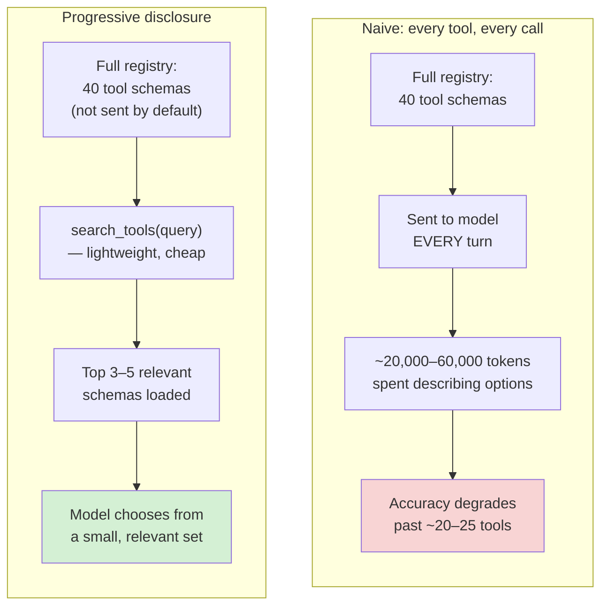
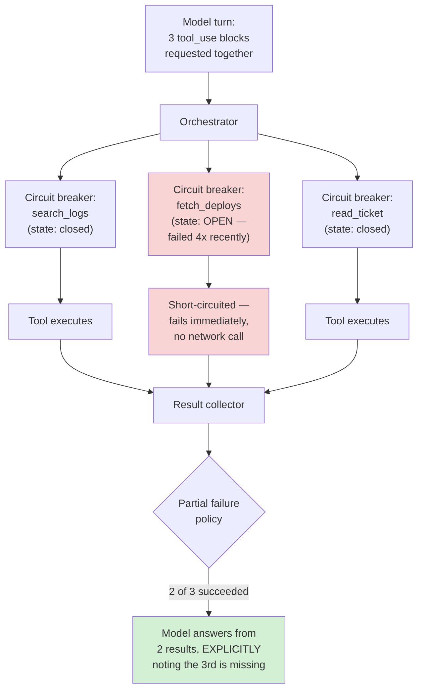
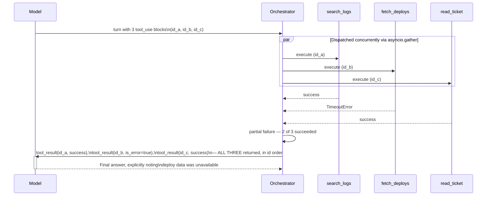
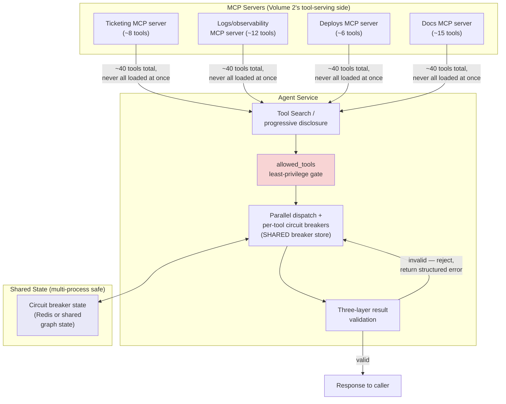
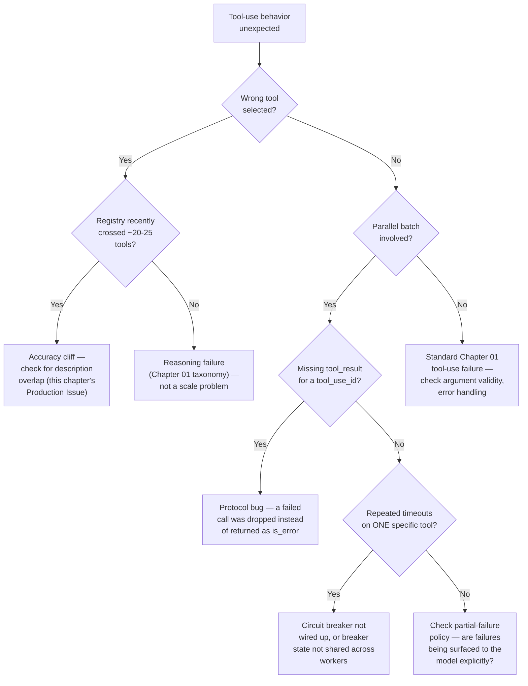

# Chapter 03 — Tool Use and Function Calling at Scale

## Learning Objectives

By the end of this chapter, you will be able to:

- Explain, with concrete numbers, why simply adding every available tool to an agent's context degrades both token budget and tool-selection accuracy as tool count grows.
- Implement progressive disclosure — searching for and loading only the tools a task plausibly needs, instead of every tool the system has ever registered — and know when a smaller agent doesn't need this at all.
- Issue genuinely parallel tool calls correctly: multiple `tool_use` blocks in one turn, matched `tool_result` responses, and the specific bugs (ID mismatches, shared-state races) that sequential-only code never had to worry about.
- Build a circuit breaker for a chronically-failing tool, including the shared-state consideration that makes this harder in parallel or multi-agent deployments than it looks.
- Handle partial failure in a parallel batch honestly — report what's missing rather than let the model quietly fill the gap with a hallucinated value.
- Validate a tool's result at three distinct layers (schema, structural, content) and explain how this differs from the tool-call-injection defense Chapter 01 already covered.
- Apply least-privilege tool scoping to a many-tool, high-throughput agent, and distinguish "what's in context" from "what's actually approved to run."
- Read a tool-use-specific benchmark (BFCL) without over-trusting a single cited leaderboard number, the same discipline Chapter 01 taught for end-to-end agent benchmarks.

## Prerequisites

- **Chapters completed:** Chapter 01 (bounded loops, the `Agent` Protocol, tool-use failure as a taxonomy category); Chapter 02 (specifically the Plan-and-Execute weekly-report example — this chapter's Intermediate Implementation directly answers the question that chapter's Preparation for Next Chapter section deliberately left open).
- **Tools installed:** Everything from Chapters 01–02 (`anthropic`, `claude-agent-sdk==0.2.115`, `langgraph==1.2.9`), plus nothing new — this chapter uses Python's standard-library `asyncio` for parallel dispatch.
- **Cross-volume connection:** Volume 2 (MCP server/client engineering) covered the tool-*serving* side of this problem — building an MCP server that exposes tools correctly. This chapter is the tool-*consuming* side at production scale: an agent choosing, calling, and trusting many tools, potentially spread across many MCP servers.

## Estimated Reading Time

60–75 minutes

## Estimated Hands-on Time

2.5–3 hours

---

## ⚡ Fast Read

> **Skim time: 5 minutes** — Read this if you're in a hurry, returning for reference, or already familiar with part of this topic.

- **What it is:** The engineering discipline of making an agent's tool use work correctly once "a couple of tools" becomes "dozens or hundreds of tools across multiple MCP servers" — tool selection, parallel execution, failure recovery, and result trust, all at scale.
- **Why it matters:** Chapters 01–02 used two tools and never had to think about this. Real Aperture Cloud production agents don't stay at two — and simply appending every new tool to one flat list has a failure mode that has nothing to do with blast radius (Chapter 01's concern): the agent measurably gets *worse* at picking the right tool as the list grows, even when every tool is perfectly safe.
- **Key insight:** More available tools is not "more capability" past a certain point — it's a decision-quality problem. A well-described tool costs roughly 500–1,500 tokens in context just to exist as an option, and tool-selection accuracy has been observed to decline once an agent is routinely choosing from more than about 20–25 tools loaded at once — which is exactly why Anthropic now ships a first-party feature to *defer* loading most tool definitions until they're actually needed, the same progressive-disclosure idea this very course's own authoring tool uses on itself.
- **What you build:** A hand-rolled progressive-disclosure tool search, a parallel tool-dispatch layer with a per-tool circuit breaker (applied directly to Chapter 02's weekly-report executor, finally parallelizing the independent steps that chapter deliberately left sequential), and a three-layer result validator — all wrapped behind Chapter 01's `Agent` Protocol.
- **Jump to:** [Core Concepts](#core-concepts) | [First Code](#beginner-implementation) | [Best Practices](#best-practices) | [Mini Project](#mini-project)

---

## Why This Topic Exists

Chapter 02 ended with a question it deliberately didn't answer: in the weekly-report Plan-and-Execute graph, `executor_node` dispatched `reopened tickets`, `deploys`, and `incidents` one at a time, in sequence, inside a single node. Nothing about the Plan-and-Execute pattern *required* that. This chapter opens by finally closing that loop — but it turns out to be one instance of a much bigger problem this course hasn't addressed yet: **what happens once an agent has to work with a lot of tools, in a lot of calls, under real production traffic?**

Here's the part that isn't obvious until you hit it. Aperture Cloud's support-insights agent from Chapters 01–02 had exactly two tools: `read_ticket` and `search_logs`. As the engineering org connects more of its systems — deploy history, internal docs, a read-only billing lookup, an on-call schedule — the natural instinct is to do exactly what Chapter 01's `TOOLS` list already demonstrated: append the new tool's schema to the list. That instinct is *architecturally* fine (each new tool doesn't inherently change the loop's structure) and it is *quietly wrong* at scale, for a reason that has nothing to do with Chapter 01's blast-radius concern. Every tool definition costs real context tokens just to exist as an option the model is choosing between — commonly 500 to 1,500 tokens each — and current guidance places a measurable accuracy cliff once an agent is routinely selecting from somewhere around 20 to 25 simultaneously loaded tools. Past that point, adding a 26th tool doesn't just cost more tokens. It makes the agent measurably worse at picking correctly among all 26, including the ones it used to pick correctly before.

That's the first problem this chapter solves: tool *selection* has to scale independently of tool *count*, or the agent degrades exactly as it becomes more capable on paper. The second problem is the one Chapter 02 left open: once you're making several tool calls per task instead of one, doing them strictly one-at-a-time is leaving real latency on the table for calls that don't actually depend on each other — but naively parallelizing introduces failure modes a sequential loop never had to handle (a batch where 2 of 5 calls fail — now what?). This chapter is where "an agent that uses tools" becomes "an agent that uses tools *at production scale*," and those are different engineering problems, not just a bigger version of the same one.

## Real-World Analogy

Picture a new hire's access badge. In their first week, it opens exactly three doors: the front entrance, their desk area, and the break room. They never have to think about which door to use — there are only three, and each is obviously right for one specific situation.

By month six, that same employee has been granted access to forty different doors across the building — server rooms, other teams' floors, supply closets, executive offices. If you handed them a single printed map showing all forty doors *every time* they needed to go somewhere, with no way to filter it, two things would get worse, not better: it would take them longer to find the right door on the map, and — this is the counterintuitive part — they'd start picking the *wrong* door more often too, because forty similar-looking entries on one page is harder to scan correctly than three. Their access didn't get worse. Their ability to *use* that access got worse, purely because of how much of it was presented to them at once, unfiltered, every single time.

A good facilities system doesn't solve this by taking doors away. It solves it with a directory: "tell me where you're headed, and I'll tell you which door and give you the badge-scan for just that one" — the employee's full forty-door access still exists, but what's actually presented to them at the moment of decision is small and relevant. That directory is progressive disclosure. This chapter builds the software equivalent of it, plus the separate skill of sending someone through three doors at once when the tasks behind them don't depend on each other, instead of making them walk the halls one door at a time.

---

## Core Concepts

### The Tool-Selection Accuracy Cliff

**Technical definition:** The empirically observed degradation in an agent's tool-selection correctness as the number of simultaneously available tool definitions increases, distinct from — and compounding — the token-cost increase from the same growth.

**Plain English:** Past a certain number of tools all presented at once, the agent doesn't just cost more per call — it starts picking the wrong tool more often, even for tasks it used to handle correctly with a shorter list.

**Analogy:** The forty-door badge map above — the same person, with the same actual access, makes worse choices when handed everything at once versus a filtered, relevant subset.

> Current guidance (verified for this chapter) places this decline starting around 20–25 simultaneously loaded tools, with individual tool descriptions typically costing 500–1,500 tokens each — meaning a modest 30-tool registry can already be spending tens of thousands of tokens per call just describing options, before the agent does any actual work. This is the direct, scale-specific extension of Chapter 01's tool-use-failure taxonomy category: at small scale, tool-use failure usually means "wrong arguments to the right tool"; at scale, it increasingly means "wrong tool entirely, chosen from a list too long to reason about well."

### Progressive Disclosure (Tool Search)

**Technical definition:** A pattern where an agent's full tool registry is not loaded into context by default; instead, a lightweight search/discovery mechanism lets the agent (or the orchestrator, on the agent's behalf) find and load only the tool definitions relevant to the current task, on demand.

**Plain English:** Don't show the agent every tool it could ever use — show it a way to *find* the few tools it actually needs right now.

**Analogy:** The facilities directory from this chapter's opening analogy — full access still exists; what's presented at any one moment is small and relevant.

> **Currency Note (verified 2026-07-11):** Anthropic ships exactly this as a first-party feature — the **Tool Search Tool**, announced 2026-01-14 as part of "advanced tool use" on the Claude Developer Platform. Tools marked for deferred loading are not sent to the model up front; the agent searches for and loads only the handful most relevant to its current turn, with Anthropic reporting roughly an 85% reduction in tool-definition context tokens in their own benchmark comparison. The Claude Agent SDK's current documentation confirms this is **on by default**, with official guidance that manually disabling it only makes sense below roughly 10 tools. Exact configuration field names move with SDK versions faster than this chapter's prose — confirm current parameter syntax against the live SDK docs before shipping a production configuration; this chapter's Advanced Implementation flags exactly where to check.

### Parallel Tool Calls

**Technical definition:** A single model turn in which more than one `tool_use` block is emitted, representing multiple tool invocations the model has requested together — with the API leaving execution order and concurrency strategy entirely up to the calling orchestrator.

**Plain English:** The model can ask for several tools to be run "at the same time" as far as it's concerned; whether your code actually runs them concurrently, one after another, or in some mix is completely your decision, not the model's.

**Analogy:** A manager asking three different departments for their quarterly numbers in one email doesn't dictate whether those three departments actually respond simultaneously or in sequence — that's a logistics decision for whoever's collecting the answers, not something implied by asking all three at once.

### Circuit Breaker (applied to tools)

**Technical definition:** A per-tool state machine — **closed** (calls proceed normally), **open** (calls are short-circuited and fail immediately without attempting the underlying tool, after a failure threshold is crossed), **half-open** (a limited trial call is allowed to test if the tool has recovered) — used to stop a chronically-failing tool from making every dependent call pay a full timeout.

**Plain English:** If a tool has failed the last several times in a row, stop trying it for a while and tell the agent it's unavailable, instead of making every single call wait through a timeout to rediscover the same failure.

**Analogy:** After a vending machine eats your money three times in a row, you stop putting more money in and just tell your coworkers "that machine's broken" — you don't need to personally re-test it on every single visit to know that.

### Partial-Failure Handling

**Technical definition:** The explicit policy for what an orchestrator does when some, but not all, of a batch of parallel tool calls fail — specifically, whether to proceed with the successful subset (and how that's communicated to the model) or treat the whole batch as failed.

**Plain English:** When you asked three systems for data and only two answered, deciding — on purpose, not by accident — whether "two out of three, clearly labeled as incomplete" is an acceptable answer to work with.

**Analogy:** A doctor who has two of three lab results back tells the patient "we have two results, we're still waiting on the third" — they don't quietly present a diagnosis based on two results while implying they had all three.

### Three-Layer Tool Result Validation

**Technical definition:** Checking a tool's returned data at three independent layers before trusting it: **schema validation** (does the shape match the expected type contract), **structural validation** (is it even parseable — valid JSON, correctly typed fields), and **content/business-rule validation** (is the value plausible given domain knowledge — e.g., a negative ticket count, or a timestamp in the future, are structurally valid but semantically wrong).

**Plain English:** Checking not just "did I get something back that looks like the right shape," but "does what I got back actually make sense."

**Analogy:** A warehouse receiving a shipment checks that the box matches the packing slip (schema), that the box isn't damaged and can actually be opened (structural), and that what's inside is actually the right product and not, say, expired or the wrong color (content) — three genuinely different checks, and skipping any one of them lets a real problem through.

> This is deliberately distinct from Chapter 01's tool-call-injection concern. Injection is about *adversarial* content smuggled into a tool result, aimed at hijacking the agent's next action. Result validation is about *non-adversarial* but wrong data — a bug in the underlying system, a schema drift nobody updated the agent for, a stale cache — that's just as capable of corrupting a downstream step, especially now that chaining one tool's structured output directly into the next tool's input is the default shape of most 2026 production agent pipelines. A malformed, unvalidated result doesn't just mislead the model narratively anymore; it can break the next mechanical step outright.

---

## Architecture Diagrams

### Diagram 1 — The Tool-Count Problem, and Its Fix



### Diagram 2 — Parallel Dispatch with Per-Tool Circuit Breakers



The circuit breaker for `fetch_deploys` being open is not an error state the diagram is hiding — it's the entire point of the pattern. The call fails fast, without wasting a timeout, and the result collector below it treats that as a known, structured absence rather than a mysterious empty result the way Chapter 01's original ambiguous-tool-result Production Issue would have.

## Flow Diagrams

### Diagram 3 — One Parallel Batch, Start to Finish



The detail worth internalizing here: even though `id_b` failed, the orchestrator still returns **three** `tool_result` blocks, one per `tool_use_id` from the original turn — never fewer. The API requires a result for every tool call the model made in that turn; a missing `tool_result` for an `id` the model is expecting is a protocol-level bug, not a graceful way to represent "this one didn't work."

---

## Beginner Implementation

Aperture Cloud's support-insights agent has grown from Chapter 01's two tools to fifteen, spanning tickets, logs, deploys, docs, and a read-only billing lookup. This is exactly the scale where the accuracy cliff starts to bite. The fix here is fully hand-rolled — no vendor-specific feature yet — to make the underlying mechanic unmistakable before the Advanced Implementation shows Anthropic's first-party version of the same idea.

```python
# Learning example — hand-rolled progressive disclosure over a
# growing tool registry, no framework or vendor feature required.
import json
from anthropic import Anthropic

client = Anthropic()

# --- A registry that's grown well past "a couple of tools" ------------
FULL_TOOL_REGISTRY = {
    "read_ticket": {
        "name": "read_ticket", "category": "tickets",
        "description": "Look up a support ticket's status and product area.",
        "input_schema": {"type": "object", "properties": {"ticket_id": {"type": "string"}}, "required": ["ticket_id"]},
    },
    "search_logs": {
        "name": "search_logs", "category": "logs",
        "description": "Search recent error logs associated with a ticket ID.",
        "input_schema": {"type": "object", "properties": {"ticket_id": {"type": "string"}}, "required": ["ticket_id"]},
    },
    "fetch_deploys": {
        "name": "fetch_deploys", "category": "deploys",
        "description": "List deploys shipped in a given date range.",
        "input_schema": {"type": "object", "properties": {"since": {"type": "string"}}, "required": ["since"]},
    },
    "search_docs": {
        "name": "search_docs", "category": "docs",
        "description": "Search internal engineering documentation by keyword.",
        "input_schema": {"type": "object", "properties": {"query": {"type": "string"}}, "required": ["query"]},
    },
    "read_billing_summary": {
        "name": "read_billing_summary", "category": "billing",
        "description": "Read-only lookup of a customer's current billing plan and usage tier.",
        "input_schema": {"type": "object", "properties": {"customer_id": {"type": "string"}}, "required": ["customer_id"]},
    },
    # ... in a real system, this registry has grown to 15+ entries
    # across these categories and more (on-call schedules, incident
    # history, feature-flag state) as more of Aperture Cloud's
    # internal systems get connected.
}

# The ONE tool always visible to the model — everything else is
# discovered through it, not loaded up front.
SEARCH_TOOL_SCHEMA = {
    "name": "search_tools",
    "description": "Search the full tool registry by keyword to find relevant tools for the current task. Always start here if you're not sure which tool to use.",
    "input_schema": {
        "type": "object",
        "properties": {"query": {"type": "string"}},
        "required": ["query"],
    },
}


def search_tools(query: str, top_k: int = 3) -> list[dict]:
    """A deliberately simple relevance scorer — real systems typically
    use embedding similarity over each tool's name/description/category
    (structurally the same retrieval problem Volume 3 Chapter 06 taught
    for RAG document chunks, applied here to tool schemas instead)."""
    query_terms = set(query.lower().split())
    scored = []
    for tool in FULL_TOOL_REGISTRY.values():
        haystack = f"{tool['name']} {tool['description']} {tool['category']}".lower()
        score = sum(1 for term in query_terms if term in haystack)
        if score > 0:
            scored.append((score, tool))
    scored.sort(key=lambda pair: pair[0], reverse=True)
    return [tool for _, tool in scored[:top_k]]


def run_agent_with_progressive_disclosure(goal: str, max_iterations: int = 6) -> str:
    # The model only ever sees search_tools at the start — every other
    # tool schema is loaded into `available_tools` on demand, and only
    # for the rest of THIS run, not the whole registry forever.
    available_tools = {"search_tools": SEARCH_TOOL_SCHEMA}
    messages = [{"role": "user", "content": goal}]

    for _ in range(max_iterations):
        response = client.messages.create(
            model="claude-sonnet-5", max_tokens=1024,
            tools=list(available_tools.values()),
            messages=messages,
        )

        tool_calls = [b for b in response.content if b.type == "tool_use"]
        if not tool_calls:
            return "".join(b.text for b in response.content if b.type == "text")

        messages.append({"role": "assistant", "content": response.content})

        tool_results = []
        for call in tool_calls:
            if call.name == "search_tools":
                found = search_tools(call.input["query"])
                # Newly discovered tools get added to what's available
                # for the REST of this run — the model can now call
                # them directly on a future turn.
                for tool in found:
                    available_tools[tool["name"]] = {
                        "name": tool["name"], "description": tool["description"],
                        "input_schema": tool["input_schema"],
                    }
                result = json.dumps([t["name"] for t in found])
            elif call.name in available_tools and call.name != "search_tools":
                result = json.dumps({"status": "stub", "tool": call.name, "args": call.input})
            else:
                result = json.dumps({"status": "error", "detail": f"Unknown or not-yet-discovered tool: {call.name}"})

            tool_results.append({"type": "tool_result", "tool_use_id": call.id, "content": result})

        messages.append({"role": "user", "content": tool_results})

    raise RuntimeError(f"Agent exceeded {max_iterations} iterations without stopping")


if __name__ == "__main__":
    answer = run_agent_with_progressive_disclosure(
        "What deploys shipped this week, and is there any billing plan info for customer C-882?"
    )
    print(answer)
```

**What's actually happening here, mechanically:**

- The model starts each run seeing exactly **one** tool: `search_tools`. Not fifteen, not forty — one. That single tool is how it bootstraps access to everything else, on demand.
- `search_tools` itself is deliberately cheap — a simple keyword scorer here, though the comment flags that production systems typically use embedding similarity instead, which is structurally the *exact same retrieval problem* Volume 3 Chapter 06 taught for RAG document chunks. Searching for the right *tool* and searching for the right *document chunk* are the same underlying operation applied to a different kind of content.
- `available_tools` grows **within a single run**, not globally — the next user request starts fresh with just `search_tools` again. This keeps the accuracy-cliff protection intact even for a task that happens to need several tools: the model never sees more than what it discovered *for this specific task*, which is almost always well under the ~20–25 tool danger zone even for a fifteen-tool-plus registry.

> **Common mistake:** it's tempting to have `search_tools` return full schemas for *every* remotely-related tool "just in case." Resist this — the entire benefit of progressive disclosure evaporates if `search_tools` routinely floods `available_tools` back up past the accuracy cliff. `top_k=3` in the code above is a deliberate, small default, not an oversight.

## Intermediate Implementation

Now for the loop Chapter 02 left open. Its weekly-report `executor_node` dispatched three independent data-fetch steps strictly in sequence, inside one node, with no dependency between them. This section builds a general parallel-dispatch layer — with a circuit breaker and honest partial-failure handling — and applies it directly to that exact function.

```python
# Learning example — parallel tool dispatch with per-tool circuit
# breakers and honest partial-failure handling. Applied directly to
# Chapter 02's weekly-report executor_node.
import asyncio
import time
from dataclasses import dataclass, field
from enum import Enum


class BreakerState(Enum):
    CLOSED = "closed"      # normal operation
    OPEN = "open"           # failing fast, not attempting calls
    HALF_OPEN = "half_open"  # one trial call allowed


@dataclass
class CircuitBreaker:
    failure_threshold: int = 3
    cooldown_seconds: float = 30.0
    state: BreakerState = BreakerState.CLOSED
    consecutive_failures: int = 0
    opened_at: float = 0.0

    def allow_call(self) -> bool:
        if self.state == BreakerState.CLOSED:
            return True
        if self.state == BreakerState.OPEN:
            if time.monotonic() - self.opened_at >= self.cooldown_seconds:
                self.state = BreakerState.HALF_OPEN
                return True  # allow exactly one trial call
            return False
        return True  # HALF_OPEN: allow the trial call through

    def record_success(self) -> None:
        self.consecutive_failures = 0
        self.state = BreakerState.CLOSED

    def record_failure(self) -> None:
        self.consecutive_failures += 1
        if self.consecutive_failures >= self.failure_threshold:
            self.state = BreakerState.OPEN
            self.opened_at = time.monotonic()


# One breaker per tool. In a multi-process or multi-agent deployment,
# this dict would need to be a shared store (Redis, or a reducer in
# shared LangGraph state) — an in-memory dict only protects a single
# process, which is a real, documented gap for parallel/fleet
# deployments, not a simplification-for-teaching detail to ignore.
BREAKERS: dict[str, CircuitBreaker] = {}


async def call_tool_with_breaker(tool_name: str, tool_fn, **kwargs) -> dict:
    breaker = BREAKERS.setdefault(tool_name, CircuitBreaker())

    if not breaker.allow_call():
        return {"tool": tool_name, "status": "circuit_open", "result": None}

    try:
        result = await tool_fn(**kwargs)
        breaker.record_success()
        return {"tool": tool_name, "status": "ok", "result": result}
    except Exception as exc:
        breaker.record_failure()
        return {"tool": tool_name, "status": "failed", "result": None, "error": str(exc)}


# --- The three data sources from Chapter 02, now genuinely async ------
async def fetch_reopened_ticket_count() -> str:
    await asyncio.sleep(0.1)  # simulated I/O
    return "14 tickets reopened this week"

async def fetch_deploy_count() -> str:
    await asyncio.sleep(0.1)
    raise TimeoutError("deploy service unreachable")  # simulated failure

async def fetch_incident_count() -> str:
    await asyncio.sleep(0.1)
    return "1 P2 incident, 0 P1 incidents this week"


async def executor_node_parallel(state: dict) -> dict:
    """Replaces Chapter 02's sequential executor_node. Every step in
    `state["plan"]` that has no dependency on another is dispatched
    together — this is the direct answer to that chapter's closing
    question."""
    steps = {
        "reopened tickets": fetch_reopened_ticket_count,
        "deploys": fetch_deploy_count,
        "incidents": fetch_incident_count,
    }
    matched = [(step, steps[k]) for step in state["plan"] for k in steps if k in step.lower()]

    results = await asyncio.gather(*[
        call_tool_with_breaker(step, fn) for step, fn in matched
    ])

    completed = state["completed_steps"] + [
        {"step": r["tool"], "result": r["result"], "status": r["status"]}
        for r in results
    ]

    failed = [r for r in results if r["status"] != "ok"]
    if failed:
        # Partial failure is surfaced explicitly, not silently
        # dropped — the synthesis step downstream (Chapter 02's
        # replan_node) sees exactly which data points are missing
        # and why, and must say so in the final report rather than
        # quietly omitting them with no explanation.
        completed.append({
            "step": "_partial_failure_notice",
            "result": f"{len(failed)} of {len(results)} data sources unavailable: "
                      f"{[f['tool'] for f in failed]}",
            "status": "warning",
        })

    return {"plan": [], "completed_steps": completed}  # all steps attempted at once


if __name__ == "__main__":
    state = {
        "task": "weekly report",
        "plan": ["reopened tickets", "deploys", "incidents"],
        "completed_steps": [],
        "response": None,
    }
    result = asyncio.run(executor_node_parallel(state))
    for entry in result["completed_steps"]:
        print(entry)
```

**Why this is the direct answer to Chapter 02's open question, and what changed structurally:**

- `executor_node_parallel` dispatches all three (in this run, independent) steps via a single `asyncio.gather` call, instead of Chapter 02's one-at-a-time loop through `state["plan"]`. For genuinely independent steps, this turns roughly 3x sequential latency into roughly 1x — real, measurable, and free once the steps have no dependency on each other, which they didn't in Chapter 02 either; that chapter's sequential dispatch was simply leaving this on the table.
- Each call is wrapped through `call_tool_with_breaker`, so a chronically-failing tool (simulated here as `fetch_deploy_count` always raising) doesn't just fail once — it trips its own breaker, and subsequent calls to that specific tool fail fast rather than repeating the same timeout on every future run until someone notices.
- The `_partial_failure_notice` entry is this chapter's concrete version of Chapter 01's "unambiguous tool result" rule, extended to a *batch*: the downstream synthesis step (Chapter 02's `replan_node`, unchanged) now has an explicit, structured signal that some data is missing, instead of silently working with an incomplete `completed_steps` list and no way to know it's incomplete.
- The comment about `BREAKERS` needing to be a shared store in multi-process deployments is not a footnote — it's a specific, documented gap: an in-memory dict circuit breaker only protects the process it lives in. Two parallel workers hitting the same failing tool, each with their own in-memory breaker, will each independently retry past the failure threshold before either one trips — a Redis-backed or shared-state breaker (a natural fit for LangGraph's own state, since Chapter 02 already put this executor inside a `StateGraph`) closes that gap.

## Advanced Implementation

Production-grade means combining everything above with real result validation and least-privilege scoping — and, for the tool-selection half of this chapter, showing Anthropic's own first-party version of the progressive-disclosure pattern the Beginner Implementation hand-rolled, wrapped behind Chapter 01's `Agent` Protocol so it composes with everything else this course has built.

```python
# Production example — three-layer result validation, least-privilege
# tool scoping via the Claude Agent SDK, wrapped behind the Agent
# Protocol from Chapter 01. Pinned version verified 2026-07-11:
# claude-agent-sdk==0.2.115.
from __future__ import annotations
from dataclasses import dataclass
from typing import Any, AsyncIterator
import json

# Reused from Chapter 01: Agent (Protocol), AgentEvent(kind, payload)

# --- Layer 1: schema validation -----------------------------------------
def validate_schema(data: dict, required_fields: dict[str, type]) -> list[str]:
    """Does the shape match the expected type contract?"""
    errors = []
    for field_name, expected_type in required_fields.items():
        if field_name not in data:
            errors.append(f"missing required field: {field_name}")
        elif not isinstance(data[field_name], expected_type):
            errors.append(f"{field_name} expected {expected_type.__name__}, got {type(data[field_name]).__name__}")
    return errors


# --- Layer 2: structural validation --------------------------------------
def validate_structure(raw: str) -> tuple[bool, dict | None]:
    """Is it even parseable?"""
    try:
        return True, json.loads(raw)
    except json.JSONDecodeError:
        return False, None


# --- Layer 3: content / business-rule validation --------------------------
def validate_content(data: dict, rules: list) -> list[str]:
    """Is the value plausible, given domain knowledge — structurally
    valid but semantically wrong is exactly what this layer exists
    to catch (a negative ticket count; a future-dated log entry)."""
    return [rule.message for rule in rules if not rule.check(data)]


@dataclass
class ContentRule:
    message: str
    check: Any  # Callable[[dict], bool]


TICKET_COUNT_RULES = [
    ContentRule(
        message="reopened_ticket_count cannot be negative",
        check=lambda d: d.get("reopened_ticket_count", 0) >= 0,
    ),
]


def validate_tool_result(raw: str, required_fields: dict[str, type], rules: list) -> dict:
    """Runs all three layers in order, stopping at the first that
    fails — there's no point checking content rules on data that
    isn't even valid JSON."""
    is_parseable, data = validate_structure(raw)
    if not is_parseable:
        return {"valid": False, "layer": "structural", "errors": ["not valid JSON"]}

    schema_errors = validate_schema(data, required_fields)
    if schema_errors:
        return {"valid": False, "layer": "schema", "errors": schema_errors}

    content_errors = validate_content(data, rules)
    if content_errors:
        return {"valid": False, "layer": "content", "errors": content_errors}

    return {"valid": True, "layer": None, "errors": [], "data": data}


# --- Least-privilege scoping + first-party progressive disclosure --------
from claude_agent_sdk import ClaudeSDKClient, ClaudeAgentOptions

class ScaledSupportAgent:
    """Satisfies Chapter 01's Agent Protocol. Uses the Claude Agent
    SDK's own Tool Search feature (on by default in the SDK as of
    this writing) instead of this chapter's hand-rolled version —
    same underlying idea as the Beginner Implementation, now the
    vendor-native version of it."""

    def __init__(self, mcp_servers: dict):
        self._options = ClaudeAgentOptions(
            mcp_servers=mcp_servers,
            # Least-privilege: explicitly enumerate what's APPROVED
            # to run, separate from what's merely visible in context.
            # This is a distinct layer from tool search/discovery —
            # a tool can be discoverable and still not be allowed.
            allowed_tools=[
                "mcp__support__read_ticket",
                "mcp__support__search_logs",
                "mcp__support__fetch_deploys",
            ],
            max_turns=8,
        )
        # NOTE (Currency Note): exact current field names for
        # controlling Tool Search behavior (e.g. per-tool deferred
        # loading) move with SDK releases faster than this chapter's
        # prose. Confirm the current parameter surface against the
        # live Claude Agent SDK docs before relying on specific field
        # names beyond what's shown here — the *behavior* (search-
        # then-load, on by default, off below ~10 tools) is verified
        # as of 2026-07-11; the exact syntax for tuning it may drift.

    async def run(self, goal: str) -> AsyncIterator["AgentEvent"]:
        async with ClaudeSDKClient(options=self._options) as client:
            await client.query(goal)
            async for message in client.receive_response():
                # Real code validates every tool_result payload it
                # sees here via validate_tool_result before trusting
                # it, and maps SDK message types to AgentEvent —
                # abbreviated to the shape that matters for this
                # chapter's point, consistent with Chapter 01's own
                # Advanced Implementation abbreviation style.
                yield AgentEvent(kind="final_answer", payload=str(message))
```

**Why each piece is here, specifically:**

- `validate_tool_result` runs the three layers **in order**, short-circuiting on the first failure — there's no reason to check whether a negative ticket count violates a business rule if the payload wasn't valid JSON to begin with. This ordering is a deliberate efficiency choice, not an accident of how the function happened to get written.
- `allowed_tools` on `ClaudeAgentOptions` is doing exactly the least-privilege job Chapter 01 first introduced — but now made explicit that it's a **separate layer** from tool *discovery*. A tool can be found by the Tool Search feature and still be rejected at call time if it's not in `allowed_tools`; scale doesn't relax the blast-radius discipline Chapter 01 established, it just adds a second axis (discoverability) that has to be governed alongside it.
- The Currency Note inside the class is deliberate, not decorative — this chapter's research verified the Tool Search feature's *existence, default-on behavior, and rough token savings* directly from Anthropic's own announcement and the SDK's current docs page, but exact configuration field names are exactly the kind of fast-moving API surface CLAUDE.md's own rules say not to state with false confidence. Flagging precisely what's verified versus what needs a fresh check is the correct discipline here, not a hedge to be embarrassed about.

---

## Production Architecture



At Aperture Cloud's real scale, this agent talks to **four separate MCP servers** — exactly Volume 2's territory — totaling roughly 40 tools across ticketing, logs, deploys, and docs. Nothing about progressive disclosure requires those tools to live behind one server; Tool Search and `allowed_tools` operate the same way whether the underlying tool came from one MCP server or five, which is precisely why current MCP-spec guidance (list endpoints that don't vary per connection, cacheable `tools/list` responses) is aimed at exactly this multi-server, many-tool production shape rather than a single small server.

### Production Issue: Agent Consistently Calls the Wrong (but Similarly Named) Tool

**Symptoms**
Once Aperture Cloud's tool registry crossed roughly 20 tools, support engineers started noticing the agent occasionally answering billing questions using `search_docs` (Aperture Cloud's internal documentation) instead of `read_billing_summary` (the actual customer billing lookup) — producing plausible-sounding but wrong answers, sourced from generic documentation instead of the customer's actual account. This didn't happen when the registry had 8 tools.

**Root Cause**
`search_docs` and `read_billing_summary` had similar-sounding descriptions ("search internal documentation" and "read billing summary" both plausibly match a query containing the word "billing," since Aperture Cloud's docs happen to include a general billing-FAQ page). At small tool counts, the model reliably disambiguated correctly anyway. Past the accuracy cliff, with ~20+ tools all competing for the model's attention in one selection decision, the marginal disambiguation signal in a slightly-overlapping description stopped being reliably enough to win consistently — this is the exact, concrete mechanism behind the "accuracy declines past ~20-25 tools" finding from this chapter's Core Concepts, not just an abstract statistic.

**How to Diagnose It**
- Pull the trace for a misrouted request (this is only possible if, per Chapter 01's discipline, every tool call is logged, not just the final answer).
- Confirm the *wrong* tool was actually a plausible-sounding match for the query — if it's a completely unrelated tool being called, that's a different failure (a reasoning failure, not a tool-selection ambiguity) and needs a different fix.
- Check whether the registry recently crossed the accuracy-cliff threshold — a tool-selection bug that "just started happening" without any single tool's description changing is a strong signal that the *total count*, not any one tool, is the actual root cause.

**How to Fix It**
```python
# Before: two tools with genuinely overlapping description language
{
    "name": "search_docs",
    "description": "Search internal engineering documentation by keyword.",
},
{
    "name": "read_billing_summary",
    "description": "Read-only lookup of a customer's current billing plan and usage tier.",
},

# After: descriptions made mutually exclusive on the specific
# dimension that was actually ambiguous (billing terminology)
{
    "name": "search_docs",
    "description": "Search internal ENGINEERING documentation (architecture, "
                    "runbooks, on-call guides) by keyword. Does NOT contain "
                    "customer-specific billing or account data — use "
                    "read_billing_summary for that.",
},
{
    "name": "read_billing_summary",
    "description": "Look up a SPECIFIC CUSTOMER's actual current billing plan "
                    "and usage tier by customer ID. This is the only tool with "
                    "real account data — search_docs only has general docs.",
},
```
Making each tool's description explicitly disclaim what the *other* tool is for, not just describe itself in isolation, resolves the ambiguity directly at the source rather than hoping the model infers the distinction from two independently-written descriptions that happen not to reference each other.

**How to Prevent It in Future**
- Whenever the registry crosses a round-number threshold (10, 20, 30 tools), do a deliberate pass specifically looking for description overlap between tools in different categories — this is cheap to catch proactively and expensive to diagnose after the fact from a support engineer's bug report.
- Prefer progressive disclosure's smaller, task-relevant `available_tools` set over a flat, ever-growing registry precisely because it keeps the *effective* tool count the model sees at decision time well under the accuracy-cliff threshold, even as the *total* registry keeps growing.
- Log tool-selection confidence or near-miss data if your framework exposes it (some agent frameworks surface the model's alternative candidates) — this turns "engineers noticed something was wrong" into "the system flagged an ambiguous selection before it shipped a wrong answer."

---

## Best Practices

1. **Never load more than a task plausibly needs.** Progressive disclosure isn't a nice-to-have past a certain registry size — treat the ~20–25 tool accuracy cliff as a hard design constraint, the same way Chapter 01 treated `max_iterations` as non-negotiable.
2. **Only parallelize calls with no dependency and no shared mutable state.** A batch of read-only lookups is a safe parallel candidate; a sequence where step 2 needs step 1's confirmed result, or where two calls write to the same record, is not — parallelizing those introduces races Chapter 01's original sequential loop never had to consider.
3. **Make circuit breaker state shared, not per-process, the moment you have more than one worker.** An in-memory breaker only protects the process it lives in; multiple workers each independently retrying past a failure threshold defeats the entire point of the pattern.
4. **Always return one `tool_result` per `tool_use_id`, even for failures.** A missing result for a call the model made in the same turn is a protocol-level bug, not a valid way to represent "this one didn't work" — represent failure as a `tool_result` with `is_error=True`, never as an absent response.
5. **Validate at all three layers, in order, and stop at the first failure.** Checking content rules on unparseable JSON wastes work; schema-then-structure-then-content is the efficient, and correct, order.
6. **Keep `allowed_tools` (what's approved) separate from what's merely discoverable.** Progressive disclosure controls what the model *sees*; least-privilege scoping controls what it's *allowed to actually run* — conflating the two means a discoverable tool is implicitly an approved one, which quietly undoes Chapter 01's blast-radius discipline.

## Security Considerations

- **Ambiguous tool descriptions are a security surface, not just a UX problem.** This chapter's Production Issue was framed as an accuracy bug, but the identical mechanism is exploitable: a maliciously-named or maliciously-described tool, registered on a compromised or careless MCP server, can be deliberately crafted to look like a *more* plausible match than the legitimate tool for certain queries — this is a real, current concern flagged in the OWASP MCP guidance Volume 2 introduced, now sharpened by scale, since a larger registry gives an attacker more "similar-sounding neighbors" to hide a malicious tool among.
- **Progressive disclosure changes, but doesn't remove, the untrusted-tool-result discipline from Chapter 01.** A tool discovered via search and then called is exactly as untrusted as one loaded up front — discovery is not a trust signal.
- **Parallel dispatch multiplies the tool-call-injection surface, not just the throughput.** If three tool results are being fed back to the model in one batch instead of one at a time, an injection payload hidden in any one of them lands in context alongside the others — validate and treat each result independently, not as a trusted bundle just because they arrived together.

## Cost Considerations

| Approach | Tool-definition tokens per call (40-tool registry) | Notes |
|---|---|---|
| Load everything, every call | ~20,000–60,000 (40 tools × 500–1,500 tokens) | Also the approach most exposed to the accuracy cliff |
| Progressive disclosure, top-3 loaded | ~1,500–4,500 (search tool + 3 discovered schemas) | Anthropic's own reported comparison: ~85% reduction in tool-definition tokens using this pattern |
| Progressive disclosure, cold task needing 6 tools across 2 search rounds | ~3,000–9,000 | Still dramatically below the flat-registry cost, even for a task needing more tools than the top-k default |

Parallel dispatch's cost story is different: it doesn't reduce token spend at all (the same tool calls happen either way) — its entire value is **latency**, not tokens. Don't conflate the two optimizations even though this chapter covers both: progressive disclosure saves money and improves accuracy; parallel dispatch saves wall-clock time. A production system usually wants both, but they're solving different problems and should be reasoned about separately when deciding where to invest engineering effort first.

## Common Mistakes

```python
# WRONG — loading the entire registry on every call regardless of size.
response = client.messages.create(
    model="claude-sonnet-5",
    tools=list(FULL_TOOL_REGISTRY.values()),  # all 40, every time
    messages=messages,
)
```

```python
# RIGHT — progressive disclosure; only search_tools is always present.
response = client.messages.create(
    model="claude-sonnet-5",
    tools=list(available_tools.values()),  # starts with just search_tools
    messages=messages,
)
```

```python
# WRONG — "parallelizing" calls that aren't actually independent.
# submit_refund depends on confirm_customer_identity having already
# succeeded — running them concurrently can submit a refund before
# identity is confirmed.
async def process_refund_unsafe(customer_id, amount):
    await asyncio.gather(
        confirm_customer_identity(customer_id),
        submit_refund(customer_id, amount),
    )
```

```python
# RIGHT — dependency-respecting sequencing; only the genuinely
# independent calls are batched.
async def process_refund_safe(customer_id, amount):
    await confirm_customer_identity(customer_id)
    await asyncio.gather(
        fetch_recent_orders(customer_id),
        fetch_support_history(customer_id),
    )
    await submit_refund(customer_id, amount)
```

```python
# WRONG — a failed parallel call silently omitted from the results
# sent back to the model, instead of an explicit is_error result.
async def collect_results_unsafe(calls):
    results = await asyncio.gather(*calls, return_exceptions=True)
    return [
        {"type": "tool_result", "tool_use_id": c.id, "content": r}
        for c, r in zip(calls, results) if not isinstance(r, Exception)
    ]  # BUG: silently drops the failed ones — the model gets fewer
       # tool_results than tool_use blocks it made, a protocol violation.
```

```python
# RIGHT — every tool_use_id gets a tool_result, failures included.
async def collect_results_safe(calls):
    results = await asyncio.gather(*calls, return_exceptions=True)
    return [
        {
            "type": "tool_result", "tool_use_id": c.id,
            "content": str(r) if isinstance(r, Exception) else r,
            "is_error": isinstance(r, Exception),
        }
        for c, r in zip(calls, results)
    ]
```

## Debugging Guide



| Symptom | Likely Cause | Where to Look |
|---|---|---|
| Agent picks a plausible-but-wrong tool, registry recently grew | Accuracy cliff | Compare the chosen tool's description against the correct tool's — look for overlapping language |
| `IndexError` or mismatched results when processing a parallel batch | `tool_use_id` mismatch, or results not returned in the order expected | Confirm every `tool_result` is matched by `tool_use_id`, not by list position |
| Same tool fails over and over, every call pays a full timeout | No circuit breaker, or breaker state not actually shared across processes | Check whether `BREAKERS` (or your equivalent) is process-local |
| Final answer looks complete but is missing a data point with no explanation | Partial failure silently dropped instead of surfaced | Check whether the synthesis step ever sees a `_partial_failure_notice`-equivalent signal |
| Downstream step crashes on a tool's output | Missing or skipped result validation | Confirm `validate_tool_result`'s three layers actually ran before the result was used |

## Performance Optimisation

- **Parallelize before you optimize anything else.** For a batch of N genuinely independent tool calls, going from sequential to parallel dispatch is close to an N-times latency reduction for free — no smaller optimization in this chapter (caching, prompt trimming) comes close to that ceiling.
- **Cache `search_tools` results for structurally repeated task types.** If Aperture Cloud's ticket-investigation agent runs the same kind of `search_tools("ticket logs")` query dozens of times a day, caching that lookup (not the underlying tool's *data*, just which tools are relevant to that query shape) avoids paying the search cost repeatedly for a decision that doesn't change.
- **Tune circuit breaker thresholds per tool, not globally.** A tool backed by a flaky third-party API might reasonably need a lower failure threshold and longer cooldown than an in-house, generally reliable one — a single global threshold either trips too eagerly on a normally-noisy tool or too slowly on a critical one.

---

## Technology Comparison — Scale-Relevant MCP and Benchmark Landscape

> **Currency Note:** Verified 2026-07-11. MCP spec details specifically move fast — reconfirm against the live spec if reading this materially later.

| Item | Status (verified 2026-07-11) | Relevance to this chapter |
|---|---|---|
| MCP spec (finalized) | 2025-11-25 | Baseline spec version this chapter assumes |
| MCP spec (release candidate) | 2026-07-28 (not yet final at research time) | Adds cacheable `tools/list` (respecting server `ttlMs`) and connection-independent list endpoints — both aimed directly at many-tool, many-server production scale |
| `tools/list` pagination | Confirmed current, cursor-based | Directly relevant once a single MCP server exposes dozens of tools |
| Tool namespacing | **Not a confirmed spec-level feature** | Production teams use the informal "MCP Wrapper Pattern" (expose only discovery tools at the top level) instead — don't describe namespacing as a spec guarantee |
| Anthropic Tool Search Tool | Confirmed current (announced 2026-01-14), on by default in the Claude Agent SDK | This chapter's Advanced Implementation's vendor-native progressive disclosure |
| Berkeley Function-Calling Leaderboard (BFCL) | Confirmed current, at V4 (holistic agentic evaluation), leaderboard last updated July 2026 | The function-calling-specific benchmark, distinct from end-to-end agent benchmarks (GAIA, SWE-bench, WebArena, Tau-Bench) covered in Chapter 12 — check the live leaderboard directly for current standings rather than trusting a cited number, since this chapter's own research found conflicting figures across secondary sources |

## Decision Framework — When to Parallelize a Batch of Tool Calls

1. **Do any of the calls depend on another call's result or confirmed success?** If yes, that dependency must be respected sequentially — parallelize only the independent subsets, as the Common Mistakes section's refund example shows.
2. **Do any of the calls write to, or otherwise mutate, shared state?** Two read-only lookups are safe to parallelize. Two calls that write to the same record, or where ordering affects the outcome, are not — parallelize only the read-only or independently-scoped subset.
3. **Is the latency savings worth the added failure-handling complexity for this specific batch?** A batch of 2 calls that already complete in under 200ms combined has little to gain and adds partial-failure-handling code for marginal benefit; a batch of 5+ slower calls is where parallel dispatch's latency win becomes the dominant consideration.
4. **Whatever you decide, does every call — parallel or sequential — still get a matched, honest `tool_result`, success or failure?** This is non-negotiable regardless of the answer to 1–3, per this chapter's Diagram 3.

## Real Client Scenario — Aperture Cloud's Tool Registry Crosses the Cliff

Six months after Chapter 01's two-tool support-insights agent shipped, Aperture Cloud's engineering org had connected it to four MCP servers and roughly 40 tools total — and support engineers started filing a pattern of bug reports that looked, individually, like random model mistakes: billing questions occasionally answered from generic docs, incident questions occasionally answered from stale deploy data instead of current logs. No single tool's description had changed recently. Nothing in Chapter 01's blast-radius model flagged a problem — every tool was still correctly scoped to read-only, least-privilege access.

Walking this through the chapter: the actual root cause wasn't any individual tool, it was the registry's *total size* crossing the accuracy cliff this chapter opened with. The fix wasn't tightening any one tool's permissions (that was already correct) — it was progressive disclosure (this chapter's Beginner/Advanced Implementation) to keep the *effective* tool count the model reasons over, per task, well under the danger zone, plus a deliberate description-disambiguation pass (this chapter's Production Issue) for the specific tools that had drifted into overlapping language as the registry grew organically over six months of incremental additions. Both fixes shipped without changing a single tool's actual access scope — this was a decision-quality problem, solved with decision-quality tools, entirely separate from the blast-radius work Chapter 01 already got right.

---

## Exercises

1. **(15 min)** Add three more stub tools to the Beginner Implementation's `FULL_TOOL_REGISTRY` (e.g., `read_oncall_schedule`, `search_incident_history`, `read_feature_flags`), and confirm `search_tools("who is on call")` surfaces the right one without the model ever seeing the other new tools it didn't ask about.
2. **(30 min)** Run the Intermediate Implementation's `executor_node_parallel` with all three fetch functions succeeding, then again with `fetch_deploy_count` always failing. Confirm the circuit breaker trips after 3 consecutive failures across separate runs, and that a 4th run short-circuits without attempting the call at all.
3. **(30 min)** Deliberately reintroduce this chapter's Production Issue: give two of your Exercise 1 tools overlapping description language on purpose, and confirm you can reproduce a misrouted call. Then apply the mutually-exclusive-description fix and confirm it resolves.
4. **(45 min)** Implement `validate_tool_result` end to end against a tool that sometimes returns malformed JSON, sometimes returns valid JSON missing a required field, and sometimes returns a structurally valid but semantically impossible value (e.g., a negative count) — confirm all three failure layers are independently reachable and correctly identified.
5. **(60 min, Challenge)** Extend the Intermediate Implementation's circuit breaker to use a shared store (a simple file-based or SQLite-backed implementation is sufficient for the exercise) instead of the in-memory `BREAKERS` dict, and demonstrate that two separate Python processes calling the same chronically-failing tool correctly share breaker state instead of each independently retrying past the failure threshold.

## Quiz

1. **What two distinct problems does simply adding more tools to an agent's context create, and why are they different problems?**
   *Answer: Increased token cost (each tool definition costs context regardless of whether it's used) and decreased selection accuracy (the model gets measurably worse at picking correctly once past roughly 20–25 simultaneously loaded tools). They're different because the accuracy decline isn't just a consequence of the token cost — it's a decision-quality effect that would still occur even if token budget weren't a constraint at all.*

2. **How does progressive disclosure solve the accuracy-cliff problem specifically, as opposed to just the token-cost problem?**
   *Answer: By keeping the number of tools actually presented to the model at any decision point small (a handful of task-relevant tools via search), rather than the full registry — this keeps the model well under the accuracy-cliff threshold even as the total registry keeps growing, independent of any token savings.*

3. **Why must every `tool_use` block in a model's turn receive a matching `tool_result`, even when the underlying call failed?**
   *Answer: The API contract requires a result for every tool call the model made in that turn — a missing result for an expected `tool_use_id` is a protocol-level bug. Failure must be represented as a `tool_result` with `is_error=True`, never as an absent response.*

4. **What specifically makes an in-memory circuit breaker insufficient once an agent is deployed across multiple worker processes?**
   *Answer: An in-memory breaker only protects the single process it lives in — multiple workers each maintaining their own independent breaker state will each separately retry a failing tool past the failure threshold before any of them trips, defeating the fail-fast purpose of the pattern. A shared store (Redis, or shared graph state) is required once there's more than one process.*

5. **Why is it wrong to have the model silently receive fewer tool results than tool calls it made, when a parallel batch has partial failures?**
   *Answer: It violates the API's protocol expectation (one result per tool_use_id) and, more importantly, hides the failure from the model entirely — the model can't reason honestly about what it does and doesn't know if a failed call simply vanishes instead of returning an explicit, structured error.*

6. **What's the difference between the three layers of tool result validation, using this chapter's warehouse analogy?**
   *Answer: Schema validation checks the box matches the packing slip (does the shape match the expected type contract); structural validation checks the box isn't damaged and can be opened (is it parseable at all); content validation checks what's actually inside is correct and not expired or wrong (is the value plausible per domain rules), even though the first two checks passed.*

7. **How does tool-call injection (Chapter 01) differ from a failed content-validation check (this chapter)?**
   *Answer: Tool-call injection is adversarial — malicious, instruction-like content deliberately smuggled into a tool result to hijack the agent's next action. A failed content-validation check is typically non-adversarial — a bug, stale data, or schema drift producing a structurally valid but semantically wrong value, with no attacker involved.*

8. **According to the Decision Framework, what's the specific signal that two tool calls should NOT be parallelized even if both individually seem safe?**
   *Answer: If either call depends on the other's result or confirmed success, or if both mutate shared state such that ordering affects the outcome — independence (no dependency, no shared mutation) is the requirement, not just "both calls look safe in isolation."*

9. **In this chapter's Production Issue, why did the same two tools with the same descriptions work fine at 8 tools but misroute at 20+?**
   *Answer: At small tool counts, even mildly overlapping descriptions had enough disambiguating signal for the model to reliably choose correctly. Past the accuracy cliff, with far more competing options in one selection decision, that same marginal signal stopped being reliably sufficient — the tools' descriptions didn't change, but the total competitive field around them did.*

10. **Why does the chapter distinguish progressive disclosure's cost benefit (token savings) from parallel dispatch's benefit (latency savings) as two separate optimizations rather than one combined one?**
    *Answer: They solve genuinely different problems and don't substitute for each other — progressive disclosure reduces how many tokens are spent describing options and improves selection accuracy, while parallel dispatch doesn't change token spend at all, only wall-clock time by running independent calls concurrently instead of sequentially. A production system typically wants both, but conflating them would misattribute which fix addresses which symptom.*

## Mini Project

**Build:** Extend the Beginner Implementation's progressive-disclosure agent to a registry of at least 12 tools across 4 categories, and add a deliberate pair of overlapping-description tools to reproduce this chapter's Production Issue on purpose, then fix it.

**Time estimate:** 2–3 hours

**Requirements:**
- At least 12 stub tools across at least 4 categories (tickets, logs, deploys, docs, or similar).
- `search_tools` must correctly surface the right subset for at least three different example queries, without ever loading the full registry into the model's context.
- Deliberately include two tools with overlapping description language, reproduce a misrouted call, then apply the mutually-exclusive-description fix from this chapter and confirm it resolves.
- Log every `search_tools` call and every subsequent tool call in a structured trace, showing exactly what was discovered vs. what was actually invoked.

**Acceptance criteria checklist:**
- [ ] The model never sees more than `search_tools` plus the discovered subset for any single query — confirmed by inspecting what's actually sent in the `tools` parameter each turn
- [ ] The deliberately-reproduced misrouting bug is demonstrated with a trace showing the wrong tool being selected
- [ ] The same query, after the description fix, correctly selects the right tool
- [ ] A query needing tools from more than one category correctly discovers and uses tools across categories in a single run

## Production Project

**Build:** A full parallel-dispatch, validated, least-privilege-scoped tool layer — combining this chapter's Intermediate and Advanced Implementations into one service that could plausibly sit in front of Aperture Cloud's real 40-tool, 4-MCP-server footprint.

**Time estimate:** 1–2 days

**Requirements:**
- A shared (not in-memory-per-process) circuit breaker store — file-based, SQLite, or Redis-backed — demonstrated working correctly across at least two separate processes.
- Genuine parallel dispatch via `asyncio.gather` for a batch of independent calls, with honest partial-failure surfacing exactly matching this chapter's `_partial_failure_notice` pattern.
- All three validation layers wired in front of every tool result before it's used downstream, with each layer's failure independently testable.
- `allowed_tools`-equivalent least-privilege scoping enforced separately from tool discoverability — demonstrate a tool that's discoverable via search but correctly rejected at call time because it's not in the allowlist.
- A short internal README explaining, using this chapter's Decision Framework, which of your tools were chosen as parallel-safe and which were deliberately kept sequential, and why.

**Acceptance criteria checklist:**
- [ ] Two separate processes correctly share circuit breaker state for the same tool
- [ ] A batch with 1 of 3 calls failing produces a final answer that explicitly and correctly identifies the missing data source
- [ ] Each of the three validation layers can be independently triggered and correctly identified in a test case
- [ ] A discoverable-but-not-allowed tool call is correctly rejected, with a clear, structured reason, not a silent failure
- [ ] README's parallel-vs-sequential reasoning explicitly walks the Decision Framework's four questions

## Key Takeaways

- More available tools is not free capability — past roughly 20–25 simultaneously loaded tools, selection accuracy measurably declines, independent of and in addition to the rising token cost.
- Progressive disclosure (search-then-load) keeps the *effective* tool count the model reasons over small and task-relevant, even as the *total* registry keeps growing — this is both a cost optimization and an accuracy fix, and Anthropic now ships it as a first-party, on-by-default feature.
- The API doesn't dictate how parallel tool calls actually execute — that's the orchestrator's decision, and it should be based on genuine independence (no shared state, no ordering dependency), not just "the model asked for them together."
- Every `tool_use` block in a turn requires a matched `tool_result`, success or failure — a silently dropped result for a failed call is a protocol violation, not a graceful failure mode.
- Circuit breakers stop a chronically-failing tool from making every dependent call pay a full timeout, but only work correctly across multiple workers if their state is shared, not per-process.
- Partial failure in a batch should be surfaced explicitly to the model, the same "unambiguous result" discipline Chapter 01 established for a single tool call, now applied to a batch.
- Tool result validation has three genuinely distinct layers — schema, structural, content — and skipping any one lets a real class of bug through that the other two don't catch.
- Tool-call injection (adversarial) and failed content validation (non-adversarial but wrong) are different problems requiring different defenses, even though both involve "don't trust a tool's returned content blindly."
- Least-privilege tool scoping and tool discoverability are separate axes — a tool being findable via search doesn't make it approved to run, and conflating the two quietly undoes Chapter 01's blast-radius discipline at scale.
- Ambiguous tool descriptions are both an accuracy problem and, per this chapter's Security Considerations, a genuine attack surface once a registry is large enough to hide a malicious near-duplicate among legitimate tools.

## Chapter Summary

| Concept | Key Takeaway |
|---|---|
| Tool-selection accuracy cliff | Selection accuracy measurably declines past ~20–25 simultaneously loaded tools, separate from token cost |
| Progressive disclosure | Search-then-load keeps effective tool count small regardless of total registry size; Anthropic ships this natively, on by default |
| Parallel tool calls | The API allows multiple `tool_use` blocks per turn; execution strategy is entirely the orchestrator's decision |
| Circuit breaker | Closed/open/half-open state machine per tool; must be shared state across workers, not per-process, to work correctly at scale |
| Partial-failure handling | Surface incomplete batches explicitly to the model — never silently drop a failed call's result |
| Three-layer validation | Schema, structural, content — each catches a distinct class of bad tool result, run in that order |
| Least-privilege at scale | `allowed_tools` (approved to run) is a separate axis from discoverability (findable via search) |
| MCP at scale | Current spec work (cacheable `tools/list`, connection-independent list endpoints) targets exactly this many-tool, many-server production shape |

## Resources

- Anthropic, *Introducing advanced tool use on the Claude Developer Platform* (2026-01-14) — the Tool Search Tool announcement this chapter's Advanced Implementation builds on
- Claude Agent SDK docs, *Scale to many tools with tool search* — current guidance on default behavior and the ~10-tool threshold for manual override
- Berkeley Function-Calling Leaderboard (BFCL) — [gorilla.cs.berkeley.edu/leaderboard.html](https://gorilla.cs.berkeley.edu/leaderboard.html) — check live for current standings rather than citing a static figure, per this chapter's own research caveat
- Volume 2 (MCP Engineering) — the tool-serving side of every problem this chapter addresses from the consuming side, and the source of the OWASP MCP guidance referenced in Security Considerations
- Volume 3, Chapter 06 (Dense Retrieval) — the retrieval mechanism this chapter's `search_tools` reuses conceptually, applied to tool schemas instead of document chunks
- Fowler, Martin, *CircuitBreaker* — the original software-engineering pattern this chapter's `CircuitBreaker` class implements, applied here specifically to agent tool calls
- MCP specification — finalized 2025-11-25, release candidate 2026-07-28 (scale-relevant `tools/list` caching and connection-independent list endpoints)

## Glossary Terms Introduced

| Term | One-line definition |
|---|---|
| Tool-selection accuracy cliff | The empirically observed decline in correct tool selection past roughly 20–25 simultaneously available tools |
| Progressive disclosure (Tool Search) | Loading only task-relevant tool definitions on demand, instead of the full registry, up front, every call |
| Parallel tool calls | Multiple `tool_use` blocks requested in one model turn, with execution strategy left to the orchestrator |
| Circuit breaker (tool context) | A closed/open/half-open per-tool state machine that fails fast on a chronically-failing tool |
| Partial-failure handling | The explicit policy for what happens when some, but not all, calls in a parallel batch fail |
| Schema validation | Checking a tool result's shape against its expected type contract |
| Structural validation | Checking a tool result is even parseable |
| Content/business-rule validation | Checking a tool result's value is plausible per domain knowledge, beyond just being well-formed |
| Least-privilege tool scoping | Restricting which discovered/discoverable tools are actually approved to execute |

## See Also

| Related Chapter | Why |
|---|---|
| Chapter 01 (Agent Architecture Deep Dive) | Source of the tool-use failure taxonomy category, the blast-radius/least-privilege discipline, and the `Agent` Protocol this chapter's implementations satisfy |
| Chapter 02 (Reasoning and Planning Patterns) | The weekly-report Plan-and-Execute example this chapter's Intermediate Implementation directly extends and finally parallelizes |
| Volume 2 (MCP Engineering) | The tool-serving side of this chapter's tool-consuming content, and the source of the OWASP MCP guidance behind this chapter's ambiguous-description security note |
| Volume 3, Chapter 06 (Dense Retrieval) | The retrieval mechanism `search_tools` reuses conceptually for finding relevant tools instead of relevant documents |
| Chapter 05 (Multi-Agent Orchestration) | Where shared circuit-breaker state and cross-agent tool governance become genuinely harder problems than this chapter's single-agent version |
| Chapter 12 (Agent Evaluation) | Where BFCL sits alongside the end-to-end agent benchmarks as a tool-use-specific evaluation signal |
| Chapter 13 (Agent Security) | Full treatment of malicious/near-duplicate tool registration and the injection risk this chapter's Security Considerations previewed |
| Chapter 14 (Production Agent Operations) | Fleet-level circuit-breaker and rate-governance concerns this chapter's single-service version is the foundation for |

## Preparation for Next Chapter

**Technical checklist:**
- [ ] You can run this chapter's progressive-disclosure agent and confirm, by inspecting the actual API request, that the full tool registry is never sent in one call
- [ ] You can explain why an in-memory circuit breaker is insufficient across multiple worker processes
- [ ] You can name the three tool-result validation layers, in the correct execution order, without notes

**Conceptual check:** Before Chapter 04, make sure you can answer this: *this chapter's `search_tools` reuses Volume 3 Chapter 06's dense-retrieval idea to find relevant tools instead of relevant documents. If an agent needed to find a relevant *past experience* — "have I handled a ticket like this before, and what did I learn?" — instead of a relevant tool or a relevant document, would the same retrieval mechanism apply, and what would need to change?* (If your answer is "yes, structurally the same retrieval problem — embed the query, retrieve the most similar stored item — but now the stored items are past task summaries or lessons learned instead of tool schemas or document chunks, which means you need a system that decides what's worth storing as a memory in the first place," you've essentially previewed Chapter 04's entire scope: agent memory systems, including exactly the kind of stored-experience retrieval that would let Chapter 02's Reflexion concept — reflection plus persisted memory of past critiques — actually be built, not just described.)

**Optional challenge:** Take this chapter's Mini Project's 12-tool registry and simulate what happens if `search_tools` is removed and all 12 schemas are loaded on every call instead. Deliberately construct 3–4 queries where tools have any description overlap, and compare tool-selection correctness with progressive disclosure on versus off. You won't have enough tools to reliably reproduce the full accuracy cliff at just 12 (the effect strengthens past ~20), but you should be able to observe the token-cost difference directly, and reason about why the accuracy effect would compound further at true production scale.
