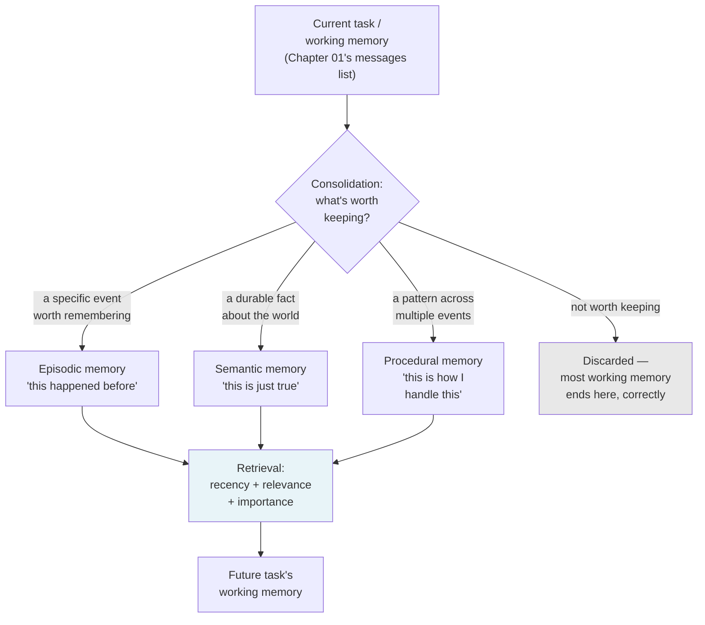
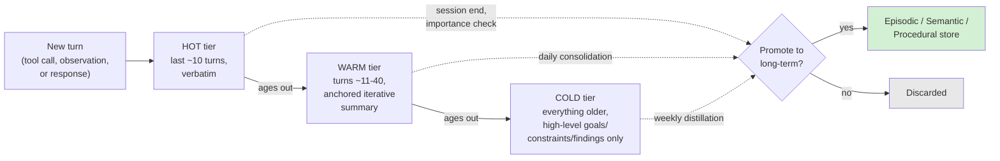
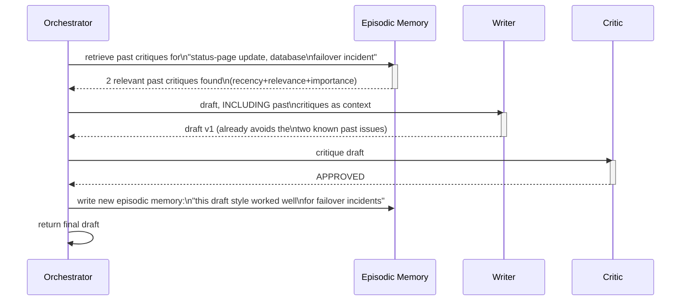
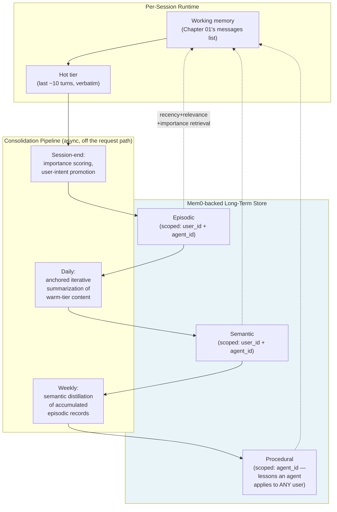
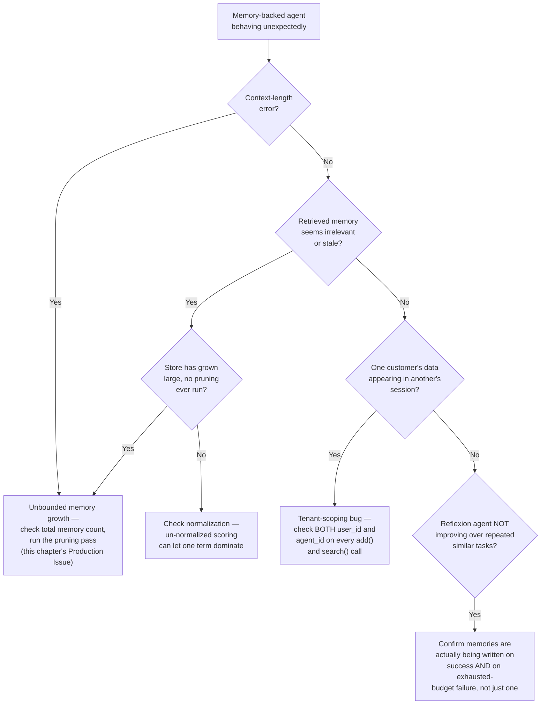

# Chapter 04 — Agent Memory Systems: Working, Long-Term, and Episodic Memory

## Learning Objectives

By the end of this chapter, you will be able to:

- Explain the four-part functional memory taxonomy — working, episodic, semantic, and procedural — and why collapsing them into a single representation loses real, engineering-relevant distinctions.
- Extend Chapter 01's in-task working memory into memory that survives past the end of a single run, using a three-tier hot/warm/cold consolidation strategy.
- Implement episodic memory retrieval using the recency-relevance-importance scoring formula, extending Volume 3 Chapter 06's dense retrieval with two additional terms plain RAG doesn't need.
- Build a working Reflexion agent — Chapter 02's Reflection pattern, now genuinely augmented with persisted memory of past critiques — closing the exact forward reference that chapter left open.
- Use Mem0 to store and retrieve agent memories correctly scoped by user and agent identity, so one tenant's memories can never leak into another's context.
- Distinguish memory poisoning from prompt injection, and explain why persistence specifically is what makes memory poisoning a different threat, not just a longer-lived version of the same one.
- Design a memory promotion pipeline that decides, on purpose, what's worth writing to long-term memory and when — instead of either remembering everything or nothing.
- Recognize the unbounded-memory-growth production issue before it happens, and apply this chapter's tiered-consolidation fix.

## Prerequisites

- **Chapters completed:** Chapter 01 (the small, in-task working memory this chapter extends, and the `Agent` Protocol every implementation here still satisfies); Chapter 02 (specifically Reflexion — "Reflection augmented with persisted memory of past critiques," explicitly deferred to this chapter); Chapter 03 (the closing question about retrieving a relevant *past experience* the same way `search_tools` retrieves a relevant tool).
- **Volume 3 connection:** Chapter 06 (Dense Retrieval) — this chapter's episodic memory retrieval is dense retrieval with two additional scoring terms, not a different technique from scratch.
- **Tools installed:** Everything from Chapters 01–03, plus `pip install mem0ai` (this chapter's named production memory layer).

## Estimated Reading Time

65–80 minutes

## Estimated Hands-on Time

2.5–3.5 hours

---

## ⚡ Fast Read

> **Skim time: 5 minutes** — Read this if you're in a hurry, returning for reference, or already familiar with part of this topic.

- **What it is:** Giving an agent memory that survives past the end of a single task — what it's learned, what happened before, and what it knows about the world it's operating in — instead of starting every run from a blank slate the way every agent in Chapters 01–03 has so far.
- **Why it matters:** Chapter 02 named a pattern (Reflexion) that explicitly requires this and couldn't build it yet. Chapter 03 ended by asking whether "find a relevant past experience" is the same retrieval problem as "find a relevant tool." Both questions have the same answer, and it's this chapter.
- **Key insight:** Agent memory retrieval is not a new technique — it's Volume 3's dense retrieval with two extra scoring terms bolted on. A memory that's semantically relevant but happened eight months ago and was trivial shouldn't outrank one that's slightly less relevant but happened yesterday and mattered a great deal — plain similarity search can't tell the difference, which is exactly why every serious memory system since 2023's "Generative Agents" paper scores memories on relevance *and* recency *and* importance together, not similarity alone.
- **What you build:** A hand-rolled episodic memory store with the recency-relevance-importance retrieval formula, a Reflexion agent that genuinely remembers its past critiques across tasks (finally closing Chapter 02's loop), and a production-grade, tenant-scoped memory layer using Mem0.
- **Jump to:** [Core Concepts](#core-concepts) | [First Code](#beginner-implementation) | [Best Practices](#best-practices) | [Mini Project](#mini-project)

---

## Why This Topic Exists

Every agent built in Chapters 01 through 03 has had a form of amnesia by design. Chapter 01's `messages` list — the working memory that let the agent remember its own tool calls within one run — is thrown away the instant `run_agent` returns. Ask the same agent to investigate ticket #4471 twice in a row, on two separate calls, and it has no idea it's ever seen that ticket before. That was the right scope for Chapter 01: an in-task loop needs working memory to function at all, and this course deliberately didn't complicate that chapter with anything that outlives a single run.

But two chapters since then have quietly been building toward this one, on purpose. Chapter 02 introduced Reflexion and immediately flagged what it *isn't* yet: "Reflexion specifically refers to the named pattern of augmenting reflection with explicit persisted memory of past failures/successes... Reflexion's persistence layer is a direct extension you'll have the tools to build once Chapter 04 covers long-term memory." Chapter 03 ended by asking, almost rhetorically, whether finding a relevant past experience is the same retrieval problem as finding a relevant tool or a relevant document — and answering "yes, structurally, but what's stored and what decides it's worth storing is different." This chapter is where both of those open threads get resolved, not introduced from nothing.

Here's the concrete engineering problem underneath both: an agent that never remembers anything makes the same mistake in session two that it made and got corrected on in session one. Chapter 02's status-page Reflection agent, run fresh every time, will happily get critiqued for "too technical" on a database-failover incident this month, and get critiqued for the exact same thing on a near-identical incident next month, having learned nothing in between — because there was never anywhere for that lesson to live. Fixing that requires more than "store things somewhere." It requires deciding *what* is worth remembering, *how long* it should matter, and *how* to find the right memory among potentially thousands, without flooding the agent's context with everything it's ever seen — which is a retrieval problem, a consolidation problem, and (once Chapter 05 introduces more than one agent sharing memory) a scoping problem, all at once.

## Real-World Analogy

Think about the difference between someone's first day on a job and their first year.

On day one, they have no memory of anything — every question gets answered from scratch, every customer is a stranger, every situation is encountered for the first time. That's **working memory only**: whatever's in front of them right now, and nothing else, exactly like every agent this course has built through Chapter 03.

By month three, they remember specific things that happened — "we had an outage like this back in March, and it turned out to be a bad certificate rotation." That's **episodic memory**: a record of specific past events, retrievable when something similar comes up again.

By month six, they've internalized facts that don't attach to any one event — "this customer is on the Enterprise tier and always escalates through their account manager, not support," "the billing service has three known integration quirks." That's **semantic memory**: accumulated knowledge, detached from the specific moment it was learned.

By month twelve, they've developed instincts — "when a billing-service ticket reopens, check the retry-path logic first, because that's caused three of our last five reopens." That's **procedural memory**: not a fact and not a specific memory, but a learned rule for *how* to act, refined by experience.

Notice: nobody would want an employee who remembers absolutely everything with equal weight, either — the trivial and the critical treated identically clogs their judgment just as much as remembering nothing does. A good employee (and, this chapter argues, a good agent) has to actively decide what's worth keeping, what fades, and what gets promoted from "something that happened once" into "a rule I now follow."

---

## Core Concepts

### Working Memory (Extended from Chapter 01)

**Technical definition:** The active, in-context state of a single agent run — the conversation history, tool calls, and results accumulated so far in the current task, discarded (or consolidated, per this chapter) when the run ends.

**Plain English:** What the agent is holding in its head *right now*, for the task it's doing *right now*.

**Analogy:** What you're actively thinking about mid-conversation, gone the moment the conversation ends unless you deliberately write something down.

> This is exactly Chapter 01's `messages` list — nothing about its mechanics changes here. What changes is that this chapter gives it somewhere to go *before* it's discarded, instead of just vanishing.

### Episodic Memory

**Technical definition:** A stored record of a specific past event, interaction, or decision — retrievable later when a sufficiently similar, recent, or important situation recurs.

**Plain English:** "I remember the time this happened before."

**Analogy:** The month-three employee's memory of the March outage — a specific thing that happened, not a general fact or a rule.

### Semantic Memory

**Technical definition:** Accumulated factual knowledge, detached from any single event that produced it — user or customer attributes, product configuration, organizational policy.

**Plain English:** Things the agent just *knows*, without necessarily remembering when or how it learned them.

**Analogy:** The month-six employee's knowledge that a specific customer always escalates through their account manager — a fact, not a memory of a specific conversation where that was established.

### Procedural Memory

**Technical definition:** A learned rule, heuristic, or playbook for *how* to act, refined by accumulated experience rather than stored as a discrete fact or event.

**Plain English:** An instinct for what to do, built up from having done similar things before.

**Analogy:** The month-twelve employee's habit of checking the retry-path logic first on billing-service reopens — not a memory of one incident, and not a standalone fact, but a rule of thumb earned across several.

> **Currency Note (verified 2026-07-11):** Current sources converge on this four-part split — working, episodic, semantic, procedural — as the standard functional taxonomy, one level more granular than this chapter's title. This chapter keeps "Working, Long-Term, and Episodic Memory" as its primary teaching structure (matching its committed scope), but treats **semantic and procedural memory as the two sub-types that make up "long-term memory"** — so wherever this chapter says "long-term," assume it covers both facts (semantic) and learned rules (procedural) unless a section specifically distinguishes them.

### Memory Consolidation (Promotion)

**Technical definition:** The process of deciding which working-memory content is worth persisting beyond the current run, and writing it into the appropriate long-term store (episodic, semantic, or procedural) — as opposed to simply discarding everything, or persisting everything indiscriminately.

**Plain English:** Deciding, on purpose, what's worth remembering, instead of remembering nothing or remembering everything equally.

**Analogy:** Writing a brief note in a logbook after a meaningful shift, versus either throwing away every day's events the moment the shift ends, or trying to write down literally everything that happened, word for word.

### Hot/Warm/Cold Memory Tiers

**Technical definition:** A three-layer consolidation strategy — a **hot** layer holding recent turns verbatim and uncompressed, a **warm** layer holding a maintained, iteratively-updated summary of moderately recent activity, and a **cold** layer holding highly compressed, long-horizon context (major findings, standing constraints) — used to keep working memory within a usable context budget without simply truncating older content and losing it.

**Plain English:** Keep the very recent stuff exactly as it happened, keep a running summary of the recently-recent stuff, and keep only the headline points from everything older than that.

**Analogy:** You remember this morning's conversation word for word, you remember the gist of what happened this week, and you remember only the major decisions from a project that wrapped up two months ago — not every detail of every day.

> Current guidance (verified for this chapter) specifically recommends **anchored iterative summarization** — merging new content into a persistent running summary — over regenerating a full summary from scratch each time, citing better accuracy, completeness, and continuity for the warm tier specifically.

### Recency-Relevance-Importance Retrieval Scoring

**Technical definition:** A memory-retrieval scoring function that combines three independently normalized signals — **relevance** (embedding similarity between the current query and the stored memory, structurally identical to Volume 3 Chapter 06's dense retrieval), **recency** (exponential decay since the memory was last accessed or created), and **importance** (a stored significance rating, typically assigned by an LLM at write time) — rather than ranking retrieved memories by relevance alone.

**Plain English:** The right memory to retrieve isn't just "the one that sounds most similar to what I'm asking about" — it's a combination of how similar, how recent, and how significant that memory actually was.

**Analogy:** A doctor reviewing a patient's chart doesn't just pull the most textually-similar past note — a highly relevant note from eight years ago about a resolved, minor issue matters less right now than a moderately relevant note from last week about something still active and serious.

> **Currency Note (verified 2026-07-11):** This formula traces to the "Generative Agents" (Stanford "simulacra town") research and is confirmed still current and widely adopted across subsequent memory systems (MemGPT/Letta, Mem0, and LangGraph-based memory implementations are all cited as using recency/relevance/importance-style scoring in some form). The specific formula this chapter uses: `score = recency + relevance + importance` (each term min-max normalized to [0, 1] before summing, optionally weighted), with recency modeled as exponential decay since last access. This is the chapter's single most load-bearing technical concept — everything in the Beginner and Advanced Implementations builds on it directly.

### Memory Poisoning

**Technical definition:** An attack in which an adversary causes false, misleading, or malicious content to be written into an agent's *persistent* memory store, such that every subsequent session that retrieves that memory inherits the corrupted content — as distinct from prompt injection, which affects only the current session.

**Plain English:** Prompt injection tricks the agent once, for one conversation. Memory poisoning tricks the agent *permanently*, because the bad instruction gets saved and comes back every time.

**Analogy:** A single forged memo that fools someone for one day, versus a forged memo that gets filed into the permanent employee handbook — the second one keeps fooling every future reader until someone specifically finds and removes it.

---

## Architecture Diagrams

### Diagram 1 — The Four Memory Types, and What Feeds Them



The `Discard` branch is not a gap in the diagram — it's the majority outcome, and it's supposed to be. An agent that tries to consolidate every working-memory turn into long-term storage is exactly the unbounded-growth production issue this chapter's [Production Architecture](#production-architecture) section exists to prevent.

### Diagram 2 — Three-Tier Consolidation Pipeline



Every arrow in this diagram is doing real, load-bearing compression work — a hot-tier turn is exact and expensive; a cold-tier item is compressed and cheap; the promotion decision is what actually decides whether anything survives past this run at all.

## Flow Diagrams

### Diagram 3 — A Reflexion Agent, Start to Finish

This is Chapter 02's Reflection pattern, finally closed into genuine Reflexion — retrieving past critiques before drafting, and writing a new one after.



Compare this to Chapter 02's original `ReflectionAgent`, which always started from a blank slate — the Writer there had no way to know a nearly-identical incident had been critiqued for the same issue last month. The only two new steps here are the retrieval before drafting and the write after — everything else is Chapter 02's pattern, unchanged.

---

## Beginner Implementation

Before reaching for Mem0, build the mechanic by hand — the same discipline this course has followed since Chapter 01's Framework Thread: concept first, vendor feature second. This extends Chapter 01's working memory with a simple, file-backed episodic store and the recency-relevance-importance formula, in full.

```python
# Learning example — hand-rolled episodic memory with the recency-
# relevance-importance retrieval formula, no external memory library.
import json
import math
import time
from dataclasses import dataclass, field
from anthropic import Anthropic

client = Anthropic()


@dataclass
class Memory:
    content: str
    embedding: list[float]
    importance: float        # 1-10, assigned at write time
    created_at: float        # unix timestamp
    last_accessed_at: float  # unix timestamp, updated on retrieval


class EpisodicMemoryStore:
    """A deliberately simple, in-process store — production systems
    use a real vector database underneath (this is exactly the
    retrieval problem Volume 3 Chapter 06 solved for RAG document
    chunks), but the SCORING logic here is the actual point of this
    chapter and is identical regardless of what stores the vectors."""

    def __init__(self, decay_per_hour: float = 0.995):
        self._memories: list[Memory] = []
        self._decay_per_hour = decay_per_hour

    def _embed(self, text: str) -> list[float]:
        # Stubbed for teaching clarity — production code calls a real
        # embedding model here, exactly as Volume 3 Chapter 06 taught.
        return [float(ord(c) % 10) for c in text[:32].ljust(32)]

    def _cosine_similarity(self, a: list[float], b: list[float]) -> float:
        dot = sum(x * y for x, y in zip(a, b))
        norm_a = math.sqrt(sum(x * x for x in a))
        norm_b = math.sqrt(sum(y * y for y in b))
        return dot / (norm_a * norm_b) if norm_a and norm_b else 0.0

    def add(self, content: str, importance: float) -> None:
        now = time.time()
        self._memories.append(Memory(
            content=content, embedding=self._embed(content),
            importance=importance, created_at=now, last_accessed_at=now,
        ))

    def search(self, query: str, top_k: int = 3) -> list[Memory]:
        if not self._memories:
            return []

        query_embedding = self._embed(query)
        now = time.time()

        relevances = [self._cosine_similarity(query_embedding, m.embedding) for m in self._memories]
        recencies = [
            self._decay_per_hour ** ((now - m.last_accessed_at) / 3600)
            for m in self._memories
        ]
        importances = [m.importance / 10.0 for m in self._memories]  # normalize 1-10 to 0-1

        def normalize(values: list[float]) -> list[float]:
            lo, hi = min(values), max(values)
            if hi == lo:
                return [1.0 for _ in values]
            return [(v - lo) / (hi - lo) for v in values]

        rel_n, rec_n, imp_n = normalize(relevances), normalize(recencies), normalize(importances)
        scores = [r + c + i for r, c, i in zip(rel_n, rec_n, imp_n)]

        ranked = sorted(zip(scores, self._memories), key=lambda pair: pair[0], reverse=True)
        top = [memory for _, memory in ranked[:top_k]]
        for memory in top:
            memory.last_accessed_at = now  # retrieval itself refreshes recency
        return top


def score_importance(content: str) -> float:
    """Asks the model to rate how significant a piece of working
    memory is, 1-10 — this IS the consolidation decision from
    Diagram 1: low scores are the majority outcome and should be
    discarded, not stored."""
    response = client.messages.create(
        model="claude-sonnet-5", max_tokens=10,
        messages=[{
            "role": "user",
            "content": f"Rate the significance of this event for future "
                       f"reference, 1 (routine) to 10 (critical), respond "
                       f"with ONLY the number:\n\n{content}",
        }],
    )
    try:
        return float(response.content[0].text.strip())
    except ValueError:
        return 1.0  # fail safe toward "not important" rather than crashing


PROMOTION_THRESHOLD = 6.0

def consolidate_working_memory(store: EpisodicMemoryStore, working_memory_summary: str) -> bool:
    """Called at the end of a run — decides whether this task's
    outcome is worth promoting to episodic memory at all."""
    importance = score_importance(working_memory_summary)
    if importance >= PROMOTION_THRESHOLD:
        store.add(working_memory_summary, importance)
        return True
    return False  # most runs end here, correctly — see Diagram 1


if __name__ == "__main__":
    store = EpisodicMemoryStore()

    # A routine ticket lookup — low importance, should NOT be promoted.
    consolidate_working_memory(store, "Looked up ticket #4471, status was already resolved.")

    # A genuinely significant finding — should be promoted.
    consolidate_working_memory(
        store,
        "Investigated ticket #4471: billing-service reopened tickets are "
        "consistently caused by the retry-path fix from v2.3.1 not covering "
        "the timeout case. Checked retry-path logic FIRST on any future "
        "billing-service reopen.",
    )

    results = store.search("why do billing service tickets keep reopening")
    for memory in results:
        print(f"[importance={memory.importance}] {memory.content}")
```

**What matters here, line by line:**

- `_embed` is deliberately stubbed — the point of this section is the *scoring formula* around retrieval, not re-teaching embeddings, which Volume 3 Chapter 06 already covered in full. Production code drops in a real embedding call here without changing anything else in this class.
- `score_importance` is the entire consolidation decision from Diagram 1, made concrete: most working memory scores low and is correctly discarded (`PROMOTION_THRESHOLD = 6.0` is deliberately not `0` — remembering everything is exactly as wrong as remembering nothing).
- `search`'s three `normalize()` calls are what make the recency-relevance-importance formula actually work as a *combination* rather than one term dominating by scale — relevance (a cosine similarity, naturally in `[-1, 1]`) and importance (originally `1`–`10`) live on completely different scales before normalization, and summing them un-normalized would let whichever term happens to have the largest raw range silently dominate the ranking.
- `last_accessed_at` being updated on every successful retrieval, not just at write time, means a memory that keeps proving relevant stays "fresh" in recency terms even as it ages in wall-clock time — this is a deliberate, current-guidance-backed design choice, not an oversight.

## Intermediate Implementation

Now the payoff this chapter has been building toward since its opening: closing Chapter 02's Reflexion gap for real. This wraps `EpisodicMemoryStore` around Chapter 02's `ReflectionAgent`, with no change to that class's own logic — memory is added *around* it.

```python
# Learning example — Chapter 02's ReflectionAgent, now genuinely
# Reflexion: it retrieves past critiques before drafting, and writes
# a new memory after. Chapter 02's Writer/Critic prompts and control
# flow are reused unchanged; only the memory layer is new.
from __future__ import annotations
from dataclasses import dataclass
from typing import AsyncIterator
from anthropic import AsyncAnthropic

# Reused from Chapter 01: Agent (Protocol), AgentEvent
# Reused from this chapter's Beginner Implementation: EpisodicMemoryStore

client = AsyncAnthropic()

WRITER_SYSTEM_PROMPT = """You draft customer-facing status-page updates
for Aperture Cloud. Be clear, honest about impact, and never promise a
specific fix timeline unless one was explicitly provided."""

CRITIC_SYSTEM_PROMPT = """You review a DRAFT status-page update, never
write one yourself. Check specifically for: (1) any timeline promise
not explicitly supported by the input facts, (2) overly technical
language a non-engineer customer wouldn't understand, (3) a missing
acknowledgment of customer impact. Respond with "APPROVED" if none of
these issues are present, or a numbered list of exactly what to fix."""


@dataclass
class ReflexionAgent:
    """Chapter 02's ReflectionAgent, with a memory layer wrapped
    around it — this class satisfies the same Agent Protocol and can
    be swapped in anywhere a plain ReflectionAgent was used."""
    memory: "EpisodicMemoryStore"
    max_reflections: int = 2

    async def run(self, goal: str) -> AsyncIterator["AgentEvent"]:
        # NEW: retrieve relevant past critiques before drafting at all.
        past_critiques = self.memory.search(goal, top_k=2)
        memory_context = "\n".join(f"- {m.content}" for m in past_critiques)

        draft = await self._write(goal, memory_context)
        yield AgentEvent(kind="tool_call", payload=f"draft v1 (informed by {len(past_critiques)} past critiques):\n{draft}")

        for reflection_pass in range(self.max_reflections):
            critique = await self._critique(goal, draft)
            yield AgentEvent(kind="tool_result", payload=f"critique:\n{critique}")

            if critique.strip().startswith("APPROVED"):
                # NEW: write a memory of what worked, so future similar
                # tasks start from a better first draft than this one did.
                importance = 8.0 if past_critiques else 5.0  # a first-of-its-kind case is worth remembering more
                self.memory.add(
                    f"For goal '{goal}': draft approved after {reflection_pass} "
                    f"revision(s). {'Used ' + str(len(past_critiques)) + ' past critiques successfully.' if past_critiques else 'No prior similar critiques existed yet.'}",
                    importance=importance,
                )
                yield AgentEvent(kind="final_answer", payload=draft)
                return

            draft = await self._revise(goal, draft, critique)
            yield AgentEvent(kind="tool_call", payload=f"draft v{reflection_pass + 2}:\n{draft}")

        # NEW: an exhausted reflection budget is ALSO worth remembering —
        # if this task shape keeps needing max_reflections, that pattern
        # itself is a signal worth surfacing to a human reviewing memory,
        # not just a one-off failure to discard.
        self.memory.add(
            f"For goal '{goal}': FAILED to reach APPROVED within "
            f"{self.max_reflections} reflections — needs human review of "
            f"the Critic's criteria for this task shape.",
            importance=9.0,
        )
        raise RuntimeError(
            f"Draft did not reach APPROVED within {self.max_reflections} reflection passes — "
            f"escalate to a human editor, do not publish"
        )

    async def _write(self, goal: str, memory_context: str) -> str:
        prompt = goal
        if memory_context:
            prompt = f"{goal}\n\nRelevant lessons from past similar drafts:\n{memory_context}"
        response = await client.messages.create(
            model="claude-sonnet-5", max_tokens=512,
            system=WRITER_SYSTEM_PROMPT,
            messages=[{"role": "user", "content": prompt}],
        )
        return response.content[0].text

    async def _critique(self, goal: str, draft: str) -> str:
        response = await client.messages.create(
            model="claude-sonnet-5", max_tokens=512,
            system=CRITIC_SYSTEM_PROMPT,
            messages=[{"role": "user", "content": f"Task: {goal}\n\nDraft:\n{draft}"}],
        )
        return response.content[0].text

    async def _revise(self, goal: str, draft: str, critique: str) -> str:
        response = await client.messages.create(
            model="claude-sonnet-5", max_tokens=512,
            system=WRITER_SYSTEM_PROMPT,
            messages=[{
                "role": "user",
                "content": f"Task: {goal}\n\nYour previous draft:\n{draft}\n\n"
                            f"Editor's critique:\n{critique}\n\nRevise accordingly.",
            }],
        )
        return response.content[0].text
```

**Why this is genuinely Reflexion now, not just Reflection with extra steps:**

- The `_write` call's `memory_context` parameter is the entire mechanism — a fresh `ReflectionAgent` from Chapter 02 and this `ReflexionAgent` produce *identical* first drafts on the very first time a task shape is ever seen (`past_critiques` is empty, `memory_context` is `""`). The difference only appears the *second* time a similar task comes up, which is exactly the property Reflexion's definition requires: it's not smarter in general, it's smarter *because it remembers*.
- Both the success path and the failure path write a memory — this matters. A naive implementation might only remember what worked; but a task shape that *keeps* exhausting `max_reflections` is at least as important to surface (arguably more so, since it points at a Critic-criteria problem, echoing Chapter 02's own Production Issue) as one that succeeded cleanly.
- The `importance` scores here are hand-assigned rather than run through `score_importance` from the Beginner Implementation, for a deliberate reason: this class already knows structurally significant facts about its own outcome (first-of-its-kind vs. repeat, success vs. exhausted budget) that are more reliable signals than asking a separate model call to guess importance from the text alone. Not every consolidation decision needs an LLM call — use one when the significance genuinely isn't knowable structurally, skip it when it is.

## Advanced Implementation

Production-grade means a real, tenant-scoped memory backend instead of an in-process Python object, and explicit multi-tenant boundaries — because the moment Aperture Cloud's memory-backed agent serves more than one customer, the scoping question stops being optional.

```python
# Production example — Mem0-backed episodic memory, correctly scoped
# by user_id AND agent_id to prevent cross-tenant leakage. Pinned
# package verified 2026-07-11: mem0ai.
from mem0 import MemoryClient

# Hosted client — reads MEM0_API_KEY from the environment by default.
# Mem0 also offers a fully local/self-hosted variant (`from mem0 import
# Memory`) for teams that can't send data to a hosted service; the
# scoping discipline below applies identically to either.
memory_client = MemoryClient()


def add_reflexion_memory(customer_id: str, agent_name: str, content: str, importance: float) -> None:
    """Writes a memory scoped to BOTH the customer (user_id) and the
    specific agent that produced it (agent_id) — two axes, not one.
    Scoping by customer alone would let two different agents'
    memories bleed into each other; scoping by agent alone would let
    one customer's memories leak into another's context. Both
    boundaries have to hold for this to be safe."""
    memory_client.add(
        messages=[{"role": "assistant", "content": content}],
        user_id=customer_id,
        agent_id=agent_name,
        metadata={"importance": importance, "type": "reflexion_critique"},
    )


def search_reflexion_memory(customer_id: str, agent_name: str, query: str, top_k: int = 3) -> list[dict]:
    """Retrieval is scoped identically to writes — a query issued for
    customer A, agent 'status-page-writer' can NEVER retrieve a
    memory written under a different user_id or agent_id, regardless
    of how semantically similar the content is. This is the tenant
    boundary Mem0 enforces at the query layer, not something the
    calling code has to remember to filter after the fact."""
    return memory_client.search(
        query=query,
        user_id=customer_id,
        agent_id=agent_name,
        top_k=top_k,
    )


# --- Wired into the Agent Protocol from Chapter 01 -----------------------
from dataclasses import dataclass
from typing import AsyncIterator

@dataclass
class ProductionReflexionAgent:
    """Same control flow as this chapter's ReflexionAgent, with Mem0
    replacing the hand-rolled EpisodicMemoryStore — satisfies the
    same Agent Protocol, swappable at any call site that expected
    the Intermediate Implementation's version."""
    customer_id: str
    agent_name: str = "status-page-writer"
    max_reflections: int = 2

    async def run(self, goal: str) -> AsyncIterator["AgentEvent"]:
        past_critiques = search_reflexion_memory(self.customer_id, self.agent_name, goal)
        # ... identical control flow to the Intermediate Implementation's
        # ReflexionAgent.run from here — draft, critique, revise, and on
        # success or exhausted budget, call add_reflexion_memory scoped
        # to self.customer_id and self.agent_name. Abbreviated here to
        # the shape that matters: WHERE the tenant boundary is enforced,
        # not a restatement of control flow already shown in full above.
        yield AgentEvent(kind="final_answer", payload="(see Intermediate Implementation for full control flow)")
```

**Why the double-scoping is the actual point of this section:**

- `user_id` and `agent_id` together define the tenant boundary. This directly operationalizes this chapter's memory-poisoning and tenant-bleed-through concerns from [Security Considerations](#security-considerations) below: even a successful prompt-injection-driven attempt to write a poisoned memory is contained to the attacker's own `user_id` scope — it cannot surface in a *different* customer's retrieval results, because Mem0 enforces the scope at the query layer, not as an application-level filter that a bug could accidentally omit.
- This is a genuinely different failure mode from Chapter 03's tool-registry concerns: a mis-scoped memory doesn't just produce a wrong answer, it can leak one customer's private incident history into another customer's session — which is exactly why this chapter treats memory scoping as a security topic, not just a data-modeling detail.

---

## Production Architecture



Notice **procedural memory is scoped by `agent_id` alone, not `user_id`** — deliberately. A lesson like "check the retry-path logic first on billing-service reopens" is a rule the agent should apply to *any* customer's billing-service ticket, not something private to the customer whose ticket first taught the agent that lesson. Episodic and semantic memory, by contrast, are almost always customer-specific and need the full `user_id` + `agent_id` scope from the Advanced Implementation. Getting this distinction backwards in either direction is a real bug: scoping procedural memory per-customer means the agent never generalizes what it learns; scoping episodic memory only per-agent means one customer's incident history leaks into every other customer's context.

### Production Issue: Long-Term Memory Grows Unbounded, Context Window Exhaustion

**Symptoms**
Six months after launch, Aperture Cloud's Reflexion-based status-page agent starts intermittently failing with context-length errors, and separately, support engineers notice its drafts have started referencing oddly specific, seemingly irrelevant past incidents — a query about a database failover pulls in a memory about a minor DNS hiccup from four months ago that happens to share a few keywords, crowding out two genuinely relevant recent memories that would have mattered more.

**Root Cause**
Two compounding problems, both stemming from the same root cause: `consolidate_working_memory`'s promotion decision ran correctly at first, but as the agent handled more incidents over time, the *total volume* of stored episodic memories grew without any corresponding pruning — nothing in this chapter's Beginner or Intermediate Implementation ever removes an old, low-value memory once it's written. Combined with `search`'s recency-relevance-importance formula, a large-enough memory store means more near-ties in the relevance dimension, and once the store is large enough, occasionally a marginally-relevant-but-old memory's importance score wins out over a more genuinely relevant one purely because the retrieval pool got too large and noisy for the scoring formula's small `top_k` to reliably surface the best matches.

**How to Diagnose It**
- Check the total memory count for the affected `user_id`/`agent_id` scope — if it's grown into the thousands with no pruning ever having run, that's the direct signal.
- Pull the actual `search` results for a recent bad draft and inspect the `importance` and age of what got retrieved versus what a human would consider the obviously-correct memory to surface — a retrieval clearly dominated by an old, low-importance, marginally-relevant memory confirms the diagnosis.
- Confirm whether a pruning or archival job (see the fix below) was ever actually scheduled — this is a common gap: the *consolidation* pipeline (write path) gets built and shipped, and the *pruning* pipeline (removing what's no longer worth keeping) quietly never does.

**How to Fix It**
```python
# Before: memories accumulate forever, no pruning path exists at all.
class EpisodicMemoryStore:
    def add(self, content, importance):
        self._memories.append(Memory(content, ..., importance, ...))
    # no prune(), no expiry, no cap — this chapter's Beginner
    # Implementation, as originally written, has exactly this gap.

# After: a periodic pruning pass, using the SAME recency-relevance-
# importance signals already computed for retrieval, run in reverse —
# to find what's safe to forget, not just what's worth retrieving.
def prune_low_value_memories(store: EpisodicMemoryStore, keep_top_n: int = 500) -> int:
    """Run on a schedule (e.g. weekly, alongside the semantic
    distillation pass from the Production Architecture diagram).
    Scores every stored memory the same way retrieval does, but
    keeps only the top N — everything else is either archived to
    cold storage (cheap, rarely-queried) or discarded outright,
    depending on the memory's type and the org's retention policy."""
    now_query = ""  # importance-weighted, not query-specific, for pruning
    scored = sorted(store._memories, key=lambda m: m.importance, reverse=True)
    to_keep, to_prune = scored[:keep_top_n], scored[keep_top_n:]
    store._memories = to_keep
    return len(to_prune)
```
Pruning isn't a one-time fix — it's a permanent, scheduled part of the same consolidation pipeline that writes memories in the first place. A store that only ever grows is a store that was always going to hit this issue eventually; the question is only when.

**How to Prevent It in Future**
- Treat memory pruning as a required, scheduled companion to memory promotion from day one — not an optimization to add "once it becomes a problem." The Production Architecture diagram's weekly semantic-distillation step is the natural place to also run pruning, since both are already periodic, off-the-request-path jobs.
- Cap `top_k` retrieval results deliberately and monitor retrieval quality over time, not just at launch — a `top_k=3` that worked well against a 50-memory store may need re-tuning (or a smarter pre-filter, like restricting the candidate pool to memories above a minimum importance threshold before scoring) once the store has grown to thousands of entries.
- Alert on total memory count per `user_id`/`agent_id` scope crossing a threshold, the same way Chapter 01 recommended alerting on bound-trip rate — an unbounded store is a slow-motion version of Chapter 01's unbounded loop, and deserves the same "catch it before it's a production incident" discipline.

---

## Best Practices

1. **Score importance at write time, and make discarding the default outcome.** Most working memory is not worth promoting — a `PROMOTION_THRESHOLD` that's easy to clear defeats the entire purpose of consolidation.
2. **Always normalize before combining retrieval signals.** Relevance, recency, and importance live on different natural scales; summing them un-normalized lets whichever term happens to have the widest raw range silently dominate every ranking.
3. **Scope memory by every axis that needs a boundary, not just the obvious one.** `user_id` alone is not enough once more than one agent shares a memory store — `agent_id` (or an equivalent) closes the second axis, and procedural memory specifically often needs the *opposite* scoping choice from episodic/semantic memory, per this chapter's Production Architecture.
4. **Pair every promotion pipeline with a pruning pipeline, from the start.** A store that only grows will eventually hit this chapter's Production Issue — build the fix in from day one rather than retrofitting it after a context-length error in production.
5. **Prefer anchored iterative summarization over full-reconstruction summarization for the warm tier.** Current guidance is explicit that merging new content into a persistent running summary outperforms regenerating the whole thing from scratch on accuracy, completeness, and continuity.
6. **Let structurally-known facts skip the importance-scoring LLM call when you already know the answer.** The Intermediate Implementation's `ReflexionAgent` hand-assigns importance for its own success/failure outcomes rather than asking a model to guess — use judgment about when a call is actually needed versus when the calling code already knows.

## Security Considerations

- **Memory poisoning is a distinct, persistence-driven threat, not just "prompt injection that happened to work."** A single successful injection that gets written into long-term memory keeps affecting every future session that retrieves it, until someone specifically finds and removes the poisoned entry — which is a fundamentally different remediation problem than a single bad response that's forgotten the moment the session ends.
- **Tenant scoping must be enforced at the query layer, not as an application-level filter applied after retrieval.** The Advanced Implementation's `user_id` + `agent_id` scoping on both `add` and `search` calls is the correct pattern specifically because it can't be accidentally bypassed by a missing post-hoc filter somewhere else in the codebase — the boundary lives in the same call that does the retrieval.
- **Every write to long-term memory is exactly as untrusted as any tool result, per Chapter 01's original discipline** — a memory being *your own agent's* past output doesn't make it automatically safe to retrieve and trust blindly, especially once an adversary has any path (a crafted support ticket, a manipulated tool result) to influence what gets consolidated in the first place.

> **A note on unverified claims:** this chapter's research surfaced two specific incidents worth being aware of — a reported cross-tenant leak in a cloud SRE agent product, and a reported large financial loss attributed to memory poisoning on shared infrastructure. Neither was corroborated to the multi-source bar this course applies before citing something as a confirmed case study (the standard this course held the Replit and GTG-1002 incidents to in Chapter 01). Treat both as illustrative of a real, named class of risk — not as verified, citable incidents — unless you've independently confirmed them against primary sources at the time you're reading this.

## Cost Considerations

| Operation | Cost driver | Notes |
|---|---|---|
| Importance scoring at write time | One small LLM call per candidate memory | Cheap individually (`max_tokens=10` in this chapter's example), but scales with working-memory volume — batch or sample if consolidation volume is very high |
| Embedding a new memory | One embedding call per stored memory | Same cost shape as embedding a RAG document chunk (Volume 3) |
| Recency-relevance-importance retrieval | Roughly one embedding call per query, plus in-memory scoring over the candidate pool | Scoring itself is cheap (no LLM call); cost scales with how large the unpruned candidate pool has grown — another reason pruning matters for cost, not just retrieval quality |
| Daily/weekly consolidation passes | One or more LLM calls per summarization pass | Off the request path (per the Production Architecture diagram) — amortized, not paid per user request |
| Mem0 hosted vs. self-hosted | Hosted: per-operation API cost. Self-hosted (`from mem0 import Memory`): your own vector DB + embedding + LLM costs | Self-hosting trades ops burden for per-call cost — the right choice depends on Aperture Cloud's existing infrastructure, not a universal answer |

The unbounded-growth Production Issue above is a cost problem as much as a quality problem: an ever-growing, never-pruned memory store doesn't just risk a bad retrieval — every future retrieval against it pays a growing (if modest, given no LLM call is needed for scoring itself) computational cost, and the embedding-storage cost for a self-hosted vector store scales directly with how much dead weight was never pruned.

## Common Mistakes

```python
# WRONG — promoting every working-memory turn to long-term storage,
# defeating the entire purpose of consolidation.
def consolidate_working_memory(store, working_memory_summary):
    store.add(working_memory_summary, importance=5.0)  # always promotes
```

```python
# RIGHT — most working memory is correctly discarded; only content
# clearing an explicit importance threshold gets promoted.
def consolidate_working_memory(store, working_memory_summary):
    importance = score_importance(working_memory_summary)
    if importance >= PROMOTION_THRESHOLD:
        store.add(working_memory_summary, importance)
        return True
    return False
```

```python
# WRONG — combining relevance, recency, and importance without
# normalizing first; whichever term has the widest raw numeric range
# silently dominates the ranking regardless of actual significance.
scores = [rel + rec + imp for rel, rec, imp in zip(relevances, recencies, importances)]
```

```python
# RIGHT — every term normalized to [0, 1] before combining.
rel_n, rec_n, imp_n = normalize(relevances), normalize(recencies), normalize(importances)
scores = [r + c + i for r, c, i in zip(rel_n, rec_n, imp_n)]
```

```python
# WRONG — scoping memory only by user_id, letting different agents'
# memories bleed together for the same user.
memory_client.add(messages=[...], user_id=customer_id)
memory_client.search(query=..., user_id=customer_id)
```

```python
# RIGHT — scoped by BOTH axes that need a boundary.
memory_client.add(messages=[...], user_id=customer_id, agent_id=agent_name)
memory_client.search(query=..., user_id=customer_id, agent_id=agent_name)
```

## Debugging Guide



| Symptom | Likely Cause | Where to Look |
|---|---|---|
| Context-length error from a memory-backed agent | Unbounded memory growth, no pruning ever ran | Total memory count for the affected scope |
| Retrieved memory is old, low-value, and crowds out better matches | Large unpruned store, or un-normalized scoring | Inspect raw relevance/recency/importance values before normalization |
| One customer's incident history appears in another customer's draft | Tenant-scoping bug | Confirm every `add`/`search` call includes both `user_id` and `agent_id` |
| Reflexion agent repeats the same mistake across similar tasks | Memories not being written, or `top_k` too low to surface them | Confirm `memory.add` actually ran on both the success and failure paths |
| Procedural lesson learned from one customer doesn't generalize to others | Procedural memory incorrectly scoped by `user_id` | Should be scoped by `agent_id` alone, per this chapter's Production Architecture |

## Performance Optimisation

- **Pre-filter the candidate pool by a minimum importance threshold before scoring, once the store is large.** Scoring every stored memory against every query gets more expensive as the store grows; restricting the candidate pool to memories above a minimum importance floor before computing recency-relevance-importance scores keeps retrieval fast without materially changing which memories actually surface (low-importance memories rarely won anyway).
- **Batch importance scoring for a session's working memory instead of scoring turn by turn.** One consolidation call summarizing and scoring an entire session's worth of candidate promotions is cheaper than a separate LLM call per turn.
- **Cache embeddings for frequently-repeated query shapes.** Aperture Cloud's Reflexion agent likely sees structurally similar goals repeatedly ("draft a status update for an incident affecting X service") — caching the query embedding for a recurring shape avoids re-embedding nearly-identical text on every run.

---

## Technology Comparison — Agent Memory Layers

> **Currency Note:** Verified 2026-07-11.

| System | Positioning | Key differentiator | Notes |
|---|---|---|---|
| **Mem0** | This chapter's named example | Automatic memory extraction/consolidation from raw conversation, conflict resolution between contradictory memories, built-in `user_id`/`agent_id`/session scoping | 59,600+★, Apache 2.0, v2.0 (June 2026); described by multiple sources as the de facto standard for agentic memory |
| **Letta** (formerly MemGPT) | OS-inspired virtual context management | The agent itself manages what's paged in/out of context via memory tools, carrying MemGPT's original "RAM vs. disk" framing forward literally | Best fit for long-running, stateful agents that should manage their own memory allocation, not just retrieve from an external store |
| **Zep** | Temporal reasoning over facts that change over time | Graphiti knowledge-graph engine; cited at 63.8% on LongMemEval vs. Mem0's 49.0% on the same benchmark | Free Community Edition deprecated — production use means Zep Cloud or a self-run Graphiti deployment, not the free managed tier |

None of these three is a strict upgrade over the others — Mem0's strength is the consolidation pipeline this chapter builds around; Letta's strength is agent-managed context paging for long-running sessions; Zep's strength is reasoning about facts that change over time (e.g., "what was this customer's plan tier *as of* the incident date," not just "what is it now"), which none of this chapter's own examples specifically needed but which matters a great deal for some production use cases.

## Decision Framework — Which Memory Type Does This Task Need?

1. **Does the task only need to remember things within its own run?** Working memory (Chapter 01) is sufficient — don't add persistence machinery a task doesn't need.
2. **Does the task benefit from recalling a specific past event when a similar one recurs?** Episodic memory, with recency-relevance-importance retrieval.
3. **Does the task need durable facts that don't attach to any single event?** Semantic memory — and consider whether it should be customer-scoped (most cases) or agent-scoped (rare, but real — a fact true regardless of which customer is involved).
4. **Does the task benefit from a rule of thumb that improves with accumulated experience, generalized across many past instances rather than any one of them?** Procedural memory, scoped by `agent_id` rather than `user_id`, per this chapter's Production Architecture.
5. **Whatever you chose, have you built the pruning path alongside the promotion path?** Per this chapter's Production Issue, this is not optional past a certain scale — it's a matter of when, not if, an unpruned store causes a problem.

## Real Client Scenario — The Reflexion Agent That Actually Learns

Six months into running Chapter 02's status-page Reflection agent unchanged, Aperture Cloud's support-engineering lead noticed something frustrating: the agent kept getting critiqued for the same class of issue — overly technical language on database-related incidents — over and over, incident after incident, with zero improvement between them. Every run started from the same blank slate.

Wiring in this chapter's `ReflexionAgent`, backed by Mem0 and correctly scoped per customer and per agent, changed the trajectory measurably within a month: the third database-incident draft in that window needed zero revision passes, because the Writer's first draft already incorporated the lesson from the first two incidents' critiques. The Critic didn't get any smarter — the *system* did, because a lesson that used to evaporate at the end of every run now had somewhere to live and a reliable way to be found again when it mattered. This is the concrete, measurable version of what "agent memory" is actually for: not an agent that seems to remember things when you ask it to, but a system whose *output quality compounds over time* instead of resetting to zero on every single task.

---

## Exercises

1. **(15 min)** Run the Beginner Implementation's example twice — once with the routine ticket lookup only, once with both examples. Confirm `search` never surfaces the routine lookup (it was correctly never promoted) and does surface the significant finding.
2. **(30 min)** Add a `prune_low_value_memories` call to the Beginner Implementation, and simulate 50 low-importance memories accumulating alongside 3 high-importance ones. Confirm pruning to `keep_top_n=10` retains the 3 high-importance memories and discards the rest.
3. **(30 min)** Run the Intermediate Implementation's `ReflexionAgent` twice in a row against two similar (not identical) goals. Confirm the second run's first draft (`draft v1`) already reflects the lesson from the first run's critique, and that this differs from what Chapter 02's original `ReflectionAgent` would have produced (no memory, same blank-slate draft every time).
4. **(45 min)** Using the Advanced Implementation's Mem0 scoping pattern, demonstrate that a memory written under `user_id="customer-A"` is never returned by a `search` call scoped to `user_id="customer-B"`, even when the query text is identical and highly relevant to the stored content.
5. **(60 min, Challenge)** Implement procedural memory scoping (by `agent_id` alone, no `user_id`) alongside the episodic memory from Exercise 3–4, and demonstrate that a procedural lesson learned from one customer's incident (e.g., "check the retry-path logic first on billing-service reopens") correctly surfaces for a *different* customer's similar incident, while episodic and semantic memories correctly do not cross that same boundary.

## Quiz

1. **What's the difference between episodic, semantic, and procedural memory, using this chapter's month-three/month-six/month-twelve employee analogy?**
   *Answer: Episodic (month three) is a specific past event — "we had an outage like this in March." Semantic (month six) is a durable fact detached from any one event — "this customer always escalates through their account manager." Procedural (month twelve) is a learned rule refined by accumulated experience — "check the retry-path logic first on billing-service reopens."*

2. **Why does the recency-relevance-importance formula normalize each term before summing them?**
   *Answer: Relevance, recency, and importance live on different natural numeric scales — summing them un-normalized would let whichever term happens to have the widest raw range silently dominate every ranking, regardless of which term actually matters most for a given retrieval.*

3. **What specifically makes the Intermediate Implementation's `ReflexionAgent` genuinely "Reflexion" rather than just "Reflection with extra code"?**
   *Answer: It retrieves relevant past critiques before drafting and writes a new memory after — meaning its behavior on a repeated or similar task genuinely differs from its behavior the first time that task shape was seen, because a real lesson persisted and was retrieved. A plain Reflection agent produces an identical first draft every single time, with no way to improve across tasks.*

4. **Why is memory poisoning considered a different threat from prompt injection, not just a longer-lived version of the same thing?**
   *Answer: Prompt injection affects only the current session — it ends when the session ends. Memory poisoning specifically exploits persistence: a single successful attack gets written into long-term memory and keeps affecting every future session that retrieves it, requiring active removal rather than simply ending when the conversation does.*

5. **In the Advanced Implementation, why is memory scoped by BOTH `user_id` and `agent_id`, rather than either alone?**
   *Answer: `user_id` alone would let two different agents' memories bleed together for the same customer. `agent_id` alone would let one customer's memories leak into a different customer's session. Both boundaries have to hold simultaneously for the scoping to actually prevent cross-tenant or cross-agent leakage.*

6. **Why is procedural memory scoped differently (by `agent_id` alone) than episodic and semantic memory (by `user_id` + `agent_id`) in this chapter's Production Architecture?**
   *Answer: A procedural lesson (like "check the retry-path logic first") is meant to generalize across all of an agent's interactions, not stay private to the one customer whose incident first taught it — scoping it per-customer would prevent the agent from ever generalizing what it learns, defeating the point of procedural memory.*

7. **What specifically causes this chapter's unbounded-memory-growth Production Issue, and why doesn't fixing the promotion threshold alone solve it?**
   *Answer: A store that only ever grows, with no pruning path, will eventually accumulate enough memories that retrieval quality degrades (more near-ties, occasional old/low-value memories outranking better matches) and storage/context costs rise — even a well-tuned promotion threshold only controls the RATE of growth, not the fact that the store is unbounded. Pruning has to be a permanent, scheduled companion to promotion, not a one-time fix.*

8. **Why does this chapter recommend anchored iterative summarization over full-reconstruction summarization for the warm memory tier?**
   *Answer: Current guidance confirms anchored iterative summarization (merging new content into a persistent running summary) outperforms regenerating the entire summary from scratch each time, on accuracy, completeness, and continuity — full reconstruction risks losing detail that a persistent, incrementally-updated summary retains.*

9. **According to the Decision Framework, why shouldn't a task that only needs within-run memory use episodic or long-term memory anyway "just in case"?**
   *Answer: Adding persistence machinery a task doesn't need adds real cost (embedding, storage, consolidation overhead) and complexity (scoping, pruning) for no benefit — Chapter 01's working memory is sufficient and correct for tasks that don't need to recall anything across separate runs, and reaching for more is over-engineering, not extra safety.*

10. **Why does this chapter explicitly hedge the two specific incidents (cross-tenant leak, memory-poisoning financial loss) mentioned in Security Considerations, rather than citing them as confirmed case studies the way Chapter 01 cited the Replit and GTG-1002 incidents?**
    *Answer: Neither incident was corroborated across multiple independent sources — the same multi-source bar this course applied before treating the Replit database-deletion incident and Anthropic's GTG-1002 disclosure as confirmed fact. Per this course's own discipline (never let an unverified claim read as confirmed fact), single-source claims are presented as illustrative of a real risk category, not cited as verified events.*

## Mini Project

**Build:** A hand-rolled episodic memory system (extending this chapter's Beginner Implementation) for Aperture Cloud's ticket-investigation agent from Chapters 01–02, so it recalls similar past tickets when investigating a new one.

**Time estimate:** 2–3 hours

**Requirements:**
- At least 8 stored episodic memories representing past ticket investigations, with realistic varying importance scores.
- The recency-relevance-importance retrieval formula implemented in full, with all three terms independently verifiable (write a test that isolates each term's contribution).
- A working `consolidate_working_memory` function correctly discarding low-importance content — demonstrate at least 3 example working-memory summaries that get correctly discarded, not just promoted.
- A `prune_low_value_memories` function, demonstrated against a store artificially grown to 50+ entries.

**Acceptance criteria checklist:**
- [ ] Given a new ticket investigation query, the correct past ticket (by content relevance) is retrieved from among at least 8 stored memories
- [ ] An artificially aged, low-relevance-but-high-importance memory still surfaces ahead of a highly-relevant-but-trivial one for at least one constructed test case, demonstrating the formula genuinely combines all three terms rather than being dominated by relevance alone
- [ ] At least 3 low-importance working-memory summaries are correctly discarded, not promoted
- [ ] Pruning a 50+ entry store to `keep_top_n=10` correctly retains the highest-importance entries

## Production Project

**Build:** A tenant-scoped, Mem0-backed Reflexion agent implementing this chapter's full Production Architecture — consolidation pipeline, pruning, and correctly-differentiated episodic/semantic/procedural scoping.

**Time estimate:** 1–2 days

**Requirements:**
- A working `ReflexionAgent` (or equivalent) backed by Mem0, satisfying Chapter 01's `Agent` Protocol, demonstrated improving its first-draft quality across at least 3 similar tasks for the same simulated customer.
- Correct dual-axis scoping (`user_id` + `agent_id`) for episodic and semantic memory, and single-axis (`agent_id` only) scoping for procedural memory, with a test demonstrating the tenant boundary holds for the former and correctly does NOT hold (intentionally) for the latter.
- A scheduled (can be manually triggered for the project, not literally cron-scheduled) three-tier consolidation pipeline: session-end promotion, and a pruning pass removing low-value memories past a configurable threshold.
- Demonstrate the unbounded-growth Production Issue on purpose (grow a store past a reasonable size with pruning disabled), observe the retrieval-quality degradation, then enable pruning and confirm it resolves.
- A short internal README walking through the Decision Framework for at least two of your production agent's memory needs, explaining which memory type each need maps to and why.

**Acceptance criteria checklist:**
- [ ] The agent's measured draft quality (e.g., revisions needed) improves across repeated similar tasks for the same customer
- [ ] Cross-tenant isolation is demonstrated for episodic/semantic memory (customer A's memory never appears in customer B's retrieval)
- [ ] Cross-tenant generalization is demonstrated for procedural memory (a lesson learned from customer A correctly appears for customer B)
- [ ] The unbounded-growth issue is reproduced, diagnosed using this chapter's Debugging Guide, and resolved via pruning
- [ ] README's memory-type reasoning explicitly walks the Decision Framework's five questions

## Key Takeaways

- Working memory (Chapter 01) is scoped to a single run and discarded by default — this chapter adds a deliberate consolidation decision about what, if anything, should survive past that.
- The functional taxonomy of agent memory has four parts — working, episodic, semantic, procedural — even though this chapter's title (and most systems' practical structure) groups semantic and procedural together under "long-term."
- Memory retrieval is not a new technique — it's Volume 3's dense retrieval with two additional, well-established scoring terms (recency and importance) that plain similarity search doesn't account for.
- Reflexion is not a smarter reasoning pattern than plain Reflection — it's identically smart on a first encounter and measurably better on a repeat, purely because a lesson had somewhere to persist and be retrieved.
- Most working memory should be discarded, not promoted — a consolidation pipeline that promotes everything defeats its own purpose just as thoroughly as one that promotes nothing.
- Every promotion pipeline needs a matching pruning pipeline from day one — an unbounded memory store degrades both retrieval quality and cost, and it's a "when," not an "if."
- Memory poisoning is a distinct threat from prompt injection specifically because of persistence — the same discipline Chapter 01 applied to untrusted tool results applies to untrusted memory writes, but the remediation cost is categorically higher once something is poisoned and persisted.
- Tenant scoping for memory needs to be enforced at the query layer (built into every `add`/`search` call), not bolted on as an application-level filter that could be forgotten in one code path.
- Episodic and semantic memory are usually customer-scoped; procedural memory is usually agent-scoped — getting this backwards either prevents generalization or leaks private context across customers.
- Not every task needs persistent memory at all — the Decision Framework's first question is deliberately "does this task only need working memory," because adding persistence machinery unnecessarily is its own kind of over-engineering.

## Chapter Summary

| Concept | Key Takeaway |
|---|---|
| Working memory | In-task only, discarded by default — Chapter 01's `messages` list, unchanged |
| Episodic memory | A specific past event, retrieved via recency+relevance+importance |
| Semantic memory | A durable fact, detached from any one event |
| Procedural memory | A learned rule, generalized across many past instances — scoped by agent, not customer |
| Consolidation | The deliberate decision of what's worth promoting — discarding is the correct majority outcome |
| Recency-relevance-importance | Dense retrieval (Volume 3 Ch06) plus two normalized additional terms; the chapter's core formula |
| Reflexion | Reflection (Chapter 02) plus persisted memory — identical on a first encounter, better on a repeat |
| Tenant scoping | Enforced at the query layer via both `user_id` and `agent_id` — not an application-level afterthought |
| Memory poisoning | Distinct from prompt injection because of persistence — remediation costs more once something is written |
| Unbounded growth | Requires a permanent pruning pipeline alongside promotion, not a one-time fix |

## Resources

- Park et al., *Generative Agents: Interactive Simulacra of Human Behavior* — the original paper behind this chapter's recency-relevance-importance retrieval formula
- Mem0 — [github.com/mem0ai/mem0](https://github.com/mem0ai/mem0) (v2.0, June 2026, 59,600+★ as of this chapter's research)
- Letta (formerly MemGPT) — OS-inspired virtual context management, current center of gravity around "Letta Code"
- Zep / Graphiti — temporal knowledge-graph memory, cited at 63.8% on LongMemEval vs. Mem0's 49.0%
- Volume 3, Chapter 06 (Dense Retrieval) — the retrieval mechanism this chapter's episodic memory search directly extends
- Shinn et al., *Reflexion: Language Agents with Verbal Reinforcement Learning* — referenced first in Chapter 02, closed out concretely in this chapter's Intermediate Implementation

## Glossary Terms Introduced

| Term | One-line definition |
|---|---|
| Episodic memory | A stored record of a specific past event, retrievable when a similar situation recurs |
| Semantic memory | Accumulated factual knowledge, detached from the specific event that produced it |
| Procedural memory | A learned rule or heuristic for how to act, refined by accumulated experience |
| Memory consolidation (promotion) | The deliberate decision of what working memory is worth persisting, and where |
| Hot/warm/cold memory tiers | A three-layer strategy for keeping working memory within a usable context budget |
| Anchored iterative summarization | Merging new content into a persistent running summary, rather than regenerating from scratch |
| Recency-relevance-importance scoring | A memory retrieval formula combining three independently normalized signals, not relevance alone |
| Memory poisoning | An attack that writes false or malicious content into persistent memory, affecting every future retrieval |
| Tenant scoping (memory) | Enforcing that one user's or agent's memories cannot be retrieved in another's context |

## See Also

| Related Chapter | Why |
|---|---|
| Chapter 01 (Agent Architecture Deep Dive) | Source of the working-memory concept and `Agent` Protocol this chapter's implementations extend and satisfy |
| Chapter 02 (Reasoning and Planning Patterns) | Introduced Reflexion and explicitly deferred its persistence layer to this chapter — closed out here in full |
| Chapter 03 (Tool Use and Function Calling at Scale) | The `search_tools` retrieval pattern this chapter's episodic memory search directly parallels, applied to experiences instead of tools |
| Volume 3, Chapter 06 (Dense Retrieval) | The retrieval mechanism this chapter's recency-relevance-importance formula extends with two additional terms |
| Chapter 05 (Multi-Agent Orchestration) | Where shared memory across multiple agents — not just multiple sessions of one agent — becomes the next scoping challenge |
| Chapter 13 (Agent Security) | Maps memory/context poisoning onto OWASP's named ASI06 category and, separately, extends tenant-boundary enforcement into per-instance identity scoping (Chapter 15 composes the two directly) — a framing extension of this chapter's Security Considerations, not a deeper technical treatment of memory poisoning specifically |

## Preparation for Next Chapter

**Technical checklist:**
- [ ] You can run this chapter's `EpisodicMemoryStore` and explain why each of the three retrieval terms is normalized before combining
- [ ] You can explain, without notes, why `ReflexionAgent` produces an identical first draft to Chapter 02's `ReflectionAgent` on a task shape it's never seen before
- [ ] You understand why procedural memory is scoped differently from episodic and semantic memory, and can state the concrete failure mode of getting it backwards

**Conceptual check:** Before Chapter 05, make sure you can answer this: *this chapter's memory store belonged to a single agent — one `agent_id`, potentially many customers' data correctly walled off from each other by `user_id`. What happens to this scoping model the moment TWO different agents need to legitimately share a memory — say, a supervisor agent and a worker agent both need access to the same episodic record of a past incident?* (If your answer is "the current model would either need to grant both agents the same `agent_id`, which conflates who's actually the source of a memory, or add an explicit sharing/permission layer between agents' memory scopes, since simple per-agent isolation was never designed for legitimate cross-agent access," you've correctly anticipated the exact problem Chapter 05 opens with: this course has built single-agent systems that reason, use tools, and remember — Chapter 05 is where more than one agent has to coordinate, and every scoping and boundary decision this course has made so far gets revisited under that new constraint.)

**Optional challenge:** Extend this chapter's Mini Project so that two differently-named agents (e.g., a "ticket-investigator" and a "report-writer") both need to read the SAME episodic memory about a specific incident, without being able to read each other's *other*, unrelated memories. Design a scoping scheme that achieves this with Mem0's `user_id`/`agent_id` model as it exists today, and note where the model starts to feel like it's being stretched past what it was cleanly designed for — that friction is a preview of exactly what Chapter 05 addresses properly.
