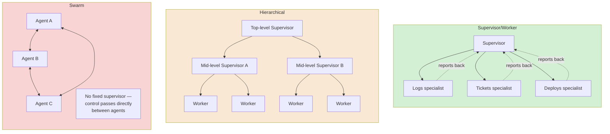
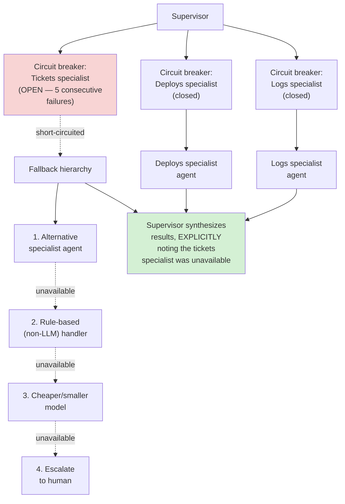
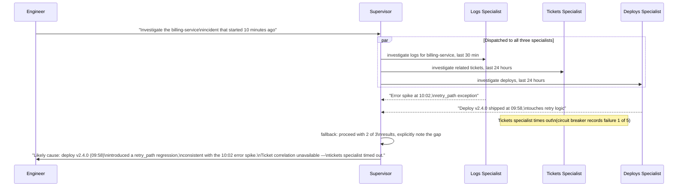
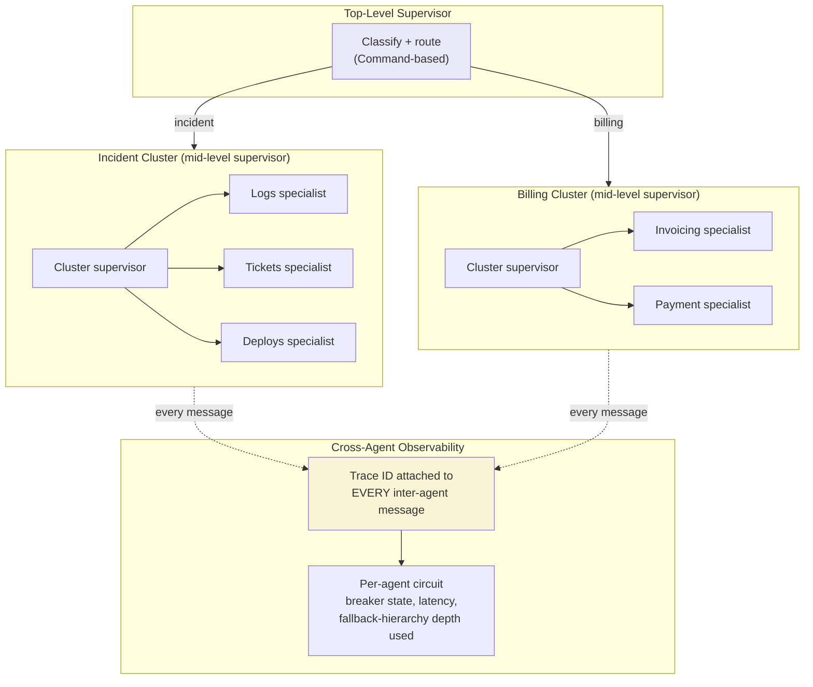
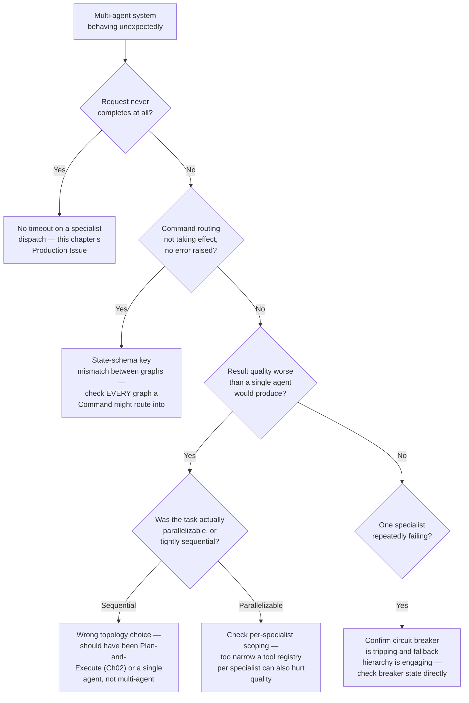

# Chapter 05 — Multi-Agent Orchestration Patterns

## Learning Objectives

By the end of this chapter, you will be able to:

- Explain the supervisor/worker, hierarchical, and swarm topologies precisely, and place each correctly on the production-proven-to-experimental spectrum using current evidence, not intuition.
- Build a supervisor/worker system where a supervisor agent dispatches to multiple specialist worker agents via tool-calling — first hand-rolled, then in LangGraph using its current recommended pattern.
- Extend Chapter 03's single-tool circuit breaker to a whole worker *agent* failing, and implement the concrete fallback hierarchy production systems use when a specialist is unavailable.
- Build a hierarchical (supervisor-of-supervisors) system, and quantify the real coordination-latency cost each additional level adds.
- Correctly distinguish the swarm *topology* (a legitimate, if still largely experimental, architecture pattern) from OpenAI Swarm the specific, now-deprecated framework.
- Apply a concrete, evidence-based decision framework for when multi-agent genuinely outperforms a well-designed single agent — and recognize the much more common case where it doesn't.
- Reproduce, in miniature, the shape of Anthropic's own production multi-agent research system, and articulate exactly which task properties make that architecture win and which make it lose.
- Recognize the standard multi-agent production issue — a silently failed worker hanging the whole workflow — and apply this chapter's timeout/fallback/circuit-breaker fix before it happens in production.

## Prerequisites

- **Chapters completed:** Chapter 01 (the `Agent` Protocol every worker agent in this chapter satisfies, and the "coordination failure" taxonomy category this chapter is the primary treatment of); Chapter 02 (LangGraph's `StateGraph`, `add_conditional_edges`, and the Plan-and-Execute pattern this chapter's supervisor pattern structurally resembles); Chapter 03 (the per-tool circuit breaker this chapter extends to whole-agent failure); Chapter 04 (memory scoping — this chapter's workers will need the same `agent_id`-aware discipline once more than one agent shares state).
- **Tools installed:** Everything from Chapters 01–04 (`anthropic`, `claude-agent-sdk==0.2.115`, `langgraph==1.2.9`, `mem0ai`) — no new packages required; this chapter uses LangGraph's `Command` primitive, already part of the pinned `langgraph` install.

## Estimated Reading Time

70–85 minutes

## Estimated Hands-on Time

3–4 hours

---

## ⚡ Fast Read

> **Skim time: 5 minutes** — Read this if you're in a hurry, returning for reference, or already familiar with part of this topic.

- **What it is:** Coordinating more than one agent to work on parts of the same overall task — deciding who's in charge, who reports to whom, and what happens when one of them fails.
- **Why it matters:** Every chapter through Chapter 04 built exactly one agent per task. The moment a real problem decomposes into genuinely independent pieces — investigate logs, investigate tickets, investigate deploys, all at once, during a live incident — one agent working through them sequentially is leaving real speed on the table, but naively splitting into multiple agents introduces an entirely new failure category this course hasn't dealt with yet: what happens when one of them doesn't come back.
- **Key insight:** Multi-agent systems are not a strictly better version of single-agent systems — current evidence shows they typically cost 2–5x more per task and can straightforwardly *underperform* a well-designed single agent on tightly interdependent work. The right default, confirmed by current production guidance and Anthropic's own published findings, is a single agent until you have a *specific, evidence-backed reason* to add more — and the reason is almost always "this decomposes into genuinely independent, parallelizable pieces," not "this feels complicated enough to deserve several agents."
- **What you build:** A hand-rolled supervisor dispatching to specialist workers via tool-calling, the same pattern in LangGraph using its currently-recommended approach, and a hierarchical supervisor-of-supervisors system with a measured, real coordination-latency cost.
- **Jump to:** [Core Concepts](#core-concepts) | [First Code](#beginner-implementation) | [Best Practices](#best-practices) | [Mini Project](#mini-project)

---

## Why This Topic Exists

Every agent this course has built so far — Chapter 01's ticket investigator, Chapter 02's report generator, Chapter 03's fifteen-tool support agent, Chapter 04's memory-backed Reflexion writer — has been exactly one agent, working through one task, whatever its internal reasoning pattern. That was never a limitation of the tooling. It was a deliberate choice: Chapter 01's Decision Framework asked "does this task genuinely require variable, runtime-decided control flow?" before reaching for an agent at all, and nothing in Chapters 01–04 needed more than one.

Something changes with Aperture Cloud's live-incident scenario. When a production incident hits, an engineer genuinely wants to know, at the same time: what do the logs say, what tickets have come in, and what deployed recently that might be the cause. These three lines of investigation don't depend on each other's results — they're the textbook case Chapter 02's Plan-and-Execute pattern was built for. But Plan-and-Execute, even parallelized the way Chapter 03 taught, is still fundamentally *one agent* doing three things — one shared reasoning context, one shared tool registry, one point of failure. What if each investigation line genuinely benefits from its *own* specialized reasoning, its own narrower tool access, and its own independent failure boundary — a logs specialist that's an expert at reading log patterns, a tickets specialist that's tuned for support-history nuance, a deploys specialist scoped only to deployment data?

That's the actual engineering question this chapter answers, and it's a harder one than "just run three agents instead of one." The moment there's more than one agent, new problems appear that didn't exist before: who decides which specialist handles what, what happens when a specialist doesn't answer, how do you stop one failing specialist from hanging the entire investigation, and — the question this chapter spends real time on — is adding more agents even the right call for a given task, or is it solving a problem that a better single agent would have solved more cheaply. Chapter 01 previewed "coordination failure" as a taxonomy category and explicitly deferred it here. This is where that deferral gets paid off.

## Real-World Analogy

Picture Aperture Cloud's incident response before and after this chapter's change.

**Before:** One senior on-call engineer handles everything. They check the logs, then the tickets, then the deploy history, one at a time, because there's only one of them and they can only look at one screen at once. They're capable, but the investigation is bottlenecked by their own sequential attention, and if they get pulled into an unrelated fire, the whole investigation stalls — there's no backup.

**After, done well:** The on-call engineer becomes a coordinator, delegating three parallel workstreams to three specialists — someone who lives in the logs, someone who knows the ticket history cold, someone who tracks every deploy. Each works independently and reports back. The investigation genuinely finishes faster, because the work was actually parallelizable. If the logs specialist gets pulled away, the coordinator notices, waits a reasonable amount of time, and either reassigns that piece or proceeds with what's known and flags the gap — the whole investigation doesn't just silently stall waiting for someone who isn't coming back.

**After, done badly:** The same on-call engineer now spends most of their time in status meetings, relaying information between three specialists who could have just talked to each other, for a question that one competent engineer could have answered alone in the time it took to convene everyone. The overhead of coordinating exceeded the benefit of splitting the work — the classic failure mode of adding people (or agents) to a problem that didn't actually need more of them.

Both "after" scenarios use the exact same structure — a coordinator and three specialists. What separates the good outcome from the bad one isn't the topology, it's whether the underlying task actually had genuinely independent, parallelizable pieces worth splitting in the first place. This chapter teaches you to build the structure *and* to recognize which of the two outcomes a given task is heading toward before you commit to it.

---

## Core Concepts

### Multi-Agent Topology

**Technical definition:** The structural pattern by which multiple agents are organized and communicate to jointly accomplish a task — who talks to whom, who has decision authority, and how work and results flow between them.

**Plain English:** The org chart for a group of agents working together.

**Analogy:** The difference between a single manager directing several direct reports, several managers each directing their own team reporting up to one director, and a group of peers who coordinate directly with no manager at all — three different org charts, each with real tradeoffs.

> Current sources describe a five-way topology taxonomy this chapter organizes around: **Orchestrator-Worker** (this chapter's "supervisor/worker"), **Hierarchical** (supervisor-of-supervisors), **Swarm** (decentralized, peer-to-peer handoff), **Mesh** (direct peer-to-peer without any handoff hierarchy at all), and **Pipeline** (sequential, stage-based — structurally closest to Chapter 02's Plan-and-Execute, just with a distinct agent per stage instead of one agent working through the stages). This chapter builds the first three in depth, per its committed scope.

### Supervisor/Worker (Orchestrator-Worker)

**Technical definition:** A topology in which one supervisor agent holds decision authority — deciding which worker agent(s) to invoke, in what order or in parallel, and how to synthesize their results — while worker agents each handle a narrower, specialized piece of the overall task and report back to the supervisor, never directly to each other.

**Plain English:** One agent in charge, delegating pieces of the work to specialist agents, and putting the results back together.

**Analogy:** The "after, done well" scenario above — a coordinator delegating to specialists who each report back to the coordinator, not to each other.

### Hierarchical (Supervisor-of-Supervisors)

**Technical definition:** An extension of supervisor/worker with more than two levels — a top-level supervisor delegates to mid-level supervisors, each of whom manages their own cluster of worker agents, rather than one supervisor directly managing every worker.

**Plain English:** Supervisor/worker, stacked — a manager of managers, not just a manager of individual contributors.

**Analogy:** A VP overseeing several team leads, each of whom manages their own individual contributors, rather than one VP trying to directly manage every individual contributor in the whole org.

### Swarm (Decentralized Handoff)

**Technical definition:** A topology with no fixed central supervisor — agents hand off control to one another directly and dynamically, based on which agent is best suited to handle the current state of the task, with control potentially passing among many agents over the course of one task.

**Plain English:** No boss — whichever agent is best suited for what's needed right now just takes over directly from whoever had it before.

**Analogy:** A group of specialists in an emergency room who hand a patient directly to whichever colleague is right for the next step, without routing every handoff through a single head physician first.

> **Critical distinction, verified for this chapter:** "Swarm" as a topology is a real, current architecture pattern with at least one actively-maintained production-grade implementation (LangGraph's own `langgraph-swarm` package). **OpenAI Swarm**, the specific 2024 experimental framework carrying this name, is a *different thing* — it's confirmed archived and superseded by the OpenAI Agents SDK, which itself implements supervisor/worker, not a peer swarm. The framework's deprecation says nothing about the topology's viability; don't let the name collision imply otherwise.

### Coordination Failure (Deepened from Chapter 01)

**Technical definition:** A failure specific to multi-agent systems in which one agent's failure, timeout, or unexpected output breaks an assumption another agent (or the orchestrator) depended on — Chapter 01 previewed this as a taxonomy category; this chapter builds its detection and mitigation in full.

**Plain English:** One agent not showing up, or showing up with something unexpected, and the rest of the system not having a plan for that.

**Analogy:** The "after, done badly" version of a specialist getting pulled away mid-investigation, with no one else checking in or reassigning the work — the whole investigation just silently waits forever.

### Circuit Breaker, Extended to Agent-Level Failure

**Technical definition:** Chapter 03's per-tool circuit breaker pattern (closed/open/half-open), applied to a whole worker *agent* rather than a single tool call — tripping after repeated failures of a specific specialist agent, so the supervisor stops routing to it and falls back instead of every task paying a full timeout waiting on an unavailable specialist.

**Plain English:** The same "stop calling the thing that keeps failing" idea from Chapter 03, but now applied to an entire specialist agent going down, not just one tool.

**Analogy:** If a specific colleague has been unreachable for the last several requests, you stop routing new requests to them and start using the backup plan, instead of everyone individually rediscovering they're unreachable one at a time.

### Fallback Hierarchy

**Technical definition:** An ordered sequence of alternative response strategies a supervisor falls back through when a preferred worker agent is unavailable — typically: an alternative specialist agent, then a simpler rule-based (non-LLM) handler, then a cheaper/smaller model, then escalation to a human.

**Plain English:** A plan B, C, and D for when the first-choice specialist doesn't answer, instead of just hanging indefinitely or failing outright.

**Analogy:** A hospital's on-call chain — if the first specialist doesn't pick up, there's a defined next call, not just an indefinite wait for the first person to eventually respond.

---

## Architecture Diagrams

### Diagram 1 — Three Topologies, Side by Side



The color coding is deliberate and matches this chapter's own evidence: supervisor/worker (green) is the most production-proven; hierarchical (amber) is real but a minority pattern with real coordination-latency costs; swarm (red, not "bad" — "still largely experimental at production scale") is the topology this chapter treats with the most caution.

### Diagram 2 — Supervisor/Worker with Circuit Breakers and Fallback



This is a direct, structural extension of Chapter 03's Diagram 2 (per-tool circuit breakers) — same mechanism, one level up: a whole agent instead of a single tool call, and a fallback *hierarchy* instead of a single short-circuit response, because an unavailable specialist agent is a bigger gap to fill than one failed tool call.

## Flow Diagrams

### Diagram 3 — A Live Incident, Supervisor Dispatching Three Specialists in Parallel



Notice the final answer explicitly states that the tickets specialist timed out, rather than silently presenting a two-out-of-three-sources answer as if it were complete — this is Chapter 03's partial-failure-handling discipline, applied here at the agent level instead of the tool-call level.

---

## Beginner Implementation

Build the mechanism by hand first, exactly as this course's Framework Thread requires — a supervisor coordinating specialist workers via tool-calling, with no framework yet. This directly follows LangChain's own current guidance: implement the supervisor pattern via tool-calling rather than reaching for a packaged abstraction as the default.

```python
# Learning example — hand-rolled supervisor/worker via tool-calling.
# Each specialist satisfies Chapter 01's Agent Protocol; the
# supervisor treats "call a specialist" as a tool call, the same
# mechanism this course has used for every tool since Chapter 01.
import asyncio
import json
from dataclasses import dataclass
from typing import AsyncIterator, Protocol
from anthropic import AsyncAnthropic

client = AsyncAnthropic()

# Reused from Chapter 01: AgentEvent(kind, payload)

class Specialist(Protocol):
    """A worker agent the supervisor can dispatch to — deliberately
    the SAME shape as Chapter 01's Agent Protocol (async run(goal)),
    so any single-agent implementation from Chapters 01-04 can serve
    as a specialist here with zero changes."""
    async def run(self, goal: str) -> AsyncIterator["AgentEvent"]: ...


@dataclass
class StubSpecialist:
    """A minimal specialist for teaching clarity — in a real system
    this would be, e.g., Chapter 01's HandRolledAgent scoped to a
    narrow tool registry, or Chapter 04's ReflexionAgent."""
    name: str
    canned_response: str
    should_fail: bool = False

    async def run(self, goal: str) -> AsyncIterator["AgentEvent"]:
        await asyncio.sleep(0.1)  # simulated work
        if self.should_fail:
            raise TimeoutError(f"{self.name} specialist did not respond")
        yield AgentEvent(kind="final_answer", payload=self.canned_response)


SPECIALISTS: dict[str, Specialist] = {
    "logs_specialist": StubSpecialist("logs", "Error spike at 10:02, retry_path exception in billing-service."),
    "tickets_specialist": StubSpecialist("tickets", "", should_fail=True),  # simulates an unavailable specialist
    "deploys_specialist": StubSpecialist("deploys", "Deploy v2.4.0 shipped at 09:58, touches retry logic."),
}

# The supervisor's tools are "call a specialist" — structurally
# identical to any other tool schema this course has used since
# Chapter 01, just with a specialist agent behind each one instead
# of a plain function.
DISPATCH_TOOLS = [
    {
        "name": name,
        "description": f"Delegate investigation to the {name.replace('_', ' ')} agent.",
        "input_schema": {
            "type": "object",
            "properties": {"question": {"type": "string"}},
            "required": ["question"],
        },
    }
    for name in SPECIALISTS
]


async def dispatch_to_specialist(name: str, question: str) -> dict:
    """Runs one specialist and returns a structured result — success
    or failure, matching Chapter 03's honest-partial-failure discipline
    applied at the agent level instead of the tool-call level."""
    specialist = SPECIALISTS[name]
    try:
        result_text = ""
        async for event in specialist.run(question):
            if event.kind == "final_answer":
                result_text = event.payload
        return {"specialist": name, "status": "ok", "result": result_text}
    except Exception as exc:
        return {"specialist": name, "status": "failed", "result": None, "error": str(exc)}


async def run_supervisor(goal: str) -> str:
    messages = [{"role": "user", "content": goal}]

    response = await client.messages.create(
        model="claude-sonnet-5", max_tokens=1024,
        tools=DISPATCH_TOOLS,
        messages=messages,
    )
    tool_calls = [b for b in response.content if b.type == "tool_use"]
    messages.append({"role": "assistant", "content": response.content})

    # Dispatch to all requested specialists IN PARALLEL — this is
    # Chapter 03's parallel-dispatch pattern, applied to agents
    # instead of tool calls, for exactly the same reason: these
    # three investigations don't depend on each other's results.
    dispatch_results = await asyncio.gather(*[
        dispatch_to_specialist(call.name, call.input["question"]) for call in tool_calls
    ])

    tool_results = []
    for call, result in zip(tool_calls, dispatch_results):
        content = result["result"] if result["status"] == "ok" else f"UNAVAILABLE: {result['error']}"
        tool_results.append({
            "type": "tool_result", "tool_use_id": call.id,
            "content": content, "is_error": result["status"] != "ok",
        })
    messages.append({"role": "user", "content": tool_results})

    final = await client.messages.create(
        model="claude-sonnet-5", max_tokens=1024,
        messages=messages,
    )
    return "".join(b.text for b in final.content if b.type == "text")


if __name__ == "__main__":
    answer = asyncio.run(run_supervisor(
        "Investigate the billing-service incident that started 10 minutes ago"
    ))
    print(answer)
```

**Why this is genuinely a multi-agent system, not just more tools:**

- `Specialist` is deliberately the *exact same shape* as Chapter 01's `Agent` Protocol. This isn't a coincidence — it's the entire architectural point of building that Protocol back in Chapter 01: a worker agent in a multi-agent system and a standalone single agent from Chapter 01–04 are structurally the same thing, satisfying the same interface. Multi-agent orchestration doesn't need a new agent abstraction, just a new *caller* that treats agents as dispatchable units.
- `dispatch_to_specialist` never lets a failing specialist crash the whole supervisor run — exactly Chapter 03's tool-result discipline, now wrapping an entire agent invocation instead of one function call. The `tickets_specialist`'s simulated failure produces a structured `UNAVAILABLE` result the supervisor's final synthesis call can see and reason about honestly.
- `asyncio.gather` dispatching to all three specialists at once is Chapter 03's parallel tool-call pattern, applied one level up — the specialists don't depend on each other's results, so there's no reason to run them sequentially.

## Intermediate Implementation

Now the same pattern in LangGraph, using its current recommended tool-calling-based supervisor approach — not the packaged `langgraph-supervisor` library, per current LangChain guidance favoring more control over context engineering for most cases. This section also builds the circuit breaker and fallback hierarchy from Diagram 2 in full.

```python
# Learning example — LangGraph supervisor/worker via tool-calling,
# with agent-level circuit breakers and a fallback hierarchy.
# Pinned version verified 2026-07-11: langgraph==1.2.9.
import time
from dataclasses import dataclass, field
from enum import Enum
from typing import TypedDict, Optional
from langgraph.graph import StateGraph, START, END
from langgraph.prebuilt import ToolNode
from anthropic import Anthropic

client = Anthropic()


class BreakerState(Enum):
    CLOSED = "closed"
    OPEN = "open"
    HALF_OPEN = "half_open"


@dataclass
class AgentCircuitBreaker:
    """Chapter 03's CircuitBreaker, extended: the failure threshold
    is lower (3, not 5, matching this chapter's own research finding
    of ~5 for a full production system — 3 here for faster teaching
    feedback) because a failed AGENT is a bigger gap than a failed
    tool call, and the cooldown is longer, since a specialist agent
    recovering typically takes longer than a single flaky tool call."""
    failure_threshold: int = 3
    cooldown_seconds: float = 60.0
    state: BreakerState = BreakerState.CLOSED
    consecutive_failures: int = 0
    opened_at: float = 0.0

    def allow_call(self) -> bool:
        if self.state == BreakerState.CLOSED:
            return True
        if self.state == BreakerState.OPEN:
            if time.monotonic() - self.opened_at >= self.cooldown_seconds:
                self.state = BreakerState.HALF_OPEN
                return True
            return False
        return True

    def record_success(self) -> None:
        self.consecutive_failures = 0
        self.state = BreakerState.CLOSED

    def record_failure(self) -> None:
        self.consecutive_failures += 1
        if self.consecutive_failures >= self.failure_threshold:
            self.state = BreakerState.OPEN
            self.opened_at = time.monotonic()


AGENT_BREAKERS: dict[str, AgentCircuitBreaker] = {}


class IncidentState(TypedDict):
    goal: str
    findings: dict          # specialist name -> result or None
    unavailable: list       # specialist names that couldn't respond
    final_report: Optional[str]


def call_specialist_with_fallback(name: str, question: str) -> tuple[str | None, bool]:
    """Returns (result, used_fallback). Implements the fallback
    hierarchy from Diagram 2: alternative specialist -> rule-based
    handler -> cheaper model -> caller marks unavailable for human
    escalation. Abbreviated to two levels here for teaching clarity;
    the same pattern extends to all four."""
    breaker = AGENT_BREAKERS.setdefault(name, AgentCircuitBreaker())

    if breaker.allow_call():
        try:
            result = simulate_specialist_call(name, question)  # stubbed
            breaker.record_success()
            return result, False
        except Exception:
            breaker.record_failure()

    # Fallback level 2: a cheap, rule-based, non-LLM handler — e.g.
    # a canned "unable to complete deep investigation, here is the
    # last known status" instead of nothing at all.
    fallback_result = rule_based_fallback(name)
    if fallback_result is not None:
        return fallback_result, True

    return None, True  # exhausted fallbacks — caller must mark unavailable


def simulate_specialist_call(name: str, question: str) -> str:
    # Stubbed for teaching clarity — production code invokes a real
    # specialist agent here (this chapter's Beginner Implementation
    # shows the full async version).
    if name == "tickets_specialist":
        raise TimeoutError("tickets specialist unreachable")
    return f"[{name} result for: {question}]"


def rule_based_fallback(name: str) -> str | None:
    canned = {"tickets_specialist": "No automated ticket correlation available — check ticketing system manually."}
    return canned.get(name)


def dispatch_node(state: IncidentState) -> dict:
    findings, unavailable = {}, []
    for name in ["logs_specialist", "tickets_specialist", "deploys_specialist"]:
        result, used_fallback = call_specialist_with_fallback(name, state["goal"])
        if result is None:
            unavailable.append(name)
        else:
            findings[name] = {"result": result, "used_fallback": used_fallback}
    return {"findings": findings, "unavailable": unavailable}


def synthesize_node(state: IncidentState) -> dict:
    findings_text = "\n".join(f"- {k}: {v['result']}" for k, v in state["findings"].items())
    gap_note = f"\n\nUNAVAILABLE: {', '.join(state['unavailable'])}" if state["unavailable"] else ""
    prompt = f"Synthesize an incident summary from these findings:\n{findings_text}{gap_note}"
    response = client.messages.create(
        model="claude-sonnet-5", max_tokens=1024,
        messages=[{"role": "user", "content": prompt}],
    )
    return {"final_report": response.content[0].text}


graph = StateGraph(IncidentState)
graph.add_node("dispatch", dispatch_node)
graph.add_node("synthesize", synthesize_node)
graph.add_edge(START, "dispatch")
graph.add_edge("dispatch", "synthesize")
graph.add_edge("synthesize", END)
app = graph.compile()

if __name__ == "__main__":
    result = app.invoke({
        "goal": "Investigate the billing-service incident",
        "findings": {}, "unavailable": [], "final_report": None,
    })
    print(result["final_report"])
```

**Why the circuit breaker and fallback hierarchy are the actual point of this section, not the LangGraph syntax:**

- `AgentCircuitBreaker` is structurally identical to Chapter 03's `CircuitBreaker`, with tuned thresholds — this is a deliberate, explicit demonstration that Chapter 03's pattern generalizes cleanly one level up, rather than needing a redesign.
- `call_specialist_with_fallback` implements two levels of this chapter's four-level fallback hierarchy (alternative specialist and rule-based handler are the two shown; the cheaper-model and human-escalation levels follow the identical shape). Crucially, `synthesize_node` receives an explicit `unavailable` list and is *instructed* to note the gap — the same honest-partial-failure discipline from Chapter 03's tool batches, now applied to a batch of agents.
- This uses plain sequential nodes (`dispatch` then `synthesize`), not `Command`-based dynamic handoffs — deliberately, because this specific topology (a fixed set of known specialists, always dispatched together) doesn't need dynamic routing. The next section shows where `Command` genuinely earns its complexity: hierarchical delegation, where *which* mid-level supervisor handles a request depends on the request itself.

## Advanced Implementation

Production-grade for this chapter means hierarchical delegation — a top-level supervisor routing to the *right* mid-level supervisor, each managing its own worker cluster, using LangGraph's `Command` primitive for dynamic handoff. This also concretely demonstrates the coordination-latency cost this chapter's research quantified.

```python
# Production example — hierarchical supervisor-of-supervisors using
# LangGraph's Command primitive for dynamic handoff. Demonstrates the
# real coordination-latency cost of adding a hierarchy level.
import time
from typing import TypedDict, Literal, Optional
from langgraph.graph import StateGraph, START, END
from langgraph.types import Command
from anthropic import Anthropic

client = Anthropic()


class OrgState(TypedDict):
    goal: str
    active_cluster: Optional[str]  # MUST match a key both graphs read/write
    cluster_result: Optional[str]
    final_report: Optional[str]


def top_level_supervisor(state: OrgState) -> Command[Literal["incident_cluster", "billing_cluster", "END"]]:
    """Routes to the right MID-LEVEL supervisor based on the request
    — this is where Command earns its complexity over a fixed
    sequential pipeline: the destination genuinely depends on state."""
    routing_prompt = f"""Classify this request into exactly one category:
"incident" (production outages, errors, degraded service) or
"billing" (invoicing, plan changes, payment issues).
Respond with ONLY the category word.

Request: {state['goal']}"""
    response = client.messages.create(
        model="claude-sonnet-5", max_tokens=10,
        messages=[{"role": "user", "content": routing_prompt}],
    )
    category = response.content[0].text.strip().lower()

    target = "incident_cluster" if "incident" in category else "billing_cluster"
    # Command combines the state update (`update`) and the routing
    # decision (`goto`) in ONE return value — the current LangGraph
    # mechanism for dynamic handoff, more direct than
    # add_conditional_edges for exactly this kind of multi-destination
    # routing based on freshly-computed state.
    return Command(update={"active_cluster": target}, goto=target)


def incident_cluster_supervisor(state: OrgState) -> dict:
    """A MID-LEVEL supervisor — this is itself a supervisor/worker
    node internally (dispatching to logs/tickets/deploys specialists,
    per this chapter's Intermediate Implementation), abbreviated here
    to the shape that matters for the hierarchy's own mechanics."""
    time.sleep(0.05)  # simulates this cluster's own LLM coordination call
    return {"cluster_result": "Incident cluster: root cause identified as deploy v2.4.0 regression."}


def billing_cluster_supervisor(state: OrgState) -> dict:
    time.sleep(0.05)
    return {"cluster_result": "Billing cluster: no anomalies found in recent invoicing."}


def top_level_synthesis(state: OrgState) -> dict:
    return {"final_report": f"[{state['active_cluster']}] {state['cluster_result']}"}


graph = StateGraph(OrgState)
graph.add_node("top_level_supervisor", top_level_supervisor)
graph.add_node("incident_cluster", incident_cluster_supervisor)
graph.add_node("billing_cluster", billing_cluster_supervisor)
graph.add_node("synthesis", top_level_synthesis)

graph.add_edge(START, "top_level_supervisor")
# NOTE: no add_edge FROM top_level_supervisor — Command's `goto`
# handles that routing dynamically; adding a static edge here as
# well would be redundant with (and can conflict with) Command's
# own routing.
graph.add_edge("incident_cluster", "synthesis")
graph.add_edge("billing_cluster", "synthesis")
graph.add_edge("synthesis", END)

app = graph.compile()

if __name__ == "__main__":
    start = time.monotonic()
    result = app.invoke({
        "goal": "Investigate the billing-service incident",
        "active_cluster": None, "cluster_result": None, "final_report": None,
    })
    elapsed = time.monotonic() - start
    print(result["final_report"])
    print(f"Coordination overhead alone (excluding worker-level LLM calls "
          f"inside each cluster): {elapsed:.2f}s for a 2-level hierarchy")
```

**Why this concretely demonstrates the hierarchy cost this chapter's research quantified:**

- `top_level_supervisor` makes its own LLM call to *classify and route*, before any actual investigation work happens. `incident_cluster_supervisor` (in a real system) makes its *own* LLM call(s) to coordinate its workers. That's two full rounds of coordination overhead stacked before any worker's result comes back — exactly the mechanism behind this chapter's research finding that a three-level hierarchy with a 2-second LLM call at each level adds at least 6 seconds of pure coordination latency before any worker even starts.
- `active_cluster` in `OrgState` must exist as a matching key in *both* the top-level graph's state schema and whatever state schema `incident_cluster_supervisor`'s own internal graph uses, if that cluster is itself implemented as a nested LangGraph subgraph — this is the exact, current, documented gotcha this chapter's research flagged: **a `Command.update` silently fails to propagate if the target graph's state schema doesn't share the matching key.** This is a debugging trap worth hitting once in a low-stakes exercise rather than discovering in production.
- The comment explaining why there's no `add_edge` from `top_level_supervisor` is not incidental — it's the single most common structural mistake when converting a Chapter 02-style static graph into a `Command`-routed one: leaving a static edge in place that conflicts with `Command`'s own dynamic `goto`.

---

## Production Architecture



The `Trace` box is not optional infrastructure — current guidance is explicit that a trace ID attached to every inter-agent message is standard practice specifically *because* a coordination failure in a multi-agent system is much harder to diagnose after the fact than a single-agent failure: when something goes wrong, you need to reconstruct which agent said what to which other agent, in what order, and that reconstruction is only possible if every message carries an identifier tying it back to the originating task.

### Closing Chapter 04's Cliffhanger: Shared Memory Across Multiple Agents

Chapter 04 ended by asking exactly the question this chapter's topology raises: its `EpisodicMemoryStore` and Mem0 scoping were both designed around one `agent_id`, with `user_id` as the only other axis. The moment the logs specialist and the tickets specialist both need to read the *same* episodic memory of a past incident, that single-`agent_id` model doesn't cleanly cover it — neither specialist "owns" that memory alone, and granting both the same `agent_id` would conflate who actually produced it.

The fix, applied to this chapter's incident-cluster scenario, is a third scoping axis: **write memories under the cluster (or task) that produced them, not the individual specialist.**

```python
# Extends Chapter 04's Mem0 scoping with a cluster-level agent_id,
# shared by every specialist in that cluster, instead of one agent_id
# per specialist.
def add_shared_incident_memory(customer_id: str, content: str, importance: float) -> None:
    memory_client.add(
        messages=[{"role": "assistant", "content": content}],
        user_id=customer_id,
        agent_id="incident_cluster",  # shared across ALL specialists in this cluster
        metadata={"importance": importance, "written_by": "logs_specialist"},  # provenance kept separately
    )

def search_shared_incident_memory(customer_id: str, query: str) -> list[dict]:
    # Any specialist in incident_cluster can retrieve this — the
    # tickets specialist searching for context sees memories the
    # logs specialist wrote, and vice versa.
    return memory_client.search(query=query, user_id=customer_id, agent_id="incident_cluster")
```

This resolves the exact tension Chapter 04 flagged: `agent_id="incident_cluster"` is the shared read/write boundary every specialist in that cluster is trusted within, while the `written_by` metadata field preserves *provenance* (which specialist actually produced a given memory) without using it as the access-control boundary. The billing cluster gets its own separate `agent_id="billing_cluster"` scope — a logs specialist's memory still cannot leak into a billing specialist's context, because they're different clusters, not just different individual agents. Chapter 04's procedural-memory scoping rule (by `agent_id` alone, generalizing across customers) still applies unchanged within each cluster; only the *episodic* sharing boundary needed to widen from "one specialist" to "one cluster."

### Production Issue: A Worker Agent Silently Fails, the Whole Workflow Hangs

**Symptoms**
An engineer files a report that the incident-investigation supervisor "just never responds" for certain requests — no error, no timeout message, the request simply never completes. Checking the trace store shows the supervisor dispatched to all three specialists, two responded normally, and the third — the tickets specialist — has no corresponding response logged at all, ever, for that trace ID.

**Root Cause**
The original version of `dispatch_node` (before this chapter's circuit-breaker-and-fallback version was added) called each specialist with no timeout and no fallback path — a specialist agent that hung indefinitely (in this case, due to an unrelated downstream dependency it depended on being unresponsive) caused the supervisor's `await`/blocking call on that specialist to never return, which meant `synthesize_node` never ran, which meant the whole graph invocation never completed. This is coordination failure exactly as CLAUDE.md's own standard production-issue table describes it: "a worker agent silently fails; the orchestrator has no timeout/fallback → the whole workflow hangs."

**How to Diagnose It**
- Check the trace store for the specific trace ID — a dispatch with no corresponding response, ever, is the signature (as opposed to a fast, explicit `TimeoutError`, which this chapter's fixed version now produces).
- Confirm whether the hung request's specialist call had an explicit timeout configured at all — the absence of one is the direct root cause, not a downstream mystery to chase.
- Check whether the hanging specialist's own dependency (in this case, a downstream service it called) had a separate, unrelated outage — coordination failures often surface as "agent X is broken" when the real root cause is one level further downstream, inside agent X's own tool calls.

**How to Fix It**
```python
# Before: no timeout at all — a hung specialist hangs the whole graph.
def dispatch_node(state):
    result = call_specialist(state["goal"])  # can block forever
    return {"findings": {"result": result}}

# After: every specialist call has an explicit timeout, and a timeout
# is treated as a failure the circuit breaker and fallback hierarchy
# already know how to handle — not a special case requiring new code.
import asyncio

async def dispatch_node_safe(state):
    try:
        result = await asyncio.wait_for(call_specialist(state["goal"]), timeout=10.0)
        return {"findings": {"result": result}, "unavailable": []}
    except asyncio.TimeoutError:
        fallback_result = rule_based_fallback("logs_specialist")
        return {
            "findings": {"result": fallback_result} if fallback_result else {},
            "unavailable": [] if fallback_result else ["logs_specialist"],
        }
```
The fix is not a special "hang detector" — it's making sure every specialist dispatch already goes through the same timeout-bounded, circuit-breaker-protected, fallback-equipped path this chapter's Intermediate Implementation built, with no code path that calls a specialist directly and unprotected.

**How to Prevent It in Future**
- Audit every place a specialist agent is invoked and confirm none of them bypass the timeout/circuit-breaker/fallback path — a single unprotected call site is enough to reintroduce this exact issue.
- Set the timeout based on the specialist's *own* realistic bound — Chapter 01's `max_iterations` discipline applies recursively here: a specialist agent that's itself a bounded loop has its own worst-case latency, and the supervisor's timeout for calling it should be set with that bound in mind, not an arbitrary guess.
- Alert on trace IDs with a dispatch and no corresponding response after N seconds, the same "catch it before a human notices" discipline this course has applied since Chapter 01's bound-trip-rate alerting.

---

## Best Practices

1. **Default to a single agent. Add more only for a specific, evidence-backed reason.** Current guidance and Anthropic's own findings converge on this — scale up a single agent (better prompt, better model, more tools) before reaching for multi-agent, per this chapter's Decision Framework.
2. **Give every worker agent an explicit timeout, always, with no exceptions.** This chapter's Production Issue exists specifically because one dispatch path skipped this.
3. **Extend circuit breakers to the agent level, not just the tool level.** A whole specialist being unavailable is a bigger gap than one failed tool call, and deserves the same fail-fast discipline Chapter 03 established, tuned for the larger blast radius.
4. **Build the full fallback hierarchy, not just "retry or fail."** Alternative specialist → rule-based handler → cheaper model → human escalation gives a supervisor real options before a task has to fail outright.
5. **Attach a trace ID to every inter-agent message, from the start.** Multi-agent coordination failures are categorically harder to diagnose after the fact than single-agent failures — this is not optional infrastructure to add once it becomes a problem.
6. **Match state-schema keys exactly across every graph a `Command` might route into.** This chapter's Advanced Implementation flagged this as a real, current, documented gotcha — a silent handoff failure from a key mismatch is one of the harder multi-agent bugs to spot without knowing to look for it specifically.

## Security Considerations

- **Least privilege now applies per-agent, not just per-tool.** Each specialist should hold only the tool access and data scope its specific job needs — a tickets specialist shouldn't have deploy-system write access just because it's part of the same supervisor's cluster, extending Chapter 01's blast-radius discipline to a multi-agent org chart.
- **Coordination failure and security failure can look identical from the outside.** A worker agent that's silently unavailable might be a legitimate outage — or it might be an attacker deliberately degrading one specialist to force the supervisor's fallback path into a weaker, less-scrutinized handler. This chapter's fallback hierarchy should be designed with that possibility in mind, not assumed benign by default; Chapter 13 covers this class of risk in full.
- **This chapter deliberately does not yet cover agent identity/authentication between agents that aren't in the same process or trust boundary** — every worker agent here is assumed to be a trusted peer within one system, coordinated in-process. Chapter 06 (Agent-to-Agent Communication and the A2A Protocol) is where "how do I stop an untrusted agent from being treated as a trusted peer" — the agent-impersonation risk Chapter 01 first flagged — gets a full treatment, for exactly the case where agents cross a real trust boundary.

## Cost Considerations

| Topology | Latency multiplier vs. single agent | Cost multiplier vs. single agent | Notes |
|---|---|---|---|
| Single agent (baseline) | 1x | 1x | Chapters 01–04's default |
| Supervisor/worker (2-tier, few specialists) | ~1.5–2x | ~2–3x | This chapter's confirmed current figures for a lean setup |
| Hierarchical (3-tier) | Adds ≥6 seconds of pure coordination latency before any worker starts (2-second LLM call per level) | Higher than 2-tier — each level adds its own coordination LLM calls | Real, citable cost of "depth that looks right on a whiteboard" |
| Anthropic's parallel-fan-out research architecture | Faster wall-clock for genuinely parallelizable research tasks | ~15x tokens vs. single-agent chat | Explicitly scoped by Anthropic to independent, parallelizable research — NOT tightly-coupled work like coding |

These are genuinely different points on the same curve, not contradictory numbers — cost scales with how many independent agents and context windows a given topology actually spins up, which is a design decision you make, not a fixed property of "multi-agent" as a category. A lean two-specialist supervisor and Anthropic's many-subagent research fan-out are both "multi-agent," and they cost completely different multiples for exactly that reason.

## Common Mistakes

```python
# WRONG — reaching for multi-agent because the task "feels" complex,
# with no actual parallelizable structure underneath.
# This task is a single, tightly sequential reasoning chain — adding
# three "specialist" agents here adds 2-3x cost for no real benefit.
supervisor.dispatch(["requirements_agent", "design_agent", "code_agent"])
# ...where design genuinely can't start until requirements finishes,
# and code genuinely can't start until design finishes. No parallelism
# exists here; this is Chapter 02's Plan-and-Execute territory, not
# multi-agent territory.
```

```python
# RIGHT — a single, well-designed agent working through a sequential
# task via Chapter 02's Plan-and-Execute, reserving multi-agent for
# genuinely independent, parallelizable work.
plan_execute_graph.invoke({"task": "design and implement feature X"})
```

```python
# WRONG — no timeout on a specialist dispatch; a hung specialist
# hangs the entire supervisor.
async def dispatch_unsafe(question):
    result = await call_specialist("tickets_specialist", question)
    return result
```

```python
# RIGHT — every specialist call is timeout-bounded, per this
# chapter's Production Issue.
async def dispatch_safe(question):
    result = await asyncio.wait_for(call_specialist("tickets_specialist", question), timeout=10.0)
    return result
```

```python
# WRONG — a Command routing to a subgraph whose state schema doesn't
# share the key being updated; the handoff silently fails to
# propagate active_cluster with no error raised.
class TopState(TypedDict):
    active_cluster: str

class SubgraphState(TypedDict):
    cluster_name: str  # different key name — the handoff breaks silently
```

```python
# RIGHT — matching keys across every graph a Command might route into.
class TopState(TypedDict):
    active_cluster: str

class SubgraphState(TypedDict):
    active_cluster: str  # same key — Command.update propagates correctly
```

## Debugging Guide



| Symptom | Likely Cause | Where to Look |
|---|---|---|
| Request never completes | No timeout on a specialist dispatch | Trace store: a dispatch with no corresponding response |
| A `Command` handoff doesn't take effect, no error | State-schema key mismatch between graphs | Confirm the exact key names match across every graph in the routing path |
| Multi-agent result is worse than a single agent would have produced | Wrong topology choice for a tightly sequential task | Re-run the Decision Framework's questions against the actual task shape |
| One specialist keeps failing, supervisor keeps retrying it anyway | Circuit breaker not wired into the dispatch path | Confirm `AGENT_BREAKERS` (or equivalent) is actually checked before every call |
| Final report doesn't mention a specialist that was actually unavailable | Partial-failure handling not surfaced in synthesis | Confirm `unavailable` (or equivalent) is passed into the synthesis prompt, not silently dropped |

## Performance Optimisation

- **Parallelize specialist dispatch whenever the specialists are genuinely independent** — this chapter's Beginner Implementation's `asyncio.gather` across specialists is the direct multi-agent analog of Chapter 03's parallel tool dispatch, and the same latency-multiplication-avoided logic applies.
- **Keep hierarchy depth to the minimum the task actually needs.** Per this chapter's cost table, every additional level adds real, measured coordination latency before any actual work starts — a flat supervisor/worker with a clear routing schema frequently outperforms a deeper hierarchy that looks more organized on a whiteboard.
- **Scope each specialist's tool registry tightly, reusing Chapter 03's progressive-disclosure discipline per-agent.** A specialist with an unnecessarily broad tool registry pays the same accuracy-cliff cost Chapter 03 identified, now multiplied across every specialist in the system instead of contained to one agent.

---

## Technology Comparison — Multi-Agent Topologies at a Glance

> **Currency Note:** Verified 2026-07-11.

| Topology | Production maturity | Typical cost multiplier | Current named implementation |
|---|---|---|---|
| **Supervisor/Worker (Orchestrator-Worker)** | Most production-proven | ~2–3x | LangGraph tool-calling pattern (recommended) or `langgraph-supervisor` package |
| **Hierarchical** | Real, but a minority pattern | Higher, scales with depth | Hand-rolled `Command`-based routing (this chapter's Advanced Implementation) |
| **Swarm** | Largely experimental at production scale; genuine implementations exist | Varies; academic work (SWARM+) demonstrates scaling to 990 agents, research-stage only | `langgraph-swarm` (actively maintained, proves the topology is real — NOT the deprecated OpenAI Swarm framework) |
| **Mesh** | Least production-proven of the five; mentioned for completeness | Highest coordination overhead of the group | No dominant current named implementation found in this chapter's research |
| **Pipeline** | Production-proven, but structurally closer to Chapter 02's Plan-and-Execute than to "multi-agent" | Comparable to Plan-and-Execute's cost profile | Chapter 02's `StateGraph` pattern, one agent per stage instead of one agent working through stages |

## Decision Framework — Is Multi-Agent Actually the Right Call?

1. **Does the task decompose into genuinely independent, parallelizable sub-tasks?** If the sub-tasks depend on each other's results (design can't start before requirements, code can't start before design), this is Chapter 02's Plan-and-Execute territory — a single agent, not multiple.
2. **Do different pieces of the task need genuinely different tools, different scoped access, or different underlying models?** If every piece could be handled equally well by the same agent with the same tool registry, multi-agent adds cost and complexity without a corresponding benefit.
3. **Is there a specific safety, audit, or compliance reason to enforce a hard boundary between pieces of the work?** A genuine, real reason to keep two pieces of work in separately-scoped, separately-auditable agents — not just "it feels cleaner to separate concerns."
4. **Have you scaled up a single agent first — better prompt, better model, more tools — and confirmed it genuinely can't do the job?** Current guidance is explicit that this should happen *before* reaching for multi-agent, not after, given the confirmed 2–5x cost multiplier and the real possibility that multi-agent coordination can underperform a well-designed single agent on tightly interdependent work.
5. **If yes to the above, which topology?** Supervisor/worker by default (most production-proven); hierarchical only if a flat supervisor genuinely can't scale to the number of specialists needed and you've priced in the coordination-latency cost; swarm only for genuinely exploratory work where the production-maturity gap is an acceptable tradeoff.

## Real Client Scenario — Aperture Cloud's Incident Investigation, Multi-Agent for Real

Walking Aperture Cloud's incident-investigation scenario through the Decision Framework: (1) yes — logs, tickets, and deploy history genuinely don't depend on each other's findings during the initial investigation phase; (2) yes — each specialist benefits from a narrower, more focused tool registry and, plausibly, a different underlying model tuned for its specific data shape; (3) arguably — keeping the billing cluster's access scoped away from incident-response tooling is a genuine compliance-relevant boundary, not just tidiness; (4) confirmed — the team's original single Chapter 03-style agent with fifteen tools was already hitting the tool-selection accuracy cliff from that chapter, a real, evidence-backed reason a single agent wasn't scaling further.

This is the same underlying investigation Chapters 01–03 already built as a single agent with many tools — the difference in this chapter isn't the business problem, it's recognizing exactly when that single-agent approach stops being the right engineering choice and a genuinely parallel, specialist-scoped multi-agent system starts paying for its added cost and complexity. Note what didn't change: every specialist here is still read-only, still bounded, still traced — this chapter added agents, not blast radius.

---

## Exercises

1. **(15 min)** Run the Beginner Implementation's `run_supervisor` and confirm the final synthesized answer explicitly notes the tickets specialist was unavailable, rather than silently presenting a two-of-three-sources answer as complete.
2. **(30 min)** Add a fourth specialist (e.g., `metrics_specialist`) to the Beginner Implementation, and confirm the supervisor correctly dispatches to all four in parallel via `asyncio.gather`.
3. **(30 min)** Deliberately reintroduce this chapter's Production Issue (remove the timeout from a specialist dispatch, make that specialist hang indefinitely) and confirm the request never completes. Then reapply the fix and confirm it resolves.
4. **(45 min)** Deliberately mismatch a state-schema key between the Advanced Implementation's top-level graph and one cluster's internal state, and confirm the `Command` handoff silently fails to propagate the expected value — reproducing this chapter's documented gotcha on purpose before fixing it.
5. **(60 min, Challenge)** Using the Decision Framework's five questions, evaluate a task of your own choosing (real or hypothetical) and write a short justification for whether it warrants multi-agent, and if so, which topology — explicitly citing this chapter's cost/latency figures in your reasoning, not just intuition.

## Quiz

1. **What's the precise structural difference between supervisor/worker and hierarchical topologies?**
   *Answer: In supervisor/worker, one supervisor directly manages every worker. In hierarchical, a top-level supervisor delegates to mid-level supervisors, each of whom manages their own cluster of workers — a "supervisor of supervisors" with more than two levels.*

2. **Why is it wrong to conclude that swarm-topology architectures are dead just because OpenAI Swarm the framework is deprecated?**
   *Answer: OpenAI Swarm was a specific 2024 experimental framework, since archived and superseded by the OpenAI Agents SDK — which itself implements supervisor/worker, not swarm. Swarm as a general decentralized-coordination topology is a separate, real, current architecture pattern with at least one actively-maintained production implementation (LangGraph's `langgraph-swarm`); the framework's fate says nothing about the topology's viability.*

3. **According to this chapter's Decision Framework, what should happen BEFORE reaching for multi-agent, and why?**
   *Answer: Scaling up a single agent first — a better prompt, a better model, more tools — should be tried before adding more agents, because current guidance and evidence confirm multi-agent systems typically cost 2–5x more per task and can underperform a well-designed single agent on tightly interdependent work; the cost is only justified when the task genuinely has independent, parallelizable structure a single agent can't exploit.*

4. **Why does this chapter present the ~2-3x cost multiplier for a lean supervisor/worker setup and the ~15x multiplier for Anthropic's research system as consistent rather than contradictory?**
   *Answer: Both are genuinely different points on the same underlying curve — cost scales with how many independent agents and context windows a topology actually spins up, which is a design decision, not a fixed property of "multi-agent" as a category. A lean two-specialist setup and a many-subagent parallel research fan-out are both multi-agent architectures that simply spin up very different numbers of independent contexts.*

5. **What specific task property did Anthropic identify as the reason their multi-agent research system wins, and what property makes the same architecture explicitly worse?**
   *Answer: The architecture excels at problems that decompose into independent, parallelizable research directions. Anthropic explicitly describes it as less effective for tightly interdependent tasks, citing coding specifically as an example where the architecture underperforms.*

6. **Why does a worker-agent circuit breaker use a different (typically higher) failure threshold and longer cooldown than Chapter 03's per-tool circuit breaker?**
   *Answer: A failed agent represents a larger gap than a single failed tool call — losing an entire specialist is a bigger blast radius than one unavailable capability — and a specialist agent recovering from whatever caused its failure typically takes longer than a single flaky tool call recovering, justifying a longer cooldown before retrying.*

7. **What are the four levels of this chapter's fallback hierarchy, in order?**
   *Answer: An alternative specialist agent, then a rule-based (non-LLM) handler, then a cheaper/smaller model, then escalation to a human.*

8. **In this chapter's Production Issue, what specifically caused the request to hang forever rather than fail with an error?**
   *Answer: The specialist dispatch had no timeout configured — an `await` on a hung specialist call blocked indefinitely, which meant the synthesis step downstream never ran, which meant the entire graph invocation never completed, with no error ever raised to signal what had gone wrong.*

9. **Why does the Advanced Implementation's `Command`-based routing avoid adding a static `add_edge` from the top-level supervisor node?**
   *Answer: `Command`'s `goto` field already handles routing dynamically based on freshly-computed state; adding a static edge as well would be redundant with — and can conflict with — Command's own routing, since the destination is meant to be decided at runtime, not fixed at graph-construction time.*

10. **Why does this chapter treat "attach a trace ID to every inter-agent message" as non-optional infrastructure rather than a nice-to-have?**
    *Answer: Coordination failures in multi-agent systems are categorically harder to diagnose after the fact than single-agent failures — reconstructing which agent said what to which other agent, in what order, during a failed run is only possible if every message carries an identifier tying it back to the originating task; without it, a coordination failure like this chapter's Production Issue would be far harder to trace to its root cause.*

## Mini Project

**Build:** A supervisor/worker system (extending the Beginner Implementation) coordinating at least four specialist agents for a task of your choosing, with a working circuit breaker and at least two levels of the fallback hierarchy.

**Time estimate:** 3–4 hours

**Requirements:**
- At least four specialist agents, each satisfying Chapter 01's `Agent` Protocol, dispatched in parallel via `asyncio.gather`.
- A working circuit breaker per specialist, correctly tripping after repeated failures and correctly transitioning through closed/open/half-open states.
- At least two levels of the fallback hierarchy (alternative specialist and rule-based handler, at minimum) demonstrated working when a specialist is unavailable.
- A final synthesis step that explicitly and honestly notes any specialists that were unavailable, per Chapter 03's partial-failure discipline applied at the agent level.

**Acceptance criteria checklist:**
- [ ] All four specialists are dispatched in parallel, confirmed by timing (roughly 1x the slowest specialist's latency, not the sum of all four)
- [ ] A deliberately-failing specialist correctly trips its circuit breaker after the configured threshold
- [ ] The fallback hierarchy correctly engages when a specialist's breaker is open, producing a usable (if degraded) result instead of a hard failure
- [ ] The final synthesized answer explicitly names any specialist that was unavailable, rather than silently omitting it

## Production Project

**Build:** A hierarchical, `Command`-routed multi-agent system implementing this chapter's full Production Architecture — a top-level supervisor dynamically routing to at least two mid-level supervisors, each managing its own specialist cluster, with cross-agent tracing.

**Time estimate:** 1–2 days

**Requirements:**
- A top-level supervisor using `Command`-based dynamic routing to select between at least two mid-level supervisor clusters based on the incoming request.
- Each mid-level cluster implements its own internal supervisor/worker dispatch (reusing this chapter's Intermediate Implementation pattern) to at least two specialists.
- A trace ID generated at the top level and threaded through every inter-agent message across both hierarchy levels, demonstrated by reconstructing a full request's path from the trace store alone.
- Measure and report the actual coordination-latency overhead your hierarchy adds (comparable to this chapter's Advanced Implementation's timing demonstration), and compare it against a flattened, single-supervisor alternative for the same total specialist count.
- A short internal README applying the Decision Framework to justify why this specific task warranted a hierarchical topology rather than a flat supervisor/worker or a single agent.

**Acceptance criteria checklist:**
- [ ] Routing to the correct mid-level cluster is demonstrated for at least two distinct request types
- [ ] A full request's path is reconstructable from trace data alone, across both hierarchy levels
- [ ] Measured coordination overhead is reported and compared against a flattened alternative
- [ ] At least one specialist failure is handled via the fallback hierarchy without the whole system hanging or crashing
- [ ] README's Decision Framework justification explicitly weighs the measured coordination-latency cost against the benefit of the hierarchy for this specific task

## Key Takeaways

- A worker agent in a multi-agent system and a standalone single agent from Chapters 01–04 are structurally the same thing — both satisfy Chapter 01's `Agent` Protocol, and multi-agent orchestration is a new *caller* pattern, not a new agent abstraction.
- Multi-agent systems are not a strictly better version of single-agent systems — they typically cost 2–5x more and can underperform a well-designed single agent on tightly interdependent work, per current evidence and Anthropic's own findings.
- The correct default is a single agent, scaled up first, with multi-agent reserved for tasks with confirmed, genuinely independent, parallelizable structure.
- Supervisor/worker is the most production-proven topology; hierarchical is real but adds measurable coordination latency per level; swarm is a legitimate topology, cleanly distinct from the deprecated OpenAI Swarm framework, but still largely experimental at production scale.
- A circuit breaker and fallback hierarchy, extended from Chapter 03's single-tool version to whole-agent failure, is the concrete fix for this chapter's standard production issue — a silently failed worker hanging the entire workflow.
- Every specialist dispatch needs an explicit timeout, with no exceptions — this chapter's Production Issue exists specifically because one code path skipped this.
- Anthropic's own multi-agent research system is a real, primary-sourced, ~15x-token-cost, >90%-quality-improvement case study — explicitly scoped to parallelizable research work, explicitly described as worse for tightly-coupled tasks like coding.
- State-schema key mismatches across graphs a `Command` might route into cause silent handoff failures — a real, current, documented gotcha worth deliberately reproducing once so it's recognizable later.
- Trace IDs threaded through every inter-agent message are non-optional infrastructure, because coordination failures are categorically harder to diagnose after the fact than single-agent failures.
- Least privilege now applies per-agent, and a genuine safety/audit/compliance boundary between agents is one of the few legitimate reasons to add a hierarchy level, beyond raw specialist count.

## Chapter Summary

| Concept | Key Takeaway |
|---|---|
| Supervisor/worker | Most production-proven topology; one supervisor, direct-reporting specialists, ~2–3x cost |
| Hierarchical | Real but a minority pattern; each level adds measurable coordination latency before work starts |
| Swarm | A real, current topology, cleanly distinct from the deprecated OpenAI Swarm framework; still largely experimental at scale |
| Coordination failure | A silently failed worker with no timeout/fallback hangs the whole workflow — this chapter's standard production issue |
| Agent-level circuit breaker | Chapter 03's pattern, extended to whole-agent failure with tuned thresholds |
| Fallback hierarchy | Alternative specialist → rule-based handler → cheaper model → human escalation |
| Decision Framework | Default to single agent; multi-agent only for confirmed, genuinely independent, parallelizable work |
| Anthropic's research system | ~15x token cost, >90% quality improvement — explicitly scoped to parallelizable research, not tightly-coupled work |
| `Command` routing | Combines state update and dynamic routing; requires matching state-schema keys across every graph in the path |

## Resources

- LangChain, `langgraph-supervisor` — [github.com/langchain-ai/langgraph-supervisor-py](https://github.com/langchain-ai/langgraph-supervisor-py) — the packaged supervisor abstraction, current guidance favors tool-calling directly for most cases
- LangChain, `langgraph-swarm` — [github.com/langchain-ai/langgraph-swarm-py](https://github.com/langchain-ai/langgraph-swarm-py) — the actively-maintained proof that swarm-as-topology is real and current
- Anthropic, *How we built our multi-agent research system* — the primary-sourced case study behind this chapter's ~15x token cost and >90% quality improvement figures, and the explicit scoping caveat about parallelizable vs. tightly-coupled tasks
- LangGraph documentation, *Multi-agent systems* and *Command* — current API reference for this chapter's routing mechanism
- This repository's `reference/06-multi-agent-topology-comparison.md` — quick-lookup companion to this chapter's Technology Comparison and Decision Framework

## Glossary Terms Introduced

| Term | One-line definition |
|---|---|
| Multi-agent topology | The structural pattern by which multiple agents are organized and communicate |
| Supervisor/worker (orchestrator-worker) | One supervisor delegates to specialist workers, who report back to it directly |
| Hierarchical | Supervisor/worker with more than two levels — a supervisor of supervisors |
| Swarm | Decentralized topology with no fixed supervisor; agents hand off control directly to each other |
| Coordination failure | One agent's failure or unexpected output breaking another agent's or the orchestrator's assumptions |
| Agent-level circuit breaker | Chapter 03's per-tool circuit breaker, extended to a whole worker agent failing |
| Fallback hierarchy | The ordered sequence of alternatives a supervisor falls back through when a worker is unavailable |

## See Also

| Related Chapter | Why |
|---|---|
| Chapter 01 (Agent Architecture Deep Dive) | Source of the `Agent` Protocol every worker satisfies, and the "coordination failure" taxonomy category this chapter is the primary treatment of |
| Chapter 02 (Reasoning and Planning Patterns) | The Plan-and-Execute pattern this chapter's supervisor/worker structurally resembles, and the correct choice for tightly sequential tasks this chapter's Decision Framework routes away from multi-agent |
| Chapter 03 (Tool Use and Function Calling at Scale) | Source of the circuit breaker and partial-failure-handling patterns this chapter extends from tool-level to agent-level |
| Chapter 04 (Agent Memory Systems) | The `user_id`/`agent_id` scoping discipline this chapter's workers will need once they share a memory store |
| Chapter 06 (Agent-to-Agent Communication and the A2A Protocol) | Where agents crossing a real trust boundary — not just in-process coordination — need genuine identity and authentication |
| Chapter 07 (Building Multi-Agent Systems with LangGraph) | Goes far deeper on LangGraph's multi-agent primitives than this chapter's introductory `Command` usage |
| Chapter 13 (Agent Security) | Full treatment of the security risk this chapter previewed — a degraded specialist forcing a weaker fallback path being exploited deliberately |

## Preparation for Next Chapter

**Technical checklist:**
- [ ] You can run this chapter's supervisor/worker implementation and explain, without notes, why the specialists are dispatched via `asyncio.gather` rather than sequentially
- [ ] You can state the concrete coordination-latency cost of adding a hierarchy level, with real numbers
- [ ] You can explain the difference between the swarm topology and the deprecated OpenAI Swarm framework clearly enough to correct someone who conflates them

**Conceptual check:** Before Chapter 06, make sure you can answer this: *every worker agent in this chapter's implementations ran in the same process, coordinated by a supervisor that trusted it implicitly — there was no step where a specialist had to prove its identity before the supervisor accepted its response. What breaks about that assumption the moment a "specialist" isn't code running in your own process, but a separate agent operated by a different team, or a different company entirely, communicating over a network?* (If your answer is "the supervisor can no longer just trust that a response claiming to be from the tickets specialist actually came from the real tickets specialist — it needs some way to verify the sender's identity before treating its output as trustworthy input, which is exactly the agent-impersonation risk Chapter 01 flagged and this chapter explicitly deferred," you've correctly previewed Chapter 06's entire scope.)

**Optional challenge:** Take this chapter's Mini Project and imagine (don't yet implement — that's Chapter 06's job) one of your four specialists being operated by a different, external system instead of code in your own process. List, concretely, every assumption your current supervisor code makes about that specialist that would no longer safely hold — this becomes your own worked checklist for exactly what Chapter 06's A2A protocol treatment needs to solve.
