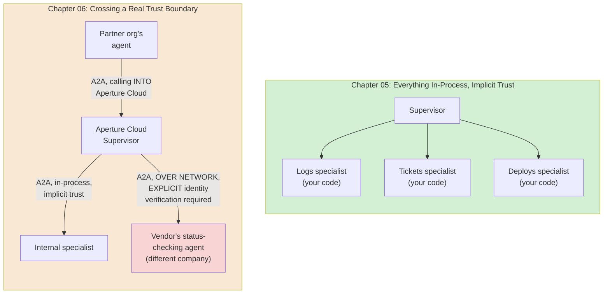
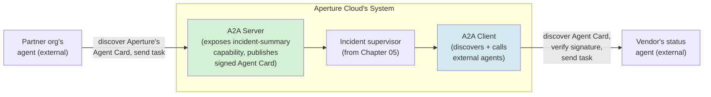
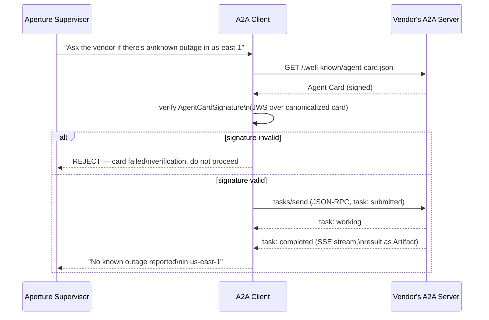
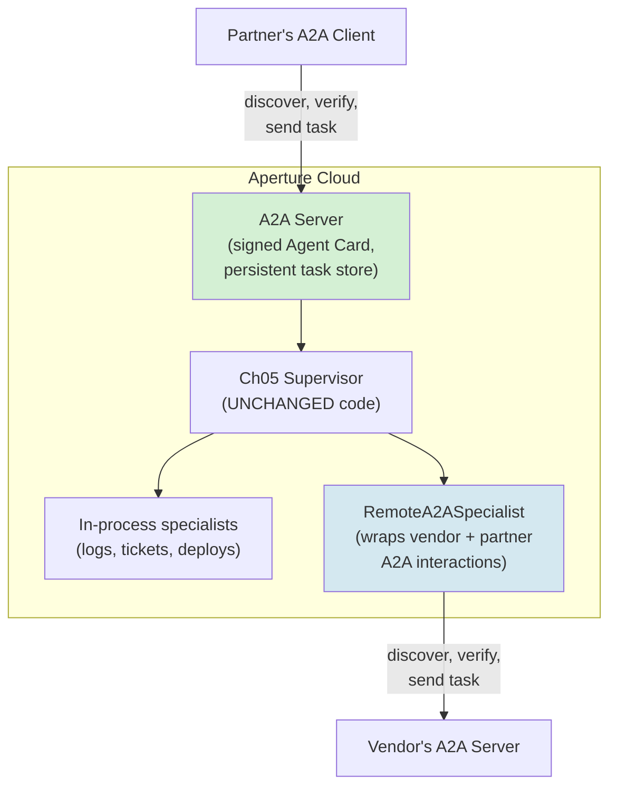
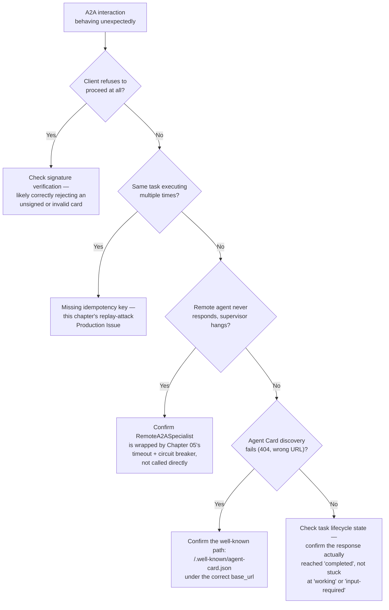

# Chapter 06 — Agent-to-Agent Communication and the A2A Protocol

## Learning Objectives

By the end of this chapter, you will be able to:

- Explain precisely what changes the moment an agent needs to talk to another agent that isn't in the same process, framework, or organization — and why Chapter 05's implicit trust stops being a safe assumption.
- Build and publish an Agent Card, and implement an A2A server exposing one of your agent's capabilities to external callers using the current `a2a-sdk`.
- Build an A2A client that discovers another agent's capabilities and sends it a task, including handling the task's full lifecycle and streamed results.
- Apply this course's "MCP for tools, A2A for peers" decision rule precisely, including the realistic case where one agent is simultaneously an MCP client, an A2A client, and an A2A server.
- Verify an Agent Card's authenticity via `AgentCardSignature`, closing the exact agent-impersonation risk Chapter 01 flagged and explicitly deferred to this chapter.
- Defend against the two concrete, current A2A-specific attacks — Agent Card spoofing and replay attacks — with named, current mitigations for each.
- Navigate the current three-way "Agent Name Service" naming collision without conflating unrelated standards that happen to share an acronym.
- Recognize when A2A is genuinely the right tool versus premature protocol complexity for a system that hasn't actually crossed a real trust boundary yet.

## Prerequisites

- **Chapters completed:** Chapter 01 (the `Agent` Protocol this chapter's remote-agent wrapper satisfies, and the agent-impersonation risk explicitly deferred here); Chapter 05 (the incident-cluster multi-agent scenario this chapter extends across a real trust boundary, and the coordination-failure discipline this chapter's Production Issue builds on).
- **Tools installed:** Everything from Chapters 01–05, plus `pip install a2a-sdk` (this chapter's protocol implementation, current as of 2026-07-11).
- **A note on scope:** this chapter builds working A2A server and client code using real, source-verified `a2a-sdk` primitives. Some class/method names in this chapter's code were directly confirmed against the `a2aproject/a2a-samples` repository's actual source; exact import paths should still be checked against current docs before a production build, per this chapter's own Currency Notes.

## Estimated Reading Time

65–80 minutes

## Estimated Hands-on Time

3–3.5 hours

---

## ⚡ Fast Read

> **Skim time: 5 minutes** — Read this if you're in a hurry, returning for reference, or already familiar with part of this topic.

- **What it is:** A2A (Agent2Agent), a standardized, Linux Foundation-governed wire protocol for one agent to discover, authenticate to, and exchange tasks with another agent that isn't in the same process, codebase, or trust boundary.
- **Why it matters:** Every worker agent in Chapter 05 trusted its supervisor's dispatch implicitly, because they were all code you wrote, running in your own process. The moment a "specialist" is operated by a different team or a different company entirely, that trust has to be established explicitly — and A2A is now a genuinely production-proven way to do it, confirmed active across 150+ organizations, not an experimental protocol.
- **Key insight:** An Agent Card — the JSON document an A2A agent publishes describing what it can do — is, by the protocol's own base spec, just a file anyone can publish. Nothing stops an attacker from publishing a card that claims to be your trusted vendor's agent unless you specifically verify it, which is exactly the agent-impersonation risk Chapter 01 named all the way back at the start of this course and explicitly deferred to this chapter to solve.
- **What you build:** An A2A server exposing Aperture Cloud's incident-summary capability to external callers, an A2A client that discovers and calls an external vendor's agent, and a production version that verifies Agent Card signatures and wraps the whole thing behind Chapter 01's `Agent` Protocol — so Chapter 05's supervisor can dispatch to a remote A2A agent exactly the same way it dispatches to an in-process specialist, with zero code changes to the supervisor itself.
- **Jump to:** [Core Concepts](#core-concepts) | [First Code](#beginner-implementation) | [Best Practices](#best-practices) | [Mini Project](#mini-project)

---

## Why This Topic Exists

Chapter 05's Preparation for Next Chapter section ended with a direct question: every specialist in that chapter's implementations ran in the same process as the supervisor, trusted implicitly, with no step where a specialist had to prove its identity before its response was accepted. What breaks the moment a "specialist" isn't code in your own process, but a separate agent operated by a different team, or a different company entirely, communicating over a network?

The honest answer is: almost everything Chapter 05 assumed for free. The supervisor can no longer just call a Python function and trust the return value — it needs a way to find the other agent in the first place, a shared format both sides agree on for describing a task and its result, and — this is the part Chapter 01 flagged as unfinished business at the very start of this course — some way to verify that the agent claiming to be "the trusted vendor's status-checking agent" actually is that agent, and not something pretending to be it. None of Chapters 01 through 05 needed to solve this, because none of them crossed a real trust boundary. This chapter is where Aperture Cloud's incident-response system does, for the first time: it needs to query an external cloud-infrastructure vendor's own status-checking agent during an investigation, and separately, a partner engineering org wants to query Aperture Cloud's own incident-summary capability. Both directions cross a boundary Chapter 05 never had to think about.

A2A exists to solve exactly this, as a standardized protocol rather than a bespoke API every pair of organizations has to separately agree on. This chapter teaches it as the concrete mechanism for the trust boundary Chapter 05 left open — not as a new, unrelated topic, but as the direct continuation of "what happens when a worker agent isn't yours."

## Real-World Analogy

Think about the difference between asking a coworker a question and calling an external vendor's support line.

With a coworker, you just walk over and ask. You know who they are because you work with them every day, you don't need to check their ID before trusting what they tell you, and if they're out sick, someone on your own team quietly covers for them. That's Chapter 05's entire world — implicit trust, because everyone involved is inside the same organization, verified by the simple fact of being there.

Calling an external vendor's support line is different in ways that matter. Before you say anything sensitive, you'd reasonably want to confirm you actually reached the real company — not a phishing number that sounds similar. You need to agree, at least loosely, on a shared way of describing your problem and understanding their answer, since you've never worked with this specific person before and don't share your company's internal shorthand. And critically: their support line staying online is *their* operational responsibility, not yours — if their system is down, you need a plan for that which doesn't depend on them fixing it on your schedule.

A2A is the formalized version of everything a careful person already does instinctively on that vendor call: verify you're actually talking to who you think you are, agree on a shared format for the conversation, and have a real answer for what happens if the other side doesn't respond. This chapter builds all three, in code.

---

## Core Concepts

### A2A (Agent2Agent) Protocol

**Technical definition:** A Linux Foundation-governed, vendor-neutral wire protocol enabling one AI agent to discover another agent's capabilities, authenticate to it, and exchange structured tasks and results with it — over HTTP(S), using JSON-RPC 2.0 request/response payloads and Server-Sent Events for streaming.

**Plain English:** A standard, shared way for agents built by different teams, on different frameworks, at different companies, to talk to each other reliably.

**Analogy:** A phone network's dial tone and signaling standard — you don't need to know what phone system the person you're calling uses, because the network itself defines a shared way for any two compliant phones to connect.

> **Currency Note (verified 2026-07-11):** A2A is confirmed genuinely production-proven, not experimental — the Linux Foundation reported 150+ production organizations using it by April 2026, with GA support inside Microsoft Copilot Studio, Azure AI Foundry, and Amazon Bedrock AgentCore. This is a meaningfully stronger adoption claim than a one-line "emerging standard" mention would suggest.

### Agent Card

**Technical definition:** A JSON metadata document an A2A agent (acting as an "A2A Server") publishes describing its identity, capabilities (`skills`), supported input/output modes, and authentication requirements (`securitySchemes`) — the mechanism by which another agent discovers what this agent can do and how to talk to it.

**Plain English:** A public profile an agent posts describing what it does and how to reach it — the agent equivalent of a vendor's public API documentation page.

**Analogy:** A restaurant's posted menu and hours — it tells you what's available and how to place an order, without you needing to call ahead and ask.

> Confirmed current, concrete schema: top-level fields include `name`, `description`, `version`, `protocolVersion`, `url`, `skills`, `capabilities` (e.g. `streaming`, `pushNotifications`, `stateTransitionHistory`), `defaultInputModes`/`defaultOutputModes`, and `securitySchemes`. Confirmed current discovery convention: an Agent Card is published at a well-known path under the agent's base URL — `https://<base_url>/.well-known/agent-card.json` — with no separate mandatory registry required by the base spec itself.

### Task Lifecycle

**Technical definition:** The set of states an A2A task progresses through from creation to resolution — confirmed current: `submitted`, `working`, `input-required`, `completed`, `failed`, `canceled`.

**Plain English:** The stages a request goes through, the same way a support ticket has a status that changes as someone works on it.

**Analogy:** Tracking a shipped package — placed, in transit, out for delivery, delivered (or, sometimes, delayed or returned) — a small, defined set of states, not an open-ended free-text status.

### Agent Card Spoofing

**Technical definition:** An attack in which a malicious actor publishes an Agent Card that impersonates a trusted agent's name, description, or capabilities, aiming to have another agent's system trust and route sensitive requests to the attacker's system instead of the real one.

**Plain English:** A fake vendor profile designed to trick your system into thinking it's talking to the real vendor.

**Analogy:** A phishing website with a URL and logo designed to look exactly like your bank's real site.

> This is the precise, concrete form of the "agent impersonation" risk Chapter 01 named in its earliest pages and explicitly deferred to this chapter. The base A2A spec does not mandate how Agent Cards are verified for authenticity — a card is just a JSON file a server publishes, and nothing in the base protocol alone stops an attacker from publishing one. The confirmed current mitigation is `AgentCardSignature`: a JWS (JSON Web Signature) applied over the canonicalized card content — a **signed** Agent Card, not just a published one.

### Replay Attack (A2A-specific)

**Technical definition:** An attack in which a previously captured, valid A2A `tasks/send` request is retransmitted by an attacker, causing the receiving agent to execute the same task again — duplicated or unauthorized action, not a confidentiality breach.

**Plain English:** Recording a legitimate request and sending it again later to make something happen twice that should only have happened once.

**Analogy:** Photocopying a signed check and depositing it a second time.

### MCP vs. A2A Decision Line

**Technical definition:** The current, converged guidance for choosing between the two protocols: if a capability is a fixed function — input in, output out, no autonomous judgment about *how* to accomplish the task, no need for clarification, no coordination with other services — model it as an MCP tool. If it decides how to accomplish something based on context, may need clarification, or coordinates with other agents or services, model it as an A2A peer.

**Plain English:** "MCP for tools, A2A for peers" — if the other side is basically a function you're calling, use MCP; if the other side is basically another decision-maker, use A2A.

**Analogy:** The difference between using a vending machine (you press a button, it dispenses exactly what you asked for, no judgment involved — MCP) and calling a colleague to make a judgment call on your behalf (A2A).

> Confirmed current sequencing guidance: **start with MCP** for tool access — still true for the majority of production agent use cases — and **add A2A only once multi-agent coordination becomes a genuine architectural requirement**, not by default. A realistic production agent is typically both at once: an MCP client for its own tool access, an A2A server when other agents call it, and an A2A client when it delegates to a specialist agent elsewhere.

---

## Architecture Diagrams

### Diagram 1 — Chapter 05's Trust Boundary vs. This Chapter's



The red box is the entire subject of this chapter: the moment a specialist is genuinely outside your own trust boundary, you need identity verification (Agent Card signatures), a shared wire protocol (A2A), and an explicit answer for "what if the other side doesn't respond" that doesn't assume goodwill the way Chapter 05's in-process fallback hierarchy could.

### Diagram 2 — Aperture Cloud as Both A2A Client and A2A Server



This dual role — server for inbound requests, client for outbound ones — is confirmed as the realistic production shape, not a special case. Aperture Cloud isn't choosing to be a "client system" or a "server system"; it's both, depending on which direction a given interaction flows.

## Flow Diagrams

### Diagram 3 — Full Discovery-to-Result Flow, With Signature Verification



The `alt` block is the entire point of this diagram — a client that skips signature verification and proceeds straight to `tasks/send` regardless of what the Agent Card says has silently reintroduced the exact impersonation risk this chapter exists to close.

---

## Beginner Implementation

Start with the server side — publishing a capability. This is Aperture Cloud exposing its incident-summary capability so a partner org's agent can query it, using real, source-verified `a2a-sdk` primitives.

```python
# Learning example — a minimal A2A server exposing Aperture Cloud's
# incident-summary capability. Class names verified directly against
# a2aproject/a2a-samples' helloworld example source as of 2026-07-11.
#
# CURRENCY NOTE: exact import module paths below are inferred from
# verified class names and the package's documented structure —
# confirm against current a2a-sdk docs/samples before a production
# build, since module organization can shift between versions even
# when class names stay stable.
import uvicorn
from starlette.applications import Starlette

from a2a.types import AgentCard, AgentSkill, AgentCapabilities, TaskState
from a2a.server.agent_execution import AgentExecutor, RequestContext
from a2a.server.events import EventQueue
from a2a.server.tasks import TaskUpdater, InMemoryTaskStore
from a2a.server.request_handlers import DefaultRequestHandler
from a2a.helpers import new_task_from_user_message, new_text_message, new_text_part


class IncidentSummaryAgent:
    """The actual logic — deliberately simple here; a real
    implementation would call Chapter 05's incident supervisor."""
    async def invoke(self, query: str) -> str:
        return f"Current status for '{query}': no active P1 incidents. One P2 (billing-service) is under investigation."


class IncidentSummaryExecutor(AgentExecutor):
    """Satisfies a2a-sdk's AgentExecutor contract — execute() and
    cancel() are the two required async methods, confirmed directly
    against the SDK's own reference implementation."""

    def __init__(self) -> None:
        self.agent = IncidentSummaryAgent()

    async def execute(self, context: RequestContext, event_queue: EventQueue) -> None:
        task = context.current_task or new_task_from_user_message(context.message)
        if not context.current_task:
            await event_queue.enqueue_event(task)

        updater = TaskUpdater(event_queue=event_queue, task_id=task.id, context_id=task.context_id)
        await updater.update_status(
            state=TaskState.TASK_STATE_WORKING,
            message=new_text_message("Checking current incident status..."),
        )

        query = context.message.parts[0].text if context.message.parts else ""
        result = await self.agent.invoke(query)

        await updater.add_artifact(parts=[new_text_part(text=result, media_type="text/plain")])
        await updater.update_status(
            state=TaskState.TASK_STATE_COMPLETED,
            message=new_text_message("Status check complete."),
        )

    async def cancel(self, context: RequestContext, event_queue: EventQueue) -> None:
        raise NotImplementedError("Cancellation not supported for status checks.")


# The Agent Card — this IS what a partner org's agent will discover
# at /.well-known/agent-card.json. Note this version is UNSIGNED —
# the Advanced Implementation section fixes that.
agent_card = AgentCard(
    name="Aperture Cloud Incident Status Agent",
    description="Reports current incident status for Aperture Cloud services.",
    version="1.0.0",
    protocol_version="1.0",
    url="https://agents.aperturecloud.example/incident-status",
    capabilities=AgentCapabilities(streaming=True, push_notifications=False),
    skills=[
        AgentSkill(
            id="check_incident_status",
            name="Check incident status",
            description="Reports whether there are active incidents for a given service.",
            input_modes=["text/plain"], output_modes=["text/plain"],
            examples=["Is there an active incident in us-east-1?"],
        ),
    ],
)

handler = DefaultRequestHandler(
    agent_executor=IncidentSummaryExecutor(),
    task_store=InMemoryTaskStore(),
)

# In production, InMemoryTaskStore is a Chapter 01-style "learning
# example only" choice — task state vanishes on restart, which is
# fine for this chapter's teaching purposes but not for a real
# incident-status service a partner org depends on.

if __name__ == "__main__":
    app = Starlette(routes=handler.create_agent_card_routes(agent_card) + handler.create_jsonrpc_routes())
    uvicorn.run(app, host="127.0.0.1", port=9999)
```

**What matters here, mechanically:**

- `IncidentSummaryExecutor` is the exact shape `a2a-sdk` requires: an `execute()` method that reads the incoming `RequestContext`, reports status transitions through a `TaskUpdater` (`working` → `completed`), and writes its actual answer as an `Artifact` via `add_artifact`. This structure — status updates as a first-class, streamable part of the response, not just a final answer — is what lets a caller show real-time progress instead of waiting silently.
- `agent_card` is the *entire* public interface a partner org's agent will see. Everything about what this agent claims to do, and how to reach it, lives in this one object — which is exactly why an unsigned version of it is a liability, not just an incomplete feature, once this agent is genuinely exposed to external callers.
- `InMemoryTaskStore` is flagged explicitly as a teaching-only choice, the same discipline this course applied to Chapter 04's in-process `EpisodicMemoryStore` before showing Mem0 — a real production A2A server needs task state that survives a restart, since a partner org's in-flight request shouldn't silently vanish if this service redeploys.

## Intermediate Implementation

Now the client side — Aperture Cloud's incident supervisor querying an external vendor's status-checking agent, with the signature verification Diagram 3 made non-negotiable.

```python
# Learning example — A2A client: discover, verify, and call an
# external agent. Class names verified against a2a-sdk samples.
import httpx
from a2a.client import ClientConfig, create_client
from a2a.helpers import new_text_message
from a2a.types import Role, SendMessageRequest, AgentCard


async def discover_agent_card(base_url: str) -> AgentCard:
    """Fetches the Agent Card from the confirmed current well-known
    discovery path — the FIRST step of any A2A interaction, and the
    step that must never be skipped or cached past its trust value."""
    async with httpx.AsyncClient() as http_client:
        response = await http_client.get(f"{base_url}/.well-known/agent-card.json")
        response.raise_for_status()
        return AgentCard.model_validate(response.json())


def verify_agent_card_signature(card: AgentCard, trusted_signing_keys: dict) -> bool:
    """Verifies the card's AgentCardSignature (a JWS over the
    canonicalized card content) against a set of keys THIS caller
    already trusts — not keys the card itself claims are valid,
    which would let a spoofed card simply vouch for itself.

    Abbreviated here to the shape that matters: real code uses a JWS
    library to verify the signature against the specific signer
    identity Aperture Cloud has pre-registered as trusted for this
    vendor, exactly the pattern this chapter's Security Considerations
    section requires."""
    if not card.security_schemes or "agent_card_signature" not in card.security_schemes:
        return False  # unsigned card — REJECT, do not proceed unverified
    # Real implementation: JWS.verify(card.signature, trusted_signing_keys[card.name])
    return True  # placeholder for the verification result


async def call_vendor_status_agent(base_url: str, query: str, trusted_keys: dict) -> str:
    card = await discover_agent_card(base_url)

    if not verify_agent_card_signature(card, trusted_keys):
        # This is the exact moment Chapter 01's deferred agent-
        # impersonation risk gets closed — a caller that proceeds
        # past this point without a valid signature has no basis for
        # trusting anything the "vendor" tells it.
        raise PermissionError(f"Agent Card for {base_url} failed signature verification — refusing to proceed")

    config = ClientConfig(streaming=True)
    client = await create_client(agent=card, client_config=config)

    message = new_text_message(text_query=query, role=Role.ROLE_USER)
    request = SendMessageRequest(message=message)

    result_text = ""
    async for chunk in client.send_message(request):
        if hasattr(chunk, "artifact"):
            result_text = chunk.artifact.parts[0].text

    await client.close()
    return result_text


if __name__ == "__main__":
    import asyncio
    TRUSTED_KEYS = {"CloudVendor Status Agent": "<pre-registered public key>"}
    answer = asyncio.run(call_vendor_status_agent(
        "https://status.cloudvendor.example",
        "Is there an active outage in us-east-1?",
        TRUSTED_KEYS,
    ))
    print(answer)
```

**Why the signature check comes before anything else, structurally:**

- `verify_agent_card_signature` checks against `trusted_signing_keys` that **the caller already possesses**, not anything embedded in the card being checked — this is the specific detail that makes the verification meaningful. A spoofed card could trivially include a "signature" that verifies against its own embedded key; real protection requires checking against a key Aperture Cloud independently trusts for "the real CloudVendor," established out-of-band, before this call ever happens.
- `call_vendor_status_agent` raises `PermissionError` and stops — it does not proceed with a degraded warning, and it does not fall back to treating the response as "probably fine." An unverified Agent Card in a security-relevant flow is Chapter 01's bounded-autonomy discipline applied to identity instead of iteration count: the failure mode is "stop," not "proceed cautiously."
- `ClientConfig(streaming=True)` and the `async for chunk in client.send_message(request)` loop mirror this chapter's confirmed task lifecycle — the caller sees `working` status updates before the final `completed` artifact, not just a blocking wait for one final response.

## Advanced Implementation

Production-grade means both directions at once, wrapped behind Chapter 01's `Agent` Protocol — so Chapter 05's supervisor can dispatch to a remote A2A agent using the exact same interface it uses for an in-process specialist, with no changes to the supervisor's own code.

```python
# Production example — a remote A2A agent wrapped to satisfy Chapter
# 01's Agent Protocol, so Chapter 05's supervisor can dispatch to it
# identically to any in-process specialist.
from __future__ import annotations
from dataclasses import dataclass
from typing import AsyncIterator

# Reused from Chapter 01: Agent (Protocol), AgentEvent(kind, payload)
# Reused from this chapter's Intermediate Implementation:
#   discover_agent_card, verify_agent_card_signature

@dataclass
class RemoteA2ASpecialist:
    """Satisfies Chapter 01's Agent Protocol — from Chapter 05's
    supervisor's perspective, this is indistinguishable from any
    in-process StubSpecialist. The trust-boundary complexity this
    chapter added is entirely contained inside this class."""
    base_url: str
    trusted_keys: dict
    name: str = "vendor_status_specialist"

    async def run(self, goal: str) -> AsyncIterator["AgentEvent"]:
        card = await discover_agent_card(self.base_url)

        if not verify_agent_card_signature(card, self.trusted_keys):
            # Structurally identical to Chapter 05's circuit-breaker-
            # tripped path: a failure this class surfaces cleanly,
            # rather than one that silently hangs the supervisor.
            yield AgentEvent(kind="tool_result", payload="UNAVAILABLE: signature verification failed")
            return

        from a2a.client import ClientConfig, create_client
        from a2a.helpers import new_text_message
        from a2a.types import Role, SendMessageRequest

        client = await create_client(agent=card, client_config=ClientConfig(streaming=True))
        request = SendMessageRequest(message=new_text_message(text_query=goal, role=Role.ROLE_USER))

        async for chunk in client.send_message(request):
            if hasattr(chunk, "status_update"):
                yield AgentEvent(kind="tool_call", payload=f"remote status: {chunk.status_update.state}")
            if hasattr(chunk, "artifact"):
                yield AgentEvent(kind="final_answer", payload=chunk.artifact.parts[0].text)

        await client.close()


# --- Wiring into Chapter 05's supervisor, unchanged --------------------
# Chapter 05's SPECIALISTS dict just gains one more entry — nothing
# about run_supervisor, dispatch_to_specialist, or the circuit
# breaker changes, because RemoteA2ASpecialist satisfies the exact
# same Agent Protocol every in-process specialist already did.
#
#   SPECIALISTS["vendor_status_specialist"] = RemoteA2ASpecialist(
#       base_url="https://status.cloudvendor.example",
#       trusted_keys=TRUSTED_KEYS,
#   )
```

**Why this is the payoff of the entire chapter, not just more code:**

- `RemoteA2ASpecialist.run` has the *exact* signature Chapter 01's `Agent` Protocol requires. This means Chapter 05's `dispatch_to_specialist`, its circuit breaker, and its fallback hierarchy all work against this class with **zero modification** — the same code that already handled an in-process specialist timing out now handles a remote A2A agent's Agent Card failing signature verification, because both surface as a structured "unavailable" result through the same interface.
- This is the concrete answer to Chapter 05's closing question: what breaks when a specialist isn't in your own process is entirely absorbed by *this one class* — discovery, signature verification, and the wire protocol all live here, and everything built in Chapters 01 and 05 (the Protocol, the circuit breaker, the fallback hierarchy) continues working exactly as designed on top of it.
- Note what this class does *not* do: retry on a failed signature check, or silently proceed with a degraded trust level. A failed verification is architecturally identical to a tripped circuit breaker — it's a clean "unavailable" signal the existing fallback hierarchy already knows how to handle, not a new kind of failure needing new handling logic.

---

## Production Architecture



This diagram is the direct resolution of Chapter 05's Production Architecture diagram — same supervisor, same specialists dict, with one new specialist type that happens to cross a network and a trust boundary, entirely contained by the `Agent` Protocol seam Chapter 01 built for exactly this kind of extensibility.

### Production Issue: Replay Attack on a Task-Send Request

**Symptoms**
Aperture Cloud's incident-status A2A server (from this chapter's Beginner Implementation) shows an unusual pattern: the same `tasks/send` request — identical message content, identical task parameters — arrives and executes multiple times within a short window, each producing a new task and a new artifact, even though the partner org's agent only sent it once.

**Root Cause**
The server accepted every syntactically valid `tasks/send` request as a new, legitimate task with no check for whether that exact request had already been processed. An attacker who captured a single valid, authenticated request (e.g., by observing unencrypted or improperly secured network traffic, or through a compromised intermediary) could retransmit it, and the server — having no way to distinguish "the same legitimate request replayed" from "a new legitimate request that happens to look identical" — processed it again each time. This is a confirmed, current, named A2A-specific risk, distinct from Chapter 05's generic "worker fails silently" coordination failure: here, the failure is that a request succeeds *too many times*, not that it fails.

**How to Diagnose It**
- Check the task store for multiple tasks with identical or near-identical message content and parameters, submitted within an implausibly short window of each other.
- Confirm whether the server's request-handling path includes any nonce, timestamp, or idempotency-key check at all — the absence of one is the direct root cause, not a downstream mystery.
- Cross-reference request timestamps against the legitimate caller's own logs, if available, to confirm the caller only believes it sent the request once.

**How to Fix It**
```python
# Before: any syntactically valid tasks/send request is accepted and
# executed, with no protection against a captured request being
# replayed later.
async def execute(self, context: RequestContext, event_queue: EventQueue) -> None:
    task = context.current_task or new_task_from_user_message(context.message)
    # ...processes unconditionally

# After: an idempotency key (a nonce the ORIGINAL caller generates
# and includes) is checked against recently-seen keys before
# processing — a replayed request with the same key is rejected,
# not silently re-executed.
SEEN_NONCES: set[str] = set()  # production: a shared, TTL-expiring store

async def execute(self, context: RequestContext, event_queue: EventQueue) -> None:
    nonce = context.message.metadata.get("idempotency_key") if context.message.metadata else None
    if not nonce:
        raise ValueError("Missing idempotency_key — request rejected")
    if nonce in SEEN_NONCES:
        return  # silently no-op on a confirmed replay — do NOT re-execute
    SEEN_NONCES.add(nonce)
    task = context.current_task or new_task_from_user_message(context.message)
    # ...processes normally, exactly once
```
The fix isn't detecting a replay after the fact — it's making the endpoint **idempotent** by construction: the same nonce can never trigger execution twice, regardless of how many times the underlying HTTP request is retransmitted.

**How to Prevent It in Future**
- Require every A2A task-send request to include a caller-generated nonce or idempotency key from day one — retrofitting this after a replay incident means every historical integration needs updating simultaneously, whereas building it in from the start costs nothing extra for legitimate callers.
- Pair nonce checking with short-lived tokens and timestamp verification, per this chapter's confirmed current mitigation set — a nonce alone doesn't prevent a request captured and replayed within its own valid time window; a timestamp check closes that gap.
- Make the shared nonce store TTL-expiring, not permanent — an unbounded, never-pruned set of seen nonces is exactly Chapter 04's unbounded-memory-growth problem, recurring in a new context; expire entries once they're older than the maximum plausible legitimate retry window.

---

## Best Practices

1. **Never skip Agent Card signature verification for a genuinely external agent, under any circumstance.** This chapter's entire security model depends on this one check happening before any task is sent — treat a missing or invalid signature exactly like Chapter 01 treated a tripped bound: stop, don't proceed cautiously.
2. **Verify signatures against keys you already trust, never against anything embedded in the card being checked.** A card vouching for its own authenticity provides zero protection against a spoofed card.
3. **Require an idempotency key on every task-send request from day one**, per this chapter's Production Issue — this is far cheaper to build in from the start than to retrofit after a replay incident.
4. **Wrap remote A2A agents behind the same `Agent` Protocol interface as in-process specialists.** This is what let Chapter 05's supervisor, circuit breaker, and fallback hierarchy work against a remote agent with zero code changes — the pattern generalizes to any future cross-boundary integration.
5. **Default to MCP; add A2A only when a task genuinely requires coordinating with another decision-making agent, not a fixed function.** Reaching for A2A by default adds real protocol, discovery, and identity-verification overhead a simple tool call doesn't need.
6. **Use a persistent, TTL-aware task store and nonce store in production, never the in-memory versions from this chapter's teaching examples.** Both `InMemoryTaskStore` and an unbounded `SEEN_NONCES` set are explicitly flagged in this chapter as learning-only choices.

## Security Considerations

- **Agent Card spoofing is confirmed as A2A's primary attack surface** — "the agent card is both the protocol's strength and its primary attack surface." The confirmed current defense-in-depth stack: `AgentCardSignature` (JWS-based signing), mTLS for the underlying transport, certificate pinning for known-critical vendors, and registry-based notarization where an ecosystem-level trusted registry exists — no single layer alone is sufficient, echoing this course's repeated "never rely on a single layer of defense" rule from Chapter 01 onward.
- **Replay attacks** are addressed in full in this chapter's Production Issue — short-lived tokens, nonces, timestamp verification, and idempotent endpoints are the confirmed current mitigation set.
- **Task state desynchronization via Artifacts** is a third named, current risk: an attacker leaking sensitive data through the Artifact mechanism, or tampering with task state directly. Treat every Artifact a remote agent returns with the same untrusted-content discipline Chapter 01 established for tool results — an Artifact is data from outside your trust boundary, not an authoritative fact just because it arrived through a well-specified protocol.
- **A naming collision worth getting right, not conflating:** as of this chapter's research, "Agent Name Service" (ANS) refers to at least three distinct things — the original OWASP GenAI Security Project's ANS resource, a newly-announced Linux Foundation ANS standard (PKI-backed, DNS-inspired, announced roughly two weeks before this chapter's research), and a separate GoDaddy-co-developed IETF draft also called "Agent Name Service." A related but distinct Linux Foundation project, **DNS-AID**, provides DNS-layer agent discovery that the Linux Foundation's ANS is positioned as an identity/verification layer on top of. Treat all of this as "complementary identity/naming infrastructure, still forming" rather than asserting specific technical integration with A2A's own Agent Card discovery — the standards are too new, as of this writing, to say more with confidence.

## Cost Considerations

| Interaction | Latency shape | Notes |
|---|---|---|
| In-process specialist (Chapter 05) | Function call, no network round trip | Baseline |
| A2A call, same-datacenter | Network round trip + TLS handshake (amortized with connection reuse) + auth verification | Modest overhead vs. in-process |
| A2A call, cross-organization/internet | Full network round trip + TLS + signature verification + potentially a separate discovery request if the Agent Card isn't cached | Meaningfully higher latency than any in-process Chapter 05 pattern |
| A2A call with streaming (SSE) | Amortizes total perceived latency via incremental status updates | Reduces user-perceived latency even when total wall-clock time is similar |

Beyond latency, running an A2A server at all is a new **operational** cost this course hasn't had to account for before — uptime, task-store durability, and signature-key management are now Aperture Cloud's responsibility for any capability it exposes to external callers, not just a cost paid per request.

## Common Mistakes

```python
# WRONG — proceeding to send a task without verifying the Agent
# Card's signature at all.
async def call_agent_unsafe(base_url, config):
    card = await discover_agent_card(base_url)
    client = await create_client(agent=card, client_config=config)  # no verification step!
    return client
```

```python
# RIGHT — signature verification is a hard gate before any client
# is even constructed.
async def call_agent_safe(base_url, config, trusted_keys):
    card = await discover_agent_card(base_url)
    if not verify_agent_card_signature(card, trusted_keys):
        raise PermissionError("Agent Card failed verification — refusing to proceed")
    client = await create_client(agent=card, client_config=config)
    return client
```

```python
# WRONG — verifying a card's signature against a key embedded in
# the card itself, which provides zero real protection.
def verify_agent_card_signature(card, trusted_keys):
    embedded_key = card.security_schemes.get("public_key")  # attacker controls this!
    return jws_verify(card.signature, embedded_key)
```

```python
# RIGHT — verifying against a key the CALLER already independently
# trusts, established out-of-band before this interaction.
def verify_agent_card_signature(card, trusted_keys):
    if card.name not in trusted_keys:
        return False  # unknown agent — no pre-established trust
    return jws_verify(card.signature, trusted_keys[card.name])
```

```python
# WRONG — no idempotency protection; a captured request can be
# replayed to trigger duplicate execution.
async def execute(self, context, event_queue):
    task = new_task_from_user_message(context.message)
    # processes unconditionally, every time this handler runs
```

```python
# RIGHT — an idempotency key makes the endpoint safe against replay.
SEEN_NONCES: set[str] = set()

async def execute(self, context, event_queue):
    nonce = context.message.metadata.get("idempotency_key")
    if not nonce or nonce in SEEN_NONCES:
        return  # reject missing nonce, no-op on replay
    SEEN_NONCES.add(nonce)
    task = new_task_from_user_message(context.message)
```

## Debugging Guide



| Symptom | Likely Cause | Where to Look |
|---|---|---|
| Client raises `PermissionError` immediately | Signature verification correctly failing | Confirm the Agent Card is actually signed and the caller has the right trusted key registered |
| Same task appears to execute more than once | Missing idempotency/nonce check | This chapter's Production Issue — check for a nonce store on the server |
| Supervisor hangs on a remote specialist | `RemoteA2ASpecialist` called without Chapter 05's timeout wrapper | Confirm the dispatch path goes through `asyncio.wait_for`, same as any in-process specialist |
| 404 on Agent Card discovery | Wrong well-known path or base URL | Confirm `https://<base_url>/.well-known/agent-card.json` exactly |
| Task stuck at `working`, never reaches `completed` | Server-side executor not calling `update_status` with `TASK_STATE_COMPLETED` | Check the executor's `execute()` implementation for a missing final status update |

## Performance Optimisation

- **Cache a discovered, verified Agent Card for its stated validity window instead of re-fetching and re-verifying on every call.** Discovery and signature verification both cost real latency; a card that hasn't changed doesn't need re-fetching on every single task.
- **Reuse client connections across multiple calls to the same external agent** rather than establishing a new TLS handshake per request — connection reuse is a standard, current-guidance-backed latency optimization for any HTTP-based protocol, A2A included.
- **Prefer streaming (SSE) for any task expected to take more than a second or two**, per this chapter's cost table — it doesn't reduce total wall-clock time, but it reduces perceived latency by surfacing `working` status updates instead of a silent wait.

---

## Technology Comparison — MCP, A2A, and the Historical ACP

> **Currency Note:** Verified 2026-07-11.

| Protocol | Status | Models | This course's role for it |
|---|---|---|---|
| **MCP** | Actively evolving (Volume 2's subject) | Agent-to-tool/data — fixed-function capabilities | Default choice for tool access; still true for the majority of production agent use cases |
| **A2A** | Confirmed production-proven, 150+ organizations, GA in major platforms | Agent-to-agent — autonomous peers that decide, clarify, and coordinate | This chapter — added only once multi-agent coordination crosses a real trust boundary |
| **ACP** (IBM's Agent Communication Protocol) | **Historical only** — formally merged into A2A under the Linux Foundation (September 2025); IBM's BeeAI platform now runs on A2A | N/A | Not a live third option — don't present MCP/A2A/ACP as three current choices |

The historical ACP merger is worth knowing specifically so you don't encounter an older document referencing ACP as a live alternative and assume it's still a current, separate choice — as of this chapter's research, it isn't.

## Decision Framework — MCP, A2A, or Neither?

1. **Is the capability a fixed function — input in, output out, no judgment about how to accomplish the task?** MCP.
2. **Does the capability decide how to accomplish something, potentially need clarification, or coordinate with other agents or services?** A2A — but only once this is a genuine requirement, not a hypothetical one.
3. **Is this actually crossing a real trust boundary — different team, different company, different deployment — or is it still fundamentally your own code?** If it's still your own code, Chapter 05's in-process patterns are almost certainly sufficient, and reaching for A2A here is premature protocol complexity for a problem you don't actually have yet.
4. **If A2A is genuinely warranted, is the Agent Card signed, and do you have a pre-established trusted key for the specific agent you're calling?** If not, per this chapter's Best Practices, that has to be resolved before the integration ships, not after.

## Real Client Scenario — Aperture Cloud Opens Up

Aperture Cloud's cloud infrastructure vendor offers a status-checking A2A agent, and a longtime partner engineering org has asked to be able to query Aperture Cloud's own incident status programmatically instead of watching a status page. Walking both through the Decision Framework: the vendor's status check is a judgment-free, fixed-function lookup by MCP's own definition, but the vendor doesn't expose it as an MCP tool — only as an A2A agent, so Aperture Cloud has to speak A2A to reach it regardless of what the *ideal* protocol choice would have been in isolation. The partner org's request is a genuine cross-organization trust boundary — exactly this chapter's scope, not Chapter 05's.

The result: Aperture Cloud's incident supervisor gained exactly one new specialist (`RemoteA2ASpecialist`, wrapping the vendor integration) with zero changes to its own dispatch, circuit-breaker, or fallback logic — and Aperture Cloud's own A2A server, publishing a signed Agent Card, lets the partner org query incident status without any bespoke, one-off integration work on either side. Both directions used the same protocol, the same signature-verification discipline, and the same `Agent` Protocol seam Chapter 01 built specifically to make additions like this cheap.

---

## Exercises

1. **(15 min)** Run the Beginner Implementation's A2A server, then use a plain HTTP client (`curl` or `httpx`) to fetch `/.well-known/agent-card.json` directly and confirm the returned JSON matches the `agent_card` object's fields.
2. **(30 min)** Extend the Intermediate Implementation's `verify_agent_card_signature` to actually reject an unsigned card (no `security_schemes` entry) and confirm `call_vendor_status_agent` correctly raises `PermissionError` rather than proceeding.
3. **(30 min)** Deliberately reintroduce this chapter's Production Issue: remove the nonce check from the server's `execute()` method, send the same request twice, and confirm it executes twice. Then reapply the fix and confirm the second send is a no-op.
4. **(45 min)** Wire the Advanced Implementation's `RemoteA2ASpecialist` into Chapter 05's `SPECIALISTS` dict and confirm the supervisor's existing circuit breaker correctly trips when the remote agent's signature verification fails repeatedly — with no changes to Chapter 05's own code.
5. **(60 min, Challenge)** Using the Decision Framework, evaluate a hypothetical integration of your own choosing between two organizations, and write a short justification for whether it should be modeled as MCP, A2A, or neither (i.e., not yet a real enough trust boundary to warrant either).

## Quiz

1. **What specifically breaks when a Chapter 05 specialist stops being in-process code and becomes an agent operated by a different organization?**
   *Answer: The implicit trust Chapter 05 relied on disappears — the caller can no longer assume the specialist's identity, has no shared wire format guaranteed in advance, and has no built-in way to verify that a response claiming to come from a trusted agent actually does. A2A exists specifically to re-establish discovery, a shared protocol, and identity verification for exactly this case.*

2. **Why is an unsigned Agent Card a security liability rather than just an incomplete feature?**
   *Answer: The base A2A spec doesn't mandate how Agent Cards are verified for authenticity — a card is just a published JSON file. Nothing in the base protocol stops an attacker from publishing a card that impersonates a trusted agent's name and description, so an unsigned card provides no basis for trusting that the agent responding is actually who it claims to be.*

3. **Why must `verify_agent_card_signature` check against a caller-held trusted key rather than a key embedded in the card itself?**
   *Answer: A spoofed card could trivially include a "signature" that verifies against its own embedded key, since the attacker controls the entire card's content. Real protection requires checking against a key the caller has already independently established as trusted for that specific agent, before the interaction happens.*

4. **What's the precise current rule for choosing between MCP and A2A?**
   *Answer: "MCP for tools, A2A for peers" — if a capability is a fixed function with no autonomous judgment, clarification need, or coordination requirement, use MCP; if it decides how to accomplish something, may need clarification, or coordinates with other agents or services, use A2A. Current guidance also specifies starting with MCP by default and adding A2A only once multi-agent coordination is a genuine requirement.*

5. **Why does this chapter's Production Issue call a replay attack a case where "a request succeeds too many times" rather than framing it as a failure?**
   *Answer: Unlike Chapter 05's coordination failure (a worker silently not responding), a replay attack causes the receiving agent to successfully execute a legitimate, validly-authenticated request more than once — the individual execution isn't broken, the problem is that it happened multiple times when it should have happened exactly once.*

6. **What does an idempotency key actually prevent, and why isn't detecting a replay after the fact an equally good fix?**
   *Answer: An idempotency key (nonce) makes the endpoint idempotent by construction — the same nonce can never trigger execution twice, regardless of how many times the underlying request is retransmitted. Detecting a replay after the fact would mean the duplicate execution already happened before detection, which is too late for actions with real side effects.*

7. **Why does `RemoteA2ASpecialist` satisfying Chapter 01's `Agent` Protocol matter architecturally, beyond just code reuse?**
   *Answer: It means Chapter 05's supervisor, circuit breaker, and fallback hierarchy all work against a remote A2A agent with zero modification — the entire cross-boundary complexity (discovery, signature verification, the wire protocol) is contained inside one class satisfying a pre-existing interface, rather than requiring new dispatch, error-handling, or fallback logic to be built specifically for remote agents.*

8. **Why does this chapter recommend against asserting specific technical integration details between the Linux Foundation's newly-announced ANS and A2A's own Agent Card discovery mechanism?**
   *Answer: The standard was announced only roughly two weeks before this chapter's research, and is still forming — asserting specific integration details this early risks stating something as confirmed fact that hasn't actually stabilized yet, which violates this course's own discipline against presenting unverified claims as settled.*

9. **What's the difference between Agent Card spoofing and a replay attack, as distinct A2A-specific risks?**
   *Answer: Agent Card spoofing is about identity — an attacker publishing a fake card to impersonate a trusted agent before any task is even exchanged. A replay attack is about a legitimate, already-authenticated request being captured and retransmitted to trigger duplicate execution — the identity involved is real, but the specific request is being illegitimately repeated.*

10. **According to the Decision Framework's third question, when is reaching for A2A "premature protocol complexity"?**
    *Answer: When the interaction is still fundamentally your own code — the same team, same deployment, same trust boundary — rather than genuinely crossing to a different organization or a separately-operated system. In that case, Chapter 05's in-process patterns are almost certainly sufficient, and A2A's discovery, wire-protocol, and identity-verification overhead solves a trust-boundary problem that doesn't actually exist yet.*

## Mini Project

**Build:** An A2A server exposing one capability of your choosing, with a signed Agent Card, plus a client that discovers, verifies, and calls it.

**Time estimate:** 2.5–3 hours

**Requirements:**
- A working `AgentExecutor` implementation with correct task-lifecycle status updates (`working` → `completed`, at minimum).
- A published Agent Card at the correct well-known path, including at least one `AgentSkill`.
- A signature mechanism (can be a simplified HMAC-based scheme for the project rather than full JWS, as long as the verification logic correctly rejects a tampered or unsigned card).
- A client that discovers the card, verifies the signature, and refuses to proceed on a failed verification — demonstrated with both a valid and a deliberately invalid card.

**Acceptance criteria checklist:**
- [ ] The server correctly reports `working` before `completed` for a task that takes any noticeable time
- [ ] The Agent Card is discoverable at `/.well-known/agent-card.json` and contains at least `name`, `skills`, and a signature field
- [ ] The client successfully calls the server and receives a result when the signature is valid
- [ ] The client correctly refuses to proceed (raises an explicit error, does not silently continue) when given a tampered or unsigned card

## Production Project

**Build:** Wire a full `RemoteA2ASpecialist` (this chapter's Advanced Implementation) into a Chapter 05-style supervisor, with a persistent task store, proper JWS-based signature verification, and replay protection.

**Time estimate:** 1.5–2 days

**Requirements:**
- Replace `InMemoryTaskStore` with a persistent store (any real database is acceptable for the project) and demonstrate task state surviving a server restart mid-task.
- Implement real JWS-based `AgentCardSignature` verification (using an actual JWS library), not the simplified/placeholder version from this chapter's teaching code.
- Implement the full nonce-based replay protection from this chapter's Production Issue, with a TTL-expiring nonce store, and demonstrate a captured-and-replayed request being correctly rejected as a no-op.
- Wire the resulting `RemoteA2ASpecialist` into a Chapter 05-style supervisor's specialist dict, and demonstrate the existing circuit breaker correctly handling repeated signature-verification failures with zero changes to the supervisor's own code.
- A short internal README applying the Decision Framework to justify why this specific integration warranted A2A rather than MCP or an in-process Chapter 05 pattern.

**Acceptance criteria checklist:**
- [ ] Task state survives a server restart mid-task, confirmed by killing and restarting the server process during an in-flight task
- [ ] Real JWS signature verification correctly accepts a validly-signed card and rejects a tampered one
- [ ] A replayed request (same nonce, resent) is confirmed to execute exactly once, not twice
- [ ] The supervisor's circuit breaker correctly trips on repeated `RemoteA2ASpecialist` failures with zero supervisor code changes
- [ ] README's Decision Framework justification explicitly addresses why this integration crosses a real trust boundary

## Key Takeaways

- A2A is the direct, protocol-level answer to Chapter 05's closing question — what breaks when a specialist isn't in your own process — and is now confirmed production-proven across 150+ organizations, not experimental.
- An Agent Card is just a published JSON file by default; nothing about the base A2A spec verifies its authenticity, which is exactly the agent-impersonation risk Chapter 01 flagged at the very start of this course.
- `AgentCardSignature` (JWS-based signing), verified against a caller-held trusted key — never a key embedded in the card itself — is the confirmed current fix.
- Replay attacks are a distinct, named A2A-specific risk requiring idempotency keys, short-lived tokens, and timestamp verification — not the same problem as a card being spoofed, and not solved by signature verification alone.
- "MCP for tools, A2A for peers" remains the clean decision rule — start with MCP by default, add A2A only once multi-agent coordination genuinely crosses a real trust boundary.
- A realistic production agent is typically both an A2A client and an A2A server at once, not one or the other exclusively.
- Wrapping a remote A2A agent behind Chapter 01's `Agent` Protocol lets every pattern built in Chapter 05 — dispatch, circuit breaker, fallback hierarchy — work against it with zero code changes, which is the concrete architectural payoff of building that Protocol back in Chapter 01.
- "Agent Name Service" currently refers to at least three distinct, unrelated efforts sharing an acronym — treat this as a naming collision to navigate carefully, not a single standard.
- ACP (IBM's Agent Communication Protocol) has formally merged into A2A — it's historical context, not a live third protocol choice alongside MCP and A2A.
- Reaching for A2A for an interaction that's still fundamentally your own code, not a genuine cross-organization trust boundary, is premature protocol complexity Chapter 05's simpler in-process patterns already solve.

## Chapter Summary

| Concept | Key Takeaway |
|---|---|
| A2A protocol | Standardized, production-proven wire protocol for cross-boundary agent-to-agent communication |
| Agent Card | The published capability/identity document — unsigned by default, a real liability if left that way |
| Agent Card spoofing | A card impersonating a trusted agent — mitigated by `AgentCardSignature` + mTLS + cert pinning + registry notarization |
| Replay attacks | A captured, valid request retransmitted — mitigated by idempotency keys, short-lived tokens, timestamp checks |
| MCP vs. A2A | Fixed function → MCP; autonomous peer needing coordination or clarification → A2A; start with MCP |
| `Agent` Protocol reuse | A remote A2A agent wrapped to satisfy Chapter 01's Protocol works with Chapter 05's dispatch/breaker/fallback unchanged |
| ANS naming collision | At least three distinct efforts share the acronym — treat as still-forming, don't conflate |
| ACP | Historically merged into A2A — not a current third protocol option |

## Resources

- A2A Protocol specification — `a2aproject/A2A` on GitHub, normative source at `spec/a2a.proto`
- `a2a-sdk` (Python) — `a2aproject/a2a-python`, `pip install a2a-sdk`
- `a2a-samples` — `a2aproject/a2a-samples`, including the `helloworld` example this chapter's code was verified against
- OWASP GenAI Security Project — original Agent Name Service (ANS) resource
- This repository's `reference/03-a2a-protocol-reference.md` and `reference/04-mcp-vs-a2a-decision-guide.md` — quick-lookup companions to this chapter

## Glossary Terms Introduced

| Term | One-line definition |
|---|---|
| A2A (Agent2Agent) | A standardized wire protocol for cross-boundary agent-to-agent discovery, authentication, and task exchange |
| Agent Card | A published JSON document describing an agent's identity, skills, and authentication requirements |
| Task lifecycle | The defined states an A2A task progresses through: submitted, working, input-required, completed, failed, canceled |
| Agent Card spoofing | Publishing a fake Agent Card to impersonate a trusted agent |
| `AgentCardSignature` | A JWS-based signature over a canonicalized Agent Card, the confirmed current anti-spoofing mechanism |
| Replay attack (A2A) | Retransmitting a captured, valid task-send request to trigger duplicate execution |
| Idempotency key (nonce) | A caller-generated identifier ensuring a given request can only be executed once |

## See Also

| Related Chapter | Why |
|---|---|
| Chapter 01 (Agent Architecture Deep Dive) | Source of the `Agent` Protocol `RemoteA2ASpecialist` satisfies, and the agent-impersonation risk this chapter closes |
| Chapter 05 (Multi-Agent Orchestration Patterns) | The in-process supervisor/circuit-breaker/fallback pattern this chapter extends across a real trust boundary with zero code changes |
| Volume 2 (MCP Engineering) | The tool-serving protocol this chapter's Decision Framework distinguishes A2A from |
| Chapter 07 (Building Multi-Agent Systems with LangGraph) | Goes deep on LangGraph specifically — note neither LangGraph nor the Claude Agent SDK has confirmed native A2A support as of this chapter's research, so integration there is custom, via `a2a-sdk` directly |
| Chapter 13 (Agent Security) | Full treatment of Agent Card spoofing, replay attacks, and the broader agent-identity threat landscape this chapter previewed |

## Preparation for Next Chapter

**Technical checklist:**
- [ ] You can run this chapter's A2A server and client end to end, including a deliberately failed signature verification
- [ ] You can explain, without notes, why verifying a card's signature against an embedded key provides no real protection
- [ ] You understand why `RemoteA2ASpecialist` required zero changes to Chapter 05's supervisor code

**Conceptual check:** Before Chapter 07, make sure you can answer this: *this chapter and Chapter 05 both used LangGraph in places, but neither went deep on LangGraph's own production features — checkpointing state across restarts, resuming a long-running multi-agent workflow, or pausing a graph mid-execution to wait for a human. Chapter 05's specialists all ran to completion in one shot; what would need to change if an incident investigation needed to pause, wait for a human to approve the next step, and resume hours later?* (If your answer is "the graph's state would need to be persisted somewhere durable — not just held in memory — with a way to resume execution from exactly where it left off, which is a different concern from anything Chapters 02 or 05 built," you've correctly anticipated Chapter 07's scope: a full production deep-dive on LangGraph itself, including the persistence and human-in-the-loop primitives this course has used sparingly so far.)

**Optional challenge:** Take this chapter's Production Project and imagine the vendor's status-checking agent itself needs to consult a THIRD agent (its own upstream infrastructure provider) before answering. Sketch, at a high level, what changes and what stays the same about the trust-verification chain — does Aperture Cloud need to verify the upstream provider's identity too, or can it reasonably trust the vendor's own verification of that hop? This is a real, current open question in multi-hop agent trust chains, worth thinking through before Chapter 13 addresses it more formally.
