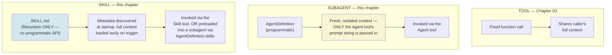
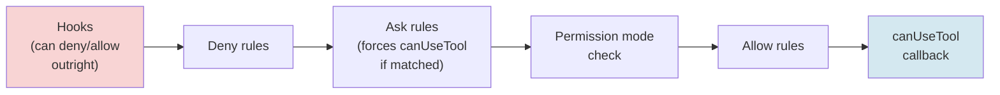
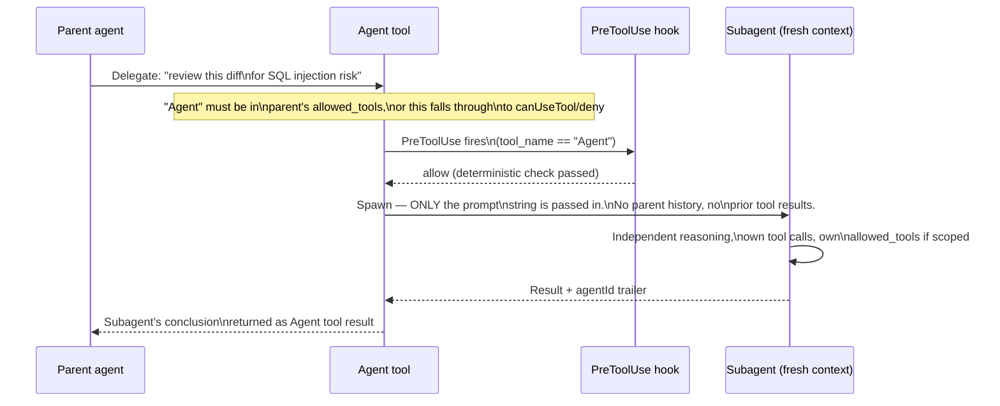
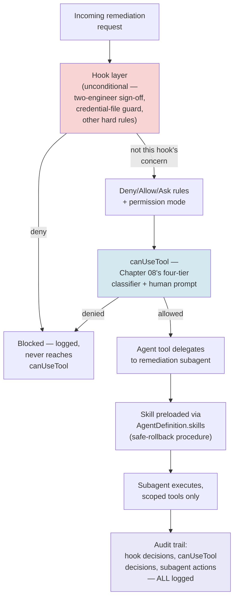

# Chapter 09 — Building Agents with the Claude Agent SDK: Subagents, Hooks, and Skills

## Learning Objectives

By the end of this chapter, you will be able to:

- Use `AgentDefinition` to declare programmatic subagents with the correct current field set, and explain precisely what a subagent inherits from its parent (almost nothing) versus what it doesn't.
- Register hooks at the correct current event points (`PreToolUse`, `PostToolUse`, `SubagentStart`/`SubagentStop`, and others) and explain the confirmed current permission evaluation order hooks sit inside.
- Distinguish, with working code, when a rule belongs in a hook (unconditional, deterministic) versus `canUseTool` (single-call, human-judgment) — closing the exact question Chapter 08 left open.
- Build a Skill as a filesystem artifact and explain why Skills are deliberately non-programmatic, unlike subagents — and how `AgentDefinition.skills` bridges the two.
- Design a hook-and-permission configuration that makes an approval gate structurally un-bypassable by a permissions misconfiguration — directly answering Chapter 08's closing AWS/Kiro challenge.
- Distinguish session-level resume/fork (`continue`, `resume`, `fork`) from subagent-level resume (`agentId` + `session_id`), and explain why the SDK's JSONL-transcript persistence is a genuinely different mechanism from LangGraph's checkpointer-based state persistence.
- Recognize the current, real cost shape of Managed Agents (per-token pricing plus a $0.08/session-hour runtime charge) and evaluate when self-hosting the SDK is the better tradeoff.
- Build a first genuinely consequential agent — one with real, if bounded, write access — using the SDK's own primitives to enforce the bound, not just documentation promising the agent will behave.

## Prerequisites

- **Chapters completed:** Chapter 01 (the hand-rolled agent loop this chapter's SDK replaces, and the `Agent` Protocol its `ClaudeSDKClient` backend already satisfied); Chapter 03 (tool use, least-privilege allowlists, and the progressive-disclosure pattern Skills reuse); Chapter 08 (the four-tier risk model, `canUseTool`, and the exact permission-evaluation-order research this chapter extends with hooks).
- **Tools installed:** Python 3.10+, `claude-agent-sdk` (pinned to `0.2.115`, current as of this chapter's research — verify against `pip index versions claude-agent-sdk` before a production build, since this ecosystem moves fast). An Anthropic API key with billing enabled if you intend to run any example against a live model.
- **A note on scope:** this is the opening chapter of Module 3. Per this course's Autonomy Thread, this is the first chapter permitted to give a worked example genuinely consequential real-world capability — not hypothetical, not a toy. Read Chapter 08 first if you haven't; every gate this chapter builds assumes you already have that chapter's four-tier classifier and `canUseTool` pattern working.

## Estimated Reading Time

75–90 minutes

## Estimated Hands-on Time

3.5–4 hours

---

## ⚡ Fast Read

> **Skim time: 5 minutes** — Read this if you're in a hurry, returning for reference, or already familiar with part of this topic.

- **What it is:** A deep, primary-source-verified tour of the Claude Agent SDK's three distinct delegation primitives — subagents (programmatic, context-isolated sub-conversations), hooks (deterministic, unconditional rules that run regardless of permission mode), and Skills (filesystem-only, packaged procedural knowledge) — plus the session-management machinery that persists and resumes agent work.
- **Why it matters:** Chapter 01 introduced the SDK's `ClaudeSDKClient` at the surface level; Chapter 08 needed `canUseTool` and hooks before it could finish designing a human-oversight system. This chapter is where both debts get paid — the SDK's actual primitives, in full, are what Module 3's genuinely consequential agents get built on.
- **Key insight:** A tool, a subagent, and a Skill are not three names for the same delegation idea — they're three structurally different primitives with different inheritance rules, different invocation mechanisms, and different failure modes. Confusing them (for example, trying to enforce an unconditional guarantee through `canUseTool` instead of a hook) is exactly the kind of mistake that made Chapter 08's AWS/Kiro approval gate bypassable.
- **What you build:** A subagent-delegated, hook-gated remediation agent for Aperture Cloud that answers Chapter 08's closing challenge directly — a permission configuration where the mandatory two-engineer sign-off cannot be routed around by a misconfiguration, because the guarantee lives in a hook, not in `canUseTool` or a permission mode setting.
- **Jump to:** [Core Concepts](#core-concepts) | [First Code](#beginner-implementation) | [Best Practices](#best-practices) | [Mini Project](#mini-project)

---

## Why This Topic Exists

Chapter 01 built a hand-rolled agent loop from raw API calls specifically so you'd understand what a framework does on your behalf before trusting one — and then, in its Advanced Implementation, wrapped the Claude Agent SDK's `ClaudeSDKClient` behind the same `Agent` Protocol, as a second interchangeable backend. That was deliberately a surface-level introduction: enough to prove the SDK satisfies the same interface, not enough to use its real capabilities. Chapter 08 then needed more. Designing a human-oversight system that distinguishes "a rule that must hold no matter what" from "a decision that needs a human's judgment" required hooks and `canUseTool` as two different primitives — but Chapter 08 could only sketch hooks at the surface, because going deep on them was this chapter's job, not that one's.

There's a sharper reason this chapter exists now, not earlier: Module 3 is where this course's Autonomy Thread permits genuinely consequential agents for the first time, and the SDK is where a lot of that consequential capability actually gets wired up in real production systems — subagents that delegate real work into isolated contexts, hooks that enforce guarantees no permission mode can override, and Skills that package procedural knowledge so an agent doesn't have to rediscover how to do something safely every single time. Get these three primitives confused with each other, and you get exactly the failure mode Chapter 08's AWS/Kiro case study illustrated: a gate that looks like it should hold, built on the wrong mechanism, bypassable by something as mundane as a misconfigured permission.

## Real-World Analogy

Think about how a well-run hospital delegates work, because it maps onto this chapter's three primitives almost exactly.

A **tool** is like a piece of equipment — a blood pressure cuff, a syringe. It does exactly one well-defined thing, and any staff member cleared to use it can pick it up and use it directly. That's Chapter 03's territory: a fixed function call, no judgment delegated.

A **subagent** is like consulting a specialist. A general practitioner doesn't hand a cardiologist their entire patient history and every prior note — they write a referral: here's the specific question, here's exactly what you need to know to answer it, go do your own independent assessment and report back a conclusion. The cardiologist doesn't inherit the GP's whole context; they get precisely what's in the referral letter, form their own judgment in isolation, and hand back a result. That's a subagent: a fresh, isolated sub-conversation, given only what's explicitly passed to it.

A **hook**, by contrast, is like a hospital's hard safety interlock — the kind of rule that holds regardless of which doctor is on shift, which specialist got consulted, or what any individual staff member's judgment says in the moment. "No controlled substance leaves the pharmacy without two signatures" isn't a suggestion any single doctor can override by being confident enough; it's wired into the process itself, unconditionally, every time.

And a **Skill** is like a laminated procedure card taped inside a supply cabinet — a written, reusable protocol for exactly how to do something safely ("central line insertion: 7 steps, in this order"), available to whoever opens that cabinet, updated in one place when the protocol changes, and never itself a person who can be delegated a decision. It's packaged knowledge, not a decision-maker.

Four different things — equipment, a referral, a hard interlock, a procedure card. This chapter is about knowing precisely which one you need, because a hospital that tries to enforce a hard-interlock rule with nothing but "we trust the doctor's judgment" is one distracted afternoon away from the AWS/Kiro story.

---

## Core Concepts

### Subagents (`AgentDefinition`)

**Technical definition:** A subagent is a delegated, context-isolated sub-conversation, declared programmatically via `AgentDefinition` (imported from `claude_agent_sdk`) and registered on the parent's `ClaudeAgentOptions` through the `agents={}` dict parameter. Claude invokes a registered subagent through the built-in `Agent` tool — meaning `"Agent"` must itself appear in the parent's `allowed_tools`, or a subagent-delegation attempt falls through to `canUseTool` (or is denied outright under `dontAsk` mode).

**Plain English:** A separate, focused mini-conversation you hand a specific job to — it starts with a blank slate except for exactly what you tell it, does its own reasoning, and reports back.

**Analogy:** The specialist referral from this chapter's opening analogy — a fresh, independent assessment based only on what's in the referral, not the GP's entire patient history.

**Confirmed current field list on `AgentDefinition`:**

| Field | Required | What it does |
|---|---|---|
| `description` | Yes | What Claude reads to decide *when* to auto-delegate to this subagent |
| `prompt` | Yes | The subagent's own, independent system prompt |
| `tools` | No | Allowlist of tools this subagent may use. **Omit it and the subagent inherits ALL of the parent's tools** — a real least-privilege gotcha, covered below in Common Mistakes |
| `disallowedTools` | No | Supports MCP server-level wildcards: `mcp__server`, `mcp__server__*`, `mcp__*` |
| `model` | No | A model alias (`'opus'`, `'sonnet'`, `'haiku'`, `'inherit'`) or a full model ID — confirmed current pattern: reserve a stronger model for higher-stakes subagent variants |
| `skills` | No | A list of Skill names to preload directly into this subagent's context at startup |
| `memory` | No | `'user'`, `'project'`, or `'local'` |
| `mcpServers` | No | MCP servers scoped specifically to this subagent |
| `initialPrompt`, `maxTurns`, `background`, `effort`, `permissionMode` | No | Per-subagent overrides of the parent's corresponding settings |

> **Currency Note (verified 2026-07-11):** Confirmed via direct fetch of `code.claude.com/docs/en/agent-sdk/subagents`, not a secondary summary — treat this field list as solidly current, but re-check it against the live docs before a production build, since SDK surface area is exactly the kind of thing that changes between minor versions.

**Context isolation, confirmed precisely:** a subagent's context starts genuinely fresh. It does **not** receive the parent's conversation history, prior tool results, or system prompt. The *only* channel from parent to subagent is the `Agent` tool's prompt string — meaning any file path, error message, or prior decision the subagent needs has to be explicitly written into that prompt, or the subagent simply won't know it.

> **Currency Note (verified 2026-07-11):** Confirmed current behavior as of Claude Code v2.1.198 — subagents run in the **background by default** unless `run_in_background: false` is explicitly set, a real, dated API-behavior fact worth checking against your installed version. Also confirmed current since v2.1.172: subagents can spawn their own subagents, capped at **5 levels** below the main agent.

### Hooks

**Technical definition:** Deterministic callback functions registered against specific lifecycle events (`PreToolUse`, `PostToolUse`, `SubagentStart`, and others), which run **unconditionally** — independent of the active permission mode, and before `canUseTool` gets a chance to run at all for the events that precede it in the evaluation order.

**Plain English:** A rule that fires every single time a specific thing happens, with no exceptions carved out for "but the permission mode said allow" or "but the human approved it."

**Analogy:** The hospital's hard safety interlock — "no controlled substance leaves without two signatures," which holds regardless of which doctor is on shift.

**Confirmed current hook-event table**, with Python SDK availability marked explicitly (this matters — several events are TypeScript-only):

| Event | Python SDK | Fires |
|---|---|---|
| `PreToolUse` | Yes | Before a tool call runs — can block or modify it |
| `PostToolUse` | Yes | After a tool call returns |
| `PostToolUseFailure` | Yes | After a tool call fails |
| `UserPromptSubmit` | Yes | When a user submits a prompt |
| `Stop` | Yes | When the agent stops |
| `SubagentStart` | Yes | When a subagent starts |
| `SubagentStop` | Yes | When a subagent stops |
| `PreCompact` | Yes | Before context compaction |
| `PermissionRequest` | Yes | When a permission decision is being evaluated |
| `Notification` | Yes | On SDK notifications |
| `SessionStart`, `SessionEnd` | **No** | TypeScript-only for programmatic registration; reachable in Python only as shell-command hooks via `.claude/settings.json`, loaded through `setting_sources=["project"]` |

> This is a real, current, easy-to-get-wrong accuracy trap specifically for a Python-first chapter — don't assume every hook name you can register in TypeScript has a matching Python callback path.

**Confirmed current registration shape:**

```python
ClaudeAgentOptions(
    hooks={"PreToolUse": [HookMatcher(matcher="Write|Edit", hooks=[callback_fn])]}
)
```

A callback is `async def callback(input_data, tool_use_id, context)`, returning a dict. For `PreToolUse`, the decision lives inside `hookSpecificOutput`: `{hookEventName, permissionDecision: "allow"|"deny"|"ask"|"defer", permissionDecisionReason, updatedInput}`.

**Confirmed current permission evaluation order** (directly re-verified against the live SDK docs at time of writing — this corrects an earlier, imprecise ordering both this chapter and Chapter 08 had stated):

```
Hooks (can deny/allow outright)
  → Deny rules
    → Ask rules (forces a canUseTool prompt if matched, even in bypassPermissions)
      → Permission mode check
        → Allow rules
          → canUseTool callback
```

`PostToolUse` is a separate hook that fires *after* a tool has already executed — it is not part of this pre-execution gating sequence, and citing it as a trailing stage of the "evaluation order" (as an earlier draft of this chapter did) overstates its role.

**Confirmed current concurrency rule:** when multiple hooks match the same event, they run in **parallel**, not registration order, and `deny` outranks `defer`, which outranks `ask`, which outranks `allow`, if any hook returns a conflicting decision. Hooks must be written to act independently — never assume another hook has already run.

> **Two confirmed current gotchas, directly relevant to subagents:** (1) subagents do **not** automatically inherit a parent agent's already-granted permission approvals — each may prompt separately, a real multiplying-prompts issue at scale, covered in Common Mistakes below. (2) A `UserPromptSubmit` hook that itself spawns subagents can create a recursive hook loop if those subagents trigger the same hook — the confirmed current fix is checking for a subagent indicator in the hook input before spawning anything.

### Skills

**Technical definition:** Skills are **filesystem artifacts only** — the SDK provides no programmatic API for registering one, a sharp, deliberate contrast with subagents, which *are* programmatic via `AgentDefinition`. A Skill is a directory containing a `SKILL.md` file with YAML frontmatter (`name`, `description`) at its top level, plus optional supporting scripts and resources, placed under `.claude/skills/` (project-level) or a user-level equivalent.

**Plain English:** A written, reusable procedure — packaged instructions an agent can pick up and follow, not a decision-maker you delegate to.

**Analogy:** The laminated procedure card taped inside the hospital supply cabinet.

**Confirmed current loading mechanic:** `settingSources`/`setting_sources` must be explicitly configured for Skills to load from the filesystem at all. Skill *metadata* (name, description) is discovered at session startup; full content loads lazily, only when a Skill is actually triggered — a direct, citable structural parallel to Chapter 03's progressive-disclosure Tool Search pattern: cheap metadata first, full content on demand. `"Skill"` must be added to `allowed_tools` for Claude to invoke any Skill at all.

**Confirmed current cross-primitive interaction:** `AgentDefinition.skills` (a list of skill names) **preloads** a Skill's full content directly into a specific subagent's context at startup, bypassing the normal lazy-discovery path entirely. Skills not listed there remain invocable on-demand through the `Skill` tool as usual.

This gives a clean, three-way distinction worth internalizing before writing any code this chapter:

| Primitive | What it is | How it's declared | Context |
|---|---|---|---|
| **Tool** (Chapter 03) | A fixed function call | Programmatic (a Python function, an MCP tool) | Shares the caller's context |
| **Subagent** (this chapter) | A delegated, isolated sub-conversation | Programmatic (`AgentDefinition`) | Fresh — receives only the `Agent` tool's prompt string |
| **Skill** (this chapter) | Packaged, reusable procedural knowledge | Filesystem-only (`SKILL.md`) | Loaded into whichever context invokes it |

### Session Management — Resume, Fork, and the Two Different Persistence Mechanisms

**Technical definition:** At the top level (distinct from subagent-specific resume, below), the SDK exposes three session-control fields on `ClaudeAgentOptions`/`query()`: `continue` (resumes the most recent session in the current directory), `resume` (resumes a *specific* session by ID — required for multi-user apps or returning to a non-latest session), and `fork` (creates a **new** session as a full copy of an existing session's history, which then diverges independently — the original session is left completely unchanged, and the fork gets its own new session ID).

**Plain English:** Pick up where you left off, jump back to one specific past conversation, or branch off a copy and let it go its own way without touching the original.

**Analogy:** `continue` is reopening yesterday's document. `resume` is opening one specific saved file by name out of many. `fork` is "Save As" — a new file that starts identical to the old one and can now diverge freely.

Sessions persist as JSONL files under `~/.claude/projects/<encoded-cwd>/` (or `$CLAUDE_CONFIG_DIR/projects/...` if that environment variable is set), with the working-directory path encoded by replacing every non-alphanumeric character with `-`.

**Subagent-level resume is a genuinely different mechanism**, confirmed precisely: a completed subagent's `Agent`-tool result includes an `agentId:` trailer in its text. Resuming that *specific subagent* requires capturing both that `agentId` and the session's `session_id`, then passing `resume=session_id` on a second `query()` call using the **identical** `agents=` definition.

> **Why this is worth comparing to Chapter 07 explicitly, not glossing over:** LangGraph's checkpointer persists full graph **state** at every node boundary, via a pluggable backend (Postgres, in Chapter 07's build). The Claude Agent SDK persists session **transcripts** — JSONL files on disk, cleaned up after a configurable period (default 30 days). These solve related but genuinely different problems: LangGraph's mechanism is built for resuming exact computational state inside a multi-node graph; the SDK's is built for resuming a conversational transcript. Treating them as "the same idea, two frameworks" would be a mistake — they're not interchangeable underneath the surface similarity of "you can pause and come back."

### Managed Agents

**Technical definition:** Anthropic's hosted, server-managed execution environment for SDK-defined agents — currently **beta** — billed on two dimensions: standard per-model token rates, plus a session-runtime charge of **$0.08 per session-hour** while the agent is actively running (the meter pauses during idle time — waiting on the next message or a tool confirmation — and resumes when processing restarts).

**Plain English:** Instead of hosting the agent-running infrastructure yourself, Anthropic runs it, and you pay both for the tokens and for the wall-clock time the agent is actively doing something.

**Analogy:** The difference between owning a car (self-hosting the SDK — you handle the infrastructure) and a taxi meter that runs while you're actually moving but pauses at a red light (Managed Agents' runtime charge, paused during idle).

> **Currency Note (verified 2026-07-11):** Prompt-caching discounts carry over normally under Managed Agents (cached reads at 10% of base input price), but the standard 50% Batch API discount does **not** apply. Status is confirmed **still beta** — Anthropic has not committed to final GA pricing. Treat $0.08/session-hour as the current beta-era number, not a stable long-term commitment, the same pricing-volatility discipline this course already applied to LangSmith Deployment pricing in Chapter 07.

---

## Architecture Diagrams

### Diagram 1 — Three Primitives, Three Different Shapes



This is the single most important structural fact in this chapter: these are not three names for one delegation idea. A tool shares your context; a subagent deliberately does not; a Skill isn't a decision-maker at all — it's a preloadable, lazily-discoverable procedure.

### Diagram 2 — The Confirmed Current Permission Evaluation Order



Everything left of `canUseTool` is deterministic policy — no human judgment involved (an `ask` rule forces a `canUseTool` prompt too, but that's still a deterministic *routing* decision, not the judgment itself). `canUseTool` is specifically the *last-resort* layer for genuine human decision-making, which is exactly why Chapter 08 used it for approval prompts. A rule you want to hold **unconditionally**, regardless of permission mode, has to live at the `Hooks` stage — putting it inside `canUseTool` instead means every stage to its left can still short-circuit past it.

## Flow Diagrams

### Diagram 3 — A Subagent Delegation, End to End



The `Note` at the top is the single most common way subagent delegation silently fails in practice: a developer registers an `AgentDefinition` and expects Claude to use it, without checking that `"Agent"` itself is on the parent's `allowed_tools` list — covered explicitly in Common Mistakes below.

---

## Beginner Implementation

A single, focused subagent — no hooks yet, just the core `AgentDefinition` mechanics and the context-isolation behavior worth seeing directly.

```python
# Learning example — a single subagent delegated a focused review
# task. Demonstrates AgentDefinition's required fields and the
# context-isolation behavior: the subagent gets ONLY what's in its
# own prompt field plus whatever the Agent tool's invocation passes
# in, never the parent's conversation history.
import asyncio
from claude_agent_sdk import ClaudeSDKClient, ClaudeAgentOptions, AgentDefinition

# A subagent narrowly scoped to one job. "tools" is deliberately
# restricted to Read-only — this subagent reviews code, it does not
# edit it. Omitting "tools" here would silently inherit every tool
# the PARENT has, including Write/Edit — a real gotcha covered in
# this chapter's Common Mistakes.
security_reviewer = AgentDefinition(
    description="Reviews a code diff for SQL injection and command "
                 "injection risk. Use this whenever a diff touches "
                 "database queries or shell command construction.",
    prompt=(
        "You are a security-focused code reviewer. You will be given "
        "a diff. Identify any SQL injection or command injection risk "
        "specifically. Do not comment on style, naming, or anything "
        "unrelated to injection risk. If you find nothing, say so "
        "explicitly rather than inventing a minor issue to report."
    ),
    tools=["Read", "Grep"],   # explicit, least-privilege allowlist
    model="sonnet",            # alias — current pattern: reserve a
                                # stronger model for higher-stakes variants
)

options = ClaudeAgentOptions(
    agents={"security_reviewer": security_reviewer},
    # "Agent" MUST be present here, or Claude's attempt to delegate to
    # security_reviewer falls through to canUseTool (or is denied
    # outright under dontAsk mode) instead of actually running.
    allowed_tools=["Agent", "Read", "Grep"],
    max_turns=6,
)


async def main():
    async with ClaudeSDKClient(options=options) as client:
        await client.query(
            "Here's a diff touching our order-lookup endpoint: "
            "it now builds a SQL WHERE clause by string-concatenating "
            "a user-supplied order ID directly into the query text. "
            "Use the security_reviewer subagent to check it."
        )
        async for message in client.receive_response():
            print(message)


if __name__ == "__main__":
    asyncio.run(main())
```

**What matters here, and why:**

- `security_reviewer.tools=["Read", "Grep"]` is an explicit least-privilege allowlist — this subagent literally cannot call `Write` or `Edit`, even if the parent agent has those tools, because subagent tool access is scoped independently when `tools` is set.
- `"Agent"` in the parent's `allowed_tools` is not optional decoration — without it, the entire delegation this example demonstrates simply doesn't happen; Claude's attempt to invoke `security_reviewer` falls through the permission chain instead.
- The subagent never sees the parent conversation's history — only the specific diff content that ends up inside the `Agent` tool's invocation prompt. If you need the subagent to know something the parent already discussed, it has to be explicitly restated in that prompt; there's no ambient shared memory here, unlike a shared Python variable would imply.

## Intermediate Implementation

Now hooks — specifically the `PreToolUse` event, gating a destructive tool call deterministically, independent of whatever permission mode is active. This directly extends Chapter 08's `canUseTool` example by adding the layer that comes *before* it in the evaluation order.

```python
# Learning example — a PreToolUse hook enforcing an UNCONDITIONAL
# rule: never allow a Bash tool call containing "rm -rf" against a
# path outside a designated sandbox directory, regardless of active
# permission mode or what canUseTool might otherwise decide. This is
# the primitive Chapter 08 gestured at but didn't build.
import re
from claude_agent_sdk import ClaudeAgentOptions, HookMatcher

SANDBOX_PREFIX = "/workspace/sandbox/"


async def block_dangerous_rm(input_data: dict, tool_use_id: str, context: dict) -> dict:
    """A PreToolUse hook. Hooks run BEFORE canUseTool, deny rules,
    and permission-mode checks in the confirmed current evaluation
    order — meaning this rule holds even if canUseTool would have
    allowed the call, and even under bypassPermissions mode."""
    command = input_data.get("tool_input", {}).get("command", "")

    is_rm_rf = bool(re.search(r"\brm\s+-rf\b", command))
    targets_outside_sandbox = SANDBOX_PREFIX not in command

    if is_rm_rf and targets_outside_sandbox:
        return {
            "hookSpecificOutput": {
                "hookEventName": "PreToolUse",
                "permissionDecision": "deny",
                "permissionDecisionReason": (
                    f"rm -rf outside {SANDBOX_PREFIX} is blocked "
                    "unconditionally by hook, not subject to permission "
                    "mode or canUseTool override."
                ),
            }
        }

    # Anything else: don't make a decision here. Returning an empty
    # dict lets the evaluation chain continue normally to deny/allow
    # rules, permission mode, and canUseTool — this hook only ever
    # actively DENIES; it never actively allows on this rule's behalf.
    return {}


options = ClaudeAgentOptions(
    hooks={
        "PreToolUse": [
            HookMatcher(matcher="Bash", hooks=[block_dangerous_rm]),
        ]
    },
    allowed_tools=["Bash", "Read", "Write"],
)
```

**Why this specific example, and why it matters:**

- The hook only ever *denies*; on every other input it returns `{}` and lets the rest of the evaluation chain — deny rules, allow rules, permission mode, `canUseTool` — run normally. A hook that tried to actively *allow* things would be taking over a job the rest of the chain already does, and risks accidentally widening access instead of narrowing it.
- Because this is a hook and not a `canUseTool` check, it holds even under `bypassPermissions` mode, and even if no `canUseTool` callback is registered at all. That's the entire point: Chapter 08's Common Mistakes section flagged exactly this pattern — a credentials-file-read rule implemented inside `canUseTool` instead of a hook — as bypassable by anything that skips or short-circuits the `canUseTool` stage. This example fixes that specific class of bug directly.
- Multiple `PreToolUse` hooks matching the same tool run in **parallel**, and `deny` wins if any of them return it — so a second, independent hook checking something unrelated (say, a working-hours restriction) can coexist safely with this one; neither has to know about the other.

## Advanced Implementation

Production-grade means combining all three primitives — a hook that makes a guarantee unconditional, `canUseTool` for the genuine human-judgment tier from Chapter 08, and a subagent doing the actual isolated work — plus a Skill preloaded into that subagent so it doesn't have to rediscover a safe procedure from scratch every time.

```python
# Production example — combines a hook (unconditional guarantee), 
# canUseTool (human judgment, reused from Chapter 08's classifier),
# and a subagent with a preloaded Skill, for Aperture Cloud's
# incident-remediation system. Pinned version verified 2026-07-11:
# claude-agent-sdk==0.2.115.
from claude_agent_sdk import (
    ClaudeSDKClient,
    ClaudeAgentOptions,
    AgentDefinition,
    HookMatcher,
)

# Reused directly from Chapter 08's Intermediate Implementation:
#   classify_action, RiskTier, ActionClassification


TWO_ENGINEER_ACTIONS = {"rollback_production_deploy", "delete_production_environment"}


async def enforce_two_engineer_signoff(input_data: dict, tool_use_id: str, context: dict) -> dict:
    """UNCONDITIONAL hook — this is Chapter 08's AWS/Kiro lesson,
    fixed. The real 2025 incident's two-engineer sign-off was
    bypassed via a permissions MISCONFIGURATION, not defeated by
    clever agent reasoning. A hook, unlike canUseTool or a permission
    mode setting, cannot be routed around by a config change to
    allowed_tools or permission mode — it runs first, every time,
    regardless of what the rest of the chain would otherwise decide."""
    tool_name = input_data.get("tool_name", "")
    action_name = input_data.get("tool_input", {}).get("action_name", "")

    if action_name not in TWO_ENGINEER_ACTIONS:
        return {}  # not this rule's concern — let the chain continue

    approvals = context.get("recorded_approvals", {}).get(action_name, [])
    distinct_engineers = {a["engineer_id"] for a in approvals}

    if len(distinct_engineers) < 2:
        return {
            "hookSpecificOutput": {
                "hookEventName": "PreToolUse",
                "permissionDecision": "deny",
                "permissionDecisionReason": (
                    f"{action_name} requires two DISTINCT engineers' "
                    f"sign-off; found {len(distinct_engineers)}. This "
                    "check is a hook specifically so it cannot be "
                    "bypassed by an allowed_tools or permission-mode "
                    "misconfiguration — see this course's AWS/Kiro "
                    "case study (Chapter 08)."
                ),
            }
        }
    return {}


# A Skill packaging Aperture Cloud's own safe-rollback procedure —
# a filesystem artifact, NOT programmatic, preloaded into the
# subagent below via AgentDefinition.skills so the subagent doesn't
# have to rediscover the safe procedure from a cold context each time.
# File: .claude/skills/safe-rollback/SKILL.md
# ---
# name: safe-rollback
# description: Step-by-step safe production rollback procedure
# ---
# 1. Confirm the target deploy ID against the last-known-good tag.
# 2. Snapshot current state before rollback.
# 3. Execute rollback in the SMALLEST affected scope first.
# 4. Verify health checks before widening scope.
# 5. Log every step with timestamps for the audit trail.

remediation_subagent = AgentDefinition(
    description="Executes a verified-safe production rollback, "
                 "following the safe-rollback Skill's procedure exactly.",
    prompt="You execute production rollbacks. Follow the safe-rollback "
           "Skill's steps in order. Never skip verification.",
    tools=["Bash", "Read"],
    skills=["safe-rollback"],   # preloaded directly, not lazily discovered
    model="opus",                # stronger model for this higher-stakes subagent
)


async def can_use_tool_callback(tool_name: str, tool_input: dict) -> dict:
    """Chapter 08's classifier, reused unchanged — this is the
    genuine-human-judgment layer, reached only for actions the hook
    above didn't already deny and that survived deny/allow/ask rules
    and the active permission mode check."""
    from chapter_08_examples import classify_action, RiskTier  # illustrative import

    classification = classify_action(tool_input.get("action_name", tool_name))
    if classification.tier in (RiskTier.READ_ONLY, RiskTier.REVERSIBLE):
        return {"behavior": "allow", "updatedInput": tool_input}
    approved = await prompt_human_for_approval(tool_name, tool_input, classification.tier)
    return {"behavior": "allow" if approved else "deny", "updatedInput": tool_input}


async def prompt_human_for_approval(tool_name, tool_input, tier) -> bool:
    print(f"[APPROVAL REQUIRED — {tier.value}] {tool_name}({tool_input})")
    return True  # placeholder for a real approval channel


options = ClaudeAgentOptions(
    agents={"remediation": remediation_subagent},
    hooks={"PreToolUse": [HookMatcher(matcher="Bash", hooks=[enforce_two_engineer_signoff])]},
    can_use_tool=can_use_tool_callback,
    allowed_tools=["Agent", "Bash", "Read", "Skill"],
    setting_sources=["project"],  # required for the Skill to load from disk at all
)
```

**Why layering all three primitives here, and in this order, is the actual production pattern:**

- The hook (`enforce_two_engineer_signoff`) is checked first in the evaluation order and can deny outright — this is precisely the mechanism Chapter 08's optional challenge asked for: a rule that holds even if `allowed_tools`, permission mode, or `canUseTool` are misconfigured, because none of those stages ever get a chance to override a hook's `deny`.
- `canUseTool` only runs for what survives the hook and the deterministic rule stages — exactly the genuine-judgment tier Chapter 08 established, reused here unchanged rather than reinvented.
- The `remediation` subagent does the actual isolated work, with its `tools` allowlist scoped to just `Bash` and `Read` — it cannot, for instance, modify its own permission configuration, because that capability was never granted to it in the first place.
- `skills=["safe-rollback"]` preloads the procedure directly into the subagent's fresh context at startup — without this, the subagent's isolated context would have no way to discover that Skill unless it separately triggered lazy discovery, which is a real difference worth remembering when a subagent's behavior seems to "forget" a Skill you expected it to use automatically.

---

## Production Architecture



The `HookLayer` sitting structurally *before* `RuleChain` and `CUT` is the entire architectural answer to Chapter 08's AWS/Kiro challenge — a misconfiguration in the permission mode, the allowlist, or `canUseTool` itself cannot un-deny something the hook layer already denied, because the hook layer never delegates that decision downstream in the first place.

### Production Issue: A Least-Privilege Gap — Subagent Silently Inherits the Parent's Full Tool Access

**Symptoms**
Aperture Cloud's `security_reviewer` subagent (this chapter's Beginner Implementation, before the fix shown here) was deployed with its `tools` field accidentally omitted from `AgentDefinition` during a refactor. Three weeks later, a routine code-review request results in the subagent executing a `Write` call that modifies a file — something a "review-only" subagent should structurally be unable to do. Nobody asked it to; the model reasoned its way into "fixing" a typo it noticed while reviewing, using a tool nobody intended it to have.

**Root Cause**
Confirmed current SDK behavior: omitting `AgentDefinition.tools` does **not** mean "no tools" — it means the subagent inherits **all** of the parent agent's tools, unscoped. A refactor that dropped the explicit `tools=["Read", "Grep"]` line silently widened this subagent's capability from read-only review to the parent's full tool set, including `Write`, with no error, warning, or visible signal that anything had changed.

**How to Diagnose It**
- Check `AgentDefinition.tools` for every registered subagent — an absent field is the smoking gun, not a `tools=[]` empty list (which would correctly grant nothing).
- Review the subagent's actual tool-call history in the session transcript (the JSONL file under `~/.claude/projects/<encoded-cwd>/`) for any tool call outside what the subagent's `description` implies it should need.
- Diff the current `AgentDefinition` against its last known-good version — this class of regression is a one-line, easy-to-miss diff, exactly the kind that survives casual code review.

**How to Fix It**
```python
# Before: tools field silently dropped in a refactor — subagent now
# inherits the PARENT's full tool set, unscoped.
security_reviewer = AgentDefinition(
    description="Reviews a code diff for SQL injection risk.",
    prompt="You are a security-focused code reviewer...",
    # tools=["Read", "Grep"],  <- accidentally removed
)

# After: explicit allowlist restored, and a lint/test step added
# that fails CI if any registered AgentDefinition omits `tools`.
security_reviewer = AgentDefinition(
    description="Reviews a code diff for SQL injection risk.",
    prompt="You are a security-focused code reviewer...",
    tools=["Read", "Grep"],  # explicit, least-privilege, required
)
```

**How to Prevent It in Future**
- Add an automated check (a simple test, or a CI lint step) that fails the build if any `AgentDefinition` in the codebase has no `tools` field set — treat an omitted allowlist as a build error, not a silent default.
- Never rely on "the subagent's prompt tells it not to use Write" as the actual security boundary — Chapter 03 and Chapter 08 both already established that prompt-level instructions are not an enforcement mechanism; only `tools`, hooks, and `canUseTool` are.
- Review subagent tool-call transcripts periodically, the same audit discipline Chapter 08 applied to approval-rate monitoring — a capability regression like this one is detectable after the fact if anyone is actually looking.

---

## Best Practices

1. **Always set `tools` explicitly on every `AgentDefinition`, never rely on the inherited default.** Per this chapter's Production Issue, an omitted `tools` field silently grants the parent's full tool set — the opposite of least privilege.
2. **Put unconditional guarantees in hooks, never in `canUseTool`.** `canUseTool` can be shadowed by permission mode, allow rules, or simply never reached in the evaluation order (confirmed current `CLAUDE_SDK_CAN_USE_TOOL_SHADOWED` warning, v2.1.198+) — a rule that must hold *no matter what* belongs at the hook stage, which runs first and cannot be routed around the same way.
3. **Always include `"Agent"` in `allowed_tools` when registering subagents.** Per Diagram 3, omitting it means every delegation attempt falls through the permission chain instead of actually invoking the subagent — a silent failure mode that looks like "the subagent just isn't being used."
4. **Write every prompt string a subagent needs explicitly — never assume shared context.** A subagent's isolation is total; if the parent's prior turns established something relevant, it has to be restated in the `Agent` tool's invocation prompt.
5. **Use `AgentDefinition.skills` to preload a Skill only when a subagent needs it from its very first turn.** Skills not preloaded there remain available on-demand via lazy discovery through the `Skill` tool — preloading is for the case where you can't afford the subagent to "not know yet."
6. **Treat Managed Agents' beta status as load-bearing information, not a footnote.** The $0.08/session-hour figure and the current pricing shape are explicitly not a committed GA number — budget projections built on it should be revisited before a long-term commitment.

## Security Considerations

- **A hook is the only primitive in this chapter that can enforce a guarantee independent of permission mode.** Per this chapter's Advanced Implementation, this is the direct, concrete fix for Chapter 08's central lesson: an approval gate is only as strong as the access controls around it, and a hook is specifically the mechanism that doesn't depend on those access controls being configured correctly to hold.
- **Subagents do not inherit a parent's already-granted permission approvals.** This is a real multiplying-prompts issue at scale, but it's also a security property worth stating explicitly the other direction: a human approving an action for the *parent* agent does not silently extend that approval to whatever a spawned subagent later attempts — each surface requires its own evaluation, which is a safety property, not just friction.
- **A `UserPromptSubmit` hook that spawns subagents can create a recursive loop if those subagents' own actions re-trigger the same hook.** Confirmed current fix: check for a subagent indicator in the hook's input before spawning anything new — an unbounded recursive spawn is a real, current, citable resource-exhaustion risk distinct from anything Chapters 01–08 covered, because it's specific to this chapter's subagent-spawns-subagent capability (capped at 5 levels, but 5 levels of unconstrained fan-out is still a lot of concurrent work).
- **Skills are filesystem artifacts, which means Skill content is exactly as trustworthy as whatever can write to `.claude/skills/`.** A Skill loaded from a shared or externally-writable location is a real injection surface — the SDK doesn't distinguish "a Skill your team wrote" from "a Skill someone else's process just wrote to that directory." Treat the Skills directory with the same access-control discipline as production credentials, not as a casual scratch space.

## Cost Considerations

| Approach | Cost driver | Notes |
|---|---|---|
| Self-hosted SDK, single agent | Standard per-token model pricing only | Cheapest baseline; you own the hosting infrastructure |
| Self-hosted SDK, subagents | Per-token pricing, multiplied — each subagent invocation is its own model call(s) | A subagent that spawns its own subagents (up to 5 levels) can fan out cost quickly; bound `maxTurns` per subagent, not just the parent |
| Managed Agents (beta) | Per-token pricing **plus** $0.08/session-hour while actively running | Meter pauses during idle; no infrastructure to operate, but a real, current, non-trivial per-hour charge on top of tokens |
| Skills | Effectively free at the primitive level | Lazy-loaded content only costs tokens once actually triggered; preloading via `AgentDefinition.skills` costs tokens at subagent startup instead, a real but small, predictable tradeoff |

The subagent fan-out row is this chapter's sharpest cost lesson: a single top-level request that delegates to a subagent, which itself delegates further, can silently multiply token spend several times over compared to a flat, single-agent design — bound every level explicitly, the same discipline Chapter 01 applied to `max_iterations` in a hand-rolled loop.

## Common Mistakes

```python
# WRONG — tools omitted entirely. This subagent silently inherits
# the PARENT's full tool set, not "no tools" as it might look.
reviewer = AgentDefinition(
    description="Reviews code for security issues.",
    prompt="You are a security reviewer.",
)
```

```python
# RIGHT — explicit least-privilege allowlist, matching this chapter's
# Production Issue fix.
reviewer = AgentDefinition(
    description="Reviews code for security issues.",
    prompt="You are a security reviewer.",
    tools=["Read", "Grep"],
)
```

```python
# WRONG — registers a subagent but never adds "Agent" to allowed_tools.
# Every delegation attempt silently falls through to canUseTool/deny
# instead of actually invoking the subagent.
options = ClaudeAgentOptions(
    agents={"reviewer": reviewer},
    allowed_tools=["Read", "Grep"],  # missing "Agent"
)
```

```python
# RIGHT — "Agent" explicitly included.
options = ClaudeAgentOptions(
    agents={"reviewer": reviewer},
    allowed_tools=["Agent", "Read", "Grep"],
)
```

```python
# WRONG — an unconditional rule implemented inside canUseTool. This
# CAN be bypassed: bypassPermissions mode, an allow rule that matches
# first, or the SDK's own v2.1.198+ CLAUDE_SDK_CAN_USE_TOOL_SHADOWED
# warning can all mean this callback never actually runs.
async def can_use_tool_callback(tool_name, tool_input):
    if "credentials" in tool_input.get("path", ""):
        return {"behavior": "deny"}
    return {"behavior": "allow", "updatedInput": tool_input}
```

```python
# RIGHT — the same guarantee, as a PreToolUse hook, which runs
# BEFORE permission mode and canUseTool in the confirmed current
# evaluation order and cannot be shadowed the same way.
async def block_credentials_read(input_data, tool_use_id, context):
    path = input_data.get("tool_input", {}).get("path", "")
    if "credentials" in path:
        return {"hookSpecificOutput": {
            "hookEventName": "PreToolUse",
            "permissionDecision": "deny",
            "permissionDecisionReason": "credentials paths are blocked unconditionally",
        }}
    return {}
```

## Debugging Guide

```mermaid
flowchart TD
    Start["Subagent/hook/Skill\nbehaving unexpectedly"] --> Q1{"Subagent never\ngets invoked at all?"}
    Q1 -->|Yes| F1["Check allowed_tools —\n\"Agent\" almost certainly\nmissing"]

    Q1 -->|No| Q2{"Subagent used a tool\nit shouldn't have\naccess to?"}
    Q2 -->|Yes| F2["Check AgentDefinition.tools —\nlikely omitted, silently\ninheriting parent's full set"]

    Q2 -->|No| Q3{"A rule that should hold\nunconditionally was\nbypassed?"}
    Q3 -->|Yes| F3["Rule was implemented in\ncanUseTool instead of a\nhook — move it"]

    Q3 -->|No| Q4{"A Skill the subagent\nshould know about\nnever gets used?"}
    Q4 -->|Yes| Q5{"Was it listed in\nAgentDefinition.skills?"}
    Q5 -->|No| F4["Not preloaded — either add\nto skills=[], or confirm\nsetting_sources loads it\nfor lazy discovery"]

    Q4 -->|No| Q6{"Subagent can't find\ninformation the parent\nalready knew?"}
    Q6 -->|Yes| F5["Context isolation working\nas designed — the info\nmust be in the Agent\ntool's prompt string"]
```

| Symptom | Likely Cause | Where to Look |
|---|---|---|
| Subagent is defined but Claude never delegates to it | `"Agent"` missing from `allowed_tools` | `ClaudeAgentOptions.allowed_tools` |
| Subagent uses a tool outside its intended scope | `AgentDefinition.tools` omitted | The subagent's own `AgentDefinition` |
| A rule was bypassed under a specific permission mode | Rule implemented in `canUseTool`, not a hook | Move the check to a `PreToolUse` hook |
| A Skill never seems to get used automatically | Not preloaded via `skills=[]`, and/or `setting_sources` not configured for lazy discovery | `AgentDefinition.skills`, `ClaudeAgentOptions.setting_sources` |
| Subagent "forgets" something the parent already discussed | Expected behavior — context isolation | Restate the needed information explicitly in the delegation prompt |
| Hooks matching the same event conflict | Parallel execution, not registration order | Check each hook's return independently; `deny` always wins |

## Performance Optimisation

- **Bound `maxTurns` per subagent independently, not just at the parent level.** A subagent that spawns its own subagents (up to 5 levels) without per-level bounds can silently balloon latency and cost far beyond what the parent's own `max_turns` alone would suggest.
- **Prefer preloading a Skill via `AgentDefinition.skills` only when the subagent needs it immediately** — otherwise lazy discovery (metadata-first, full content on trigger) keeps a subagent's initial context smaller and cheaper, the same tradeoff Chapter 03's progressive-disclosure tool search made.
- **Run independent subagents concurrently where the task allows it**, rather than serially — since v2.1.198 subagents default to running in the background, which is specifically designed to support this; serializing independent subagent calls throws away that default concurrency for no benefit.

---

## Technology Comparison — Programmatic Delegation vs. Filesystem Knowledge, Across Frameworks

> **Currency Note:** Verified 2026-07-11.

| | Claude Agent SDK Subagent | Claude Agent SDK Skill | LangGraph Subgraph (Chapter 07) |
|---|---|---|---|
| **Declared** | Programmatically (`AgentDefinition`) | Filesystem only (`SKILL.md`) | Programmatically (a compiled graph) |
| **Context** | Fresh, isolated — only the invocation prompt | Loaded into whatever context invokes it | Explicit state passed via the graph's schema |
| **Invocation** | The `Agent` tool | The `Skill` tool, or preloaded via `AgentDefinition.skills` | A node/edge in the parent graph |
| **Right for** | A focused, isolated sub-task with its own reasoning | Packaged, reusable procedural knowledge | A reusable multi-node workflow component |

The comparison worth internalizing: a Skill has no LangGraph equivalent in this table, because LangGraph has no "filesystem-only, non-programmatic, packaged-instructions" primitive at all — everything in a LangGraph system is code. That's a genuine, structural difference between the two frameworks, not a naming mismatch.

## Decision Framework — Which Primitive for Which Job

1. **Does the work need its own isolated reasoning context, separate from the parent's history?** If yes, that's a subagent, not a tool.
2. **Is this a rule that must hold regardless of permission mode, allowlist configuration, or human judgment?** If yes, that's a hook — never `canUseTool`, per this chapter's central lesson.
3. **Is this a decision that genuinely needs a human's judgment, for a specific tool call?** If yes, that's `canUseTool` — and per Chapter 08, only after a four-tier classifier has already filtered out the read-only/reversible tail.
4. **Is this reusable, written procedural knowledge rather than a decision at all?** If yes, that's a Skill — a filesystem artifact, not a programmatic primitive.
5. **Do you need to resume an entire conversational session, or one specific subagent's sub-conversation within it?** Session-level `resume`/`fork` for the former; the subagent's own `agentId` + `session_id` mechanism for the latter — they are not interchangeable.

## Real Client Scenario — Answering Chapter 08's AWS/Kiro Challenge

Chapter 08 closed with an explicit optional challenge: design, on paper, the hook and permission configuration that would have prevented the AWS/Kiro incident's mandatory two-engineer sign-off from being bypassable via a permissions misconfiguration — not just detecting the bypass after the fact, but making the gate itself structurally un-bypassable.

This chapter's Advanced Implementation is that design, built for real. Aperture Cloud's `enforce_two_engineer_signoff` hook sits at the very first stage of the confirmed current evaluation order — before deny rules, before the active permission mode is even checked, before `canUseTool` gets a chance to run at all. A future engineer who accidentally widens `allowed_tools`, switches to a more permissive permission mode, or introduces a misconfigured allow rule — precisely the class of error AWS's own public statement attributes as the actual root cause, independent of how much autonomous judgment the agent itself exercised — cannot make `rollback_production_deploy` or `delete_production_environment` execute with fewer than two distinct engineers' recorded sign-off, because none of those misconfigurations touch the hook stage at all. The `remediation` subagent that actually executes an approved rollback is itself scoped to exactly `Bash` and `Read`, following the `safe-rollback` Skill's procedure step by step, with every hook decision, `canUseTool` decision, and subagent action landing in the same audit trail Chapter 08 established — so if the gate is ever weakened, that weakening is itself a visible, logged event, not a silent gap discovered only after an outage.

This is the honest, load-bearing version of "put a rule where nothing can route around it" — and it's the direct, concrete answer this course owed Chapter 08's closing question before Module 3 was allowed to build anything with genuinely real consequences on top of it.

---

## Exercises

1. **(15 min)** Take the Beginner Implementation's `security_reviewer` and deliberately remove its `tools` field. Run it against a prompt that would tempt a security reviewer to "just fix" an issue it finds, and confirm it now has access to tools (like `Write`) it shouldn't — reproducing this chapter's Production Issue directly.
2. **(30 min)** Write a `PostToolUseFailure` hook that logs every failed tool call from any subagent to a separate audit file, and confirm it fires correctly when a scoped-down subagent attempts a tool call outside its `tools` allowlist.
3. **(30 min)** Build a Skill (`SKILL.md`) for a procedure of your choosing, register it with `setting_sources=["project"]`, and confirm via the session transcript that its content loads lazily — only after it's actually triggered, not at session startup.
4. **(45 min)** Extend this chapter's Advanced Implementation's `enforce_two_engineer_signoff` hook to also require that the two recorded approvals come from engineers in *different* on-call rotations (not just different IDs), and write a test that confirms two approvals from the same rotation are still rejected.
5. **(60 min, Challenge)** Design a subagent-spawns-subagent scenario (up to the confirmed 5-level cap) for a realistic multi-step investigation task, and add the `UserPromptSubmit` recursive-loop guard this chapter's Security Considerations describes. Confirm, by instrumenting a counter, that your guard actually prevents unbounded recursive spawning under an adversarial prompt designed to trigger it.

## Quiz

1. **What's the precise difference in what a subagent inherits from its parent, versus a tool call made directly by the parent?**
   *Answer: A tool call shares the caller's full context. A subagent starts with a genuinely fresh context — it receives only the `Agent` tool's invocation prompt string, not the parent's conversation history, prior tool results, or system prompt.*

2. **Why does an unconditional rule belong in a hook rather than `canUseTool`, even though both can deny a tool call?**
   *Answer: `canUseTool` sits near the end of the confirmed permission evaluation order (hooks → deny rules → ask rules → permission mode → allow rules → canUseTool) and can be shadowed entirely — by `bypassPermissions` mode, by an allow rule matching first, or simply never being reached (the SDK's own confirmed `CLAUDE_SDK_CAN_USE_TOOL_SHADOWED` warning). A hook runs first and denies outright, independent of permission mode or downstream configuration.*

3. **What happens if you omit `tools` from an `AgentDefinition`?**
   *Answer: The subagent inherits ALL of the parent's tools, unscoped — not "no tools," which is the intuitive but incorrect assumption. This is a real least-privilege gotcha this chapter's Production Issue covers directly.*

4. **What must be true of the parent's `allowed_tools` for a registered subagent to actually be invocable?**
   *Answer: `"Agent"` must be included in the parent's `allowed_tools`. Without it, any attempt to delegate to a subagent falls through to `canUseTool` (or is denied outright under `dontAsk` mode) instead of actually invoking the subagent.*

5. **Why are Skills filesystem-only, with no programmatic registration API — how does this differ from subagents?**
   *Answer: Skills are deliberately packaged, reusable procedural knowledge, not a decision-making delegate — the SDK provides `AgentDefinition` for programmatic delegation specifically because subagents ARE decision-makers with their own reasoning, while a Skill is closer to a written procedure card that any context can pick up and follow.*

6. **How does `AgentDefinition.skills` differ from a Skill's normal lazy-discovery loading path?**
   *Answer: `AgentDefinition.skills` preloads a Skill's full content directly into a specific subagent's context at startup, bypassing the normal "metadata first, full content on trigger" lazy-discovery path that applies to Skills invoked on-demand through the `Skill` tool.*

7. **What's the precise difference between session-level `resume` and a subagent's own resume mechanism?**
   *Answer: Session-level `resume` (with `continue` and `fork`) operates on an entire conversational session, identified by a session ID, persisted as a JSONL transcript file. A subagent's resume requires capturing both the `agentId` trailer from its completed `Agent`-tool result AND the session's `session_id`, then calling `query()` again with `resume=session_id` and the identical `agents=` definition — a narrower mechanism scoped to one specific subagent's sub-conversation within a session, not the whole session.*

8. **Why is the SDK's session-transcript persistence described as a "genuinely different mechanism" from LangGraph's checkpointer, not just the same idea in a different framework?**
   *Answer: LangGraph's checkpointer persists full graph STATE at every node boundary via a pluggable backend (e.g., Postgres). The SDK persists session TRANSCRIPTS as JSONL files on disk. These solve related but structurally different problems — resuming exact computational graph state versus resuming a conversational transcript — and shouldn't be treated as interchangeable.*

9. **What two things does Managed Agents billing combine, and what does NOT carry over from standard API pricing?**
   *Answer: Standard per-model token rates plus a $0.08-per-session-hour runtime charge while the agent is actively running (paused during idle). Prompt-caching discounts do carry over, but the standard 50% Batch API discount does NOT apply under Managed Agents.*

10. **In this chapter's Real Client Scenario, why does the `enforce_two_engineer_signoff` hook specifically prevent a repeat of the AWS/Kiro incident's root cause, rather than just detecting it after the fact?**
    *Answer: Because it sits at the hook stage — the very first stage of the permission evaluation order — a permissions misconfiguration (a widened `allowed_tools`, a more permissive permission mode, a misconfigured allow rule) cannot route around it, since none of those misconfigurations touch the hook stage at all. This directly answers Chapter 08's closing challenge: making the gate structurally un-bypassable, not just observable after the fact.*

## Mini Project

**Build:** A two-tier code-review system for a small Python repository: a parent agent that receives a diff, and a `code_reviewer` subagent (least-privilege `tools=["Read", "Grep"]`) it delegates to, gated by a `PreToolUse` hook that unconditionally blocks the subagent from ever being granted `Write` access, regardless of any future configuration change.

**Acceptance Criteria:**
- [ ] `AgentDefinition` for `code_reviewer` has an explicit `tools` allowlist — never omitted.
- [ ] The parent's `allowed_tools` includes `"Agent"`, and delegation actually occurs (verified via the session transcript, not just assumed).
- [ ] A `PreToolUse` hook denies any `Write` tool call attributed to the `code_reviewer` subagent, even if you deliberately misconfigure `tools` to include `Write` as a test — the hook must hold regardless.
- [ ] At least one Skill (`SKILL.md`) packaging your team's review checklist, preloaded into `code_reviewer` via `AgentDefinition.skills`.
- [ ] A short audit log (plain text or JSON lines) recording every hook decision and subagent action taken during a test run.

**Time:** 2–3 hours

## Production Project

**Build:** Extend Aperture Cloud's incident-remediation system (Chapters 07–08) with this chapter's full primitive stack: the `enforce_two_engineer_signoff` hook from this chapter's Advanced Implementation, a `remediation` subagent with a preloaded `safe-rollback` Skill, and Chapter 08's `canUseTool` classifier reused unchanged for the genuine-judgment tier.

**Acceptance Criteria:**
- [ ] The two-engineer sign-off is enforced via a hook, not `canUseTool` — demonstrated by a test that deliberately misconfigures permission mode to `bypassPermissions` and confirms the rollback still requires two distinct engineers' approval.
- [ ] The `remediation` subagent's `tools` field is an explicit, minimal allowlist; a test confirms it cannot invoke any tool outside that list even when asked directly.
- [ ] `AgentDefinition.skills` preloads the `safe-rollback` Skill; a test confirms the subagent follows its documented step order.
- [ ] `canUseTool`, reused from Chapter 08, still correctly auto-approves read-only/reversible actions and prompts only for the external/high-risk tier — confirmed via at least one test per tier.
- [ ] A `UserPromptSubmit` recursion guard is in place and tested against an adversarial prompt attempting to trigger a recursive subagent spawn.
- [ ] A unified audit trail records hook decisions, `canUseTool` decisions, and every subagent action, queryable by action tier — extending Chapter 08's audit trail, not replacing it.

**Time:** 1–2 days

## Key Takeaways

- A tool, a subagent, and a Skill are three structurally different primitives — shared context vs. isolated context vs. filesystem-only packaged knowledge — not three names for the same delegation idea.
- Omitting `AgentDefinition.tools` silently grants a subagent the parent's full tool set; always set it explicitly.
- `"Agent"` must be in the parent's `allowed_tools`, or subagent delegation silently falls through the permission chain instead of happening.
- A subagent's context is genuinely isolated — only the `Agent` tool's invocation prompt string crosses the boundary; nothing else is shared automatically.
- The confirmed current permission evaluation order is hooks → deny rules → ask rules → permission mode → allow rules → `canUseTool` (`PostToolUse` is a separate, post-execution hook, not part of this gating sequence) — and an unconditional guarantee belongs at the hook stage specifically because nothing downstream can override it.
- Hooks matching the same event run in parallel, not registration order, with `deny` outranking `defer`, `ask`, and `allow`.
- Skills are filesystem artifacts with no programmatic registration API — a deliberate, structural contrast with subagents, which are fully programmatic via `AgentDefinition`.
- `AgentDefinition.skills` preloads a Skill's full content into a subagent's context at startup, bypassing the normal lazy-discovery path.
- Session-level resume/fork (`continue`, `resume`, `fork`) and subagent-level resume (`agentId` + `session_id`) are two different mechanisms, and neither is the same underlying idea as LangGraph's checkpointer-based state persistence.
- Managed Agents (beta) bill per-token plus $0.08/session-hour of active runtime, with the standard Batch API discount notably not applying.
- This chapter's `enforce_two_engineer_signoff` hook is a direct, working answer to Chapter 08's AWS/Kiro challenge — a gate that a permissions misconfiguration structurally cannot bypass, because it never reaches the stages a misconfiguration could touch.

## Chapter Summary

| Concept | Key Takeaway |
|---|---|
| Subagents (`AgentDefinition`) | Programmatic, context-isolated delegation — inherits nothing from the parent except the invocation prompt |
| Hooks | Deterministic, unconditional rules that run first in the evaluation order — the only primitive immune to permission-mode or `canUseTool` misconfiguration |
| Skills | Filesystem-only, packaged procedural knowledge — no programmatic API, lazily discovered unless preloaded |
| Permission evaluation order | Hooks → deny rules → ask rules → permission mode → allow rules → `canUseTool` |
| Session management | `continue`/`resume`/`fork` for whole sessions; `agentId`+`session_id` for one subagent's sub-conversation — genuinely different mechanisms |
| Managed Agents | Beta; per-token pricing plus $0.08/session-hour active-runtime charge; Batch API discount doesn't apply |

## Resources

- Anthropic, *Claude Agent SDK for Python — Subagents* — `code.claude.com/docs/en/agent-sdk/subagents` (primary source, directly fetched for this chapter's research, 2026-07-11)
- Anthropic, *Claude Agent SDK for Python — Hooks* — `code.claude.com/docs/en/agent-sdk/hooks` (primary source, directly fetched, 2026-07-11)
- Anthropic, *Claude Agent SDK for Python* — [github.com/anthropics/claude-agent-sdk-python](https://github.com/anthropics/claude-agent-sdk-python) (v0.2.115 as of 2026-07-11)
- Anthropic, *Skills documentation* — filesystem-based Skill authoring reference
- Anthropic, *Managed Agents* — current beta pricing and status documentation

## Glossary Terms Introduced

| Term | Definition |
|---|---|
| Subagent | A programmatically declared (`AgentDefinition`), context-isolated sub-conversation invoked via the `Agent` tool |
| `AgentDefinition` | The SDK class declaring a subagent's description, prompt, tool allowlist, model, and related fields |
| Hook | A deterministic callback registered against a lifecycle event (e.g. `PreToolUse`), running unconditionally and independent of permission mode |
| `HookMatcher` | The SDK class pairing a tool-name matcher pattern with one or more hook callbacks |
| Skill | A filesystem artifact (`SKILL.md` plus resources) packaging reusable procedural knowledge, with no programmatic registration API |
| `canUseTool` | The SDK's per-tool-call human-judgment callback, positioned near the end of the permission evaluation order (introduced in Chapter 08, extended here) |
| Context isolation | The property that a subagent receives none of its parent's conversation history — only the `Agent` tool's invocation prompt |
| Session fork | Creating a new session as a full, independently-diverging copy of an existing session's history |
| Managed Agents | Anthropic's hosted, server-managed execution environment for SDK agents, billed per-token plus a session-runtime charge |

## See Also

| This Chapter's Topic | Related Chapter | Why |
|---|---|---|
| `ClaudeSDKClient` surface introduction | Chapter 01 | This chapter goes deep on the SDK backend Chapter 01 only introduced at the surface level |
| Least-privilege tool allowlists | Chapter 03 | Subagent `tools` scoping is the same discipline Chapter 03 established for top-level agents |
| `canUseTool`, four-tier classifier | Chapter 08 | Reused directly in this chapter's Advanced Implementation; this chapter adds hooks as the layer Chapter 08 needed but didn't build |
| Checkpointer-based state persistence | Chapter 07 | Contrasted directly with the SDK's JSONL transcript persistence — related but structurally different mechanisms |
| Computer-use and browser agents | Chapter 10 | The next chapter wires browser automation into the SDK via the MCP integration pattern this chapter's subagents also use |

## Preparation for Next Chapter

**Technical checklist:**
- [ ] Comfortable registering an `AgentDefinition` with an explicit `tools` allowlist and confirming `"Agent"` is present in the parent's `allowed_tools`.
- [ ] Have at least one working `PreToolUse` hook that denies unconditionally, independent of permission mode.
- [ ] Have built and loaded at least one filesystem `SKILL.md`, confirmed via `setting_sources`.

**Conceptual check:** Before Chapter 10, make sure you can answer this: *this chapter established that a hook is the only primitive immune to permission-mode misconfiguration, and that `AgentDefinition.tools` must be set explicitly or a subagent silently inherits the parent's full access. Chapter 10 introduces browser agents — real, live, screen-driving automation. If a browser agent is itself invoked as a subagent, what specifically would you need to scope in its `tools` allowlist to keep a misinterpreted webpage element from causing an action outside the browser sandbox entirely?* (If your answer identifies that the subagent's tool allowlist is the boundary between "can drive a browser" and "can also touch the filesystem or run shell commands," and that this boundary needs to be enforced the same explicit way this chapter's Production Issue demonstrated — that's exactly the right amount to know before Chapter 10.)

**Optional challenge:** Anthropic's own native computer-use capability (the Messages API's computer-use beta tool) could not be confirmed, in this chapter's research, to have a documented, precise wiring path directly into `ClaudeAgentOptions` as of this writing. Before Chapter 10, try to find the current, primary-source-confirmed answer yourself — and if you can't confirm it precisely either, that itself is useful information: it means Chapter 10 will need to default to the MCP-wrapped pattern this chapter has already used repeatedly (a custom or existing MCP server, attached via `mcp_servers`), rather than assuming a native "Computer" tool option exists inside `ClaudeAgentOptions`.
