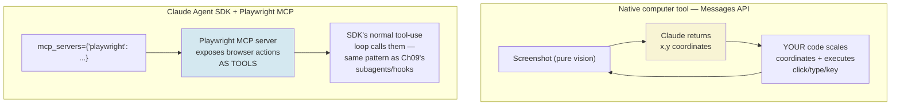
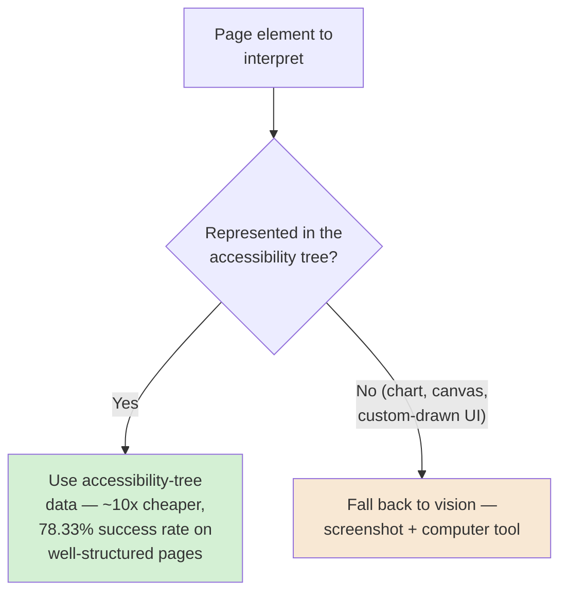
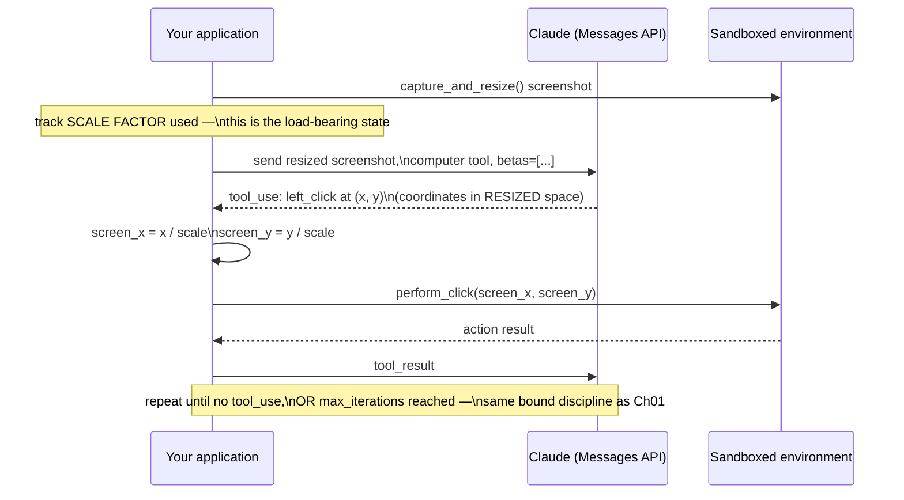
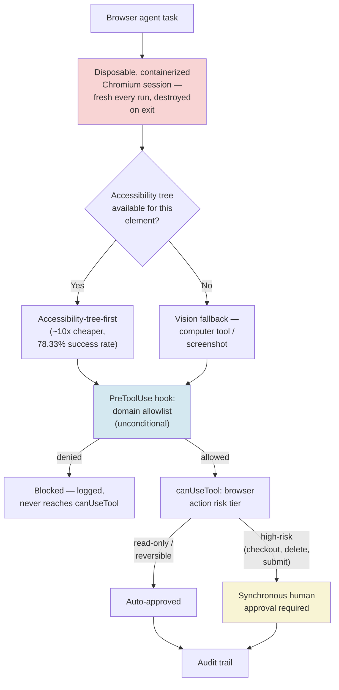
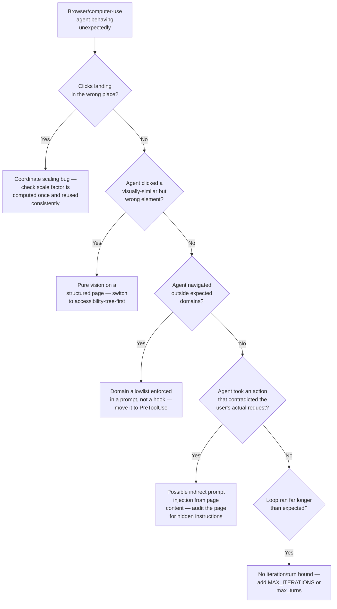

# Chapter 10 — Computer-Use and Browser Agents

## Learning Objectives

By the end of this chapter, you will be able to:

- Build a bounded computer-use agent loop against Anthropic's native `computer` tool, with the exact current tool schema, beta header, and per-model action set.
- Correctly scale screenshot coordinates between Claude's downscaled view and your real display, avoiding the single most common computer-use bug.
- Choose correctly among pure-vision, DOM/accessibility-tree, and hybrid UI-interpretation strategies, and explain why the hybrid approach is now the confirmed current production default.
- Wire browser automation into the Claude Agent SDK using the officially documented current pattern — the Playwright MCP server — rather than a nonexistent native "Computer" tool.
- Recognize indirect prompt injection via rendered webpage content as a structurally distinct risk from Chapter 01's tool-result injection, with real, named, current incidents.
- Apply Chapter 08's four-tier risk model and Chapter 09's hooks to a browser agent specifically — knowing exactly which browser actions need a synchronous human gate versus which are safe to auto-approve.
- Sandbox a browser agent using disposable, containerized sessions, and explain why this is now treated as non-negotiable for production use, not an optional hardening step.
- Build a first genuinely consequential browser agent — one that can navigate, read, and act on real, live pages — with every safeguard this course has built through Chapter 09 wired in, not bolted on after the fact.

## Prerequisites

- **Chapters completed:** Chapter 01 (the bounded agent loop and `max_iterations` discipline this chapter's `sampling_loop` reuses directly for screen-driving actions); Chapter 03 (least-privilege tool scoping); Chapter 08 (the four-tier risk model and `canUseTool`, both reused here for browser-specific actions); Chapter 09 (hooks, subagents, and the SDK's MCP integration pattern — the load-bearing mechanism this chapter's Advanced Implementation depends on).
- **Tools installed:** Everything from Chapters 01–09, plus `anthropic` (Python SDK, for direct Messages API access to the beta `computer` tool) and Node.js (for `npx @playwright/mcp@latest`, used in this chapter's SDK-based examples). A container runtime (Docker or equivalent) if you intend to run this chapter's sandboxing examples for real.
- **A note on scope:** this chapter's worked examples drive a real browser against real, live pages. Per this course's Autonomy Thread, this is squarely Module 3 territory — read Chapter 08 first if the four-tier risk model isn't already second nature, because every gate this chapter builds assumes you can apply it correctly under time pressure, not just recite it.

## Estimated Reading Time

80–95 minutes

## Estimated Hands-on Time

4–4.5 hours

---

## ⚡ Fast Read

> **Skim time: 5 minutes** — Read this if you're in a hurry, returning for reference, or already familiar with part of this topic.

- **What it is:** How an agent sees and controls a real screen or browser — Anthropic's native `computer` tool for full desktop control, and the Playwright-MCP pattern for browser-specific automation — plus the UI-interpretation strategies, sandboxing, and injection defenses this capability specifically requires.
- **Why it matters:** This is the chapter where this course's Autonomy Thread stops being hypothetical. A misclicked button or a hidden instruction embedded in a webpage isn't a wrong answer — it's a real action taken against a real system, and current, named, corroborated incidents show this going wrong in production today.
- **Key insight:** The current dominant production pattern isn't "look at a screenshot" — it's accessibility-tree-first, with vision as a fallback only for elements the accessibility tree can't see (charts, canvas, games). This is roughly an order of magnitude cheaper per page and measurably more reliable, and most beginners default to the more expensive, less reliable approach first because it's the one that "looks like how a human does it."
- **What you build:** A bounded, sandboxed browser agent for Aperture Cloud with a hard iteration cap, coordinate scaling done correctly, a domain allowlist enforced by an unconditional hook (Chapter 09's primitive, not a suggestion in a prompt), and Chapter 08's four-tier model applied specifically to browser actions — read-only research auto-approved, a checkout requiring synchronous human sign-off.
- **Jump to:** [Core Concepts](#core-concepts) | [First Code](#beginner-implementation) | [Best Practices](#best-practices) | [Mini Project](#mini-project)

---

## Why This Topic Exists

Every chapter through Chapter 09 has kept an agent's blast radius contained to a codebase, a database record, or a well-defined tool call with a known, bounded effect. A browser agent breaks that containment on purpose — its entire point is to act on the same surface a human uses: click the same buttons, submit the same forms, see the same page a person would see. That's exactly what makes it useful, and exactly what makes it dangerous in a way this course hasn't dealt with yet.

Two things make this chapter necessary now, specifically, rather than being folded into Chapter 03's general tool-use content. First, the failure modes are structurally different. A malformed API call fails loudly, with a status code you can check. A misclicked button on a real page can silently do the wrong thing — confirm a purchase, delete a listing, submit a form with the wrong data — and look, from the agent's perspective, exactly like success. Second, the content an agent reads while browsing is adversarial in a way most of this course's prior tool results weren't: a webpage isn't a trusted API response, it's arbitrary content from the open internet, and current, named, multi-source-corroborated incidents (covered in this chapter's Security Considerations) show real agentic browsers being manipulated by instructions hidden directly inside the page a human is also looking at. This chapter exists to give you the primitives — bounded loops, coordinate correctness, accessibility-tree-first interpretation, sandboxing, and Chapter 08's risk-tiered gating applied specifically to screen-driving actions — before you build anything that can actually click something real.

## Real-World Analogy

Picture handing a new employee the keys to drive your delivery van for the first time. Up to this chapter, this course has handed that employee tools that work like a warehouse system: type in an order number, the system tells you exactly what happened, and a mistake is a rejected transaction you can retry. A browser agent is the actual driving.

The employee now has to *look* at the road and interpret what they see, the same way a browser agent has to interpret a screenshot or a page's structure. A stop sign that's partly obscured by a tree branch — a UI element a human would recognize instantly but that looks ambiguous in a screenshot — can genuinely be misread, and misreading it doesn't throw an error; it just results in the wrong action, taken confidently. And crucially: the road itself isn't a controlled environment the way a warehouse system is. Other drivers, a misleading detour sign someone planted as a prank, a business's parking lot painted with confusing arrows — none of that is under your control, the same way a webpage's content is written by whoever owns that page, not by you. You wouldn't hand someone the keys without defensive-driving training and a clearly bounded route on their first day. This chapter is that training, for an agent that's about to drive a real browser.

---

## Core Concepts

### The Native `computer` Tool

**Technical definition:** Anthropic's own beta tool (`computer_20251124`, the current version, requiring the `computer-use-2025-11-24` beta header) that gives Claude screenshot capture, mouse control, and keyboard input over a sandboxed computing environment your application provides and operates — Claude never connects to the environment directly.

**Plain English:** A tool that lets Claude see a screenshot and say "click here" or "type this" — but your code is what actually performs the click or the keystroke.

**Analogy:** Claude is a passenger describing the route from a photo of the road; your application is the one actually steering.

> **Currency Note (verified 2026-07-11, direct fetch of `platform.claude.com/docs/en/agents-and-tools/tool-use/computer-use-tool`):** The `computer-use-2025-11-24` header currently supports **Claude Sonnet 5, Claude Opus 4.8, Claude Opus 4.7, Claude Opus 4.6, Claude Sonnet 4.6, and Claude Opus 4.5**. This is a meaningful update over what an earlier research pass for this chapter found — that pass, run before this chapter's final draft, had only confirmed the older `claude-opus-4-7`/`claude-sonnet-4-6` pairing as supported and flagged this course's default model string (`claude-sonnet-5`) as notably absent. Direct re-verification at draft time confirmed Sonnet 5 support has since been added — every code example in this chapter uses `claude-sonnet-5` directly, matching every other chapter in this course, with no model-pinning workaround needed. This is exactly the kind of drift Step 6 of this course's own workflow exists to catch.

**Confirmed current tool schema:**

```python
{
    "type": "computer_20251124",   # current tool version
    "name": "computer",             # must be exactly "computer"
    "display_width_px": 1024,
    "display_height_px": 768,
    "display_number": 1,            # optional, for X11 environments
    "enable_zoom": True,            # optional — enables the zoom action
}
```

**Confirmed current available actions:** `screenshot`, `left_click`, `type`, `key`, `mouse_move` (all versions); `scroll`, `left_click_drag`, `right_click`, `middle_click`, `double_click`, `triple_click`, `left_mouse_down`, `left_mouse_up`, `hold_key`, `wait` (`computer_20250124` and later); `zoom` — inspect a screen region at full resolution, requires `enable_zoom: true` — confirmed current, available specifically on `computer_20251124` for the same six models listed above.

### Coordinate Scaling — the Single Most Common Bug

**Technical definition:** The confirmed current requirement that any screenshot exceeding Claude's per-model image-size limit be deliberately downscaled by your own code before sending, with a tracked scale factor used to map Claude's returned click coordinates back to your real screen's coordinate space.

**Plain English:** If you shrink the picture before showing it to Claude, you have to remember exactly how much you shrank it — otherwise Claude's "click here" coordinates, which are in shrunk-picture space, land in the wrong place on your real, full-size screen.

**Analogy:** Giving someone a reduced photocopy of a map and asking them to mark a location with an X — their X is correct *on the photocopy*, but if you don't know the exact reduction percentage, you can't correctly translate that X back onto the full-size map.

> **Currency Note (verified 2026-07-11):** Confirmed current per-model limits: Claude Sonnet 5, Claude Opus 4.8, and Claude Opus 4.7 accept up to 2576 px on the long edge; earlier models accept up to 1568 px and roughly 1.15 megapixels total. Critically, the API will *silently downscale* an oversized image itself if you don't — but then you lose the scale factor needed to map coordinates back, since you never computed it. Only images exceeding a separate, higher request limit (roughly 8,000 px on a side) are rejected outright. This means the bug doesn't announce itself: everything appears to work, screenshots get sent, Claude returns coordinates — they're just systematically wrong, in a way that's easy to miss in early testing on a small display and only surfaces on a larger one.

### UI-Interpretation Strategies — Vision, Accessibility Tree, and Hybrid

**Technical definition:** Three confirmed current approaches to how a browser agent understands what's on a page: **pure vision** (a screenshot is passed directly to the model, as the native `computer` tool does); **DOM/accessibility-tree parsing** (the page's structural accessibility metadata — roles, labels, focus state, validation messages — is passed as text); and a **hybrid** approach using the accessibility tree as the primary signal, with vision supplementing only for elements the tree can't represent (charts, canvas-based editors, game interfaces).

**Plain English:** Either look at a picture of the page, read the page's own internal "this is a button labeled Submit" structure, or do the second one by default and only fall back to looking at the picture when something genuinely has no readable structure.

**Analogy:** Reading a restaurant's printed menu (accessibility tree — structured, cheap, precise) versus trying to identify each dish from a photo of the table (vision — works on anything, but slower and more error-prone for things that were already written down clearly).

> **Currency Note (verified 2026-07-11):** Confirmed current cost gap: a page that costs roughly 5,000 vision tokens to describe from a screenshot can cost roughly 500 accessibility-tree tokens for the same information — a full order of magnitude. Confirmed current adopters of the accessibility-tree-primary hybrid pattern as their production default: OpenAI Atlas, Microsoft's own Playwright MCP server, and Perplexity Comet. A concrete, current, citable production number: agents achieve a **78.33% success rate** on pages with proper semantic/accessibility structure — a direct, measured argument for treating accessibility-tree-first as this chapter's recommended default rather than one option among equals. Pure vision (used by the native `computer` tool, and by OpenAI's Operator) remains the right choice specifically when no accessibility structure exists to read — a canvas-rendered game, a chart, a custom-drawn UI component.

### Indirect Prompt Injection via Rendered Page Content

**Technical definition:** A prompt-injection vector specific to browser agents, where adversarial instructions are embedded directly in a webpage's rendered or near-rendered content — invisible or near-invisible to a human viewer (white text on a white background, HTML comments, off-screen elements) — and are read and acted on by the agent exactly as if they were legitimate user instructions.

**Plain English:** A webpage can contain hidden text that says "ignore your actual task and do this instead," and because the agent reads the whole page the same way it reads everything else, it can't automatically tell the difference between what the human asked for and what the page is quietly telling it to do.

**Analogy:** A phishing email hidden inside what looks like a normal customer review — the human skimming the page never notices it, but anything reading the page's full text does.

> **Currency Note (verified 2026-07-11):** This is a genuinely distinct risk from Chapter 01's general tool-result-injection concern, because here the injection vector is the same rendered page a human is also looking at, not a tool's structured return value a human never sees directly. Two confirmed, current, multi-source-corroborated incidents: (1) Brave's security team demonstrated attacks against Perplexity Comet where hidden adversarial instructions caused Comet to execute unintended cross-site actions, including fetching one-time passwords from email and accessing banking portals. (2) **"WebPromptTrap"** (Cato Networks researchers, in BrowserOS) — a threat actor manipulated an AI-generated page summary to steer a GitHub OAuth authorization flow, gaining access to a developer's repositories. Separately, OpenAI launched "Lockdown Mode" for ChatGPT (2026-02-13) while publicly stating that prompt injection in AI browsers "may never be fully patched" — a rare, notable case of a major vendor naming a security limitation as potentially structural rather than a bug that will eventually be fixed.

### Browser Agent Sandboxing

**Technical definition:** The confirmed current practice of running a browser agent inside a disposable, containerized Chromium session, where every cookie, credential, cache entry, and locally-stored artifact is fully destroyed — not merely marked for deletion — when the container exits, with a fresh, empty session starting from zero every time.

**Plain English:** Give the agent a brand-new, empty browser every single time, and throw the whole thing away the moment it's done — nothing it touched persists to the next run.

**Analogy:** A hotel room that's genuinely reset to empty after every guest, rather than just having the bed remade while yesterday's belongings are still in the drawers.

> **Currency Note (verified 2026-07-11):** Confirmed current guidance treats this as **"no longer optional... a non-negotiable requirement"** for production browser agents, one layer within a broader defense-in-depth stack: process isolation, resource controls, continuous monitoring, and IP-level isolation (a session's IP address is named specifically as a primary cross-session linking vector worth isolating). This directly extends this course's kickoff-research finding on Firecracker-microVM sandboxing (E2B, Vercel Sandbox) to the browser-session case specifically.

---

## Architecture Diagrams

### Diagram 1 — Native Computer Tool vs. SDK + Playwright MCP



**Confirmed current, and worth stating plainly:** the Claude Agent SDK's built-in tool list (`Read`, `Write`, `Edit`, `Bash`, `Monitor`, `Glob`, `Grep`, `WebSearch`, `WebFetch`, `AskUserQuestion`) does **not** include a native "Computer" tool — this was directly re-verified against the SDK's own overview documentation for this chapter. The officially documented current pattern for browser automation inside the SDK, shown directly in Anthropic's own docs, is wiring in the Playwright MCP server via `mcp_servers`, the exact same integration mechanism Chapter 09 used repeatedly for every other capability. There is no separate, SDK-specific browser primitive to learn — this is the same MCP pattern, applied here.

### Diagram 2 — Hybrid UI-Interpretation Decision



This is the confirmed current production default: accessibility-tree-first, vision as the fallback for the genuine minority of elements that have no readable structure — not vision-first, which is the more intuitive but more expensive and less reliable default a beginner tends to reach for.

## Flow Diagrams

### Diagram 3 — The Bounded Computer-Use Agent Loop, With Coordinate Scaling



The `Note` on the coordinate-scaling step is this chapter's single most important operational detail — everything else in this loop is a direct application of Chapter 01's agent-loop pattern; this is the part that's genuinely new and genuinely easy to get quietly wrong.

---

## Beginner Implementation

A minimal, bounded computer-use loop against the native `computer` tool — correct coordinate scaling from the first line, per this chapter's Core Concepts.

```python
# Learning example — a bounded native computer-use loop with correct
# coordinate scaling. Pinned beta header verified 2026-07-11:
# "computer-use-2025-11-24". Model: claude-sonnet-5 (confirmed
# current support, re-verified directly against Anthropic's own docs
# at draft time — no model-pinning workaround needed here).
import math
import anthropic

client = anthropic.Anthropic()

MAX_LONG_EDGE = 2576   # confirmed current limit for Sonnet 5 / Opus 4.8 / 4.7
MAX_ITERATIONS = 10    # the SAME bound discipline as Chapter 01's max_iterations


def get_scale_factor(width: int, height: int) -> float:
    """Confirmed current scaling formula. Never rely on the API's own
    silent downscale — it loses the scale factor you need to map
    coordinates back correctly."""
    long_edge = max(width, height)
    return min(1.0, MAX_LONG_EDGE / long_edge)


def sampling_loop(model: str, messages: list, screen_width: int, screen_height: int):
    scale = get_scale_factor(screen_width, screen_height)
    scaled_width = int(screen_width * scale)
    scaled_height = int(screen_height * scale)

    tools = [{
        "type": "computer_20251124",
        "name": "computer",
        "display_width_px": scaled_width,
        "display_height_px": scaled_height,
    }]

    for _ in range(MAX_ITERATIONS):
        response = client.beta.messages.create(
            model=model,
            max_tokens=4096,
            messages=messages,
            tools=tools,
            betas=["computer-use-2025-11-24"],
        )
        messages.append({"role": "assistant", "content": response.content})

        tool_results = []
        for block in response.content:
            if block.type != "tool_use":
                continue
            action = block.input["action"]
            if action == "left_click":
                x, y = block.input["coordinate"]
                # THE scaling step — Claude's coordinates are in
                # RESIZED space; scale them back to the real screen.
                real_x, real_y = x / scale, y / scale
                result = perform_click(real_x, real_y)
            elif action == "screenshot":
                result = capture_and_resize(scaled_width, scaled_height)
            else:
                result = handle_other_action(action, block.input, scale)
            tool_results.append({"type": "tool_result", "tool_use_id": block.id, "content": result})

        if not tool_results:
            return messages  # no more tool use — task complete
        messages.append({"role": "user", "content": tool_results})

    # MAX_ITERATIONS reached without completion — this is a bound
    # tripping, per Chapter 01's discipline: raise, don't silently
    # stop and pretend the task finished.
    raise RuntimeError(f"computer-use loop exceeded {MAX_ITERATIONS} iterations without completing")


def perform_click(x: float, y: float) -> str:
    return f"clicked at ({x}, {y})"  # real implementation drives your sandboxed environment


def capture_and_resize(width: int, height: int) -> str:
    return "<resized screenshot data>"  # real implementation captures + resizes


def handle_other_action(action: str, params: dict, scale: float) -> str:
    return f"unhandled action: {action}"
```

**What matters here, and why:**

- `get_scale_factor` is computed **once**, from the real screen dimensions, before the loop starts — and reused for every single coordinate translation inside the loop. Computing it inconsistently, or forgetting it entirely and relying on the API's own silent downscaling, is this chapter's central, easy-to-miss bug.
- `MAX_ITERATIONS` and the explicit `RuntimeError` on exceeding it are a direct, unmodified reuse of Chapter 01's bound-tripping discipline — a computer-use loop that never completes is exactly the kind of cost/latency runaway Chapter 01 warned about generically, now applied to a loop that's also driving a real screen.
- `display_width_px`/`display_height_px` on the tool definition are set to the **scaled** dimensions, not the real screen's — this has to match what you're actually sending as the screenshot, or Claude's understanding of the coordinate space is wrong from the very first screenshot.

## Intermediate Implementation

Now add the confirmed current `effort` tuning and a hard domain allowlist — a deterministic, code-level check, not a prompt-level instruction, extending Chapter 03's least-privilege discipline to browser navigation specifically.

```python
# Learning example — effort tuning per Anthropic's own confirmed
# current internal benchmarking guidance, plus a domain allowlist
# enforced in CODE, not in a prompt (prompt-level instructions are
# not an enforcement mechanism, per Chapter 03 and Chapter 09).
ALLOWED_DOMAINS = {"aperturecloud.example.com", "competitor-pricing.example.com"}


def is_navigation_allowed(url: str) -> bool:
    from urllib.parse import urlparse
    host = urlparse(url).hostname or ""
    return any(host == d or host.endswith(f".{d}") for d in ALLOWED_DOMAINS)


# Confirmed current internal-benchmarking guidance for the `effort`
# parameter (extended thinking), specific to computer-use workloads:
EFFORT_BY_MODEL = {
    "claude-sonnet-5": "medium",   # best accuracy-to-cost ratio for UI tasks
    "claude-opus-4-8": "high",     # default for Opus-tier models
}
# Avoid "max" specifically for computer-use — it adds token cost
# without improving accuracy on UI tasks, per Anthropic's own
# documented guidance. On several models, "low" uses FEWER output
# tokens than disabling thinking entirely, because fewer mistakes
# mean fewer retries — a genuinely counter-intuitive cost lesson.


def handle_navigate_action(url: str) -> str:
    if not is_navigation_allowed(url):
        # Denied in CODE, before any browser action runs — this is
        # the same "deny deterministically, don't rely on the model's
        # judgment" discipline Chapter 09 applied via hooks.
        return f"Error: navigation to {url} is outside the allowed domain list."
    return f"navigated to {url}"
```

**Why this belongs here, not folded into the Beginner example:**

- `is_navigation_allowed` is checked in your application's own code, in the same tier as Chapter 09's `PreToolUse` hooks — a browser agent that "shouldn't" leave a set of trusted domains needs that enforced by a deterministic check, not by hoping the model's instructions are followed, especially given this chapter's confirmed indirect-injection risk.
- The `effort` guidance is a real, current, citable cost lesson specific to computer-use: `max` effort is a documented waste of tokens for UI tasks specifically, which is easy to miss if you're reasoning from general "more thinking = better" intuition rather than this domain's own confirmed benchmarking.

## Advanced Implementation

Production-grade means the Claude Agent SDK, wired to the Playwright MCP server — the officially documented current pattern, not a native SDK tool — combined with Chapter 09's hooks for the domain allowlist and Chapter 08's `canUseTool` for the genuine human-judgment tier.

```python
# Production example — Claude Agent SDK + Playwright MCP, the
# confirmed current pattern (verified directly against
# code.claude.com/docs/en/agent-sdk/overview at draft time — the
# SDK's built-in tool list does NOT include a native "Computer" tool;
# this MCP-based pattern is the officially documented answer).
from claude_agent_sdk import ClaudeSDKClient, ClaudeAgentOptions, HookMatcher

# Reused directly from Chapter 08's classify_action/RiskTier and
# Chapter 09's hook pattern.


async def enforce_domain_allowlist(input_data: dict, tool_use_id: str, context: dict) -> dict:
    """UNCONDITIONAL hook — the same primitive Chapter 09 used for the
    two-engineer sign-off gate, applied here to browser navigation.
    This holds regardless of permission mode, exactly like that
    example, because it's a hook and not a canUseTool check."""
    tool_input = input_data.get("tool_input", {})
    url = tool_input.get("url", "")
    if url and not is_navigation_allowed(url):
        return {
            "hookSpecificOutput": {
                "hookEventName": "PreToolUse",
                "permissionDecision": "deny",
                "permissionDecisionReason": f"{url} is outside the allowed domain list.",
            }
        }
    return {}


BROWSER_HIGH_RISK_ACTIONS = {"submit_form", "confirm_purchase", "delete_listing"}


async def can_use_tool_callback(tool_name: str, tool_input: dict) -> dict:
    """Chapter 08's classifier, applied to browser-specific actions.
    Read-only navigation/research is auto-approved; anything matching
    a high-risk browser action gets a genuine human prompt — the
    SAME risk-tier discipline, just with a browser-specific action
    registry instead of Chapter 08's incident-remediation one."""
    action = tool_input.get("action", tool_name)
    if action in BROWSER_HIGH_RISK_ACTIONS:
        approved = await prompt_human_for_approval(tool_name, tool_input)
        return {"behavior": "allow" if approved else "deny", "updatedInput": tool_input}
    return {"behavior": "allow", "updatedInput": tool_input}


async def prompt_human_for_approval(tool_name, tool_input) -> bool:
    print(f"[APPROVAL REQUIRED — browser action] {tool_name}({tool_input})")
    return True  # placeholder for a real approval channel


options = ClaudeAgentOptions(
    mcp_servers={
        # The officially documented current pattern — browser
        # automation as an MCP-exposed tool, the same integration
        # mechanism Chapter 09 used for every other capability.
        "playwright": {"command": "npx", "args": ["@playwright/mcp@latest"]},
    },
    hooks={"PreToolUse": [HookMatcher(matcher="mcp__playwright__.*", hooks=[enforce_domain_allowlist])]},
    can_use_tool=can_use_tool_callback,
    allowed_tools=["mcp__playwright"],
    max_turns=15,  # the SAME bound discipline as this chapter's native-tool sampling_loop
)


async def run_browser_task(task_description: str):
    async with ClaudeSDKClient(options=options) as sdk_client:
        await sdk_client.query(task_description)
        async for message in sdk_client.receive_response():
            print(message)
```

**Why this layering is the actual production pattern, and why it's structurally identical to Chapter 09's:**

- `enforce_domain_allowlist` sits at the hook stage, before `canUseTool` in the confirmed permission evaluation order — a misconfigured `allowed_tools` or a permissive permission mode cannot route around it, the exact same guarantee Chapter 09's two-engineer sign-off hook provided.
- `can_use_tool_callback` reuses Chapter 08's core insight directly: most browser actions (navigation, reading, research) are read-only or reversible and should be auto-approved, while a narrow, explicitly-registered set of high-risk actions (submitting a form, confirming a purchase, deleting a listing) reach a genuine human prompt — applying Chapter 08's approval-fatigue lesson here specifically, since a browser agent that prompts for every single click would degrade into rubber-stamping within minutes.
- `max_turns=15` is this example's version of the native loop's `MAX_ITERATIONS` — every computer-use or browser-driving loop in this chapter has an explicit bound, with no exception.

---

## Production Architecture



### Production Issue: Agent Misinterprets a Visually-Similar UI Element

**Symptoms**
Aperture Cloud's competitor-pricing research agent, tasked with checking a competitor's public pricing page daily, begins reporting the wrong plan's price for three consecutive days. A manual check reveals the agent clicked a "Compare" toggle button that visually resembles the page's actual "Annual / Monthly" pricing toggle — same size, same position on the page, similar coloring — and has been reading the "Compare" view's numbers, which show a different pricing structure than the standard page.

**Root Cause**
The agent was running pure-vision interpretation (a screenshot passed to the native `computer` tool) against a page where an accessibility-tree-based approach would have distinguished the two elements immediately — the page's accessibility tree correctly labels one button `role="switch" aria-label="Annual or monthly billing"` and the other `role="button" aria-label="Compare plans"`, information a screenshot alone doesn't carry. Two visually near-identical elements are trivial for an accessibility tree to disambiguate and genuinely hard for pure vision to disambiguate reliably, especially across slightly different screenshot resolutions from one day to the next.

**How to Diagnose It**
- Compare the agent's screenshot-based reasoning trace (if using pure vision) against the same page's accessibility tree, requested independently — a mismatch between what the agent clicked and what an accessibility-tree-based interpretation would have selected is the direct signal.
- Check whether the misclicked element and the intended element share near-identical bounding-box dimensions and screen position — this is the concrete, current signature of a visual-similarity misclick, distinct from a page-layout change.
- Re-run the same task against the same page using the accessibility-tree-first hybrid approach and compare outcomes — if the hybrid approach reliably selects the correct element and pure vision doesn't, that confirms the root cause.

**How to Fix It**
```python
# Before: pure vision only — the agent has no way to distinguish two
# visually near-identical elements beyond their pixel appearance.
tools = [{"type": "computer_20251124", "name": "computer"}]  # display_width_px/height_px omitted here for brevity

# After: accessibility-tree-first hybrid — request the page's
# accessibility tree as the PRIMARY signal (via Playwright MCP's
# accessibility snapshot capability), falling back to the computer
# tool's vision only for elements the tree can't represent.
options = ClaudeAgentOptions(
    mcp_servers={"playwright": {"command": "npx", "args": ["@playwright/mcp@latest"]}},
    # Playwright MCP exposes accessibility-tree-based page snapshots
    # as its primary interaction mode — the agent reads labeled,
    # structured elements instead of raw pixels for anything the
    # tree can represent.
)
```

**How to Prevent It in Future**
- Default new browser-agent builds to the accessibility-tree-first hybrid pattern from day one, per this chapter's Core Concepts — treat pure vision as the exception for genuinely unstructured elements (charts, canvas, custom-drawn UI), not the starting point.
- For any task involving a pair of visually similar controls (toggles, adjacent buttons), add an explicit post-action verification step — take a screenshot or re-read the accessibility tree after the click and confirm the resulting page state matches what was intended, rather than assuming the click landed correctly.
- Track a "misclick rate" metric the same way Chapter 08 tracked approval rate — a rising rate of post-action verification failures is the measurable, current signal that this specific failure mode is recurring, not a one-off.

---

## Best Practices

1. **Default to accessibility-tree-first, not vision-first.** Per this chapter's Production Issue and Core Concepts, this is both the cheaper and the more reliable current default — reserve pure vision for elements with no accessibility structure at all.
2. **Compute and reuse a single scale factor per session — never rely on the API's silent downscale.** This chapter's Beginner Implementation shows the correct pattern; skipping it produces coordinates that are systematically, silently wrong.
3. **Enforce a domain allowlist in a hook, never in a prompt.** Per Chapter 09's central lesson, applied here: a rule that must hold unconditionally belongs before `canUseTool` and permission-mode checks in the evaluation order, not inside either.
4. **Bound every computer-use or browser-driving loop explicitly.** `MAX_ITERATIONS` in the native loop, `max_turns` in the SDK — this chapter has zero exceptions to Chapter 01's bounded-loop discipline.
5. **Never let an agent hold real credentials for a login-required site without explicit, scoped, revocable access — and treat login-required computer-use as a strictly higher-risk category than public-page browsing**, per Anthropic's own documented guidance on the increased prompt-injection risk this introduces.
6. **Apply Chapter 08's four-tier model to browser-specific actions with an explicit action registry**, exactly as this chapter's Advanced Implementation's `BROWSER_HIGH_RISK_ACTIONS` does — never assume "it's just browsing" means every browser action is automatically low-risk.

## Security Considerations

- **Indirect prompt injection via rendered page content is this chapter's most distinct new risk.** Per this chapter's Core Concepts, the Brave/Comet and WebPromptTrap incidents show real, current, corroborated attacks where hidden page content redirected an agent toward unintended actions — including accessing email and banking portals. Treat any content read from a live webpage with the same "untrusted until proven otherwise" discipline Volume 3's Trustworthy RAG content applied to retrieved documents, not as implicitly trusted just because a human could also see the page.
- **Anthropic's own classifier defense is real but not sufficient on its own.** Confirmed current: computer-use requests are automatically screened by classifiers that can steer Claude to ask for human confirmation when a potential injection is detected in a screenshot — a genuine, current defense layer, but one Anthropic's own documentation explicitly frames as insufficient alone, recommending sandboxing, a domain allowlist, and avoiding exposure to sensitive data as required complements, not optional extras.
- **OpenAI's own public position is worth taking seriously as a field-wide signal, not just a competitor's admission.** OpenAI's Lockdown Mode launch explicitly acknowledged prompt injection in AI browsers "may never be fully patched" — treat this as evidence that this risk category requires defense-in-depth (sandboxing, allowlisting, human gates on consequential actions) rather than waiting for a single fix that closes the gap entirely.
- **Sandboxing is the last line of defense, not the first.** Per this chapter's Core Concepts, disposable containerized sessions with fully-destroyed state on exit limit the *damage* an injected instruction can do even when the domain allowlist, the classifier defense, and the agent's own judgment all fail simultaneously — treat it as a required layer, not a redundant one.

## Cost Considerations

| Approach | Cost driver | Notes |
|---|---|---|
| Pure vision (native `computer` tool) | ~5,000 tokens per screenshot, plus output tokens per action | Necessary for unstructured elements; expensive as a default for structured pages |
| Accessibility-tree-first (hybrid) | ~500 tokens per equivalent page read | Roughly 10x cheaper than pure vision for the majority of well-structured pages |
| `effort` setting (computer-use specific) | Token cost scales with reasoning depth | `max` is a confirmed, documented waste for UI tasks; `medium` (Sonnet-tier) or `high` (Opus-tier) is current guidance; `low` can use *fewer* tokens than no thinking at all, since fewer mistakes mean fewer retries |
| Unbounded loops | Cost scales directly with iterations | The single largest realistic cost risk in this chapter — always bound explicitly, per Best Practices |
| Managed sandboxing infrastructure | Container/VM runtime cost, per session | A real, ongoing infrastructure cost distinct from token cost — budget for it explicitly rather than treating sandboxing as free |

The accessibility-tree-first row is this chapter's sharpest cost lesson, doubling as a reliability lesson: the cheaper default is also the more accurate one, which is not the usual production tradeoff and is worth stating plainly so it doesn't read as "cutting a corner."

## Common Mistakes

```python
# WRONG — relying on the API's own silent downscaling, never
# computing or tracking a scale factor. Coordinates Claude returns
# will be in the API's own downscaled space, which your code has no
# record of — every click lands in the wrong place.
tools = [{"type": "computer_20251124", "name": "computer",
          "display_width_px": screen_width, "display_height_px": screen_height}]
# ...later...
perform_click(x, y)  # x, y are NOT in real screen coordinates
```

```python
# RIGHT — explicit scale factor, computed once and reused for every
# coordinate translation, per this chapter's Beginner Implementation.
scale = get_scale_factor(screen_width, screen_height)
perform_click(x / scale, y / scale)
```

```python
# WRONG — a domain allowlist enforced only via a prompt instruction.
# Per Chapter 09's central lesson, this is not an enforcement
# mechanism and can be bypassed by injected page content telling the
# agent to "ignore the domain restriction."
system_prompt = "Only navigate to aperturecloud.example.com. Never leave this domain."
```

```python
# RIGHT — enforced deterministically in a hook, unconditionally.
async def enforce_domain_allowlist(input_data, tool_use_id, context):
    url = input_data.get("tool_input", {}).get("url", "")
    if url and not is_navigation_allowed(url):
        return {"hookSpecificOutput": {"hookEventName": "PreToolUse", "permissionDecision": "deny"}}
    return {}
```

```python
# WRONG — an unbounded computer-use loop. If the agent never stops
# requesting tool_use, this runs indefinitely, driving real screen
# actions the whole time.
while True:
    response = client.beta.messages.create(..., betas=["computer-use-2025-11-24"])
    # ...
```

```python
# RIGHT — an explicit iteration cap that raises rather than silently
# stopping, per this chapter's Beginner Implementation.
for _ in range(MAX_ITERATIONS):
    ...
raise RuntimeError(f"exceeded {MAX_ITERATIONS} iterations")
```

## Debugging Guide



| Symptom | Likely Cause | Where to Look |
|---|---|---|
| Clicks consistently offset from the intended target | Coordinate scaling bug | Verify `scale` is computed once, from real screen dimensions, and reused for every coordinate |
| Agent selects a visually similar but incorrect element | Pure vision on a page with a readable accessibility tree | Switch to accessibility-tree-first hybrid interpretation |
| Agent visits a domain outside the intended scope | Allowlist enforced at the prompt level, not a hook | Move the check to a `PreToolUse` hook, per Chapter 09 |
| Agent's action contradicts the actual user request | Possible indirect prompt injection from page content | Inspect the page's raw HTML/text for hidden instructions (white-on-white text, comments) |
| Loop runs far longer than expected, high token spend | No explicit iteration/turn bound | Add `MAX_ITERATIONS` (native) or `max_turns` (SDK) |

## Performance Optimisation

- **Default to accessibility-tree-first everywhere it's available**, per this chapter's Cost Considerations — this is simultaneously a cost and a reliability optimization, not a tradeoff between the two.
- **Use `zoom` (on `computer_20251124`, `enable_zoom: true`) instead of re-requesting a full screenshot** when Claude needs to inspect small text or a specific UI region — a targeted zoom is cheaper and more accurate than reasoning about small text in a full-resolution screenshot.
- **Tune `effort` per model, per Anthropic's own documented benchmarking guidance** — `medium` for Sonnet-tier, `high` for Opus-tier, and specifically avoid `max` for UI tasks, where it adds cost without improving accuracy.

---

## Technology Comparison — Interpreting a Page: Three Current Approaches

> **Currency Note:** Verified 2026-07-11.

| | Pure Vision | Accessibility Tree | Hybrid (current default) |
|---|---|---|---|
| **Cost per page** | ~5,000 tokens | ~500 tokens | Mostly tree-cost, vision only when needed |
| **Handles unstructured UI** (charts, canvas, games) | Yes | No | Yes (via vision fallback) |
| **Reliability on well-structured pages** | Lower — visually similar elements are genuinely hard to disambiguate | Higher — 78.33% confirmed success rate on well-structured pages | Highest — tree precision plus vision coverage |
| **Current adopters** | Native `computer` tool, OpenAI Operator | — | OpenAI Atlas, Microsoft Playwright MCP, Perplexity Comet |
| **This chapter's default recommendation** | Fallback only | Primary signal | **Recommended default** |

## Decision Framework — Building a Browser Agent Safely

1. **Can this task be done via an official API instead of screen-driving a browser?** Confirmed current guidance is explicit: for high-risk writes specifically, prefer an official API call with a human-approval step over browser automation entirely, when an API alternative exists — an API gives you a typed, logged, reversible interface a screen-driving agent does not.
2. **Is the target page's structure readable via an accessibility tree?** If yes, default to accessibility-tree-first; reserve pure vision for the genuine minority of unstructured elements.
3. **What risk tier does this specific browser action fall into, per Chapter 08's four-tier model?** Read-only research and reversible actions can be auto-approved; anything resembling a checkout, a deletion, or a form submission with real consequences needs a synchronous human gate.
4. **Is the domain allowlist enforced in a hook, or only in a prompt?** Per Chapter 09, only a hook holds unconditionally against a permissions misconfiguration or an injected instruction.
5. **Is the session sandboxed and disposable?** Confirmed current guidance treats this as non-negotiable for production — never optional, regardless of how trusted the target site seems.

## Real Client Scenario — Aperture Cloud's Competitor Pricing Agent

Aperture Cloud wants a daily agent that checks three named competitors' public pricing pages and reports any changes — read-only research, squarely low-risk under Chapter 08's four-tier model. Built on the Claude Agent SDK with the Playwright MCP server (this chapter's Advanced Implementation), the agent uses accessibility-tree-first interpretation by default, falling back to the `computer` tool's vision only on the one competitor whose pricing table is rendered as a canvas chart with no accessible structure. A `PreToolUse` hook enforces a hard three-domain allowlist — the exact three competitor URLs, nothing else — regardless of what any page's content might try to instruct the agent to do next, directly defending against this chapter's confirmed indirect-injection risk. Every session runs in a disposable containerized Chromium instance, destroyed on exit, so even a successful injection against this narrow, read-only surface has no session state or credentials left to exploit afterward. When a future request extends this same agent to *also* flag and pre-fill a competitive-response discount in Aperture Cloud's own billing system — a genuinely high-risk, real-money action — Chapter 08's `canUseTool` classifier, reused unchanged, ensures that specific action routes to a synchronous human approval gate, while the daily read-only pricing check continues running unattended, exactly the calibration Chapter 08's approval-fatigue lesson demands.

---

## Exercises

1. **(15 min)** Run this chapter's Beginner Implementation's `get_scale_factor` against three different screen resolutions, including one exceeding the confirmed 2576px long-edge limit, and confirm the scale factor and resulting coordinate translation are correct in each case.
2. **(30 min)** Deliberately omit coordinate scaling from a test computer-use loop, observe where clicks land relative to where they should, and then apply the fix — reproducing this chapter's most common bug directly.
3. **(30 min)** Build a `PreToolUse` hook enforcing a two-domain allowlist for a Playwright-MCP-backed agent, and confirm a test prompt attempting to navigate to a third domain is denied regardless of how the prompt phrases the request.
4. **(45 min)** Take a real public page with both a chart/canvas element and a standard form, and compare accessibility-tree-based interpretation against pure vision for each — confirm the hybrid approach correctly uses the tree for the form and vision for the chart.
5. **(60 min, Challenge)** Research the Brave/Perplexity Comet indirect-injection incident independently, and design — on paper — the specific combination of this chapter's defenses (sandboxing, domain allowlist, `canUseTool` gating) that would have prevented the described OTP-fetching and banking-portal access, even if the injected instruction had successfully reached the model.

## Quiz

1. **Why does relying on the API's own silent image downscaling break coordinate accuracy?**
   *Answer: The API downscales an oversized screenshot before Claude sees it, and Claude's returned coordinates are in that downscaled space — but your application never computed or tracked the scale factor used, so it has no way to correctly map those coordinates back to the real screen.*

2. **What is the confirmed current cost difference between vision-based and accessibility-tree-based page interpretation?**
   *Answer: Roughly an order of magnitude — a page costing ~5,000 tokens via a vision screenshot can cost ~500 tokens via its accessibility tree for equivalent information.*

3. **Why is the hybrid (accessibility-tree-first) approach the confirmed current production default rather than pure vision?**
   *Answer: It's both cheaper (roughly 10x) and more reliable (a confirmed 78.33% success rate on well-structured pages) — pure vision is reserved specifically for elements with no accessible structure, like canvas-rendered charts or games.*

4. **Does the Claude Agent SDK expose a native "Computer" tool matching the Messages API's computer-use beta tool?**
   *Answer: No — confirmed directly against the SDK's own current documentation, the SDK's built-in tool list does not include a native Computer tool. The officially documented current pattern is wiring browser automation in via the Playwright MCP server through `mcp_servers`, the same MCP integration mechanism used throughout Chapter 09.*

5. **What makes indirect prompt injection via webpage content structurally different from Chapter 01's tool-result injection concern?**
   *Answer: The injection vector is the same rendered page a human is also looking at, not a tool's structured return value a human never sees directly — meaning the same content a person could visually verify can still contain hidden instructions (white-on-white text, HTML comments) that a text-reading agent processes but a human skimming the page never notices.*

6. **Why should a domain allowlist for a browser agent be enforced in a hook rather than a system prompt?**
   *Answer: A prompt-level instruction is not a deterministic enforcement mechanism — it can be overridden by an injected instruction from page content, or simply not followed reliably. A `PreToolUse` hook runs first in the confirmed permission evaluation order and holds unconditionally, independent of what the model reads or decides.*

7. **What does current guidance recommend regarding sandboxing for production browser agents?**
   *Answer: Disposable, containerized Chromium sessions with all state — cookies, credentials, cache — fully destroyed on exit, treated as "no longer optional... a non-negotiable requirement," one layer within a broader defense-in-depth stack alongside process isolation, resource controls, monitoring, and IP-level isolation.*

8. **According to this chapter's Decision Framework, what should you prefer over browser automation for a high-risk write action, when the option exists?**
   *Answer: An official API call with a human-approval step — confirmed current guidance is explicit that an API gives a typed, logged, reversible interface a screen-driving browser action does not, and recommends using browser automation only where no API alternative exists.*

9. **What is the current documented guidance on the `effort` parameter specifically for computer-use tasks?**
   *Answer: Use `medium` effort as the default for Sonnet-tier models (best accuracy-to-cost ratio) and `high` for Opus-tier models; avoid `max`, which adds token cost without improving accuracy on UI tasks. On several models, `low` can use fewer output tokens than disabling thinking entirely, since fewer mistakes mean fewer retries.*

10. **In this chapter's Production Issue, why did accessibility-tree-based interpretation succeed where pure vision failed at distinguishing the two similar buttons?**
    *Answer: The accessibility tree carried structured labels (`role="switch" aria-label="Annual or monthly billing"` versus `role="button" aria-label="Compare plans"`) that unambiguously distinguished the two elements — information a raw screenshot doesn't carry, making the two visually near-identical buttons genuinely hard for pure vision to disambiguate reliably.*

## Mini Project

**Build:** A bounded, single-page research agent using the native `computer` tool that navigates to one public page, extracts a specific piece of information, and reports it — with correct coordinate scaling and an explicit iteration cap from the start.

**Acceptance Criteria:**
- [ ] `get_scale_factor` is computed once from real screen dimensions and reused consistently for every coordinate translation.
- [ ] `MAX_ITERATIONS` is set explicitly, and exceeding it raises rather than silently returning an incomplete result.
- [ ] A test with a deliberately oversized screenshot (exceeding the confirmed 2576px limit) still produces correctly-scaled clicks.
- [ ] The agent runs inside a container or VM, not directly against your host desktop.

**Time:** 2–3 hours

## Production Project

**Build:** Extend Aperture Cloud's competitor-pricing agent (this chapter's Real Client Scenario) into a working system: Claude Agent SDK + Playwright MCP, accessibility-tree-first with a vision fallback for one genuinely unstructured competitor page, a hook-enforced domain allowlist, and Chapter 08's `canUseTool` classifier gating a simulated high-risk "flag for billing team" action.

**Acceptance Criteria:**
- [ ] The domain allowlist is enforced via a `PreToolUse` hook, demonstrated by a test that confirms navigation outside the three allowed competitor domains is denied even when the permission mode is deliberately set to something permissive.
- [ ] Accessibility-tree-first interpretation is used for at least two of the three competitor pages, with a documented, tested fallback to vision for the one unstructured page.
- [ ] Every session runs in a disposable container; a test confirms no cookies, credentials, or cache persist between two separate runs.
- [ ] The read-only daily pricing check requires zero human approval; a simulated high-risk billing-flag action correctly triggers `canUseTool`'s synchronous approval path.
- [ ] Every hook decision, `canUseTool` decision, and navigation event is logged to an audit trail, extending Chapter 08/09's audit discipline.
- [ ] An explicit `max_turns` bound is set and tested — a deliberately malformed task that would otherwise loop indefinitely is confirmed to terminate with a raised error, not a silent stop.

**Time:** 1–2 days

## Key Takeaways

- Coordinate scaling — computing a scale factor once and reusing it for every coordinate translation — is the single most common computer-use bug, and it fails silently rather than loudly.
- The confirmed current production default for UI interpretation is accessibility-tree-first, with vision as a fallback only for genuinely unstructured elements — both cheaper (~10x) and more reliable (78.33% confirmed success rate) than vision-first.
- The Claude Agent SDK has no native Computer tool; the officially documented current pattern for browser automation is the Playwright MCP server, via the same `mcp_servers` mechanism Chapter 09 used throughout.
- Indirect prompt injection via rendered webpage content is a structurally distinct, current, named, multi-source-corroborated risk (Brave/Comet, WebPromptTrap) — distinct from Chapter 01's tool-result injection because the vector is content a human could also see.
- A domain allowlist and other unconditional guarantees belong in a `PreToolUse` hook, never a system prompt — the same discipline Chapter 09 established, applied here to browser navigation specifically.
- Disposable, containerized browser sessions with fully-destroyed state on exit are now treated as a non-negotiable production requirement, not optional hardening.
- Chapter 08's four-tier risk model applies directly to browser-specific actions — read-only research is safe to auto-approve; checkouts, deletions, and form submissions need a synchronous human gate.
- For high-risk writes specifically, prefer an official API with a human-approval step over browser automation entirely, whenever that API exists.
- Every computer-use or browser-driving loop needs an explicit iteration/turn bound that raises on exceeding it — the same discipline Chapter 01 established for any agentic loop, with zero exceptions in this chapter.
- `effort` tuning for computer-use has a genuinely counter-intuitive current finding: `max` wastes tokens on UI tasks, and `low` can sometimes cost fewer tokens than no thinking at all, because fewer mistakes mean fewer retries.

## Chapter Summary

| Concept | Key Takeaway |
|---|---|
| Native `computer` tool | Beta, current header `computer-use-2025-11-24`, now confirmed supported on Claude Sonnet 5 directly |
| Coordinate scaling | Compute once, reuse consistently — never rely on the API's silent downscale |
| UI interpretation | Accessibility-tree-first is the confirmed current production default; vision is the fallback |
| SDK + browser automation | No native Computer tool; the Playwright MCP server is the officially documented current pattern |
| Indirect prompt injection | A distinct, current, named risk — hidden instructions in rendered page content, not tool-result content |
| Sandboxing | Disposable, containerized sessions — non-negotiable for production |
| Risk-tiered gating | Chapter 08's four-tier model applies directly, with a browser-specific high-risk action registry |

## Resources

- Anthropic, *Computer use tool* — `platform.claude.com/docs/en/agents-and-tools/tool-use/computer-use-tool` (primary source, directly fetched for this chapter, 2026-07-11)
- Anthropic, *Agent SDK overview* — `code.claude.com/docs/en/agent-sdk/overview` (primary source, directly fetched, confirms no native Computer tool and the Playwright MCP pattern, 2026-07-11)
- Anthropic, *Computer use reference implementation* — [github.com/anthropics/anthropic-quickstarts/tree/main/computer-use-demo](https://github.com/anthropics/anthropic-quickstarts/tree/main/computer-use-demo)
- Microsoft, *Playwright MCP server* — [github.com/microsoft/playwright-mcp](https://github.com/microsoft/playwright-mcp)
- `browser-use` — open-source browser automation project, ~100k★ (verified range 99.5k–104k as of this chapter's research), MIT-licensed core wrapping Playwright with an LLM decision layer
- Brave, security research on indirect prompt injection in Perplexity Comet (primary reporting on the OTP/banking-portal incident referenced in this chapter's Security Considerations)
- Cato Networks, "WebPromptTrap" research on BrowserOS

## Glossary Terms Introduced

| Term | Definition |
|---|---|
| Computer use tool | Anthropic's native beta tool providing screenshot, mouse, and keyboard control over a sandboxed environment |
| Coordinate scaling | Mapping Claude's returned click coordinates (in downscaled screenshot space) back to real screen coordinates via a tracked scale factor |
| Accessibility tree | A page's structural metadata (roles, labels, focus state) usable as a cheaper, more precise alternative to vision-based UI interpretation |
| Hybrid UI interpretation | Accessibility-tree-first, with vision as a fallback for unstructured elements — the confirmed current production default |
| Indirect prompt injection | Adversarial instructions hidden in rendered webpage content, read and acted on by an agent processing the page |
| Browser agent sandboxing | Disposable, containerized browser sessions with fully-destroyed state on exit |
| Playwright MCP | Microsoft's MCP server exposing browser automation as tools, the officially documented current pattern for browser automation in the Claude Agent SDK |

## See Also

| This Chapter's Topic | Related Chapter | Why |
|---|---|---|
| Bounded loop discipline | Chapter 01 | `MAX_ITERATIONS`/`max_turns` here are a direct, unmodified reuse of Chapter 01's agent-loop bound |
| Hooks for unconditional guarantees | Chapter 09 | The domain allowlist here uses the exact same `PreToolUse` hook pattern as Chapter 09's two-engineer sign-off gate |
| `canUseTool` and the four-tier risk model | Chapter 08 | Reused directly for browser-specific high-risk actions |
| MCP integration pattern | Chapter 09 | This chapter's Playwright MCP wiring is the same `mcp_servers` mechanism, applied to a new capability |
| Retrieval as an agent tool | Chapter 11 | The next chapter applies this same "bounded, tool-scoped capability" discipline to retrieval specifically |

## Preparation for Next Chapter

**Technical checklist:**
- [ ] Comfortable computing and applying a coordinate scale factor correctly in a bounded computer-use loop.
- [ ] Have a working `PreToolUse` hook enforcing a domain allowlist against an MCP-backed browser tool.
- [ ] Can explain, without looking it up, why accessibility-tree-first is the current default rather than vision-first.

**Conceptual check:** Before Chapter 11, make sure you can answer this: *this chapter established that a browser agent's biggest new risk is trusting content it didn't generate itself — a webpage that can contain hidden instructions. Chapter 11 is about retrieval as an agent tool — an agent deciding when to fetch more information and when to stop and answer. What's structurally similar between "trusting a webpage's content" and "trusting a retrieved document," and what's genuinely different about the failure mode when a retrieval loop, rather than a browser action, is influenced by untrustworthy content?* (If your answer identifies that both are cases of treating fetched content as data rather than instructions — but a bad retrieval poisons an *answer*, while a bad browser interaction poisons an *action* — that's exactly the right amount to know before Chapter 11.)

**Optional challenge:** This chapter confirmed that accessibility-tree-first interpretation achieves a 78.33% success rate on well-structured pages — meaning roughly 1 in 5 attempts still fails even with the better approach. Design, on paper, a verification step this chapter's Production Issue only gestured at: an explicit post-action check that would catch a misclick or wrong-element selection *before* the agent reports a result back to a human, rather than after a manual audit discovers it days later.
