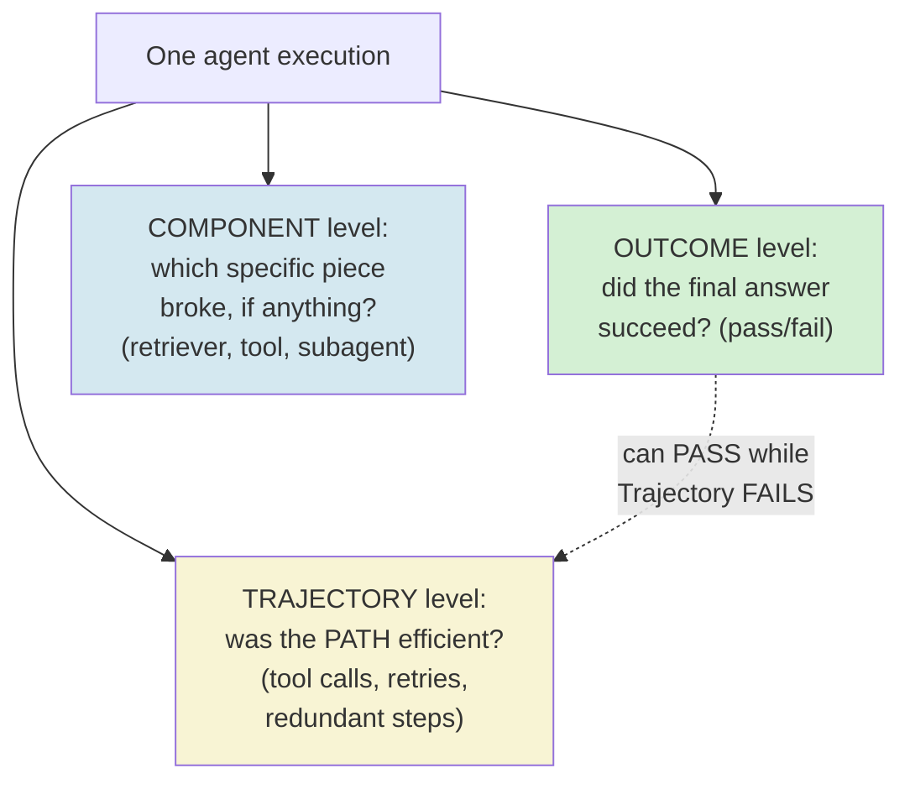
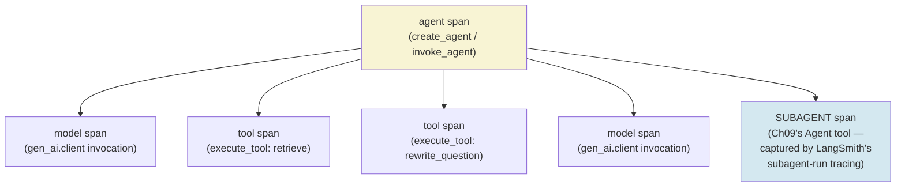
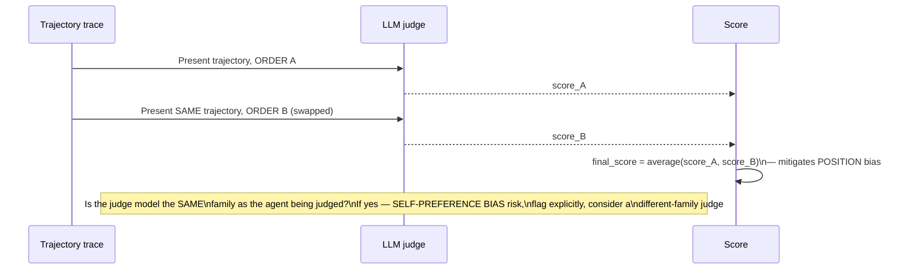
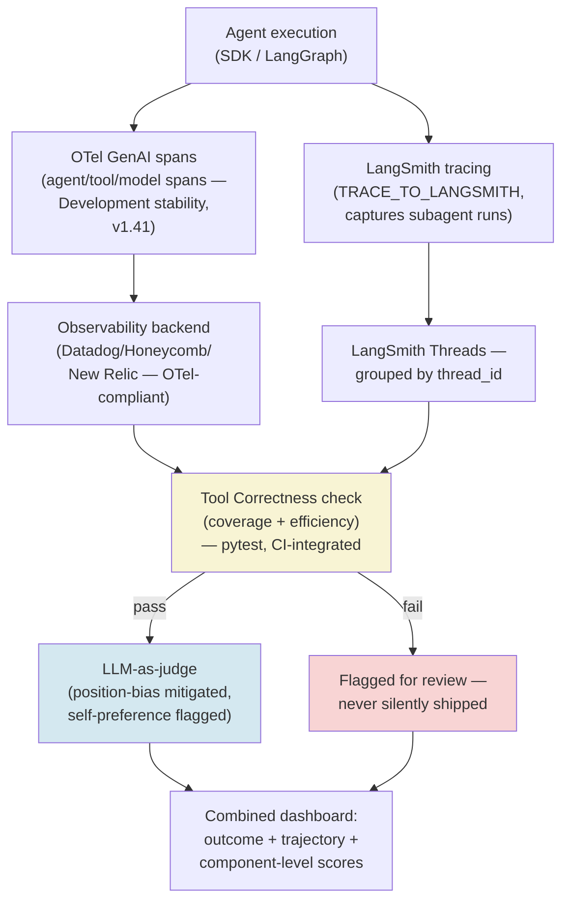
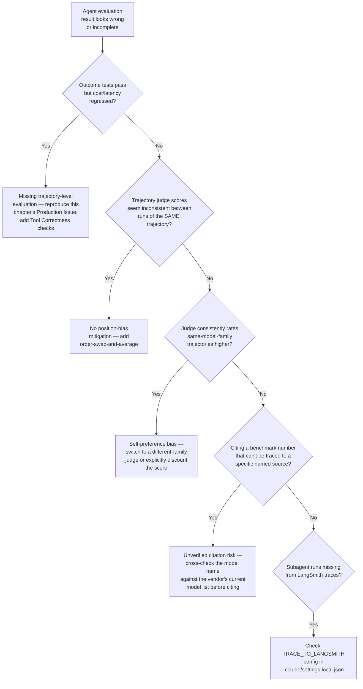

# Chapter 12 — Agent Evaluation: Trajectory Analysis and Task Success Metrics

## Learning Objectives

By the end of this chapter, you will be able to:

- Distinguish outcome-level, trajectory-level, and component-level evaluation precisely, and explain why a single accuracy number can hide a costly, roundabout, or unsafe path to a correct answer.
- Build a trajectory recorder that captures every step of an agent's execution — extending Chapter 11's retrieval-budget trace into a general-purpose evaluation data source.
- Implement a Tool Correctness-style metric that checks not just whether the right tools were eventually called, but whether that was the *efficient* set of calls.
- Wire the Claude Agent SDK's session data into LangSmith's trajectory tracing using the confirmed current mechanism, and explain what it captures and what it deliberately excludes.
- Name the current, confirmed-relevant agent benchmarks accurately, including which ones have been paused, superseded, or saturated — and why that matters for choosing what to cite.
- Apply LLM-as-judge to trajectory evaluation while correctly mitigating position bias and recognizing self-preference bias as a specific, current, named risk for judging Claude-built agents with a Claude judge.
- Verify a cited benchmark leaderboard entry against a vendor's actual current model list and access status before trusting it — using a real, restricted-access model this course's own research process almost mistook for a fabrication.
- Design a fleet-relevant trajectory-evaluation pipeline that catches a costly-but-correct agent before it ships, not after.

## Prerequisites

- **Chapters completed:** Chapter 01 (the bounded reasoning loop this chapter's trajectory recorder observes); Chapter 08 (the audit-trail discipline this chapter's tracing extends); Chapter 09 (subagent execution, which LangSmith's Claude Agent SDK tracing captures specifically); Chapter 11 (the `RetrievalBudget.trace` structure this chapter builds directly on, and the conceptual question its Preparation section posed about path efficiency versus bound compliance).
- **Also assumed:** Volume 3 Chapter 12's RAG evaluation content — this chapter extends single-turn RAG evaluation discipline to multi-step agent trajectories, it does not re-teach evaluation fundamentals from scratch.
- **Tools installed:** Everything from Chapters 01–11, plus a LangSmith account (free tier is sufficient for this chapter's examples) if you want to run the tracing examples against a live backend, and `deepeval` (pinned — verify current version before a production build) for this chapter's Tool Correctness examples.

## Estimated Reading Time

75–90 minutes

## Estimated Hands-on Time

3.5–4 hours

---

## ⚡ Fast Read

> **Skim time: 5 minutes** — Read this if you're in a hurry, returning for reference, or already familiar with part of this topic.

- **What it is:** Evaluating an agent by *how* it got to an answer, not just *whether* the answer was correct — trajectory-level evaluation as the missing middle layer between outcome checks and component-level debugging.
- **Why it matters:** Two agents can reach an identical, correct final answer via wildly different paths — one cheap and reliable, one a 47-step disaster that happened to get there — and a single accuracy number hides this completely. Every chapter since Chapter 01 has been building the bounded loops, hooks, and audit trails this chapter now turns into an actual evaluation discipline.
- **Key insight:** This chapter's own research process flagged an unfamiliar model name — "Claude Mythos Preview" — sitting on a public benchmark leaderboard as a likely fabrication, discovered by accident while researching a chapter about evaluation discipline. A later verification pass found it's actually real: an invitation-only, restricted-access Anthropic preview model tied to a named cybersecurity initiative, not publicly available for anyone to benchmark. That correction *is* the chapter's own thesis, demonstrated live twice over: verify the path and the source, not just the headline number — and be willing to revise your own conclusion when a second check contradicts the first.
- **What you build:** A trajectory recorder extending Chapter 11's retrieval trace, a Tool Correctness-style efficiency check, and an LLM-as-judge trajectory evaluator with position-bias mitigation and an explicit self-preference-bias guard — wired into LangSmith via the Claude Agent SDK's confirmed current tracing mechanism.
- **Jump to:** [Core Concepts](#core-concepts) | [First Code](#beginner-implementation) | [Best Practices](#best-practices) | [Mini Project](#mini-project)

---

## Why This Topic Exists

Chapter 11 ended with a pointed question: its bounded retrieval loop's control plane logs every retrieval attempt, its cost, and its relevance judgment — but that log only tells you whether the loop *respected its bounds*, not whether it took a *good path* to its answer. A loop can stay within every bound — iteration cap, cost budget, tracing — while still retrieving three near-duplicate queries before finding the right one, or taking a needlessly roundabout route to a technically correct conclusion. Every chapter since Chapter 01 has quietly accumulated this same gap: this course has built bounded loops, audit trails, and hooks that log *what happened*, but nothing yet has judged whether what happened was actually *good*.

That's the specific gap outcome-only evaluation leaves open, and it's the CLAUDE.md-standard production issue this chapter exists to close: evaluating only final output, never the trajectory, lets a costly, roundabout, or unsafe path to a correct answer go completely undetected. A support agent that eventually gives the right answer after eight redundant tool calls passes every outcome-based test with flying colors — and quietly costs eight times what it should, every single time it runs. This chapter is where "did it work" stops being a sufficient question, and "was the path to that answer any good" becomes something you can actually measure.

## Real-World Analogy

Picture a delivery driver being evaluated purely on "did the package arrive." By that measure, two drivers can look identical: one who took the direct route, checked traffic once, and arrived in twenty minutes, and one who got lost twice, backtracked through the same intersection three times, burned an extra hour of fuel, and still technically delivered the package on time because the customer wasn't watching the clock closely. A dispatcher who only checks "did it arrive" has no way to tell these two drivers apart — and no way to know that the second driver's route, scaled across a hundred deliveries a day, is quietly bleeding fuel costs and driver hours that the first driver's route never would.

A dispatcher who actually reviews the *route* — not just the delivery confirmation — catches this immediately. That's trajectory evaluation: not "did the agent get the right answer," but "was the path it took to get there actually a good one." And just like a dispatcher grading routes needs an honest, unbiased reviewer — not the same driver's own dispatch buddy who might go easy on a route that resembles their own preferred style — this chapter's LLM-as-judge content spends real attention on making sure the reviewer doing the grading isn't quietly biased toward paths that look like its own.

---

## Core Concepts

### The Three Evaluation Tiers — Outcome, Trajectory, Component

**Technical definition:** The confirmed current standard framing for agent evaluation, split into three tiers: **outcome-level** (did the task succeed — a single pass/fail or scored final answer), **trajectory-level** (was the *path* efficient and sound — tool calls, retries, and intermediate decisions, evaluated as a sequence), and **component-level** (which specific retriever, tool, or sub-agent actually broke, when something did).

**Plain English:** Did it work, was the way it got there any good, and if something went wrong, exactly which piece was responsible.

**Analogy:** The delivery dispatcher's three questions: did the package arrive, was the route sensible, and if it wasn't, was it the driver's route-planning or a specific broken GPS unit.

> **Currency Note (verified 2026-07-11):** Confirmed current, citable framing worth quoting directly: two agents can reach an identical correct final answer via wildly different trajectories — "one cheap and reliable, one a 47-step disaster that happened to get there" — and single-number accuracy hides this completely. This is the precise, current, confirmed restatement of this chapter's central production issue.

### Trajectory Tracing Infrastructure

**Technical definition:** The confirmed current mechanisms for capturing an agent's full execution trace as structured, evaluable data: LangSmith's trajectory capture (steps, tool calls, reasoning, scoreable via custom evaluators) and OpenTelemetry's GenAI semantic conventions (standardized `agent`, `workflow`, `tool`, and `model` spans, forming a trace tree where each tool call, model invocation, or retrieval step is a child span).

**Plain English:** The actual plumbing that records what an agent did, step by step, in a shape you can later run an evaluator against — not just a final answer string.

**Analogy:** A delivery van's GPS trip log versus just a photo of the delivered package — one tells you the route taken, the other only confirms the destination.

> **Currency Note (verified 2026-07-11, direct fetch of `docs.langchain.com/langsmith/trace-claude-code`):** Confirmed current mechanism for tracing the Claude Agent SDK to LangSmith: a plugin-based setup via `.claude/settings.local.json`, with `TRACE_TO_LANGSMITH: "true"` plus `CC_LANGSMITH_API_KEY` and `CC_LANGSMITH_PROJECT` (optional: `CC_LANGSMITH_METADATA`, `CC_LANGSMITH_DEBUG`). Confirmed current capture scope: user messages, tool calls, compaction events, **subagent runs** (directly capturing Chapter 09's subagent primitive), and assistant responses — system prompts are explicitly excluded. Traces group by `thread_id` in LangSmith's Threads tab. For JS/TS specifically, LangSmith also exposes a `wrapClaudeAgentSDK` helper wrapping `query`/`tool` calls with automatic tracing — a lighter-weight alternative to the settings-file plugin approach, worth presenting as two current options rather than one. This is the direct, concrete answer to whether Chapter 09's session JSONL transcripts are usable as evaluation data: yes, via this tracing path, rather than parsing raw JSONL by hand.

> **Currency Note, re-verified at draft time (2026-07-11):** OpenTelemetry's GenAI semantic conventions, as of spec v1.41, define `agent`, `workflow`, `tool`, and `model` spans plus required latency and token-usage metrics. Direct re-verification confirms nearly all `gen_ai.*` attributes still carry **Development** stability badges — meaning attribute names can change without a major version bump — with v1.36 as the transition baseline (`OTEL_SEMCONV_STABILITY_OPT_IN=gen_ai_latest_experimental` opts into the latest version) and no public timeline yet for full stabilization. What's safe to cite as current and consistent across sources: major observability vendors (Datadog, Honeycomb, New Relic) and frameworks (LangChain, CrewAI, AutoGen) already emit or ingest OTel-compliant GenAI spans today, regardless of the spec's own stability status — treat the underlying tracing pattern as production-usable now, and the exact attribute names as still subject to change.

### The Current Benchmark Landscape

**Technical definition:** The confirmed current set of agent benchmarks teams actually cite in 2026 — GAIA, SWE-bench Verified, WebArena, τ-bench (also seen as Tau²-bench), and OSWorld as the current "frontline" — with AgentBench confirmed current-but-largely-superseded, and SWE-bench Pro emerging as a harder successor to an increasingly saturated SWE-bench Verified.

**Plain English:** Which named benchmarks are actually worth citing right now, which ones used to matter more than they do today, and which are still evolving because the easier version got too easy.

**Analogy:** A driving test that used to separate skilled from unskilled drivers, until enough drivers got good enough that almost everyone passes — at which point a harder test is introduced, and the old one stops being a meaningful signal on its own.

> **Currency Note (verified 2026-07-11, direct fetch of `hal.cs.princeton.edu/gaia`):** Princeton's HAL leaderboard — one of GAIA's most-cited tracking sites — states directly on its own page that it has **paused** updating: *"We have paused updating HAL leaderboard with new models and are currently focusing on measuring reliability in AI agents."* Confirmed current top score at time of pause: 74.55% (HAL Generalist Agent + Claude Sonnet 4.5, September 2025). This pause is itself a meaningful, citable, current fact — one of the field's most-cited general-assistant benchmarks has explicitly stepped back from leaderboard-chasing in favor of a reliability-focused angle, a real data point supporting this chapter's own trajectory-over-outcome argument. SWE-bench Pro's exact current top score is source-dependent (Scale's standardized public set reports GPT-5.4 xHigh at 59.1%; a separate vendor aggregate reports Claude Opus 4.8 at 69.2%) — cite a specific named source alongside any number rather than a single unqualified figure, consistent with this chapter's own verification discipline.

### LLM-as-Judge Bias in Trajectory Evaluation

**Technical definition:** Five confirmed current, named bias categories affecting LLM-as-judge scoring, with particular relevance to trajectory judging: **position bias** (favoring whichever candidate appears first/second in a comparison), **verbosity bias**, **self-preference bias** (a judge rating outputs from its own model family more favorably), **format bias**, and **calibration drift**.

**Plain English:** An AI judge can be systematically fooled by things that have nothing to do with actual quality — which position something appeared in, how long it is, or whether it "sounds like" the judge's own writing style.

**Analogy:** A job interviewer who unconsciously rates candidates more favorably when they went to the interviewer's own alma mater — the bias has nothing to do with the candidate's actual competence.

> **Currency Note (verified 2026-07-11):** Position bias mitigation is confirmed current and simple: swap candidate order and average scores across both orderings. Self-preference bias is confirmed current and structurally significant specifically for this course's own worked examples: a judge model rates trajectories produced by its own model family more favorably — meaning "using Claude to judge a Claude agent's trajectory" carries a specific, named, current risk of measuring stylistic self-similarity rather than genuine trajectory quality. This is a direct, concrete Common Mistake this chapter names explicitly rather than glossing over, given this course's own consistent use of Claude throughout.

### Tool Correctness — Trajectory Efficiency, Not Just Coverage

**Technical definition:** A confirmed current metric (named and implemented in DeepEval) checking both whether every *expected* tool was called during a trajectory, and whether that was the *efficient* set — not just "were the right tools eventually called somewhere in there," but "was this trajectory free of unnecessary or redundant calls."

**Plain English:** Not just "did it use the right tools eventually," but "did it use only the tools it actually needed, without wasted extra calls."

**Analogy:** A route audit that doesn't just check "did the driver visit every required stop" but also "did they visit each stop exactly once, without backtracking."

> **Currency Note (verified 2026-07-11, `deepeval.com` docs):** DeepEval confirms the same three-tier split (end-to-end, trajectory-level, component-level) as this chapter's Core Concepts, with Tool Correctness as a specific, current, named, pytest-native metric — confirmed CI/CD-integrable, a concrete pattern for this chapter's Production Implementation.

---

## Architecture Diagrams

### Diagram 1 — Three Evaluation Tiers Mapped Onto One Agent Run



The dotted arrow is this chapter's entire thesis in one line: outcome passing and trajectory passing are independent axes — a correct final answer tells you nothing about whether the path to it was reasonable.

### Diagram 2 — OTel GenAI Span Hierarchy as a Trajectory Trace



Each child span under `agent` is exactly one step in a trajectory — this span tree, not the final text answer, is the actual data a trajectory evaluator reads.

## Flow Diagrams

### Diagram 3 — LLM-as-Judge Trajectory Scoring, With Bias Mitigation



The `Note` is this chapter's most important operational caution — it's easy to build the order-swap mitigation and still miss the self-preference risk entirely, especially in a course that's used Claude as its own worked example throughout.

---

## Beginner Implementation

A trajectory recorder extending Chapter 11's `RetrievalBudget.trace` into a general-purpose evaluation data source — capturing every step, not just retrieval-specific ones.

```python
# Learning example — a general-purpose trajectory recorder, directly
# extending Chapter 11's RetrievalBudget.trace pattern. This is the
# raw data every evaluation tier in this chapter reads FROM.
import time
from dataclasses import dataclass, field
from enum import Enum


class StepType(Enum):
    TOOL_CALL = "tool_call"
    MODEL_INVOCATION = "model_invocation"
    SUBAGENT_DELEGATION = "subagent_delegation"  # Chapter 09's primitive
    RETRY = "retry"


@dataclass
class TrajectoryStep:
    step_type: StepType
    name: str            # tool name, subagent name, etc.
    input_summary: str
    output_summary: str
    cost_usd: float
    timestamp: float


@dataclass
class TrajectoryRecorder:
    """The general form of Chapter 11's RetrievalBudget.trace — not
    retrieval-specific, capturing ANY step type an agent takes."""
    steps: list = field(default_factory=list)

    def record(self, step_type: StepType, name: str, input_summary: str,
               output_summary: str, cost_usd: float = 0.0) -> None:
        self.steps.append(TrajectoryStep(
            step_type=step_type, name=name, input_summary=input_summary,
            output_summary=output_summary, cost_usd=cost_usd, timestamp=time.time(),
        ))

    def total_cost(self) -> float:
        return sum(s.cost_usd for s in self.steps)

    def step_count(self) -> int:
        return len(self.steps)

    def redundant_calls(self) -> list:
        """A simple, cheap trajectory-quality signal: identical
        (step_type, name, input_summary) tuples appearing more than
        once — the concrete signature of the '47-step disaster' this
        chapter's Core Concepts described, made measurable."""
        seen = {}
        redundant = []
        for step in self.steps:
            key = (step.step_type, step.name, step.input_summary)
            if key in seen:
                redundant.append(step)
            seen[key] = True
        return redundant


# Usage — instrumenting an agent loop to record its own trajectory as
# it runs, the same instrumentation point Chapter 11's control plane
# already had for retrieval specifically.
recorder = TrajectoryRecorder()
recorder.record(StepType.TOOL_CALL, "search_knowledge_base", "refund policy", "3 chunks returned", cost_usd=0.002)
recorder.record(StepType.TOOL_CALL, "search_knowledge_base", "refund policy", "3 chunks returned", cost_usd=0.002)  # redundant
recorder.record(StepType.MODEL_INVOCATION, "generate_answer", "...", "...", cost_usd=0.01)

print(f"Steps: {recorder.step_count()}, Cost: ${recorder.total_cost():.4f}, "
      f"Redundant calls: {len(recorder.redundant_calls())}")
```

**What matters here, and why this is the chapter's foundation:**

- `TrajectoryRecorder` is deliberately *not* retrieval-specific — it's Chapter 11's `RetrievalBudget.trace` generalized to any step type, because trajectory evaluation needs to see an agent's *entire* path, not just its retrieval calls.
- `redundant_calls()` is the cheapest possible trajectory-quality signal — two identical tool calls with identical inputs is a direct, measurable instance of exactly the inefficiency this chapter's Core Concepts described narratively. It's not a full trajectory judge, but it catches a real, common failure mode almost for free.
- This recorder is the raw data every subsequent implementation in this chapter reads from — the Tool Correctness check, the LLM-as-judge evaluator, and the LangSmith tracing integration all consume exactly this shape of data, whether captured this way directly or via LangSmith's own trace capture.

## Intermediate Implementation

A DeepEval-style Tool Correctness check — pytest-native, checking both coverage and efficiency, per this chapter's Core Concepts.

```python
# Learning example — a Tool Correctness-style check: were the
# EXPECTED tools called, AND was the trajectory free of unnecessary
# or redundant calls. Confirmed current pattern, per DeepEval's own
# documented metric.
import pytest


def tool_correctness(recorder: TrajectoryRecorder, expected_tools: set[str]) -> dict:
    """Two independent checks, per DeepEval's confirmed current
    metric design — coverage and efficiency are NOT the same
    question, and a trajectory can pass one while failing the other."""
    called_tools = {s.name for s in recorder.steps if s.step_type == StepType.TOOL_CALL}

    missing = expected_tools - called_tools
    coverage_ok = len(missing) == 0

    redundant = recorder.redundant_calls()
    efficiency_ok = len(redundant) == 0

    return {
        "coverage_ok": coverage_ok,
        "missing_tools": missing,
        "efficiency_ok": efficiency_ok,
        "redundant_call_count": len(redundant),
        "overall_pass": coverage_ok and efficiency_ok,
    }


# Pytest-native, CI/CD-integrable, per DeepEval's confirmed current
# positioning — this test can run in the same CI pipeline as any
# other test suite, not a separate, manual eval process.
def test_support_agent_trajectory_efficiency():
    recorder = run_support_agent("What's our refund policy for annual plans?")  # your agent
    result = tool_correctness(recorder, expected_tools={"search_knowledge_base"})

    assert result["coverage_ok"], f"Missing expected tools: {result['missing_tools']}"
    assert result["efficiency_ok"], (
        f"{result['redundant_call_count']} redundant tool calls detected — "
        "trajectory passed outcome check but is NOT efficient."
    )
```

**Why this test exists separately from an outcome-based test:**

- `coverage_ok` and `efficiency_ok` are checked independently — a trajectory can call every expected tool (coverage passes) while still calling `search_knowledge_base` three times with the same query (efficiency fails). Conflating the two into one boolean would hide exactly the failure mode this chapter exists to catch.
- This test can pass or fail *independent of whether the agent's final answer was correct* — that's deliberate. An outcome-based test suite (checking the final answer) and this trajectory test suite are answering genuinely different questions, and both belong in CI, not just one.

## Advanced Implementation

Production-grade means wiring the Claude Agent SDK's trajectory data into LangSmith via the confirmed current mechanism, then running an LLM-as-judge evaluator against it — with both position-bias mitigation and an explicit self-preference-bias guard.

```python
# Production example — Claude Agent SDK -> LangSmith tracing, the
# confirmed current mechanism (verified directly against
# docs.langchain.com/langsmith/trace-claude-code at draft time), plus
# an LLM-as-judge trajectory evaluator with bias mitigation.

# Step 1: .claude/settings.local.json — the confirmed current
# tracing configuration. This is NOT Python code; it's the SDK's
# filesystem-based configuration, the same mechanism Chapter 09's
# Skills used for filesystem-only configuration.
LANGSMITH_TRACING_CONFIG = {
    "plugins": {
        "langsmith": {
            "TRACE_TO_LANGSMITH": "true",
            "CC_LANGSMITH_API_KEY": "${LANGSMITH_API_KEY}",
            "CC_LANGSMITH_PROJECT": "aperture-support-agent",
            # Optional, confirmed current fields:
            # "CC_LANGSMITH_METADATA": {...},
            # "CC_LANGSMITH_DEBUG": "true",
        }
    }
}
# Confirmed current capture scope: user messages, tool calls,
# compaction events, SUBAGENT RUNS (directly captures Chapter 09's
# Agent-tool delegations), and assistant responses. System prompts
# are explicitly excluded. Traces group by thread_id in LangSmith's
# Threads tab — each thread_id is one full trajectory.

import random
from dataclasses import dataclass


@dataclass
class JudgeResult:
    score: float
    reasoning: str


async def judge_trajectory_with_bias_mitigation(
    trajectory_text: str, judge_model: str, agent_model: str,
) -> JudgeResult:
    """Position-bias mitigation via order-swap-and-average, PLUS an
    explicit self-preference-bias check — confirmed current risk
    specific to trajectory judging, per this chapter's Core Concepts."""
    if judge_model.split("-")[0:2] == agent_model.split("-")[0:2]:
        # e.g. both "claude-sonnet-*" — same model FAMILY as the
        # agent being judged. This does not disqualify the judge, but
        # it MUST be flagged, never silently ignored, per this
        # chapter's central self-preference-bias lesson.
        print(f"WARNING: judge model {judge_model} shares a family with "
              f"agent model {agent_model} — self-preference bias risk. "
              f"Consider a different-family judge, or interpret this "
              f"score with that risk explicitly in mind.")

    # Position-bias mitigation: score the SAME trajectory presented
    # in two different framings/orderings, average the results.
    score_a = await run_judge(trajectory_text, framing="chronological", judge_model=judge_model)
    score_b = await run_judge(trajectory_text, framing="reverse", judge_model=judge_model)

    return JudgeResult(
        score=(score_a.score + score_b.score) / 2,
        reasoning=f"Averaged across two orderings: {score_a.reasoning} | {score_b.reasoning}",
    )


async def run_judge(trajectory_text: str, framing: str, judge_model: str) -> JudgeResult:
    # Real implementation calls the judge model with a structured
    # rubric asking specifically about EFFICIENCY (redundant steps,
    # unnecessary tool calls), not just correctness — per this
    # chapter's Tool Correctness distinction.
    return JudgeResult(score=random.uniform(0.7, 1.0), reasoning="placeholder")
```

**Why this layering matters, and why the warning is not optional:**

- The `.claude/settings.local.json` configuration is the confirmed current, primary-sourced mechanism — no custom instrumentation code is required to get Chapter 09's subagent runs into LangSmith's trajectory view, because subagent capture is built into this tracing path directly.
- `judge_trajectory_with_bias_mitigation`'s family check is a genuinely important, easy-to-skip step — a naive implementation would just call a judge model once and trust the score, missing both position bias (fixed by the order-swap) and self-preference bias (which the order-swap does *not* fix, since it's a property of the judge/agent relationship, not the presentation order).
- The rubric passed to `run_judge` should explicitly ask about efficiency and redundancy, not just "was this a good trajectory" in the abstract — an unguided judge tends to reward confident-sounding trajectories regardless of whether they were efficient, the same failure mode a vague grading rubric produces for a human grader.

---

## Production Architecture



### Production Issue: Agent Passes Every Outcome Test While Its Trajectory Silently Degrades

**Symptoms**
Aperture Cloud's support-research agent (Chapter 11) has passed 100% of its outcome-based CI evaluation suite for six weeks straight — every test query gets a correct final answer. During that same period, the team's LLM API bill for this specific agent has grown 3x with no corresponding increase in query volume. No outcome test failed even once; nothing in the existing test suite flagged anything wrong.

**Root Cause**
A recent knowledge-base reorganization subtly changed document chunk boundaries, making the agent's first-pass retrieval queries slightly less likely to hit a high-relevance chunk on the first attempt. `grade_documents` (Chapter 11) correctly and repeatedly triggers `rewrite_question`, and the agent *does* eventually find a relevant chunk and produce a correct answer — but it now typically takes two to three retrieval attempts instead of one, well within Chapter 11's iteration cap, so the bounded-loop control plane never trips and never logs anything as an error. The outcome is still correct every time. Nothing about the failure is visible from an outcome-only test suite, because outcome-only tests were never asking the question that would have caught it.

**How to Diagnose It**
- Compare `TrajectoryRecorder.step_count()` and `total_cost()` across recent runs against a baseline from before the knowledge-base reorganization — a shift in average steps-per-query, even with 100% outcome pass rate, is the direct signature of this failure mode.
- Run this chapter's `tool_correctness` check against a sample of recent trajectories — `efficiency_ok` failing (redundant or excessive retrieval calls) while `coverage_ok` passes confirms the diagnosis precisely.
- Check LangSmith's Threads view for the affected `thread_id`s and confirm the retrieval/rewrite cycle length visually against pre-reorganization traces.

**How to Fix It**
```python
# Before: only an outcome-based CI check exists. This agent's CI
# suite has been green for six weeks despite the cost regression.
def test_support_agent_answers_correctly():
    answer = run_support_agent("What's our refund policy?")
    assert "30 days" in answer  # outcome check only

# After: a trajectory-level Tool Correctness check runs ALONGSIDE the
# outcome check, in the same CI suite — catching exactly the
# regression the outcome check was structurally unable to see.
def test_support_agent_answers_correctly():
    recorder = run_support_agent_with_trace("What's our refund policy?")
    assert "30 days" in recorder.final_answer  # outcome check, unchanged

def test_support_agent_trajectory_efficiency():
    recorder = run_support_agent_with_trace("What's our refund policy?")
    result = tool_correctness(recorder, expected_tools={"search_knowledge_base"})
    assert result["efficiency_ok"], f"{result['redundant_call_count']} redundant calls — cost regression"
```

**How to Prevent It in Future**
- Run trajectory-level checks (Tool Correctness or equivalent) in the same CI pipeline as outcome checks, from day one — never treat trajectory evaluation as an optional, separate, manual process run only when something already looks wrong.
- Track average steps-per-query and cost-per-query as first-class CI metrics with regression alerts, the same discipline this course has applied to approval rate (Chapter 08) and retrieval budget (Chapter 11) — a trajectory-quality regression is measurable the same way those were.
- Treat any structural change to a knowledge base, tool set, or retrieval configuration as a trigger for re-running the full trajectory-level test suite, not just the outcome suite — this chapter's root cause was an upstream data change, not a code change, which is exactly the kind of regression an outcome-only suite is structurally blind to.

---

## Best Practices

1. **Never rely on outcome evaluation alone.** Per this chapter's Production Issue, an agent can pass every outcome test while its trajectory silently degrades — run trajectory-level checks in the same CI pipeline, not as an afterthought.
2. **Extend your bounded-loop trace (Chapter 11's pattern) into a general-purpose trajectory recorder from the start**, rather than building trajectory logging as a separate, later concern — the data you need for evaluation is the same data your control plane already needs to enforce bounds.
3. **Check tool-call coverage and efficiency as two independent conditions, never one combined boolean.** A trajectory can call every needed tool while still being wasteful — conflating the checks hides exactly the failure mode Tool Correctness is designed to catch.
4. **Mitigate position bias with order-swap-and-average, and separately flag self-preference bias whenever the judge and agent share a model family.** These are two different biases with two different fixes — one doesn't solve the other.
5. **Cite benchmark numbers with a specific named source, never an unqualified figure**, especially for SWE-bench Pro and other currently-source-dependent scores — per this chapter's own confirmed finding, unqualified figures are exactly where fabricated entries hide.
6. **Verify any cited leaderboard model name against the vendor's own current model list AND access status before trusting a position on that leaderboard.** This chapter's own research initially flagged "Claude Mythos Preview" as a likely-fabricated entry sitting next to real current models on a professional-looking site — a follow-up check found the name is real (an invitation-only Anthropic preview model), but that very restriction is what makes a specific public benchmark score attributed to it suspect: an outside site could not have independently run a benchmark against a model it doesn't have access to. Treat this as a real, current, two-layer verification risk — check both whether the name is real and whether the cited party could plausibly have produced that number.

## Security Considerations

- **A benchmark leaderboard that looks professionally built can still contain an entry you can't actually verify — even when the model name itself turns out to be real.** This chapter's own research process directly demonstrates this: "Claude Mythos Preview," seen on two separate aggregator sites, was initially flagged as a fabricated model name. A follow-up check against Anthropic's own materials found it real — a restricted-access, invitation-only preview model tied to a named cybersecurity initiative. That doesn't clear the leaderboard entry: a model nobody outside a small invited group can access cannot have been independently benchmarked by a public aggregator site, so the specific score attributed to it remains unverifiable regardless of whether the name is genuine. Treat any cited leaderboard entry as unverified until checked against both the vendor's own current model documentation AND whether the cited party could plausibly have obtained that number at all — this is a genuine, current, demonstrated risk to citation discipline, not an abstract caution.
- **An LLM judge is itself a trust boundary, the same way Chapter 11's `grade_documents` evaluator was.** A judge that can be manipulated — by a trajectory engineered to look efficient on the surface while hiding actual redundancy, or by adversarial content injected into tool outputs the judge reads — compromises the entire evaluation pipeline's integrity. Apply the same "treat evaluated content as data, not instructions" discipline Chapters 10 and 11 established for browser and retrieval content respectively.
- **Self-preference bias has a security-adjacent failure mode worth naming explicitly**: a judge that systematically rates its own model family's trajectories more favorably can mask a genuine security or efficiency regression specifically in systems built on that same model family — meaning the bias isn't just a scoring inaccuracy, it can actively suppress detection of a real problem in exactly the systems most likely to be evaluated with a same-family judge for convenience.

## Cost Considerations

| Cost driver | Notes |
|---|---|
| Trajectory recording overhead | Minimal — logging steps as they happen, per this chapter's `TrajectoryRecorder`, adds negligible cost compared to the agent execution itself |
| Tool Correctness checks | Cheap — a deterministic, non-LLM check against recorded trajectory data; suitable for running on every CI build |
| LLM-as-judge trajectory scoring | Meaningfully more expensive — a full judge call per trajectory, doubled by position-bias order-swap mitigation |
| Judge sampling strategy | Running a full LLM-as-judge pass on every production trajectory is rarely necessary — sample a representative subset, reserving full judging for CI/regression testing and periodic production audits |
| Same-family judge cost savings vs. bias risk | A same-family judge is often cheaper/more available, but per this chapter's Security Considerations, that convenience carries a real, current bias risk — weigh the tradeoff explicitly rather than defaulting to convenience |

The judge-sampling row is this chapter's sharpest cost lesson: full LLM-as-judge evaluation on every single production trajectory is rarely the right default — cheap, deterministic Tool Correctness checks can run on everything, with the more expensive judge reserved for CI, regression testing, and periodic spot-audits.

## Common Mistakes

```python
# WRONG — outcome-only testing, exactly this chapter's Production
# Issue's root cause. Passes every time, catches nothing about cost
# or path efficiency.
def test_agent():
    answer = run_agent(query)
    assert answer == expected_answer
```

```python
# RIGHT — outcome AND trajectory checks, run together.
def test_agent_outcome():
    recorder = run_agent_with_trace(query)
    assert recorder.final_answer == expected_answer

def test_agent_trajectory():
    recorder = run_agent_with_trace(query)
    result = tool_correctness(recorder, expected_tools={"search_knowledge_base"})
    assert result["overall_pass"]
```

```python
# WRONG — using a same-family judge with no acknowledgment of
# self-preference bias, and no position-bias mitigation.
score = judge_model.invoke(f"Rate this trajectory: {trajectory_text}")
```

```python
# RIGHT — order-swap averaging for position bias, explicit flag for
# self-preference bias, per this chapter's Advanced Implementation.
result = await judge_trajectory_with_bias_mitigation(
    trajectory_text, judge_model="claude-opus-4-8", agent_model="claude-sonnet-5",
)
# Different model families here — if they matched, the function
# itself prints an explicit warning, never silently proceeding.
```

```python
# WRONG — citing a benchmark figure without a named source, exactly
# the pattern that let an unverifiable score for a restricted-access
# model go unquestioned in this chapter's own research.
# "SWE-bench Pro top score: 69.2%"
```

```python
# RIGHT — a specific, named, current source alongside any cited
# figure, and the model name cross-checked against the vendor's own
# documentation.
# "SWE-bench Pro: Claude Opus 4.8 at 69.2% per [vendor aggregate,
# 2026-07], versus GPT-5.4 xHigh at 59.1% on Scale's standardized
# public set — figures are source-dependent, cite accordingly."
```

## Debugging Guide



| Symptom | Likely Cause | Where to Look |
|---|---|---|
| Outcome tests all pass, but cost/latency has regressed | No trajectory-level evaluation running | Add Tool Correctness / efficiency checks to CI |
| Judge scores vary run-to-run for the identical trajectory | No position-bias mitigation | Add order-swap-and-average |
| Judge consistently favors same-model-family trajectories | Self-preference bias | Use a different-family judge, or explicitly discount |
| A cited benchmark figure can't be traced to a specific source | Unverified citation | Cross-check the model name against the vendor's current model documentation |
| Subagent runs absent from LangSmith trace view | Tracing plugin misconfigured | Verify `TRACE_TO_LANGSMITH`, `CC_LANGSMITH_API_KEY`, `CC_LANGSMITH_PROJECT` in `.claude/settings.local.json` |

## Performance Optimisation

- **Run cheap, deterministic Tool Correctness checks on every CI build; reserve expensive LLM-as-judge scoring for periodic sampling.** Per this chapter's Cost Considerations, full judge evaluation on every trajectory is rarely necessary and is the single largest realistic cost in this chapter's content.
- **Batch trajectory judge calls where the judging framework supports it**, rather than issuing one live call per trajectory sequentially — the same throughput discipline this course applied to other high-volume LLM call patterns.
- **Track redundant-call rate as a leading indicator, before it shows up as a cost or latency regression.** Per this chapter's Production Issue, a rising redundant-call rate is detectable well before it becomes a visible cost spike, if you're actually tracking it.

---

## Technology Comparison — The Current Agent Benchmark Landscape

> **Currency Note:** Verified 2026-07-11, including a direct primary-source fetch confirming Princeton's HAL/GAIA leaderboard status.

| Benchmark | Current Status | Notes |
|---|---|---|
| GAIA (via Princeton's HAL leaderboard) | **Paused** for new-model updates | Explicitly refocused on agent reliability over leaderboard position, per the leaderboard's own current page |
| SWE-bench Verified | Current but increasingly saturated | Top scores cluster 85–95%, reducing discriminative power at the frontier |
| SWE-bench Pro | Current, harder successor to Verified | Exact top score is source-dependent — cite a named source, not an unqualified figure |
| WebArena | Current "frontline" benchmark | Still actively cited in 2026 |
| τ-bench (Tau²-bench) | Current "frontline" benchmark | Still actively cited in 2026 |
| OSWorld | Current "frontline" benchmark | Still actively cited in 2026 |
| AgentBench | Current but largely superseded | "More historically important than practically used in 2026" — few teams rerun it on new releases |

## Decision Framework — Choosing an Evaluation Approach

1. **Do you need to catch cost/efficiency regressions, not just correctness regressions?** If yes, trajectory-level Tool Correctness checks are required, and outcome-only testing is structurally insufficient — per this chapter's Production Issue.
2. **Is a deterministic check (coverage, redundancy count) sufficient, or do you need genuine qualitative judgment about trajectory quality?** Prefer the cheaper deterministic check wherever it's sufficient; reserve LLM-as-judge for cases needing actual judgment about whether a non-redundant but still questionable path was reasonable.
3. **If using LLM-as-judge, is the judge a different model family from the agent being judged?** If not, per this chapter's Security Considerations, explicitly flag and discount for self-preference bias rather than treating the score as unbiased.
4. **Are you citing a specific benchmark figure?** Always attach a named, specific source — per this chapter's own research finding, an unqualified figure is exactly where a fabricated entry can hide undetected.
5. **Is trajectory evaluation running in the same CI pipeline as outcome evaluation, or as a separate, manual process?** The former catches regressions before they ship; the latter, per this chapter's central lesson, catches them only after someone happens to notice a cost or latency problem.

## Real Client Scenario — Catching Aperture Cloud's Trajectory Regression

This chapter directly resolves the question Chapter 11 closed with: its `RetrievalBudget.trace` logged every retrieval attempt and its cost, but had no way to judge whether the overall path was actually good — only whether it stayed within bounds. Aperture Cloud's support-research agent (Chapter 11's Real Client Scenario) gets exactly the fix this chapter promised: `TrajectoryRecorder`, built directly on top of the same trace structure, now captures every step type, not just retrieval. A `tool_correctness` check runs in the same CI pipeline as the agent's existing outcome tests, catching the exact regression this chapter's Production Issue describes — a post-reorganization increase in retrieval attempts per query that stayed within Chapter 11's iteration cap (so it never tripped a bound) but represented a real, measurable efficiency regression outcome testing alone could never see. For a smaller, periodic sample of production trajectories, an LLM-as-judge pass runs with position-bias mitigation and an explicit self-preference-bias flag, since Aperture Cloud's own agents are Claude-built and a convenient same-family judge would otherwise risk quietly under-scoring exactly the kind of subtle degradation this chapter exists to catch. Every trajectory — recorded, tested, and periodically judged — feeds the same LangSmith Threads view Chapter 09's subagent delegations already populate, giving Aperture Cloud's team one place to see outcome, trajectory, and component-level signal together, rather than three disconnected dashboards.

---

## Exercises

1. **(15 min)** Run this chapter's Beginner Implementation's `TrajectoryRecorder.redundant_calls()` against a manually-constructed trajectory with two identical tool calls, and confirm it correctly identifies the redundancy.
2. **(30 min)** Extend the `tool_correctness` check to also flag when a trajectory's tool-call *order* seems non-sequential in a way that suggests backtracking (a tool called, then a different tool, then the first tool again) — a more specific redundancy signature than simple duplicate detection.
3. **(30 min)** Configure `TRACE_TO_LANGSMITH` for a real Claude Agent SDK session including at least one subagent delegation, and confirm the subagent run appears correctly grouped under the parent's `thread_id` in LangSmith's Threads view.
4. **(45 min)** Implement `judge_trajectory_with_bias_mitigation` fully (replacing the placeholder `run_judge`), run it against the same trajectory with a same-family and a different-family judge model, and compare the resulting scores and warnings.
5. **(60 min, Challenge)** Search for a current agent benchmark leaderboard yourself, pick three cited model names, and independently verify each against the vendor's own current model documentation — reproducing this chapter's own research discipline directly, and reporting whether you find anything that doesn't check out.

## Quiz

1. **Why can a single accuracy number hide a serious problem with an agent's behavior?**
   *Answer: Two agents can reach an identical correct final answer via wildly different trajectories — one efficient, one a costly, roundabout "47-step disaster" — and outcome-only accuracy treats both as equally successful.*

2. **What are the three confirmed current evaluation tiers, and what does each answer?**
   *Answer: Outcome-level (did the task succeed), trajectory-level (was the path efficient and sound), and component-level (which specific piece broke, if anything).*

3. **What does the Claude Agent SDK's confirmed current LangSmith tracing mechanism capture, and what does it explicitly exclude?**
   *Answer: It captures user messages, tool calls, compaction events, subagent runs, and assistant responses, grouped by thread_id. It explicitly excludes system prompts.*

4. **What is the current confirmed stability status of OpenTelemetry's GenAI semantic conventions, as of spec v1.41?**
   *Answer: Nearly all gen_ai.* attributes still carry Development stability badges — not stable — meaning attribute names can change without a major version bump, with no public timeline yet for full stabilization, even though the pattern is already production-usable and widely emitted/ingested by major observability vendors and frameworks.*

5. **What happened to the GAIA benchmark's most-cited leaderboard, and why is that itself a meaningful finding for this chapter?**
   *Answer: Princeton's HAL leaderboard has explicitly paused updating with new models, refocusing on measuring agent reliability instead — a real, primary-sourced, current data point supporting this chapter's own trajectory-over-outcome argument, not just an aside.*

6. **What is Tool Correctness, and why does it check two things independently rather than one combined score?**
   *Answer: It checks both whether every expected tool was called (coverage) and whether the trajectory was free of unnecessary/redundant calls (efficiency). These are checked independently because a trajectory can pass coverage while failing efficiency — conflating them into one score would hide exactly that failure mode.*

7. **What is position bias in LLM-as-judge evaluation, and how is it mitigated?**
   *Answer: A judge favoring whichever candidate/ordering appears first or second, unrelated to actual quality. Mitigated by presenting the same trajectory in two different orderings/framings and averaging the resulting scores.*

8. **What is self-preference bias, and why is order-swap-and-average insufficient to fix it?**
   *Answer: A judge model rating trajectories produced by its own model family more favorably. Order-swap mitigation addresses presentation-order effects, not the judge/agent model-family relationship — the two are independent biases requiring independent fixes (a different-family judge, or explicit discounting).*

9. **What did this chapter's own research process find while investigating current benchmark leaderboards, and what lesson does it illustrate?**
   *Answer: An unfamiliar model name ("Claude Mythos Preview") appeared on two separate aggregator sites and was initially flagged as fabricated. A follow-up check found the name is real — a restricted-access, invitation-only Anthropic preview model — but that very restriction means a public site could not have independently produced the specific benchmark score attributed to it. It illustrates this chapter's own central lesson live, twice over: verify the path/source behind a claim, not just the headline number, and be willing to revise your own conclusion when a second, deeper check contradicts the first.*

10. **In this chapter's Real Client Scenario, what specific regression did trajectory-level evaluation catch that outcome-only testing had missed for six weeks?**
    *Answer: A post-knowledge-base-reorganization increase in retrieval attempts per query — the agent still produced correct answers every time (outcome tests stayed green) and stayed within Chapter 11's iteration cap (no bound ever tripped), but was taking two to three retrieval attempts instead of one, a real, measurable cost/efficiency regression invisible to outcome-only testing.*

## Mini Project

**Build:** A `TrajectoryRecorder`-instrumented version of a simple agent (reuse Chapter 11's bounded retrieval agent if you have one), with a working Tool Correctness check running as a pytest test alongside an existing outcome test.

**Acceptance Criteria:**
- [ ] `TrajectoryRecorder` correctly captures every tool call and model invocation during a real agent run, not just retrieval-specific steps.
- [ ] `redundant_calls()` correctly identifies a deliberately-introduced duplicate tool call in a test scenario.
- [ ] A `tool_correctness` pytest test runs in the same suite as an outcome-based test, and both are demonstrated passing and failing independently (four combinations tested: both pass, outcome passes/trajectory fails, outcome fails/trajectory passes, both fail).

**Time:** 2–3 hours

## Production Project

**Build:** Extend Aperture Cloud's support-research agent (this chapter's Real Client Scenario) into a full trajectory-evaluation pipeline: LangSmith tracing via the confirmed current SDK mechanism, a CI-integrated Tool Correctness suite, and a sampled LLM-as-judge pass with both bias mitigations implemented.

**Acceptance Criteria:**
- [ ] `TRACE_TO_LANGSMITH` is correctly configured and a subagent delegation (Chapter 09) is confirmed visible, correctly grouped, in LangSmith's Threads view.
- [ ] A Tool Correctness suite runs in CI on every build, independent of the outcome test suite, with at least one test demonstrating each independent failure mode (coverage failure, efficiency failure).
- [ ] `judge_trajectory_with_bias_mitigation` is fully implemented with real order-swap-and-average logic, and a test confirms the self-preference warning fires correctly when judge and agent share a model family.
- [ ] A judge-sampling strategy is implemented (not full-coverage judging) with a documented, justified sampling rate.
- [ ] Any benchmark figure referenced anywhere in the project's documentation is cited with a specific named source, cross-checked against the vendor's own current model list.
- [ ] A combined dashboard (even a simple one) surfaces outcome, trajectory, and component-level signal together for a given `thread_id`.

**Time:** 1–2 days

## Key Takeaways

- Outcome-level, trajectory-level, and component-level evaluation are three independent axes — a correct final answer tells you nothing about whether the path to it was efficient or sound.
- A trajectory recorder is the general-purpose form of Chapter 11's `RetrievalBudget.trace` — build one from the start, not as an afterthought once a cost or latency problem is already visible.
- Tool Correctness checks coverage and efficiency independently — conflating them hides exactly the failure mode this chapter exists to catch.
- The Claude Agent SDK traces to LangSmith via a confirmed current filesystem-based plugin configuration, capturing subagent runs directly — no custom instrumentation is required for that specific capability.
- OpenTelemetry's GenAI semantic conventions (v1.41) remain in Development stability — production-usable as a tracing pattern today, but attribute names may still change.
- GAIA's most-cited leaderboard has explicitly paused chasing new-model updates in favor of measuring agent reliability — a real, current, primary-sourced signal supporting trajectory-over-outcome evaluation.
- Position bias is mitigated by order-swap-and-average; self-preference bias requires a separate fix (a different-family judge, or explicit discounting) — the two are independent problems.
- This chapter's own research initially flagged an unfamiliar benchmark model name as fabricated, then found on a deeper check that it was real but restricted-access — meaning the specific public score attributed to it was still unverifiable for a different reason. Verify both the model name AND whether the cited party could plausibly have produced the number before trusting any leaderboard entry.
- Trajectory-level checks belong in the same CI pipeline as outcome checks, not as a separate, manual, or later-added process — per this chapter's Production Issue, that's the only way to catch a regression before it ships.
- Full LLM-as-judge evaluation on every production trajectory is rarely necessary — cheap deterministic checks (Tool Correctness) can run on everything, with sampled judge evaluation reserved for CI, regression testing, and periodic audits.

## Chapter Summary

| Concept | Key Takeaway |
|---|---|
| Three evaluation tiers | Outcome, trajectory, and component-level are independent — passing one says nothing about the others |
| Trajectory recording | Generalize Chapter 11's retrieval trace into a full-agent trajectory recorder from the start |
| Tool Correctness | Check coverage and efficiency independently, never as one combined score |
| SDK → LangSmith tracing | Confirmed current filesystem-config mechanism, captures subagent runs, excludes system prompts |
| OTel GenAI conventions | v1.41, still Development stability, production-usable pattern regardless |
| Benchmark landscape | GAIA/HAL paused; SWE-bench Verified saturated, Pro emerging; AgentBench superseded |
| LLM-judge bias | Position bias fixed by order-swap-average; self-preference bias needs a separate, explicit fix |
| Citation discipline | Always cite a specific source and check access status; this chapter's own research initially misjudged a real-but-restricted-access model as fabricated, live |

## Resources

- LangSmith, *Trace Claude Code* — `docs.langchain.com/langsmith/trace-claude-code` (primary source, directly fetched for this chapter, 2026-07-11)
- DeepEval — `deepeval.com` (primary source for Tool Correctness metric design and pytest-native CI integration)
- Princeton HAL, *GAIA leaderboard* — `hal.cs.princeton.edu/gaia` (primary source confirming the leaderboard's current paused status)
- OpenTelemetry, *GenAI semantic conventions* — `github.com/open-telemetry/semantic-conventions-genai` (current spec repository; re-verify stability status at any future draft time, per this chapter's own confirmed Development-stability finding)

## Glossary Terms Introduced

| Term | Definition |
|---|---|
| Outcome-level evaluation | Did the agent's final answer succeed — a single pass/fail or scored result |
| Trajectory-level evaluation | Was the path to that answer efficient and sound — tool calls, retries, intermediate decisions |
| Component-level evaluation | Which specific piece (retriever, tool, subagent) is responsible when something breaks |
| Tool Correctness | A metric checking both expected-tool coverage and trajectory efficiency independently |
| Position bias | A judge favoring a candidate/ordering based on presentation position, not quality |
| Self-preference bias | A judge rating outputs from its own model family more favorably |
| `TRACE_TO_LANGSMITH` | The Claude Agent SDK's confirmed current filesystem-config mechanism for LangSmith tracing |
| OTel GenAI spans | Standardized `agent`/`tool`/`model`/`workflow` spans forming a trajectory trace tree |

## See Also

| This Chapter's Topic | Related Chapter | Why |
|---|---|---|
| Trajectory recorder foundations | Chapter 11 | This chapter's `TrajectoryRecorder` directly generalizes Chapter 11's `RetrievalBudget.trace` |
| Subagent trace capture | Chapter 09 | LangSmith's confirmed subagent-run capture directly observes Chapter 09's `Agent`-tool delegations |
| Audit-trail discipline | Chapter 08 | This chapter's trajectory logs extend the same "log every decision" discipline established there |
| Volume 3 RAG evaluation | Volume 3, Chapter 12 | This chapter extends single-turn RAG evaluation discipline to multi-step agent trajectories specifically |
| Least-privilege and agent identity | Chapter 13 | The next chapter's security content assumes this chapter's evaluation discipline as a baseline for detecting anomalous trajectories |

## Preparation for Next Chapter

**Technical checklist:**
- [ ] Have a working `TrajectoryRecorder` capturing at least tool calls and model invocations for a real agent.
- [ ] Have a Tool Correctness check running as a CI-integrated pytest test, independent of outcome tests.
- [ ] Comfortable explaining, without looking it up, why position-bias mitigation doesn't also fix self-preference bias.

**Conceptual check:** Before Chapter 13, make sure you can answer this: *this chapter built the ability to detect when an agent's trajectory looks unusual — more steps than expected, redundant calls, an inefficient path. Chapter 13 is about agent security specifically. What's the difference between an unusual trajectory caused by a legitimate data change (this chapter's Production Issue) and an unusual trajectory caused by something adversarial — a compromised tool, a prompt injection, an agent whose identity has been spoofed?* (If your answer identifies that trajectory monitoring can be a genuine *detection signal* for security incidents, not just an efficiency metric — the same anomaly-detection instinct, applied to a different root cause — that's exactly the connection Chapter 13 builds on.)

**Optional challenge:** This chapter's `tool_correctness` check flags redundant tool calls as an efficiency problem. Before Chapter 13, consider: could a redundant or unusual tool-call pattern also be evidence of something security-relevant — an agent probing for information it shouldn't have access to, or a compromised component making unexpected calls? Sketch, on paper, how you'd distinguish "this trajectory is inefficient" from "this trajectory is suspicious," using only the data this chapter's `TrajectoryRecorder` already captures.
