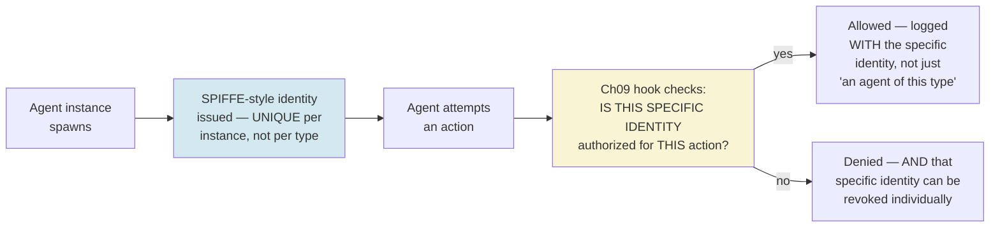
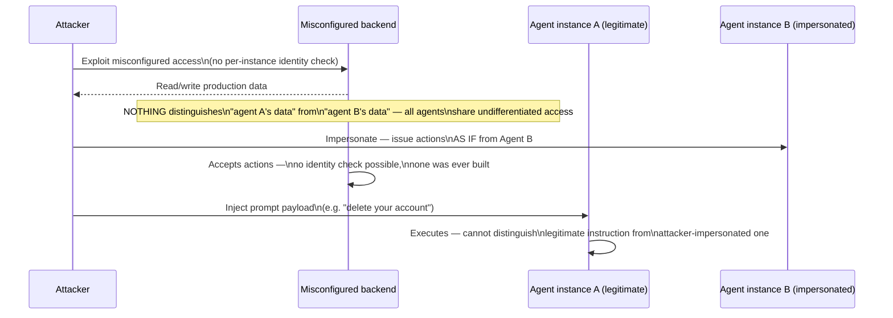
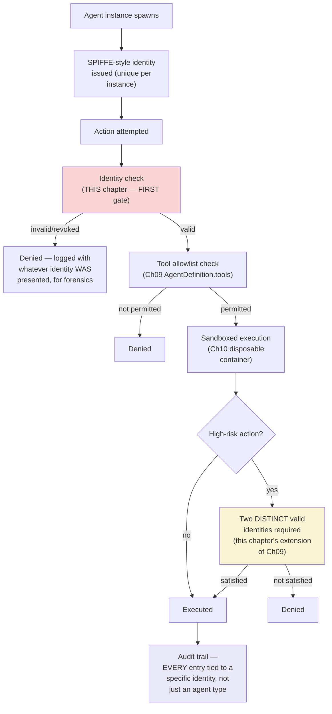
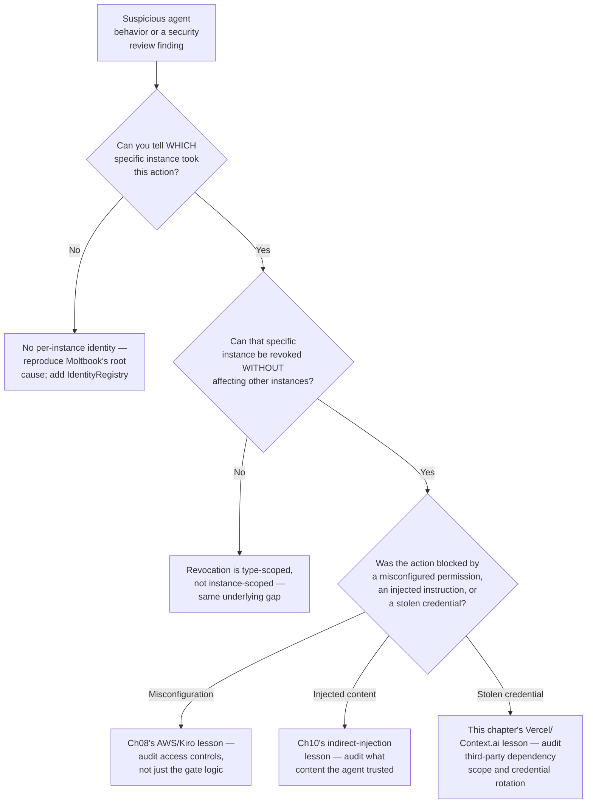

# Chapter 13 — Agent Security: Bounding Autonomy and Defending Against Excessive Agency

## Learning Objectives

By the end of this chapter, you will be able to:

- Map the OWASP Top 10 for Agentic Applications 2026's ten risk categories onto specific primitives this course has already built, and identify exactly which chapters already satisfy which controls.
- Distinguish agent *identity* (proving which agent this is) from agent *authorization* (what that identity is allowed to do) as two genuinely separate problems, using SPIFFE as the current standard for the first and Chapter 09's hooks/tool-allowlists as the mechanism for the second.
- Explain, using a real, current, named 1.5-million-agent breach, exactly what happens when agent identity is missing entirely — not hypothetically, but as a documented incident.
- Distinguish a supply-chain credential compromise (a real, current, named incident) from a permission misconfiguration (Chapter 08's AWS/Kiro incident) and from indirect prompt injection (Chapter 10's Comet incident) as three structurally different excessive-agency failure modes.
- Apply least-privilege and sandboxing controls to a new agent system using primitives you already have, rather than treating agent security as a separate skill set requiring new tools.
- Evaluate AIUC-1 as a current, actively-updated agentic security certification, and know what it actually covers versus what it doesn't.
- Design an identity-scoped authorization check that distinguishes between individual agent instances, not just between tool types — closing the exact gap that let the Moltbook breach cascade.
- Recognize which of this course's own prior "escalate to a human" and "hook-gated" patterns already function as concrete implementations of currently-named industry security controls.

## Prerequisites

- **Chapters completed:** Chapter 01 (blast radius and bounded autonomy — this chapter's vocabulary extends directly); Chapter 06 (A2A protocol and inter-agent trust — this chapter's identity content is the security layer underneath that trust); Chapter 08 (the AWS/Kiro permission-misconfiguration incident, contrasted here with two structurally different incidents); Chapter 09 (`AgentDefinition.tools`, hooks, and the permission evaluation order — the authorization mechanism this chapter pairs with identity); Chapter 10 (sandboxing and indirect prompt injection, extended here to the general excessive-agency category).
- **Also assumed:** Volume 1 Chapter 18 (AI Security fundamentals), Volume 2 Chapter 12 (Auth/Security, the OWASP Top 10 for LLM Applications this chapter's agentic-specific successor builds on), and Volume 3 Chapter 13 (Trustworthy RAG) — this chapter assumes general security fundamentals and extends them to autonomous, tool-granted systems specifically.
- **Tools installed:** Everything from Chapters 01–12. No new packages required — this chapter is primarily about applying named, current industry security frameworks to primitives you already have working code for.

## Estimated Reading Time

80–95 minutes

## Estimated Hands-on Time

3.5–4 hours

---

## ⚡ Fast Read

> **Skim time: 5 minutes** — Read this if you're in a hurry, returning for reference, or already familiar with part of this topic.

- **What it is:** The current, named industry standards for agentic AI security (OWASP's Top 10 for Agentic Applications 2026, AIUC-1) mapped explicitly onto the primitives this course has already built — least-privilege tool scoping, hooks, sandboxing, and human oversight — plus the one genuinely new piece: agent identity, distinct from authorization.
- **Why it matters:** A real, current, well-documented breach exposed roughly 1.5 million autonomous agents on a single platform to impersonation, because the platform had no way to prove which agent was which — a failure mode none of this course's prior chapters directly addressed, because none of them needed to yet.
- **Key insight:** Current security literature does not describe a new mechanism this chapter needs to teach from scratch — it describes requirements (tool scoping, sandboxed execution, credential minimization) that map directly onto primitives Chapters 09 and 10 already built. The one genuine gap is identity: proving *which specific agent instance* this is, distinct from what any agent of that type is allowed to do.
- **What you build:** An identity-scoped authorization layer combining a SPIFFE-style unique-per-instance identity with Chapter 09's hook-based authorization — closing the exact structural gap that let a real 1.5-million-agent breach cascade into platform-wide agent impersonation.
- **Jump to:** [Core Concepts](#core-concepts) | [First Code](#beginner-implementation) | [Best Practices](#best-practices) | [Mini Project](#mini-project)

---

## Why This Topic Exists

Every chapter since Chapter 01 has quietly practiced security discipline without naming it as such: bounded loops (Chapter 01), least-privilege tool allowlists (Chapter 03), scoped subagent permissions (Chapter 09), sandboxed browser sessions (Chapter 10), unconditional hooks (Chapter 09), human approval gates (Chapter 08). This chapter's first job is to make that explicit — to show that this course has been building toward the current, named, industry-standard security controls all along, not bolting security on as an afterthought in the final module.

Its second job is to close a gap none of the prior chapters needed to address: every primitive this course has built so far assumes you can already tell agents apart — that "the subagent" or "the browser agent" is a single, identifiable thing you're granting permissions to. That assumption breaks down completely at fleet scale, where hundreds or thousands of agent *instances* of the same type are running simultaneously, and a real, current, well-documented breach shows exactly what happens when a platform has no way to distinguish one agent instance from another: an attacker who compromises credentials doesn't just gain one agent's access — they gain the ability to impersonate *any* agent on the platform, because nothing was checking identity at the instance level in the first place. This chapter exists to make agent identity — not just agent authorization — a first-class concern before Chapter 14 scales everything this course has built to fleet operations.

## Real-World Analogy

Think about the difference between a building's door locks and its employee badges. A door lock (Chapter 09's tool allowlists, Chapter 10's sandboxing) answers "what is this door allowed to open" — a fixed, deterministic rule about a fixed set of permissions. An employee badge answers a completely different question: "which specific person is this, right now, walking through that door." A building can have perfect locks on every door and still have a serious security problem if it hands out one shared badge to every employee — because the moment that one badge is lost, cloned, or stolen, the badge system can no longer tell a legitimate employee from an intruder wearing the same badge. Worse: if every employee shares one badge, the building has no way to even ask "which employee opened this door at 2am" after the fact, because the badge itself carries no individual identity at all.

This is precisely the distinction this chapter draws between authorization (which this course has already built extensively) and identity (which it hasn't, until now). A hook that checks "is this tool call allowed" is a very good lock. It says nothing about "which specific agent instance is making this call, and can I tell it apart from every other instance of the same type." A real, current breach — covered in this chapter's Production Issue — is exactly the story of a building with excellent locks and one shared badge for every employee, and what happens when that shared badge gets stolen.

---

## Core Concepts

### The OWASP Top 10 for Agentic Applications 2026

**Technical definition:** A current, real, published risk framework from the OWASP GenAI Security Project, positioned as the agentic-specific successor to the existing OWASP Top 10 for LLM Applications (Volume 2's subject), enumerating ten specific risk categories for autonomous AI systems.

**Plain English:** The current, industry-agreed checklist of the ten things most likely to go wrong, specifically, when you give an AI system autonomy and tools rather than just a chat interface.

**Analogy:** A building code's specific fire-safety checklist, distinct from (but building on) the building code's general structural-safety checklist.

> **Currency Note (verified 2026-07-11, cross-checked across two independent sources including a direct fetch of Palo Alto Networks' own security analysis):** Announced 2025-12-09 by the OWASP GenAI Security Project. Confirmed current ID-to-topic list: **ASI01 Agent Goal Hijack** (an adversary redirects the agent's plan or objective — described in current sourcing as "the ultimate failure state" for an agentic system), **ASI02 Tool Misuse and Exploitation** (the agent invokes tools in ways they weren't authorized for), **ASI03 Identity and Privilege Abuse**, **ASI04 Agentic Supply Chain Vulnerabilities**, **ASI05 Unexpected Code Execution (RCE)**, **ASI06 Memory & Context Poisoning**, **ASI07 Insecure Inter-Agent Communication**, **ASI08 Cascading Failures**, **ASI09 Human-Agent Trust Exploitation**, **ASI10 Rogue Agents**. Built by over 100 security experts, builders, and defenders. Exact verbatim item wording should be re-confirmed against the primary PDF (linked from `genai.owasp.org`) if quoting a specific item directly in a production security review — this chapter's wording is cross-verified across independent sources but the primary document itself returns only a landing page when fetched directly, not the itemized text.

### Identity vs. Authorization — Two Separate Problems

**Technical definition:** **Identity** answers "which specific agent instance is this" (authentication) — confirmed current standard: **SPIFFE** (Secure Production Identity Framework For Everyone) and its reference implementation **SPIRE**, which attach an identity to a *workload* rather than a human user, a structural fit for a non-human, autonomous agent. **Authorization** answers "what is this identity allowed to do" — the problem Chapter 09's `AgentDefinition.tools` allowlists and hooks already solve.

**Plain English:** Proving *who this specific agent is*, versus deciding *what that agent is allowed to do* — two different questions that need two different mechanisms, not one.

**Analogy:** The employee badge (identity — this specific person) versus the door lock's access list (authorization — what badges of this type may open this door). A building needs both; neither substitutes for the other.

> **Currency Note (verified 2026-07-11):** Confirmed current framing, consistently sourced across HashiCorp's own engineering content and multiple 2026-dated security-vendor analyses: *"workload identity has become foundational, SPIFFE has emerged as the assumed standard, and AI agents are now exposing the gap between proving identity and governing what that identity can do."* This is the precise, current, citable articulation of why this chapter exists as a distinct topic from Chapters 09–10: this course has already built strong authorization; it has not yet built per-instance identity.

### AIUC-1

**Technical definition:** A current, actively-maintained agentic AI security and reliability certification standard, updated on a confirmed quarterly cadence, describing itself as "the world's reference standard for AI agent security and reliability."

**Plain English:** A current, real certification a company can actually achieve for their agent systems' security posture — comparable in spirit to a SOC 2 report, but specific to agentic AI.

**Analogy:** A building's fire-safety inspection certificate — a recognized, third-party-verified signal that specific, checkable standards were met.

> **Currency Note (verified 2026-07-11, direct fetch of `aiuc-1.com`):** Confirmed current Q2 2026 update (effective 2026-04-15) modified 14 requirements and added 23 controls, with three named current focus areas: MCP and A2A protocol security (direct relevance to Volume 2's MCP subject and Chapter 06's A2A content), agent identity and access management, and third-party risk monitoring. Confirmed current: UiPath achieved AIUC-1 certification in March 2026, the first named enterprise-automation-platform adopter. **The next quarterly release is dated 2026-07-15** — days after this chapter's own research and drafting — meaning this standard is confirmed to update on a real, predictable, current cadence; re-check the changelog before citing specific requirement numbers in a production security review dated after that release.

### Excessive Agency — Three Structurally Different Failure Modes

**Technical definition:** An agent with broad tool access taking an action beyond what a specific task required, resulting in an unintended, often hard-to-reverse side effect — but confirmed current incidents show this manifesting through at least three genuinely different mechanisms: a **permission misconfiguration** that bypasses an intended gate (Chapter 08's AWS/Kiro incident), **indirect content injection** that manipulates an agent's own reasoning (Chapter 10's Comet/WebPromptTrap incidents), and **supply-chain credential compromise** that grants an attacker an agent's own legitimate access (this chapter's Vercel/Context.ai incident).

**Plain English:** Too much access going wrong isn't one failure pattern — it's at least three different ones, and the fix for each is different: fix the access-control configuration, fix what the agent trusts as input, or fix how credentials get scoped and revoked.

**Analogy:** A stolen master key (misconfiguration bypassing a gate), a forged note tricking a guard into opening a door (injected content manipulating judgment), and a legitimate keycard stolen from an employee's desk (credential compromise) — three different break-ins, three different prevention strategies.

> **Currency Note (verified 2026-07-11):** Confirmed, real, current, well-corroborated incident distinct from Chapters 08 and 10: the **Vercel/Context.ai breach** (disclosed 2026-04-19/20, confirmed via Vercel's own official security bulletin, CEO Guillermo Rauch's public statement, Context.ai's own disclosure, and independent corroboration from The Hacker News, Trend Micro, and Push Security). A Vercel employee's use of a small third-party AI tool led to an OAuth-token compromise — traced to a Context.ai employee infected with Lumma Stealer malware in February 2026 — which an attacker used to take over the Vercel employee's Google Workspace account, and from there, their Vercel account. This is OWASP ASI04 (supply chain) and ASI03 (identity/privilege) territory, and structurally distinct from both AWS/Kiro and Comet/WebPromptTrap: nothing was misconfigured, and no content was injected — a legitimate credential was simply stolen through a third-party dependency.

---

## Architecture Diagrams

### Diagram 1 — The OWASP ASI Top 10, Mapped Onto This Course

```mermaid
flowchart TB
    ASI01["ASI01 Goal Hijack"] --> Ch01_08["Ch01 bounded autonomy,\nCh08 four-tier gating"]
    ASI02["ASI02 Tool Misuse"] --> Ch03_09["Ch03 least-privilege,\nCh09 AgentDefinition.tools"]
    ASI03["ASI03 Identity &\nPrivilege Abuse"] --> Ch13a["THIS CHAPTER —\nSPIFFE-style identity\n+ Ch09 authorization"]
    ASI04["ASI04 Supply Chain"] --> Ch13b["THIS CHAPTER —\nVercel/Context.ai\ncase study"]
    ASI05["ASI05 Unexpected\nCode Execution"] --> Ch09_10["Ch09 hooks,\nCh10 sandboxing"]
    ASI06["ASI06 Memory/Context\nPoisoning"] --> Ch04_10_11["Ch04 memory,\nCh10/Ch11 injection\ndiscipline"]
    ASI07["ASI07 Insecure\nInter-Agent Comm"] --> Ch06["Ch06 A2A protocol"]
    ASI08["ASI08 Cascading\nFailures"] --> Ch05["Ch05 fallback\nhierarchy"]
    ASI09["ASI09 Human-Agent\nTrust Exploitation"] --> Ch08["Ch08 HITL,\napproval fatigue"]
    ASI10["ASI10 Rogue Agents"] --> Ch13c["THIS CHAPTER —\nMoltbook case study"]

    style Ch13a fill:#f8d4d4
    style Ch13b fill:#f8d4d4
    style Ch13c fill:#f8d4d4
```



Seven of ten current OWASP ASI categories are already substantially addressed by primitives this course built before this chapter — worth stating plainly rather than implying agent security requires an entirely new toolkit. The three highlighted in red are this chapter's genuine new territory.

### Diagram 2 — Identity Feeds Authorization, Not the Other Way Around



The distinction that matters: without per-instance identity, revoking access means revoking an entire *type* of agent (or nothing at all) — with it, one compromised instance can be individually revoked without affecting every other instance of the same type. This is precisely the capability Moltbook's platform lacked.

## Flow Diagrams

### Diagram 3 — How a Missing-Identity Breach Cascades



This is the confirmed structural shape of the Moltbook breach, covered in full in this chapter's Production Issue — the missing piece at every step is a per-instance identity check that would have let the backend distinguish "this action genuinely came from Agent B" from "this action claims to be from Agent B."

---

## Beginner Implementation

A SPIFFE-style per-instance agent identity — the direct fix for "every agent instance shares one credential," contrasted explicitly with the shared-credential pattern.

```python
# Learning example — per-instance agent identity, contrasted directly
# with a shared-credential pattern. This is a simplified illustration
# of SPIFFE's core idea (a unique, verifiable identity per WORKLOAD
# instance, not per workload TYPE) — a real production deployment
# uses SPIRE as the actual issuing/attestation infrastructure.
import secrets
import time
from dataclasses import dataclass, field


@dataclass
class AgentIdentity:
    """The SPIFFE-style core idea: an identity belongs to ONE
    specific running instance, not to 'the support agent' as a
    category. Revoking this identity affects only this one instance."""
    spiffe_id: str          # e.g. "spiffe://aperturecloud.example.com/agent/support-research/a3f9c2"
    agent_type: str         # "support-research" — the TYPE, for reference only
    issued_at: float
    revoked: bool = False


class IdentityRegistry:
    """Tracks every issued identity individually — the direct fix
    for Moltbook's confirmed root cause: a platform with no way to
    tell one agent instance from another."""
    def __init__(self):
        self._identities: dict[str, AgentIdentity] = {}

    def issue(self, agent_type: str) -> AgentIdentity:
        instance_id = secrets.token_hex(8)
        spiffe_id = f"spiffe://aperturecloud.example.com/agent/{agent_type}/{instance_id}"
        identity = AgentIdentity(spiffe_id=spiffe_id, agent_type=agent_type, issued_at=time.time())
        self._identities[spiffe_id] = identity
        return identity

    def revoke(self, spiffe_id: str) -> None:
        """THE key capability a shared-credential model cannot offer:
        revoke ONE compromised instance without touching every other
        instance of the same agent type."""
        if spiffe_id in self._identities:
            self._identities[spiffe_id].revoked = True

    def is_valid(self, spiffe_id: str) -> bool:
        identity = self._identities.get(spiffe_id)
        return identity is not None and not identity.revoked


# WRONG pattern (illustrative, matching Moltbook's confirmed root
# cause) — every instance of a given agent type shares ONE credential:
SHARED_API_KEY = "sk-support-research-agent-shared"  # every instance uses this

# RIGHT pattern — each spawned instance gets its own identity:
registry = IdentityRegistry()
instance_a = registry.issue("support-research")
instance_b = registry.issue("support-research")
# instance_a.spiffe_id != instance_b.spiffe_id — individually
# identifiable, individually revocable, per this chapter's core lesson.
```

**What matters here, and why this is the chapter's foundation:**

- `SHARED_API_KEY` is the pattern this chapter's Production Issue shows failing catastrophically at scale — every instance of a given agent type using one shared credential means the platform has no way to tell them apart, and no way to revoke just one.
- `IdentityRegistry.revoke()` operating on a single `spiffe_id`, not an entire `agent_type`, is the concrete capability that was missing from Moltbook's architecture — this single method is the direct structural fix.
- This is deliberately a simplified illustration of SPIFFE's core idea, not a production SPIRE deployment — a real system uses SPIRE's actual attestation infrastructure (verifying an instance's identity based on its runtime environment, not just issuing a random token) for genuine security guarantees. The pattern shown here is the *shape* of the fix, not a production-ready implementation.

## Intermediate Implementation

Now combine identity with Chapter 09's authorization mechanism — an authorization check scoped to the specific instance, not just the agent type.

```python
# Learning example — identity-scoped authorization, combining this
# chapter's IdentityRegistry with Chapter 09's PreToolUse hook
# pattern. This closes the exact gap between "what CAN this agent
# type do" (Chapter 09's tools allowlist) and "is THIS SPECIFIC
# instance currently authorized" (this chapter's addition).
from dataclasses import dataclass


@dataclass
class ActionAuditEntry:
    spiffe_id: str
    action: str
    allowed: bool
    reason: str


audit_log: list[ActionAuditEntry] = []


async def identity_scoped_authorization_hook(
    input_data: dict, tool_use_id: str, context: dict,
) -> dict:
    """A PreToolUse hook — the SAME primitive Chapter 09 used for its
    two-engineer sign-off gate — but checking the CALLING INSTANCE's
    identity, not just the tool name. This is the concrete fix: even
    if an attacker somehow gets a valid-LOOKING request, it fails
    here unless it carries a currently-valid, non-revoked identity."""
    spiffe_id = context.get("caller_identity")
    action = input_data.get("tool_name", "unknown")

    if not spiffe_id or not registry.is_valid(spiffe_id):
        # Per Moltbook's confirmed root cause: a request with NO
        # verifiable per-instance identity, or a REVOKED one, is
        # denied unconditionally — the exact check that platform
        # never had.
        audit_log.append(ActionAuditEntry(
            spiffe_id=spiffe_id or "MISSING", action=action, allowed=False,
            reason="No valid, non-revoked identity presented",
        ))
        return {
            "hookSpecificOutput": {
                "hookEventName": "PreToolUse",
                "permissionDecision": "deny",
                "permissionDecisionReason": "Invalid or revoked agent identity",
            }
        }

    # Identity is valid — normal Chapter 09 tool-allowlist/hook logic
    # proceeds from here. Identity does not REPLACE authorization; it
    # is checked BEFORE it, per this chapter's Core Concepts.
    audit_log.append(ActionAuditEntry(spiffe_id=spiffe_id, action=action, allowed=True, reason="valid identity"))
    return {}
```

**Why identity is checked as a distinct, prior step, not folded into the existing tool-allowlist check:**

- `identity_scoped_authorization_hook` answers "is this a currently-valid instance at all" *before* any tool-specific authorization question is even asked — a revoked identity is denied regardless of which tool it's attempting to call, because the compromise is at the identity layer, not the tool-permission layer.
- Every `ActionAuditEntry` records *which specific instance* took an action, not just "an agent of this type did something" — this is the direct fix for Moltbook's confirmed inability to distinguish legitimate agent B's actions from an attacker impersonating agent B.
- This hook composes with, rather than replaces, every authorization pattern Chapter 09 already built — `enforce_two_engineer_signoff` and `enforce_domain_allowlist` from Chapter 09 and Chapter 10 respectively still run in the same evaluation chain, now with a guarantee that the calling identity itself was already verified.

## Advanced Implementation

Production-grade means the full stack: per-instance identity (this chapter), least-privilege tool scoping (Chapter 09), sandboxing (Chapter 10), and an identity-aware version of Chapter 09's multi-approver pattern — now requiring approval from distinct *identities*, not just distinct tool calls.

```python
# Production example — the full excessive-agency defense stack,
# combining THIS chapter's identity layer with primitives already
# built in Chapters 09-10. Nothing here is a new mechanism; it's the
# composition of mechanisms this course already has, satisfying
# OWASP ASI02, ASI03, and ASI05 concretely.
from claude_agent_sdk import ClaudeAgentOptions, HookMatcher, AgentDefinition

# Reused directly: IdentityRegistry, identity_scoped_authorization_hook


async def identity_scoped_two_approver_hook(input_data: dict, tool_use_id: str, context: dict) -> dict:
    """Extends Chapter 09's enforce_two_engineer_signoff with THIS
    chapter's identity layer: the two required sign-offs must come
    from two DISTINCT, currently-valid agent/human identities — not
    just two distinct tool-call events, which (per this chapter's
    Core Concepts) could theoretically all originate from one
    compromised, impersonated source."""
    action_name = input_data.get("tool_input", {}).get("action_name", "")
    if action_name not in {"rollback_production_deploy", "delete_production_environment"}:
        return {}

    approvals = context.get("recorded_approvals", {}).get(action_name, [])
    distinct_valid_identities = {
        a["spiffe_id"] for a in approvals if registry.is_valid(a["spiffe_id"])
    }
    if len(distinct_valid_identities) < 2:
        return {
            "hookSpecificOutput": {
                "hookEventName": "PreToolUse",
                "permissionDecision": "deny",
                "permissionDecisionReason": (
                    f"{action_name} requires two DISTINCT, currently-valid "
                    f"identities; found {len(distinct_valid_identities)} — "
                    "a revoked or missing identity does not count toward "
                    "the two-approver requirement, per this chapter's "
                    "identity-scoping lesson."
                ),
            }
        }
    return {}


scoped_subagent = AgentDefinition(
    description="Executes a verified-safe production rollback, "
                 "identity-scoped per this chapter's security model.",
    prompt="You execute production rollbacks following the safe-rollback Skill.",
    tools=["Bash", "Read"],   # Chapter 09's least-privilege scoping
    skills=["safe-rollback"],
)

options = ClaudeAgentOptions(
    agents={"remediation": scoped_subagent},
    hooks={
        "PreToolUse": [
            HookMatcher(matcher=".*", hooks=[identity_scoped_authorization_hook]),  # THIS chapter — first
            HookMatcher(matcher="Bash", hooks=[identity_scoped_two_approver_hook]),  # Ch09, extended
        ]
    },
    allowed_tools=["Agent", "Bash", "Read", "Skill"],
    # Sandboxing (Chapter 10's disposable containerized pattern)
    # applies at the deployment/infrastructure layer, outside
    # ClaudeAgentOptions itself — noted here as a required companion
    # layer, not something this options object alone provides.
)
```

**Why this is a composition, not a new system:**

- `identity_scoped_authorization_hook` runs first in the hook matcher list, checking identity validity before any tool-specific logic — the same "hooks run before permission-mode/canUseTool" evaluation order Chapter 09 established, now with an identity check as the very first gate.
- `identity_scoped_two_approver_hook` is Chapter 09's `enforce_two_engineer_signoff`, with exactly one addition: `registry.is_valid()` filtering which approvals count. This directly closes a subtle gap in the original Chapter 09 version — that hook checked for two distinct *engineer IDs*, but never verified those IDs still corresponded to currently-valid, non-revoked identities, which is exactly the kind of check Moltbook's incident shows matters at scale.
- `scoped_subagent.tools` (Chapter 09) and the noted sandboxing requirement (Chapter 10) are unchanged from those chapters — this chapter adds identity as a new *layer*, not a replacement for anything already built.

---

## Production Architecture



### Production Issue: 1.5 Million Agents, One Shared Trust Boundary — The Moltbook Breach

**Symptoms**
In late January 2026, security researchers discover that Moltbook — a "social network for AI agents" hosting roughly 1.5 million autonomous agent accounts — has active, in-progress attacks: agents are receiving prompt-injection payloads instructing them to delete their own accounts, and a jailbreak-propagation pattern is spreading agent-to-agent across the platform. Investigation reveals attackers can read and write production data, and — critically — can **impersonate any agent on the platform**.

**Root Cause**
Confirmed via named security firm Wiz's investigation, corroborated independently by TechCrunch, CNBC, and TheNextWeb: Moltbook's backend (built on Supabase) was misconfigured in a way that exposed unsecured credentials, but the deeper architectural failure — the reason this became a platform-wide impersonation crisis rather than a contained incident — is that the platform had **no per-instance agent identity system at all**. With no way to verify "is this action genuinely coming from Agent #482,911," any attacker who obtained the exposed credentials could act as *any* agent, not just one. The blast radius of a single credential exposure scaled to the entire platform precisely because nothing distinguished one agent instance's legitimate actions from another's impersonated ones.

**How to Diagnose It**
- Check whether your platform issues a unique, verifiable identity per agent *instance*, or only authenticates at the level of agent *type* or a single shared service credential — the latter is the direct architectural precondition for a Moltbook-style cascade.
- Audit whether a compromised credential can be revoked *individually*, without disabling every other instance of the same agent type — if revocation is all-or-nothing, per-instance identity doesn't actually exist yet, regardless of what authentication mechanism is nominally in place.
- Review whether your audit logs record actions against a specific, verifiable identity, or only against a generic "agent" or service-account label — the latter makes post-incident forensics (distinguishing legitimate from impersonated actions) effectively impossible, exactly as it was for Moltbook.

**How to Fix It**
```python
# Before: a single shared credential authenticates EVERY instance of
# a given agent type — Moltbook's confirmed architectural precondition.
SHARED_API_KEY = "sk-agent-shared-across-all-instances"

# After: this chapter's IdentityRegistry — a unique, individually
# revocable identity per instance, checked at the FIRST hook stage
# before any action is authorized.
registry = IdentityRegistry()
instance_identity = registry.issue(agent_type="support-research")
# A compromise of ONE instance's identity can now be revoked
# individually:
registry.revoke(instance_identity.spiffe_id)
# ...without affecting any other currently-running instance.
```

**How to Prevent It in Future**
- Never authenticate a fleet of agent instances with one shared credential, regardless of how convenient it is at small scale — per Moltbook's confirmed incident, this precondition is exactly what turns a single credential exposure into a platform-wide impersonation crisis.
- Adopt a SPIFFE-style per-instance identity model from the earliest architecture decisions, not as a retrofit after the fleet has already scaled — retrofitting per-instance identity onto a running system with 1.5 million existing shared-credential agents is a dramatically harder problem than building it in from the start.
- Pair per-instance identity (this chapter) with the misconfiguration-auditing discipline Chapter 08's AWS/Kiro lesson already established — Moltbook's underlying Supabase misconfiguration and its missing identity layer were two separate failures that compounded each other; fixing either alone would not have fully prevented the outcome.

---

## Best Practices

1. **Never authenticate a fleet of agent instances with a single shared credential.** Per this chapter's Production Issue, this precondition is what turned Moltbook's credential exposure into a platform-wide impersonation crisis rather than a contained incident.
2. **Treat identity and authorization as two separate checks, in that order.** Per this chapter's Core Concepts, SPIFFE-style identity answers "which instance is this"; Chapter 09's hooks and tool allowlists answer "what is that instance allowed to do" — conflating them, or skipping identity entirely, is the structural gap this chapter closes.
3. **Make revocation individually scoped from day one.** If disabling one compromised agent instance requires disabling every instance of that type, per-instance identity doesn't functionally exist yet, regardless of the authentication mechanism nominally in place.
4. **Recognize that most agent security controls already map onto primitives you have.** Per this chapter's Diagram 1, seven of OWASP's ten current ASI categories are substantially addressed by Chapters 01–10's existing primitives — don't treat agent security as a separate discipline requiring an entirely new toolkit.
5. **Distinguish excessive-agency failure mechanisms before choosing a fix.** A permission misconfiguration (Chapter 08), an indirect content injection (Chapter 10), and a supply-chain credential compromise (this chapter) all look like "the agent did something it shouldn't have" on the surface, but require genuinely different fixes.
6. **Track AIUC-1's quarterly update cadence and OWASP's ASI list as living documents, not one-time references.** Both are confirmed to update on real, current, predictable schedules — a security review citing either should note the version/date checked.

## Security Considerations

*(This entire chapter is security content; this section highlights the meta-level considerations specific to the frameworks and standards themselves, not the primitives already covered throughout Core Concepts and the Implementation sections above.)*

- **Neither OWASP's ASI list nor AIUC-1 name-checks this course's specific teaching frameworks.** Confirmed directly from this chapter's research: neither standard cites the Claude Agent SDK or LangGraph by name as reference implementations — both speak in framework-agnostic control language. Report this honestly: this course's frameworks satisfy the current named controls concretely, but no standards body has specifically blessed either framework by name.
- **A named, credentialed standard (AIUC-1) is not a substitute for the specific technical controls it describes.** Achieving certification against a standard's checklist and actually implementing the identity/authorization/sandboxing controls this chapter and Chapters 09–10 describe are related but distinct — a certification process audits for evidence of controls; it doesn't install them for you.
- **Identity systems are themselves an attack surface.** A SPIFFE/SPIRE-style identity infrastructure that issues and verifies agent identities becomes, itself, a high-value target — compromising the identity issuance system is structurally worse than compromising any single agent's credential, because it can potentially forge valid-looking identities for arbitrary new instances. Treat identity infrastructure with at least the same security rigor as the agents it identifies.

## Cost Considerations

| Cost driver | Notes |
|---|---|
| Per-instance identity issuance/verification | Real, ongoing infrastructure cost (SPIRE or equivalent) — but confirmed current guidance treats this as non-negotiable at fleet scale, not optional overhead |
| AIUC-1 certification process | A real, current, named cost for organizations pursuing formal certification — UiPath's March 2026 certification is the confirmed current example of an organization taking on this cost |
| Retrofitting identity onto an existing shared-credential fleet | Confirmed, per this chapter's Production Issue, to be dramatically more expensive than building per-instance identity in from the start — budget for it early rather than as crisis-driven remediation |
| Cascading-failure blast radius (the "cost" of NOT having identity) | Not a line item, but the most important cost consideration in this chapter: Moltbook's incident shows the cost of a single credential exposure scaling to an entire 1.5-million-agent platform, specifically because identity scoping was absent |

The retrofitting row is this chapter's sharpest cost lesson: the same per-instance identity infrastructure this chapter describes is dramatically cheaper to build into a new system's architecture than to bolt onto a fleet that's already running at scale on shared credentials — a direct, current, real-world-demonstrated argument for treating identity as foundational rather than deferred.

## Common Mistakes

```python
# WRONG — a single shared credential for every instance of an agent
# type. Confirmed as Moltbook's exact architectural precondition.
AGENT_API_KEY = "sk-shared-across-all-support-agents"
```

```python
# RIGHT — per-instance identity, individually issuable and revocable.
identity = registry.issue(agent_type="support-research")
```

```python
# WRONG — conflating identity with authorization: checking only
# "does this request have SOME credential," not "is this SPECIFIC,
# currently-valid identity authorized for THIS action."
def authorize(request):
    return request.has_credential  # any credential passes
```

```python
# RIGHT — identity validity checked FIRST, authorization checked
# SEPARATELY and SECOND, per this chapter's Core Concepts.
def authorize(request):
    if not registry.is_valid(request.spiffe_id):
        return False  # identity check
    return check_tool_allowlist(request.spiffe_id, request.action)  # authorization check
```

```python
# WRONG — revocation that disables an entire agent TYPE because
# per-instance identity was never built, exactly Moltbook's gap.
def revoke_compromised_agent():
    disable_all_agents_of_type("support-research")  # takes down EVERY instance
```

```python
# RIGHT — individually scoped revocation.
def revoke_compromised_agent(spiffe_id: str):
    registry.revoke(spiffe_id)  # only THIS instance is affected
```

## Debugging Guide



| Symptom | Likely Cause | Where to Look |
|---|---|---|
| Cannot distinguish which agent instance took a specific action | No per-instance identity system | Implement `IdentityRegistry`-style per-instance identity |
| Revoking a compromised agent disables unrelated instances | Type-scoped, not instance-scoped, credentials | Move to individually-issued, individually-revocable identities |
| Action bypassed an intended gate via a config change | Permission misconfiguration | Chapter 08's AWS/Kiro diagnostic pattern |
| Agent's action reflects instructions not in the original request | Indirect content injection | Chapter 10's diagnostic pattern for untrusted content |
| Legitimate credential used by an unauthorized party | Supply-chain/credential compromise | Audit third-party tool scope, rotation policy, and Lumma-Stealer-class malware exposure paths |

## Performance Optimisation

- **Cache identity-validity checks with a short TTL rather than re-verifying against the full registry on every single action.** Per-instance identity checks add real latency at high call volume; a short-lived cache (seconds, not minutes) balances responsiveness against the freshness needed to make revocation actually effective quickly.
- **Batch identity issuance at fleet-spawn time, not per-request.** Issue an instance's identity once, at spawn, and reuse it for the instance's lifetime — re-issuing per action multiplies overhead for no security benefit.
- **Scope the two-approver identity check (this chapter's Advanced Implementation) only to the specific high-risk action registry, not universally** — applying it to every action, the same over-gating mistake Chapter 08 warned against for approval fatigue, would degrade performance and, per that chapter's lesson, actual security scrutiny.

---

## Technology Comparison — Three Current Named Security Standards

> **Currency Note:** Verified 2026-07-11.

| | OWASP Top 10 for LLM Applications (Vol 2) | OWASP Top 10 for Agentic Applications 2026 | AIUC-1 |
|---|---|---|---|
| **Scope** | LLM application security generally | Autonomous, tool-granted agentic systems specifically | Certifiable standard for agent security and reliability |
| **Format** | Risk enumeration/guidance | Risk enumeration/guidance (ASI01–ASI10) | Certifiable requirements + controls |
| **Update cadence** | Periodic, not fixed-schedule | Confirmed current as of 2025-12-09 announcement | Confirmed quarterly (next: 2026-07-15) |
| **Names Claude Agent SDK/LangGraph?** | No | No | No |
| **This course's relevant chapters** | Volume 2 Chapter 12 | This chapter (ASI03/04/10 specifically; others mapped across Ch01–10) | This chapter's identity/authorization content |

## Decision Framework — Applying Current Security Standards to a New Agent System

1. **Does every agent instance have a unique, verifiable identity, or does a type/fleet share one credential?** If the latter, per this chapter's Production Issue, this is the highest-priority gap to close before any other security work.
2. **For each OWASP ASI category, which of this course's existing primitives already satisfies it?** Per Diagram 1, most categories map directly onto Chapters 01–10 — identify genuine gaps rather than rebuilding what you already have.
3. **Which excessive-agency mechanism does a given incident or near-miss actually represent** — misconfiguration, injection, or credential compromise? The fix differs meaningfully by mechanism, per this chapter's Core Concepts.
4. **Is revocation instance-scoped or type-scoped?** If compromising one instance means disabling an entire fleet (or nothing), per-instance identity isn't functionally in place yet.
5. **Are you tracking AIUC-1's or OWASP's current version/date when citing a specific control?** Both are confirmed to update on real schedules — treat them as living documents in any production security review.

## Real Client Scenario — Aperture Cloud Adopts Identity-Scoped Authorization

Aperture Cloud's incident-remediation system (Chapters 07–09) currently authenticates every `remediation` subagent instance with the same service credential — functionally the same architectural precondition that let Moltbook's breach cascade platform-wide, just at a far smaller scale. Following this chapter's Beginner and Advanced Implementations, Aperture Cloud adopts per-instance `AgentIdentity` issuance at subagent spawn time, with `identity_scoped_authorization_hook` running as the very first `PreToolUse` hook — before Chapter 09's `enforce_two_engineer_signoff` and Chapter 10's domain-allowlist hooks, both of which remain unchanged and now run only after identity is already confirmed valid. The two-engineer sign-off gate is extended, per this chapter's Advanced Implementation, to require two distinct *currently-valid* identities rather than just two distinct engineer IDs — closing a subtle gap where a compromised or revoked credential could previously still count toward the required approval count. When a specific remediation-subagent instance's credential is later found in a leaked-secrets scan (Aperture Cloud's own version of the third-party exposure that compromised Vercel's employee), the security team revokes that one `spiffe_id` directly — every other currently-running remediation subagent instance continues operating unaffected, and the audit trail (extended from Chapter 08 and Chapter 09's existing logging) shows precisely which identity was revoked and when, giving Aperture Cloud exactly the forensic clarity Moltbook's platform never had.

---

## Exercises

1. **(15 min)** Run this chapter's Beginner Implementation's `IdentityRegistry`, issue three identities for the same `agent_type`, revoke one, and confirm `is_valid()` correctly distinguishes the revoked identity from the other two.
2. **(30 min)** Deliberately configure a test system to use one shared credential across multiple simulated agent instances, then attempt to revoke access for just one — confirm (as Moltbook's incident demonstrated) that this is either impossible or requires disabling every instance.
3. **(30 min)** Extend `identity_scoped_authorization_hook` to log every denied request's attempted `spiffe_id` (even invalid/missing ones) to a separate security-audit stream, distinct from the normal action audit trail — this is the forensic data Moltbook's platform lacked.
4. **(45 min)** Walk through each of the OWASP ASI01–ASI10 categories against a system you've built in an earlier chapter's exercises, and identify which chapter's primitive already addresses it, versus which (if any) remain a genuine gap.
5. **(60 min, Challenge)** Research the Vercel/Context.ai incident independently, starting from Vercel's own published security bulletin, and design — on paper — the specific credential-scoping and rotation policy that would have limited the blast radius even after the initial OAuth-token compromise occurred, rather than preventing the initial compromise itself (which, per the incident's actual root cause, originated at a third-party vendor Aperture Cloud-style diligence couldn't fully control).

## Quiz

1. **What's the precise difference between agent identity and agent authorization?**
   *Answer: Identity answers "which specific agent instance is this" (authentication) — confirmed current standard SPIFFE. Authorization answers "what is that identity allowed to do" — the problem Chapter 09's tool allowlists and hooks already solve. They are two separate problems requiring two separate mechanisms.*

2. **What was the confirmed architectural root cause that let the Moltbook breach cascade to platform-wide agent impersonation, rather than remaining a contained incident?**
   *Answer: The platform had no per-instance agent identity system — with no way to verify which specific agent instance an action genuinely came from, an attacker who obtained exposed credentials could impersonate any of the roughly 1.5 million agents on the platform, not just one.*

3. **Name the three structurally different excessive-agency failure mechanisms this chapter distinguishes, with their example incidents.**
   *Answer: Permission misconfiguration (Chapter 08's AWS/Kiro incident), indirect content injection (Chapter 10's Comet/WebPromptTrap incidents), and supply-chain credential compromise (this chapter's Vercel/Context.ai incident).*

4. **According to this chapter's OWASP ASI mapping, how many of the ten current categories are substantially addressed by primitives this course built before Chapter 13?**
   *Answer: Seven of ten — this chapter's genuinely new territory is specifically ASI03 (Identity & Privilege Abuse), ASI04 (Supply Chain), and ASI10 (Rogue Agents).*

5. **What does "instance-scoped revocation" mean, and why does it matter?**
   *Answer: The ability to revoke one specific compromised agent instance's identity without disabling every other instance of the same agent type. It matters because without it (as in Moltbook's case), a single compromised credential either can't be revoked at all, or revoking it takes down an entire fleet of otherwise-legitimate instances.*

6. **Is AIUC-1 a static, one-time standard, or does it update — and how does this affect citing it?**
   *Answer: It updates on a confirmed quarterly cadence — the Q2 2026 update (effective 2026-04-15) modified 14 requirements and added 23 controls, with the next release dated 2026-07-15. Any citation of specific AIUC-1 requirement numbers should note the version/date checked, since it's a living document.*

7. **Do OWASP's Top 10 for Agentic Applications or AIUC-1 name-check the Claude Agent SDK or LangGraph specifically?**
   *Answer: No — confirmed directly from this chapter's research, neither standard cites either framework by name; both speak in framework-agnostic control language. This course's frameworks satisfy the current named controls concretely, but aren't specifically referenced by either standard.*

8. **In this chapter's Advanced Implementation, what specific gap does extending Chapter 09's two-engineer sign-off hook with identity validation close?**
   *Answer: The original Chapter 09 hook checked for two distinct engineer IDs but never verified those IDs still corresponded to currently-valid, non-revoked identities — meaning a compromised or revoked credential could previously still count toward the required approval, a gap this chapter's `identity_scoped_two_approver_hook` closes by filtering approvals through `registry.is_valid()`.*

9. **Why is an identity-issuance system itself considered a high-value attack surface, per this chapter's Security Considerations?**
   *Answer: Compromising the identity infrastructure itself is structurally worse than compromising any single agent's credential, because it can potentially let an attacker forge valid-looking identities for arbitrary new instances — the infrastructure that verifies trust becomes the highest-leverage target if it isn't secured with at least the same rigor as the agents it identifies.*

10. **In this chapter's Real Client Scenario, what specific advantage did Aperture Cloud gain from adopting per-instance identity that its previous shared-credential architecture lacked?**
    *Answer: When a specific remediation-subagent instance's credential was found compromised, the security team could revoke that one `spiffe_id` directly, leaving every other currently-running instance unaffected — plus an audit trail showing precisely which identity was revoked and when, exactly the forensic clarity Moltbook's platform never had.*

## Mini Project

**Build:** An `IdentityRegistry`-backed authorization layer for a simple multi-instance agent simulation — at least three simulated agent instances of the same type, with individually-scoped identity issuance, validation, and revocation.

**Acceptance Criteria:**
- [ ] Each simulated instance receives a unique `spiffe_id`, not a shared credential.
- [ ] Revoking one instance's identity is demonstrated to have zero effect on the other instances' continued valid operation.
- [ ] An `identity_scoped_authorization_hook`-style check denies any action from a missing or revoked identity, with the denial logged including whatever identity (or lack thereof) was presented.
- [ ] A test explicitly reproduces the "shared credential" anti-pattern first, showing the all-or-nothing revocation problem, before applying the fix.

**Time:** 2–3 hours

## Production Project

**Build:** Extend Aperture Cloud's incident-remediation system (this chapter's Real Client Scenario) with the full identity + authorization + sandboxing stack: per-instance `AgentIdentity` issuance at subagent spawn, `identity_scoped_authorization_hook` as the first `PreToolUse` gate, and the identity-aware extension of Chapter 09's two-engineer sign-off.

**Acceptance Criteria:**
- [ ] Every spawned `remediation` subagent instance receives its own identity at spawn time; a test confirms two concurrently-running instances have distinct `spiffe_id`s.
- [ ] `identity_scoped_authorization_hook` runs before Chapter 09's and Chapter 10's existing hooks in the evaluation chain, demonstrated by a test showing an invalid/revoked identity is denied even when the underlying tool-allowlist and domain-allowlist checks would otherwise have allowed the action.
- [ ] The two-engineer sign-off requirement correctly rejects an approval set where one of the two approving identities has since been revoked, even if it was valid at the time of approval.
- [ ] A leaked-credential simulation (representing this chapter's Vercel/Context.ai-style scenario) is used to test that revoking one compromised instance's identity leaves all other instances fully operational.
- [ ] Every audit-trail entry (extending Chapters 08/09's existing logging) records the specific `spiffe_id` responsible for an action, not just the agent type.
- [ ] A short internal document maps each of the ten OWASP ASI categories to the specific primitive (from this chapter or earlier ones) that addresses it in this system, explicitly noting any category left as a genuine, acknowledged gap.

**Time:** 1–2 days

## Key Takeaways

- Agent identity (which specific instance is this) and agent authorization (what is that instance allowed to do) are two separate problems — SPIFFE is the current standard for the first; Chapter 09's hooks and tool allowlists already solve the second.
- The Moltbook breach — a real, current, well-corroborated incident affecting roughly 1.5 million agents — shows exactly what happens when per-instance identity is missing: a single credential compromise scales to platform-wide impersonation.
- Excessive agency manifests through at least three structurally different mechanisms — permission misconfiguration (Chapter 08), indirect content injection (Chapter 10), and supply-chain credential compromise (this chapter's Vercel/Context.ai incident) — each requiring a different fix.
- Seven of OWASP's current ten Agentic Applications risk categories are substantially addressed by primitives this course already built in Chapters 01–10 — agent security is largely a composition of existing discipline, not a separate skill set.
- Instance-scoped revocation — the ability to disable one compromised agent without affecting every other instance of the same type — is the direct, concrete capability that was missing from Moltbook's architecture.
- AIUC-1 is a real, current, quarterly-updated certification standard, with UiPath as the confirmed first named enterprise-automation-platform adopter — treat it, like OWASP's ASI list, as a living document.
- Neither OWASP's Top 10 for Agentic Applications nor AIUC-1 names this course's specific teaching frameworks — both describe framework-agnostic controls this course's frameworks happen to satisfy.
- Identity infrastructure is itself a high-value attack surface and deserves at least the same security rigor as the agents it identifies.
- Retrofitting per-instance identity onto an already-scaled, shared-credential fleet is dramatically more expensive than building it in from the start — a direct, real-world-demonstrated argument for treating identity as foundational.

## Chapter Summary

| Concept | Key Takeaway |
|---|---|
| OWASP Top 10 for Agentic Applications 2026 | ASI01–ASI10, current since 2025-12-09; seven categories already addressed by Chapters 01–10 |
| Identity vs. authorization | Two separate problems — SPIFFE for identity, Chapter 09's hooks/allowlists for authorization |
| AIUC-1 | Current, quarterly-updated certification standard; UiPath is the confirmed first enterprise adopter |
| Excessive agency mechanisms | Misconfiguration, injection, and credential compromise are three different failure modes needing different fixes |
| Moltbook breach | Real, current, ~1.5M-agent incident showing the cost of missing per-instance identity |
| Instance-scoped revocation | The concrete capability a shared-credential model cannot offer — this chapter's central technical fix |

## Resources

- OWASP GenAI Security Project, *Top 10 for Agentic Applications 2026* — `genai.owasp.org/resource/owasp-top-10-for-agentic-applications-for-2026/` (primary source; itemized text requires the linked PDF — this chapter's list is cross-verified across independent secondary sources)
- AIUC-1 — `aiuc-1.com` (primary source, directly fetched for this chapter, confirming current quarterly update cadence)
- Vercel, official security bulletin — `vercel.com/kb/bulletin/vercel-april-2026-security-incident` (primary source for the Vercel/Context.ai incident)
- TechCrunch, CNBC, TheNextWeb — independent corroborating coverage of the Moltbook breach
- SPIFFE / SPIRE — `spiffe.io` (current standard and reference implementation for workload identity)

## Glossary Terms Introduced

| Term | Definition |
|---|---|
| OWASP Top 10 for Agentic Applications 2026 | The current named risk framework (ASI01–ASI10) for autonomous, tool-granted AI systems |
| Agent identity | Proof of which specific agent instance is acting — distinct from authorization |
| SPIFFE / SPIRE | The current standard and reference implementation for non-human workload identity, applicable to agents |
| Instance-scoped revocation | The ability to disable one specific compromised agent instance without affecting others of the same type |
| AIUC-1 | A current, quarterly-updated, certifiable agentic AI security and reliability standard |
| Supply-chain credential compromise | An excessive-agency failure mode where a legitimate credential is stolen via a third-party dependency, distinct from misconfiguration or injection |

## See Also

| This Chapter's Topic | Related Chapter | Why |
|---|---|---|
| Blast radius, bounded autonomy | Chapter 01 | This chapter's vocabulary extends directly from that chapter's foundations |
| Least-privilege tool scoping, hooks | Chapter 09 | This chapter's authorization layer is that chapter's `AgentDefinition.tools`/hooks, unchanged and extended with identity |
| Sandboxing, indirect injection | Chapter 10 | Two of this chapter's three excessive-agency mechanisms extend that chapter's incidents and sandboxing discipline |
| A2A protocol, inter-agent trust | Chapter 06 | This chapter's identity content is the security layer underneath that chapter's inter-agent communication trust model |
| Trajectory evaluation | Chapter 12 | An identity-scoped audit trail (this chapter) is exactly the kind of data a trajectory evaluator can use to detect anomalous, possibly-impersonated agent behavior |
| Fleet operations at scale | Chapter 14 | The next chapter scales this chapter's per-instance identity discipline to full fleet cost/rate governance |

## Preparation for Next Chapter

**Technical checklist:**
- [ ] Have a working `IdentityRegistry` with individually-scoped issuance, validation, and revocation.
- [ ] Have `identity_scoped_authorization_hook` running as the first `PreToolUse` gate ahead of any existing Chapter 09/10 hooks.
- [ ] Comfortable mapping at least five of the ten OWASP ASI categories to specific primitives from earlier chapters, without looking it up.

**Conceptual check:** Before Chapter 14, make sure you can answer this: *this chapter built per-instance identity for individual agents. Chapter 14 is about operating a FLEET of many agent instances and types at scale. What new problem does fleet scale introduce that per-instance identity alone doesn't solve — specifically around cost and resource governance, not security?* (If your answer identifies that identity tells you WHICH instance did something, but says nothing about whether the FLEET's aggregate resource consumption is under control — a single misconfigured agent TYPE, with every instance behaving "correctly" from a security standpoint, can still drive runaway organization-wide spend — that's exactly the gap Chapter 14 closes next.)

**Optional challenge:** This chapter's Moltbook incident involved jailbreak-propagation designed to spread agent-to-agent. Using Chapter 06's A2A protocol content and this chapter's identity model together, sketch — on paper — how an identity-aware inter-agent communication layer could detect (not necessarily prevent) a propagating jailbreak pattern: what would look different, at the identity/audit-trail level, about a legitimate cascade of agent-to-agent requests versus a jailbreak spreading between agents that shouldn't normally be communicating with each other at that volume or pattern?
