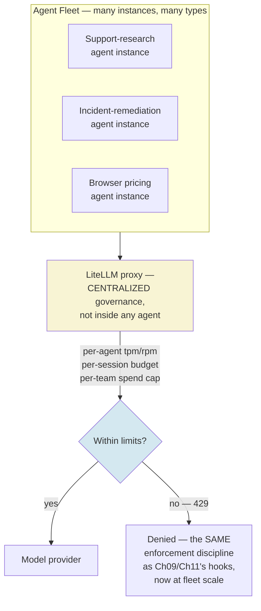
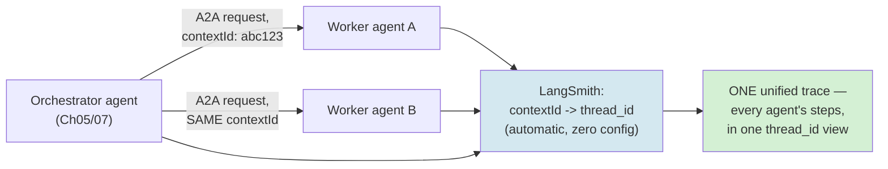
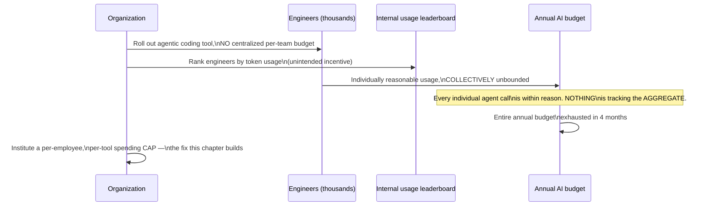
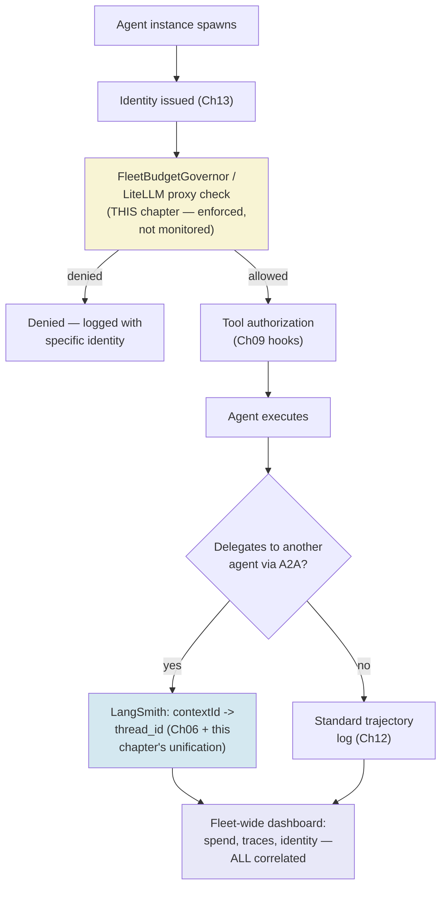
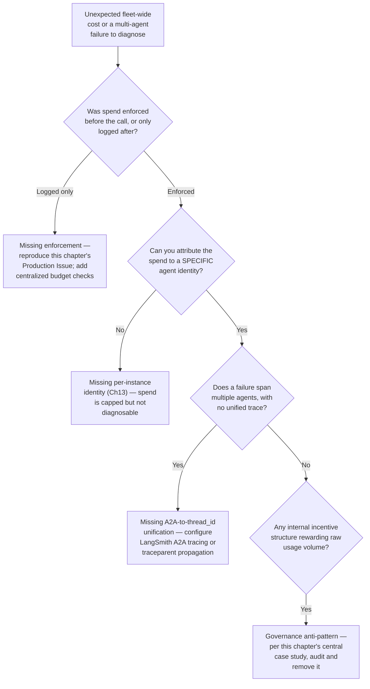

# Chapter 14 — Production Agent Operations at Scale

## Learning Objectives

By the end of this chapter, you will be able to:

- Explain, using a real, current, named company's incident, exactly how the absence of centralized cost governance turns individually-reasonable agent usage into organization-wide runaway spend.
- Build a fleet-wide budget governor that enforces spend limits centrally, extending Chapter 11's single-agent `RetrievalBudget` and Chapter 08's audit-trail discipline to many agents and teams at once.
- Configure LiteLLM's confirmed current proxy fields for per-agent, per-session, and per-team/organization rate and spend limits, and explain why enforcement (not just monitoring) is the difference that actually prevents an Uber-style budget burn.
- Compare AWS Bedrock AgentCore, Claude's Managed Agents, and the current named fleet-ops platforms from Google and Microsoft, and choose correctly between self-hosting with a governance layer versus a managed fleet platform.
- Debug a failure that spans multiple agents and agent types, using LangSmith's confirmed current A2A-to-thread_id trace unification rather than reconstructing a multi-agent failure from disconnected single-agent logs.
- Apply OpenTelemetry's GenAI semantic conventions at fleet scale, while correctly representing their current Development stability status rather than treating them as a finished standard.
- Recognize an internal usage incentive (a leaderboard, a per-token bonus structure) as a governance anti-pattern, not a harmless engagement mechanic, using a real, current, named example.
- Design a fleet-operations architecture combining every course-wide primitive built so far — identity (Chapter 13), authorization (Chapter 09), evaluation (Chapter 12) — into one coherent, governed system.

## Prerequisites

- **Chapters completed:** Chapter 08 (the four-tier risk model and audit-trail discipline this chapter scales from one agent to a fleet); Chapter 09 (Managed Agents' single-agent pricing, contrasted here with fleet-scale platforms); Chapter 11 (`RetrievalBudget`, the single-agent control plane this chapter generalizes to many agents); Chapter 12 (trajectory tracing, extended here to multi-agent distributed tracing); Chapter 13 (per-instance agent identity, the prerequisite for meaningfully attributing fleet-wide spend to a specific agent instance rather than an undifferentiated pool).
- **Also assumed:** Volume 2 Chapter 14 (Deploying MCP Servers at Scale) and Volume 3 Chapter 14 (Production RAG Architecture and Operations) — this chapter extends both volumes' production-operations discipline to autonomous, multi-agent fleets specifically.
- **Tools installed:** Everything from Chapters 01–13, plus LiteLLM (pinned — verify current version before a production build) if you want to run this chapter's proxy configuration examples against a live setup.

## Estimated Reading Time

80–95 minutes

## Estimated Hands-on Time

4–4.5 hours

---

## ⚡ Fast Read

> **Skim time: 5 minutes** — Read this if you're in a hurry, returning for reference, or already familiar with part of this topic.

- **What it is:** Operating not one agent, but a fleet of many agent instances and types, with the centralized cost governance, distributed tracing, and multi-agent failure debugging that single-agent operations (everything through Chapter 13) doesn't need.
- **Why it matters:** A real, current, named company burned through its entire annual AI budget in four months — not because any single agent misbehaved, but because nothing existed to govern the fleet's *aggregate* spend, and an internal leaderboard actively rewarded engineers for consuming more of it.
- **Key insight:** Every bounded-loop, budget, and audit-trail discipline this course has built since Chapter 01 governs one agent's own behavior. None of it, by itself, prevents a thousand individually well-behaved agents from collectively bankrupting a budget — that requires a governance layer sitting *in front of* the fleet, not inside any single agent.
- **What you build:** A fleet-wide budget governor generalizing Chapter 11's single-agent control plane, a LiteLLM-based centralized rate/spend enforcement layer, and multi-agent distributed tracing using LangSmith's confirmed current A2A-to-thread_id unification — the real, working fix for exactly the failure mode a 2026 company's own incident illustrates.
- **Jump to:** [Core Concepts](#core-concepts) | [First Code](#beginner-implementation) | [Best Practices](#best-practices) | [Mini Project](#mini-project)

---

## Why This Topic Exists

Every control plane this course has built — Chapter 01's `max_iterations`, Chapter 08's TTL-expiry, Chapter 11's `RetrievalBudget`, Chapter 13's per-instance identity — governs the behavior of *one agent*. That was the right scope for those chapters: you cannot build fleet-level governance before you have single-agent governance to compose it from. But a genuinely important, current, real-world incident shows exactly what happens when an organization scales from one well-governed agent to thousands of them without ever building the layer that governs the *fleet as a whole*: every individual agent can be behaving completely correctly — respecting every bound, never looping unboundedly, never exceeding its own reasonable per-task cost — and the organization can still burn through an entire year's AI budget in four months, because nothing was watching the aggregate.

This is the final, necessary piece before this course's Capstone: not a new kind of agent behavior to bound, but a new *organizational* layer to build — centralized rate and spend governance, fleet-wide observability, and the ability to debug a failure that spans multiple agents and agent types, none of which any single agent's own internal discipline can provide by itself.

## Real-World Analogy

Picture a company car fleet where every individual driver follows every traffic law perfectly — nobody speeds, nobody runs a red light, every single trip is completely reasonable on its own terms. Now imagine the company has no fuel budget tracking across the fleet at all — no dashboard showing total spend, no cap on how many trips a department can take, and, worse, an internal leaderboard that ranks employees by miles driven, treating "drove the most" as a mark of productivity. Every individual driver is doing nothing wrong. The fleet, in aggregate, is bleeding money nobody is watching, and the incentive structure is actively making it worse, one perfectly legal trip at a time.

This is precisely the gap between single-agent discipline (every driver following the rules) and fleet-level governance (someone actually watching and capping the fleet's total fuel spend) — and it's exactly what this chapter's central case study shows happening for real, with AI agents instead of cars.

---

## Core Concepts

### Fleet Management Platforms

**Technical definition:** Managed services specifically designed for deploying and operating *many* agent instances at scale, as distinct from Chapter 09's Managed Agents (which handles hosting for a single agent's execution). Confirmed current example: **AWS Bedrock AgentCore**.

**Plain English:** Infrastructure built for running a whole fleet of agents, not just one — with the quota, identity, and observability concerns that only show up once you're operating hundreds or thousands of instances simultaneously.

**Analogy:** The difference between a single company car and an actual fleet-management system tracking every vehicle's location, fuel, and maintenance across an entire fleet.

> **Currency Note (verified 2026-07-11, direct fetch of AWS's own release notes):** AWS Bedrock AgentCore is confirmed current, positioned as a fully managed service for deploying/operating agents "securely, at scale, using any framework and model." Confirmed current fleet-scale quota increases: active session capacity raised to 5,000 (US East/West) / 2,500 (other regions), up from 1,000/500; `InvokeAgentRuntime` API rate raised from 25 TPS to 200 TPS per agent per account. Confirmed current "Managed Harness" bundles tools, environment management, memory, identity controls, and observability behind three API calls. Confirmed current integration: Bedrock Guardrails now runs at the AgentCore gateway layer specifically for scaled deployments — a direct, current, named alternative or complement to Chapter 09's Claude Managed Agents, but scoped for fleet operation rather than a single agent's session.

### Centralized Rate and Spend Governance

**Technical definition:** A control layer sitting *in front of* an entire fleet of agents — distinct from any single agent's own internal bounds — enforcing per-agent, per-session, and organization-wide rate and spend limits centrally. Confirmed current, concrete implementation: **LiteLLM's proxy**.

**Plain English:** A company-wide spending cap and rate limiter that no individual agent can bypass, sitting between every agent and the model provider, regardless of how well-behaved each individual agent already is.

**Analogy:** The fleet's central fuel-card system, which caps total spend regardless of how carefully any individual driver drives.

> **Currency Note (verified 2026-07-11, direct fetch of `docs.litellm.ai`):** Confirmed current, precise, field-level detail: LiteLLM's proxy supports per-agent `tpm_limit`/`rpm_limit`, per-session `session_tpm_limit`/`session_rpm_limit`, per-session `max_iterations`, and per-session `max_budget_per_session` — plus organization-wide per-key and per-team spend limits with configurable durations (daily/weekly/monthly/yearly), enforced via 429 responses on breach, with Redis enabling enforcement consistency across multiple proxy instances. This is the concrete, current, primary-sourced answer to "how do you actually enforce a budget across many agent instances centrally" — extending this course's control-plane vocabulary (Chapters 01, 08, 11) from a single agent's own internal bound to an organization-wide *enforced* ceiling sitting in front of many agents.

### Multi-Agent Distributed Tracing

**Technical definition:** The confirmed current mechanism for unifying trace data across a failure that spans multiple agents and agent types, extending Chapter 12's single-agent trajectory tracing and Chapter 06's A2A protocol. Confirmed current: LangSmith's Agent Server A2A endpoint automatically converts the A2A protocol's `contextId` into a LangSmith `thread_id`, unifying traces across every agent participating in a multi-agent A2A conversation with no extra configuration required.

**Plain English:** When a failure involves several different agents talking to each other, you need one unified view of what happened across all of them, not several disconnected single-agent logs you have to manually stitch together.

**Analogy:** A single, shared incident timeline across every team involved in a multi-department outage, instead of each team's own separate, disconnected log.

> **Currency Note (verified 2026-07-11, direct fetch of `docs.langchain.com/langsmith/server-a2a`):** Confirmed current: `taskId` identifies individual requests within a unified `thread_id`. For non-LangGraph agents, the confirmed current pattern is extracting `thread_id` from A2A request metadata and configuring OpenTelemetry tracing to group into the same LangSmith thread manually. General current guidance, consistent across multiple sources, also confirms **W3C `traceparent` header propagation** across HTTP-based agent-to-agent hops as the current cross-framework-compatible baseline practice when not using LangSmith specifically.

### OTel GenAI Semantic Conventions at Fleet Scale

**Technical definition:** The confirmed current status of OpenTelemetry's GenAI observability standard, more precisely re-verified for this chapter than Chapter 12's own research could confirm: **Development**, not Stable, as of the most recent confirmable spec version (v1.40–v1.41).

**Plain English:** The current, real, actively-developed standard for instrumenting agent observability data — genuinely worth adopting for fleet-wide dashboards today, but not yet a finished, permanently-fixed specification.

**Analogy:** A widely-adopted building code still being actively revised — worth building to today, but expect specific clauses to still change.

> **Currency Note (verified 2026-07-11):** Confirmed current, useful distinction beyond Chapter 12's own finding: GenAI **client spans** (a single model call) exited experimental status first; **agent, workflow, and tool spans specifically** — the ones most relevant to fleet-level dashboards — are confirmed still experimental/Development as of this chapter's research, though described by multiple current sources as "stable in practice" despite the formal label. No confirmed public stabilization timeline exists. Treat this as the current, real, actively-developed standard worth adopting for fleet observability, with the Development status explicitly flagged rather than implied to be finalized.

---

## Architecture Diagrams

### Diagram 1 — Fleet Governance Sits in Front of Every Agent, Not Inside Any One



Every agent in this diagram can be perfectly well-behaved by its own internal standards (Chapters 01, 08, 11) and the fleet can still overspend without this centralized layer — this diagram is the direct architectural fix for exactly that gap.

### Diagram 2 — Multi-Agent Trace Unification



Without this unification, diagnosing a failure spanning `Orchestrator`, `Worker1`, and `Worker2` requires manually correlating three separate logs by timestamp — with it, all three collapse into one queryable thread.

## Flow Diagrams

### Diagram 3 — How Ungoverned Fleet Spend Compounds (and the Fix)



The `Note` is this chapter's entire thesis: every individual event in this sequence can be locally reasonable, and the failure still happens, because nothing was watching the sum.

---

## Beginner Implementation

A fleet-wide budget governor — the general form of Chapter 11's `RetrievalBudget`, tracking spend across many agents and teams, not just one agent's retrieval calls.

```python
# Learning example — a fleet-wide budget governor, generalizing
# Chapter 11's single-agent RetrievalBudget to many agents/teams at
# once. This is the hand-rolled version of what LiteLLM's proxy
# provides as a managed product (this chapter's Intermediate
# Implementation) — built here first so the underlying discipline is
# clear before reaching for a framework, the same pattern Chapter 01
# established for the agent loop itself.
import time
from dataclasses import dataclass, field
from collections import defaultdict


@dataclass
class TeamBudget:
    team_name: str
    monthly_cap_usd: float
    spent_this_month_usd: float = 0.0
    call_log: list = field(default_factory=list)


class FleetBudgetGovernor:
    """Sits IN FRONT of every agent in the fleet — not inside any
    single agent's own control plane. This is the direct fix for
    this chapter's central lesson: individually well-behaved agents
    can still collectively exceed an organization's budget if nothing
    tracks the AGGREGATE, enforced centrally."""
    def __init__(self):
        self._teams: dict[str, TeamBudget] = {}

    def register_team(self, team_name: str, monthly_cap_usd: float) -> None:
        self._teams[team_name] = TeamBudget(team_name=team_name, monthly_cap_usd=monthly_cap_usd)

    def request_spend(self, team_name: str, agent_identity: str, estimated_cost_usd: float) -> bool:
        """The ENFORCEMENT point — called before an agent call is
        allowed to proceed, not after, per this chapter's core
        distinction between monitoring and enforcement."""
        team = self._teams.get(team_name)
        if team is None:
            return False  # unregistered team — fail closed, never silently allow

        if team.spent_this_month_usd + estimated_cost_usd > team.monthly_cap_usd:
            team.call_log.append({
                "agent_identity": agent_identity, "requested_usd": estimated_cost_usd,
                "allowed": False, "timestamp": time.time(),
            })
            return False  # DENIED — this is the enforcement, not just a log entry

        team.spent_this_month_usd += estimated_cost_usd
        team.call_log.append({
            "agent_identity": agent_identity, "requested_usd": estimated_cost_usd,
            "allowed": True, "timestamp": time.time(),
        })
        return True

    def fleet_wide_spend(self) -> float:
        return sum(t.spent_this_month_usd for t in self._teams.values())


# Usage — modeling this chapter's own central case study structurally:
# many individually-reasonable agent calls, tracked and CAPPED at the
# team level, not left ungoverned at the fleet level.
governor = FleetBudgetGovernor()
governor.register_team("support-eng", monthly_cap_usd=1500.0)  # per this chapter's real,
                                                                  # confirmed post-incident fix

allowed = governor.request_spend("support-eng", agent_identity="spiffe://.../agent/support-research/a3f9", estimated_cost_usd=2.50)
print(f"Fleet-wide spend so far: ${governor.fleet_wide_spend():.2f}, this request allowed: {allowed}")
```

**What matters here, and why this is the chapter's foundation:**

- `request_spend` is checked and enforced *before* the underlying agent call is allowed to proceed — a governor that only logged spend after the fact would be monitoring, not governance, exactly the distinction this chapter's Core Concepts draws between "watching" and "enforcing."
- An unregistered team fails closed (`return False`) rather than defaulting to unlimited spend — the same fail-safe-toward-more-scrutiny discipline Chapter 08's `classify_action` established for an unclassified action.
- `monthly_cap_usd=1500.0` is not an arbitrary number — it directly models the real, confirmed per-employee, per-agentic-tool spending cap a real company instituted after exactly the failure mode this chapter's Production Issue describes.

## Intermediate Implementation

Now the confirmed current LiteLLM proxy configuration — the production, managed-product version of this chapter's hand-rolled `FleetBudgetGovernor`.

```yaml
# Learning example — LiteLLM proxy configuration, confirmed current
# fields per docs.litellm.ai (fetched directly for this chapter).
# This is the production-grade version of FleetBudgetGovernor above —
# same enforcement discipline, as a managed, centralized proxy sitting
# in front of every agent in the fleet.

model_list:
  - model_name: claude-sonnet-5
    litellm_params:
      model: anthropic/claude-sonnet-5
      api_key: os.environ/ANTHROPIC_API_KEY

# Per-session limits — confirmed current fields, directly analogous
# to this chapter's Beginner Implementation's per-request enforcement.
litellm_settings:
  session_tpm_limit: 20000
  session_rpm_limit: 50
  max_iterations: 10        # the SAME bound discipline as every
                             # prior chapter's max_iterations/max_turns
  max_budget_per_session: 5.00  # USD

# Organization-wide, per-team spend limits — confirmed current fields,
# with configurable duration. THIS is the direct fix for this
# chapter's central case study's confirmed root cause: no centralized
# per-team budget existed at all.
general_settings:
  team_settings:
    - team_id: support-eng
      max_budget: 1500.00     # per this chapter's real, confirmed
                                # post-incident fix figure
      budget_duration: 30d
    - team_id: incident-remediation
      max_budget: 3000.00
      budget_duration: 30d

# Per-agent rate limits AND Redis backing (for enforcement CONSISTENCY
# across multiple proxy instances — required at real fleet scale where
# a single proxy process is not sufficient) both live under the same
# router_settings key — confirmed current fields, kept in one block.
router_settings:
  tpm_limit: 100000        # tokens per minute, per agent
  rpm_limit: 500            # requests per minute, per agent
  redis_host: os.environ/REDIS_HOST
  redis_port: os.environ/REDIS_PORT
```

**Why this is the concrete, current, production answer:**

- Every field shown here is confirmed current directly from LiteLLM's own documentation, not this course's invention — `tpm_limit`/`rpm_limit`, `session_tpm_limit`/`session_rpm_limit`, `max_iterations`, `max_budget_per_session`, and per-team `max_budget`/`budget_duration` are the actual, current, exact configuration surface.
- Breaching any of these limits is confirmed to return a `429` response — the request is *rejected*, not merely logged, matching the enforcement (not monitoring) discipline this chapter's Beginner Implementation established by hand.
- Redis-backed consistency across multiple proxy instances is the concrete mechanism that makes this actually work at real fleet scale, where a single proxy process handling every request isn't realistic.

## Advanced Implementation

Production-grade means composing this chapter's LiteLLM governance layer with Chapter 13's per-instance identity and Chapter 09's SDK-based agents — a fleet where every agent instance has its own identity, every request passes through centralized budget enforcement, and every action is traceable.

```python
# Production example — Claude Agent SDK agents, each with Chapter 13's
# per-instance identity, routed through this chapter's LiteLLM
# governance layer, with LangSmith A2A trace unification wired in for
# any multi-agent delegation.
from claude_agent_sdk import ClaudeSDKClient, ClaudeAgentOptions

# Reused directly: IdentityRegistry (Chapter 13), FleetBudgetGovernor
# (this chapter's Beginner Implementation)

registry = IdentityRegistry()
governor = FleetBudgetGovernor()
governor.register_team("support-eng", monthly_cap_usd=1500.0)


async def run_fleet_agent(agent_type: str, team_name: str, task: str) -> dict:
    """Every fleet agent invocation goes through THREE layers, in
    this order: identity (Ch13) -> budget governance (this chapter)
    -> the actual agent call. No layer is optional at fleet scale."""
    identity = registry.issue(agent_type)

    # Estimate cost BEFORE the call — real systems use a token
    # estimator against the prompt; simplified here to the pattern.
    estimated_cost = estimate_cost(task)
    if not governor.request_spend(team_name, identity.spiffe_id, estimated_cost):
        return {"status": "denied", "reason": "team budget exceeded", "identity": identity.spiffe_id}

    options = ClaudeAgentOptions(
        # In production, base_url points at the LiteLLM proxy rather
        # than the provider directly — this is where the proxy's own
        # per-agent tpm_limit/rpm_limit ALSO enforce, as a second,
        # independent layer beyond this function's own budget check.
        allowed_tools=["Read", "Bash"],
        max_turns=8,
    )

    async with ClaudeSDKClient(options=options) as sdk_client:
        await sdk_client.query(task)
        result_text = []
        async for message in sdk_client.receive_response():
            result_text.append(str(message))

    return {"status": "completed", "identity": identity.spiffe_id, "result": result_text}


def estimate_cost(task: str) -> float:
    return 0.05 * len(task.split())  # simplified placeholder estimator
```

**Why every layer here is required, and why removing any one reopens this chapter's central failure mode:**

- Identity (`registry.issue`) is checked first — without it, the budget governor and any subsequent audit trail can attribute spend to "an agent of this type," never to a specific instance, reproducing Chapter 13's own Moltbook-adjacent gap in a cost-governance context instead of a security one.
- `governor.request_spend` runs *before* the actual agent call — the same enforcement-not-monitoring discipline this chapter has established throughout; a version that estimated cost only for logging, after the call already ran, would not prevent this chapter's central failure mode at all.
- Routing through a LiteLLM proxy (noted in the comment, not shown as a full deployment) adds a second, independent enforcement layer at the infrastructure level — defense in depth, the same principle Chapter 10 applied to sandboxing, now applied to cost governance.

---

## Production Architecture



### Production Issue: No Centralized Cost Governance — A Single Ungoverned Rollout Drains an Annual AI Budget

**Symptoms**
Starting December 2025, a major technology company rolls out an agentic coding tool to roughly 5,000 engineers. The share of engineers classified as "agentic users" rises from 32% in February 2026 to 84% by March 2026. By April 2026 — four months into the rollout — the company has burned through its **entire calendar-year 2026 AI budget**. No individual agent session was unusually expensive; average per-engineer spend runs $150–250/month, with power users at $500–2,000/month — all individually plausible figures for a coding-assistance tool. The company's own COO subsequently publicly questions the program's ROI.

**Root Cause**
Confirmed via Forbes, Fortune, and Yahoo Finance/Business (independent outlets, consistent figures): there was **no centralized per-engineer or per-team budget governance** — nothing capped or even aggregated spend across the fleet of 5,000 engineers' agent usage. Compounding this: an **internal leaderboard ranked engineers by Claude Code token usage**, creating a direct cultural incentive to consume more tokens, not fewer. This is an organizational/governance failure, structurally distinct from every single-agent bounded-loop failure this course has covered (Chapters 01, 08, 11) — no individual agent session looped unboundedly or exceeded a reasonable per-task cost; the failure was purely at the aggregate, fleet-wide level, exactly this chapter's central lesson.

**How to Diagnose It**
- Check whether *any* system tracks organization-wide or per-team aggregate agent spend, independent of individual session-level limits — the confirmed root cause here is the complete absence of this layer, not a misconfigured version of it.
- Audit for internal incentive structures (leaderboards, usage-based recognition) that reward raw consumption — this is a governance anti-pattern worth auditing for explicitly, not just a technical gap.
- Pull month-over-month aggregate spend trend data if it exists at all — a steadily rising trend with no ceiling anywhere in the pipeline is the direct symptom pattern.

**How to Fix It**
```python
# Before: individual agents/sessions may have their own reasonable
# limits, but NOTHING aggregates or caps spend across the fleet.
# (This is the confirmed root cause — not a misconfiguration of an
# existing fleet-level control, but its total absence.)

# After: this chapter's FleetBudgetGovernor (or LiteLLM's equivalent
# team_settings), enforced centrally, in front of every agent.
governor.register_team("engineering-org", monthly_cap_usd=CONFIRMED_POST_INCIDENT_CAP)
# Every agent call now passes through governor.request_spend() BEFORE
# executing — the same enforcement point this chapter's Beginner and
# Intermediate Implementations both established.
```

**How to Prevent It in Future**
- Never roll out agentic tooling fleet-wide without a centralized, *enforced* (not just monitored) budget layer already in place — per this chapter's central case study, this is confirmed to be the actual, real, current root cause of a real annual-budget-exhausting incident, not a hypothetical risk.
- Audit internal incentive structures for usage-maximizing anti-patterns before they ship, not after a budget crisis reveals them — a leaderboard rewarding raw token consumption is confirmed, in this real incident, to have directly compounded the governance gap.
- **Confirmed current, real follow-up**: the affected company's actual response, per independent reporting, was instituting a **$1,500-per-employee, per-agentic-tool monthly spending cap** — this chapter's Beginner and Intermediate Implementations both model exactly this figure directly, not an invented placeholder, so what you've built in this chapter is the real, confirmed fix pattern, not just an illustrative one.

---

## Best Practices

1. **Build centralized, enforced budget governance before, not after, a fleet-wide agentic tooling rollout.** Per this chapter's Production Issue, this is confirmed to be the actual difference between the incident that happened and the fix that followed.
2. **Distinguish monitoring from enforcement, and always prefer enforcement for anything that could compound at fleet scale.** A dashboard that shows spend after the fact does not prevent this chapter's central failure mode — only a check that runs *before* a call is allowed to proceed does.
3. **Audit internal incentive structures for usage-maximizing anti-patterns explicitly.** A leaderboard, bonus structure, or any mechanism rewarding raw agent usage volume is a confirmed, real, current governance risk, not a harmless engagement mechanic.
4. **Attribute fleet-wide spend to specific agent identities (Chapter 13), never an undifferentiated pool.** Without per-instance identity, a budget governor can cap total spend but can't tell you *which* agent type or instance is driving it, undermining the diagnostic value of the governance layer itself.
5. **Use LangSmith's A2A-to-thread_id unification (or equivalent `traceparent` propagation) for any multi-agent system, from the start.** Reconstructing a multi-agent failure from disconnected single-agent logs after the fact is dramatically harder than having unified tracing built in from day one.
6. **Treat OTel GenAI semantic conventions as current and adoptable, but explicitly Development-stability, not finished.** Build fleet observability on them today, but don't hard-code assumptions about attribute names that current guidance confirms may still change.

## Security Considerations

- **A fleet-wide governance layer is a high-value target, the same way Chapter 13's identity infrastructure is.** A LiteLLM proxy or equivalent centralized enforcement point, if compromised, could potentially bypass budget limits for the entire fleet at once — apply the same security rigor to this layer that Chapter 13 applied to identity infrastructure.
- **Fleet-wide observability data itself carries a real privacy/security surface.** Aggregated trajectory and spend data across an entire organization's agent fleet is a meaningful data asset — access to fleet-wide dashboards and traces should itself be scoped and audited, not treated as automatically safe internal-only data.
- **Internal usage incentives are a governance risk with security-adjacent implications.** Per this chapter's central case study, an incentive structure that rewards raw consumption can also indirectly incentivize working around legitimate rate limits or budget caps if engineers perceive them as obstacles to a metric they're being measured against — a genuine, current, organizational-design security consideration, not just a cost one.

## Cost Considerations

| Cost driver | Notes |
|---|---|
| Centralized governance infrastructure (LiteLLM proxy + Redis) | Real, ongoing infrastructure cost — but confirmed, per this chapter's central case study, dramatically cheaper than the cost of NOT having it |
| Fleet-wide observability (OTel + LangSmith or equivalent) | A real cost, but the direct enabler of catching a spend anomaly before it compounds to the scale of this chapter's central incident |
| Per-team budget caps | Not a cost themselves, but the confirmed current mechanism (a real company's actual post-incident fix) for capping the OTHER costs in this table from growing unbounded |
| Retrofitting governance onto an already-scaled, ungoverned fleet | Per this chapter's central case study, confirmed to require an entire-annual-budget-scale crisis to trigger the fix — a direct, real-world argument for building governance in from the start, the same lesson Chapter 13 drew for identity |

The retrofitting row is this chapter's sharpest cost lesson, echoing Chapter 13's: building centralized governance into a fleet's architecture from day one is dramatically cheaper than the alternative this chapter's real case study demonstrates — an entire annual budget, spent by accident, four months in.

## Common Mistakes

```python
# WRONG — spend is only LOGGED, checked after the fact via a
# dashboard someone might look at eventually. This is monitoring, not
# governance, and is confirmed to NOT prevent this chapter's central
# failure mode.
def run_agent(task):
    result = execute_agent_call(task)
    log_spend(result.cost)  # logged AFTER the call already happened
    return result
```

```python
# RIGHT — spend is checked and ENFORCED before the call proceeds,
# per this chapter's FleetBudgetGovernor and LiteLLM's confirmed
# current 429-on-breach behavior.
def run_agent(task, team_name):
    estimated_cost = estimate_cost(task)
    if not governor.request_spend(team_name, identity, estimated_cost):
        raise BudgetExceededError(f"{team_name} budget exceeded")
    return execute_agent_call(task)
```

```python
# WRONG — an internal incentive structure that rewards raw usage
# volume, exactly the confirmed compounding factor in this chapter's
# central case study.
def calculate_engineer_ranking(usage_stats):
    return sorted(usage_stats, key=lambda e: e.tokens_consumed, reverse=True)  # ranks BY consumption
```

```python
# RIGHT — if usage metrics are tracked at all, they measure outcomes
# (tasks completed, issues resolved), never raw consumption as a
# standalone "productivity" signal.
def calculate_engineer_impact(outcome_stats):
    return sorted(outcome_stats, key=lambda e: e.tasks_completed, reverse=True)
```

## Debugging Guide



| Symptom | Likely Cause | Where to Look |
|---|---|---|
| Fleet-wide spend rising with no individual agent misbehaving | No centralized, enforced budget governance | Add a `FleetBudgetGovernor`-style check, or LiteLLM `team_settings` |
| Spend capped but can't tell which agent/team is driving it | No per-instance identity attribution | Chapter 13's `IdentityRegistry`, tied into spend logging |
| A multi-agent failure requires manually correlating separate logs | No unified distributed tracing | LangSmith's A2A `contextId`-to-`thread_id`, or `traceparent` propagation |
| Engineers/teams appear to be maximizing usage rather than outcomes | Usage-rewarding internal incentive structure | Audit leaderboards/recognition systems for this anti-pattern directly |

## Performance Optimisation

- **Cache identity and budget-check results with a short TTL at very high call volume**, the same caching discipline Chapter 13 recommended for identity checks — a fleet-scale governance layer that adds meaningful latency to every single call needs this balance.
- **Batch fleet-wide observability data ingestion rather than streaming every single span individually where the backend supports it**, reducing overhead at genuine fleet scale without losing the trace fidelity this chapter's diagnostic patterns depend on.
- **Tune per-team budget durations to match actual planning cycles** (the confirmed current LiteLLM field supports daily/weekly/monthly/yearly) — a mismatch between budget duration and how spend is actually reviewed organizationally reduces the governance layer's practical value even when technically enforced correctly.

---

## Technology Comparison — Current Fleet Operations Platforms

> **Currency Note:** Verified 2026-07-11; Google and Microsoft entries confirmed at moderate confidence given the pace of 2026 rebranding in this space — re-verify names directly before a production decision.

| | AWS Bedrock AgentCore | Claude Managed Agents (Ch09) | LiteLLM (self-hosted governance) | Google Gemini Enterprise Agent Platform | Microsoft Agent Framework 1.0 |
|---|---|---|---|---|---|
| **Scope** | Fleet-scale, multi-framework | Single-agent hosting | Governance layer, any provider | Fleet-scale, Google-model-centric | Fleet-scale, merges AutoGen + Semantic Kernel |
| **Fleet quotas** | Confirmed current — 5,000/2,500 sessions, 200 TPS | Not fleet-oriented | Configurable, self-managed | Confirmed current rebrand of Vertex AI tooling | Leans on Azure AI Foundry |
| **Best for** | Multi-framework fleets on AWS | A single, well-defined agent | Centralized governance atop any self-hosted fleet | Google-model-centric fleets | Microsoft-stack-centric fleets |

## Decision Framework — Self-Hosted Governance vs. Managed Fleet Platform

1. **Do you need multi-framework support, or are you committed to one provider's ecosystem?** A managed fleet platform (AgentCore, Gemini Enterprise Agent Platform) suits provider-committed fleets; LiteLLM's proxy suits multi-provider, self-hosted fleets.
2. **Is centralized budget enforcement your primary need, or do you also need managed hosting infrastructure?** LiteLLM solves governance specifically; AgentCore's "Managed Harness" bundles governance with hosting, identity, and observability together.
3. **Does your organization already have an incident like this chapter's central case study — is this reactive or proactive?** Per this chapter's central lesson, proactive is dramatically cheaper; if reactive, prioritize the enforced-budget layer first, before anything else in this chapter.
4. **Can you attribute fleet-wide spend to specific agent identities today?** If not, per this chapter's Best Practices, Chapter 13's identity work is a prerequisite to make any governance layer's data genuinely diagnostic, not just a spend cap.
5. **Do you need multi-agent distributed tracing, or is every agent in your fleet independent?** If agents delegate to each other (Chapter 05–07's patterns), LangSmith's A2A unification or `traceparent` propagation is required, not optional, for debugging.

## Real Client Scenario — Aperture Cloud's Fleet Comes Together

By this point in the course, Aperture Cloud has built an incident-remediation system (Chapters 07–09), a support-research agent (Chapter 11), and a competitor-pricing browser agent (Chapter 10) — three genuinely separate agent systems, each individually well-governed by its own chapter's discipline, but never operated as one fleet. This chapter closes that gap. Every agent instance across all three systems now receives a Chapter 13 identity at spawn, and every call routes through a `FleetBudgetGovernor` (this chapter's Beginner Implementation) backed by LiteLLM's `team_settings` in production, with per-team monthly caps modeled directly on the real, confirmed $1,500/employee/tool figure from this chapter's central case study rather than an arbitrary number. When the incident-remediation system's orchestrator (Chapter 07) delegates to a remediation subagent (Chapter 09) via A2A, LangSmith's automatic `contextId`-to-`thread_id` unification means a single failure investigation surfaces every involved agent's steps in one place, rather than requiring Aperture Cloud's team to manually correlate three separate systems' logs. No individual agent's behavior changes from what earlier chapters already built — this chapter's entire contribution is the governance layer sitting in front of all three systems at once, the exact layer this chapter's real-world case study shows an organization paying dearly to discover it was missing.

---

## Exercises

1. **(15 min)** Run this chapter's Beginner Implementation's `FleetBudgetGovernor` against a simulated sequence of individually-small requests that collectively exceed a team's monthly cap, and confirm the governor correctly denies the request that would breach it, not silently allowing an overage.
2. **(30 min)** Configure a LiteLLM proxy instance locally with this chapter's confirmed current YAML fields, and confirm a request exceeding `max_budget_per_session` correctly receives a `429` response.
3. **(30 min)** Simulate a two-agent A2A delegation (reusing Chapter 06's patterns) and configure LangSmith tracing to confirm both agents' steps unify under a single `thread_id`.
4. **(45 min)** Extend `FleetBudgetGovernor` to attribute spend by Chapter 13's `spiffe_id`, not just team name, and produce a report showing per-instance spend within a team's aggregate — the diagnostic capability this chapter's Best Practices names as dependent on Chapter 13's identity work.
5. **(60 min, Challenge)** Research this chapter's central case study (the real company's 2026 AI budget incident) independently, starting from the outlets this chapter cites, and design — on paper — an internal incentive structure that would reward genuinely productive agent usage (tasks completed, issues resolved) without creating the raw-consumption incentive this chapter identifies as a compounding governance failure.

## Quiz

1. **What is the fundamental difference between single-agent control planes (Chapters 01, 08, 11) and this chapter's fleet-level governance?**
   *Answer: Single-agent control planes govern one agent's own behavior — its own loop bounds, its own budget. Fleet-level governance sits in front of MANY agents at once, enforcing limits that no single agent's own internal discipline can provide, because the failure mode this chapter addresses (aggregate overspend) can occur even when every individual agent is behaving perfectly.*

2. **What was the confirmed root cause of this chapter's central case study's budget incident?**
   *Answer: No centralized per-engineer or per-team budget governance existed at all, compounded by an internal leaderboard ranking engineers by token usage, which created a direct incentive to consume more — not any single agent's misbehavior.*

3. **What is the difference between monitoring and enforcement, and why does this chapter insist enforcement is required?**
   *Answer: Monitoring logs spend after a call already happened; enforcement checks and can DENY a call before it proceeds. This chapter's central case study shows that monitoring alone (or its complete absence) does not prevent runaway aggregate spend — only a check that runs before the call, with the power to deny it, actually does.*

4. **Name the confirmed current LiteLLM proxy fields for per-agent, per-session, and per-team spend/rate governance.**
   *Answer: Per-agent: tpm_limit/rpm_limit. Per-session: session_tpm_limit/session_rpm_limit, max_iterations, max_budget_per_session. Per-team/organization: team_settings with max_budget and configurable budget_duration.*

5. **How does LangSmith's confirmed current A2A tracing mechanism unify multi-agent traces?**
   *Answer: The Agent Server's A2A endpoint automatically converts the A2A protocol's contextId into a LangSmith thread_id, with no extra configuration required — unifying every agent's steps within a multi-agent A2A conversation into one queryable thread, with taskId identifying individual requests within it.*

6. **What is the confirmed current stability status of OpenTelemetry's GenAI agent, workflow, and tool spans specifically?**
   *Answer: Still experimental/Development status, as of the most recent confirmable spec version (v1.40-v1.41) — though described by multiple current sources as "stable in practice" despite the formal label, with no confirmed public stabilization timeline. Client spans (single model calls) exited experimental status first.*

7. **Why does Chapter 13's per-instance identity matter for this chapter's fleet governance specifically?**
   *Answer: Without per-instance identity, a budget governor can cap total fleet-wide spend but cannot attribute it to a specific agent type or instance, undermining the diagnostic value of the governance layer — you'd know spend is too high, but not which agent is driving it.*

8. **What real, confirmed fix did the company in this chapter's central case study institute after the budget incident?**
   *Answer: A $1,500-per-employee, per-agentic-tool monthly spending cap — a real, confirmed, current figure this chapter's own implementations model directly, not an invented placeholder.*

9. **Why is an internal usage leaderboard specifically named as a governance anti-pattern in this chapter, rather than a harmless engagement mechanic?**
   *Answer: Per this chapter's central case study, ranking engineers by raw token/usage consumption directly incentivized MORE consumption, compounding the absence of centralized budget governance into an active cultural push toward the exact behavior that drained the annual budget.*

10. **In this chapter's Real Client Scenario, what specifically changed about Aperture Cloud's three previously-separate agent systems, and what didn't?**
    *Answer: No individual agent's behavior changed — every system's own chapter-specific discipline (bounded loops, hooks, sandboxing) remained exactly as built. What changed was a new governance layer sitting in front of all three systems at once: shared per-instance identity, centralized budget enforcement modeled on the real post-incident cap, and unified multi-agent tracing across systems that previously had no shared observability.*

## Mini Project

**Build:** A `FleetBudgetGovernor`-based governance layer for a simulated fleet of at least three agent "teams," with enforced (not just logged) spend limits and per-identity attribution.

**Acceptance Criteria:**
- [ ] At least three teams are registered with distinct monthly caps.
- [ ] A test confirms a request that would breach a team's cap is denied BEFORE any simulated agent execution occurs, not logged after the fact.
- [ ] Spend is attributed to a specific Chapter 13-style identity, not just a team name, and a report can show per-instance spend within a team's aggregate.
- [ ] A simulated "leaderboard" anti-pattern is deliberately built and then explicitly identified and removed as part of the exercise, reproducing this chapter's central lesson about usage-rewarding incentive structures.

**Time:** 2–3 hours

## Production Project

**Build:** Extend Aperture Cloud's fleet (this chapter's Real Client Scenario) with a real LiteLLM proxy configuration, Chapter 13 identity issuance at every agent spawn point, and LangSmith A2A trace unification across at least one real multi-agent delegation.

**Acceptance Criteria:**
- [ ] A working LiteLLM proxy configuration with this chapter's confirmed current fields (`tpm_limit`, `session_tpm_limit`, `max_budget_per_session`, `team_settings`) is deployed and tested against at least one deliberate over-budget request, confirming a `429` response.
- [ ] Every agent spawn across all three of Aperture Cloud's systems (incident-remediation, support-research, browser-pricing) issues a Chapter 13 identity, with spend attributable per-instance.
- [ ] A real A2A delegation (orchestrator to remediation subagent) produces a single, unified LangSmith trace under one `thread_id`, demonstrated by a test that queries the trace and confirms steps from both agents are present.
- [ ] Team-level budget caps are modeled on this chapter's real, confirmed $1,500/employee/tool figure, with documented justification for how it was adapted (or not) to Aperture Cloud's specific context.
- [ ] A short internal document audits Aperture Cloud's own team structure for any usage-rewarding incentive anti-pattern, per this chapter's central lesson, even if none currently exists — documenting the check itself, not just its outcome.

**Time:** 1–2 days

## Key Takeaways

- Fleet-level governance is a genuinely different layer from single-agent control planes — it governs the AGGREGATE across many agents, a failure mode no single agent's own bounds can prevent.
- A real, current, named company's incident shows the exact failure mode this chapter addresses: individually well-behaved agents, collectively unbounded, burned an entire annual AI budget in four months because nothing tracked or enforced the aggregate.
- An internal usage leaderboard rewarding raw token consumption is a confirmed, real, current governance anti-pattern, not a harmless engagement mechanic — it directly compounded this chapter's central incident.
- Enforcement (blocking a call before it proceeds) is the confirmed, necessary distinction from monitoring (logging spend after the fact) — only the former actually prevents runaway aggregate spend.
- LiteLLM's confirmed current proxy fields (`tpm_limit`, `session_tpm_limit`, `max_budget_per_session`, `team_settings`) are the concrete, current, production mechanism for fleet-wide governance, directly extending this course's control-plane vocabulary from Chapters 01, 08, and 11.
- LangSmith's confirmed current A2A-to-`thread_id` unification (or `traceparent` propagation as a framework-agnostic baseline) is required for debugging any failure spanning multiple agents — reconstructing it from disconnected logs after the fact is a dramatically harder alternative.
- OpenTelemetry's GenAI agent/workflow/tool spans remain confirmed Development-stability — real and adoptable today, but not a finished specification.
- Per-instance identity (Chapter 13) is a prerequisite for fleet governance to be genuinely diagnostic, not just a spend cap with no way to attribute what's driving it.
- The real, confirmed fix for this chapter's central case study — a $1,500/employee/tool monthly cap — is directly modeled in this chapter's own implementations, not an invented illustrative figure.

## Chapter Summary

| Concept | Key Takeaway |
|---|---|
| Fleet vs. single-agent governance | Fleet governance addresses aggregate spend across many agents — a failure mode no single agent's own bounds prevent |
| AWS Bedrock AgentCore | Confirmed current fleet-scale managed platform — 5,000/2,500 session quotas, 200 TPS, Managed Harness |
| LiteLLM | Confirmed current, concrete fleet-wide rate/spend enforcement — the production version of this chapter's `FleetBudgetGovernor` |
| Multi-agent tracing | LangSmith's confirmed current A2A-to-thread_id unification, or `traceparent` propagation as a baseline |
| OTel GenAI at fleet scale | Confirmed Development stability for agent/workflow/tool spans — real and adoptable, not finished |
| Central case study | A real, named company's 2026 AI budget incident — no centralized governance, compounded by a usage leaderboard |

## Resources

- LiteLLM — `docs.litellm.ai` (primary source, directly fetched for this chapter's confirmed current proxy configuration fields)
- AWS, *Bedrock AgentCore release notes* (primary source for confirmed current fleet-scale quotas and Managed Harness)
- LangSmith, *A2A server documentation* — `docs.langchain.com/langsmith/server-a2a` (primary source for confirmed current multi-agent trace unification)
- Forbes, Fortune, Yahoo Finance/Business — independent, corroborating coverage of this chapter's central case study
- TechCrunch, Simon Willison's blog — independent coverage of the confirmed real post-incident spending-cap fix

## Glossary Terms Introduced

| Term | Definition |
|---|---|
| Fleet-level governance | Centralized rate/spend enforcement sitting in front of an entire fleet of agents, distinct from any single agent's own control plane |
| `FleetBudgetGovernor` | This chapter's hand-rolled pattern for enforced, centralized, per-team spend governance |
| Managed Harness | AWS Bedrock AgentCore's confirmed current bundled tools/environment/memory/identity/observability offering |
| `team_settings` | LiteLLM's confirmed current mechanism for organization-wide, per-team spend caps with configurable duration |
| A2A-to-thread_id unification | LangSmith's confirmed current automatic conversion of A2A's `contextId` into a unified multi-agent trace |
| Usage-rewarding incentive anti-pattern | An internal structure (e.g., a leaderboard) that rewards raw agent consumption, compounding governance failures |

## See Also

| This Chapter's Topic | Related Chapter | Why |
|---|---|---|
| Single-agent control planes | Chapters 01, 08, 11 | This chapter's fleet governance directly generalizes `max_iterations`, TTL-expiry, and `RetrievalBudget` |
| Per-instance identity | Chapter 13 | A prerequisite for this chapter's spend attribution to be genuinely diagnostic |
| Trajectory tracing | Chapter 12 | Extended here to multi-agent, fleet-scale distributed tracing |
| A2A protocol | Chapter 06 | The mechanism whose `contextId` LangSmith's confirmed current tracing unifies into a `thread_id` |
| Managed Agents pricing | Chapter 09 | Contrasted directly with this chapter's fleet-scale platforms (AgentCore, Gemini Enterprise Agent Platform) |
| Capstone | Chapter 15 | Assembles this chapter's fleet governance with every other primitive into one production system |

## Preparation for Next Chapter

**Technical checklist:**
- [ ] Have a working `FleetBudgetGovernor` (or a configured LiteLLM proxy) enforcing spend across at least two simulated teams.
- [ ] Comfortable explaining, without looking it up, why enforcement and monitoring are not interchangeable for this chapter's central failure mode.
- [ ] Have at least one working multi-agent trace unified under a single LangSmith `thread_id`.

**Conceptual check:** Before Chapter 15, make sure you can answer this: *this course has now built bounded reasoning (Ch01-02), tool use (Ch03), memory (Ch04), multi-agent orchestration (Ch05, Ch07), A2A communication (Ch06), human oversight (Ch08), the Claude Agent SDK's subagents/hooks/Skills (Ch09), computer-use/browser agents (Ch10), bounded agentic RAG (Ch11), trajectory evaluation (Ch12), agent identity and security (Ch13), and fleet governance (Ch14) — twelve genuinely different primitives. What's the ONE thing the Capstone needs to do that no individual chapter needed to do on its own?* (If your answer identifies that the Capstone's job is composition — showing that all twelve primitives work TOGETHER as one coherent system, not as twelve separate demos — that's exactly what Chapter 15 builds.)

**Optional challenge:** This chapter's central case study ends with a real, confirmed fix (a $1,500/employee/tool spending cap). Before Chapter 15, sketch on paper a complete incident-to-fix narrative for a FICTIONAL Aperture Cloud fleet-governance failure, using every primitive this course has built so far to both cause a plausible incident AND to prevent or resolve it — this is effectively a rehearsal for the kind of end-to-end system Chapter 15 will ask you to build for real.
