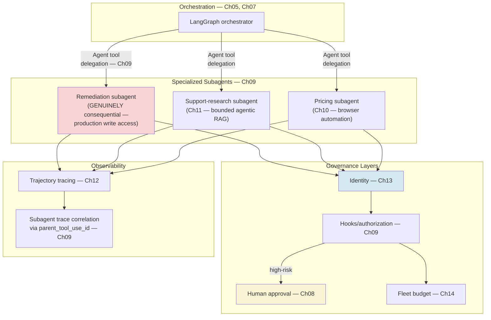
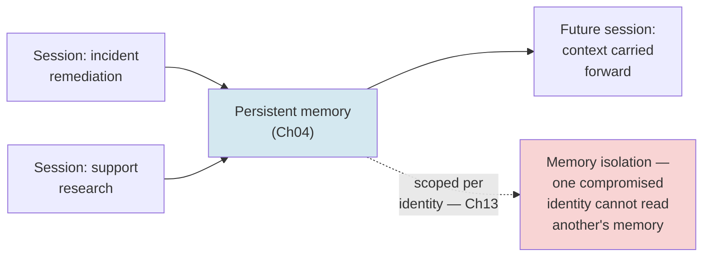
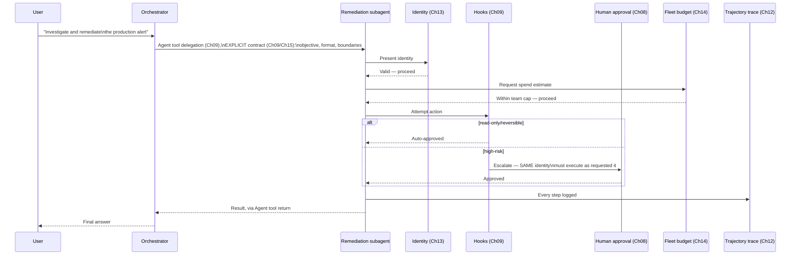
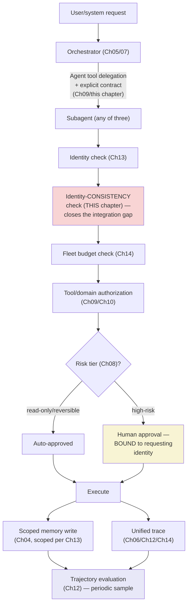
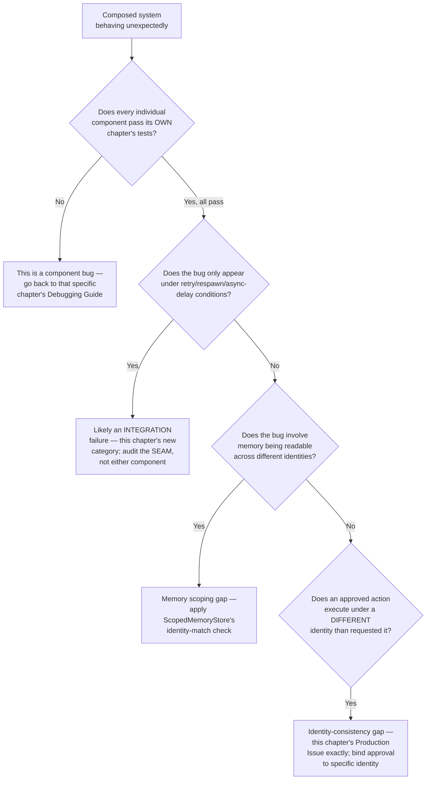

# Chapter 15 — Capstone: Production Multi-Agent System with Bounded Autonomy

## Learning Objectives

By the end of this chapter, you will be able to:

- Assemble every primitive this course has built — reasoning loops, tool use, memory, multi-agent orchestration, in-process subagent delegation, human oversight, subagents/hooks/Skills, browser automation, agentic RAG, trajectory evaluation, identity, and fleet governance — into one coherent, working production system, and correctly judge that this particular system's trust boundaries call for Chapter 09's Agent-tool delegation rather than Chapter 06's A2A protocol.
- Diagnose an "integration failure" — a bug that exists only at the seam between two individually-correct components, not inside either one — a failure category no single prior chapter's primitives can catch alone.
- Compare your own system's subagent design against Anthropic's own published, real, production multi-agent reference architecture, and apply its core lesson directly.
- Build a complete incident-to-fix narrative for a fleet-governance failure, using this course's own real, confirmed 2026 case study as the template.
- Substitute your own domain for this chapter's Aperture Cloud worked example with no conceptual gap, adapting the same architecture to customer support, DevOps, or research automation.
- Explain, from direct experience building this chapter's system, why "quality and consistency over speed" — this course's own governing principle since Chapter 01 — was the correct discipline for building something this consequential.
- Recognize that a fast-moving technical field means even a course's own citations need re-verification, using a live example caught during this very chapter's own research.
- Present a finished, production-grade, bounded-autonomy multi-agent system with a clear account of what it does, why each safeguard exists, and what would need to change to adapt it to a different domain.

## Prerequisites

- **Chapters completed:** All of Chapters 01–14. This chapter assumes fluency with every primitive built across this course, not just familiarity — you should be able to explain each one without looking it up before starting this chapter's implementation.
- **Also assumed:** This is the final chapter of Volume 4. If any earlier chapter's exercises or mini/production projects were skipped, this is the point at which the gaps become visible — the Capstone will not re-teach anything, only compose it.
- **Tools installed:** Everything from every prior chapter. If you've been building along, you already have it. If you haven't, this chapter is not the place to start from zero — go back to Chapter 01.

## Estimated Reading Time

90–110 minutes

## Estimated Hands-on Time

8–12 hours (this is a full system build, not a single-session exercise)

---

## ⚡ Fast Read

> **Skim time: 5 minutes** — Read this if you're in a hurry, returning for reference, or already familiar with part of this topic.

- **What it is:** One production multi-agent system — Aperture Cloud's incident-remediation, support-research, and competitor-pricing agents, unified for the first time — assembled from every primitive Chapters 01–14 built independently, with bounded autonomy enforced at every layer.
- **Why it matters:** Fourteen chapters of individually-correct primitives don't automatically compose into a correct system. The seams between them — where Chapter 08's approval gate meets Chapter 13's identity check, where Chapter 11's retrieval budget meets Chapter 14's fleet governance — are where a genuinely new class of bug lives, one no single chapter's testing can catch alone.
- **Key insight:** This chapter's own research process caught a live, current example of exactly the "verify both directions" discipline the course has practiced since Chapter 09: it's not enough to check that a claim isn't fabricated — you also have to keep re-checking things you already believe are settled, because a fast-moving field keeps moving even in the middle of writing about it.
- **What you build:** A complete, working, bounded-autonomy multi-agent system — an orchestrator, specialized subagents (including one with genuinely consequential real-world capability), persistent memory, risk-tiered human approval, trajectory evaluation, per-instance identity, and fleet-wide cost governance — all composed, not just individually built.
- **Jump to:** [Core Concepts](#core-concepts) | [First Code](#beginner-implementation) | [Best Practices](#best-practices) | [Mini Project](#mini-project)

---

## Why This Topic Exists

Every chapter since Chapter 01 has deliberately isolated one concern at a time: bounded reasoning, then tool use, then memory, then orchestration, then oversight, then the SDK's own primitives, then browser automation, then retrieval, then evaluation, then security, then fleet operations. That isolation was the right pedagogical choice — you cannot learn fourteen things simultaneously any more than you can safely operate an agent with fourteen unbuilt safeguards at once. But it leaves exactly one question unanswered, and it's the question that actually matters for whether any of this is real: **do these fourteen things actually work together, as one system, or do they just work individually, as fourteen separate demos?**

This chapter exists to answer that honestly, by building the system, not by asserting it would probably work. And it exists to name a category of failure this course has not yet had occasion to name: an **integration failure** — a bug where every individual component passes its own tests, and the system still does the wrong thing, because the failure lives in the handoff between two components, not inside either one. Chapter 08's approval gate can work perfectly. Chapter 13's identity check can work perfectly. And a system combining both can still have a real gap if the identity that requested an action isn't verified to be the same identity that executes it after approval — a bug that exists nowhere in either chapter's own code, only in how they're wired together. That's the genuinely new territory this final chapter opens.

## Real-World Analogy

Think about the difference between fourteen expert specialists and a hospital. A cardiologist, an anesthesiologist, a surgical nurse, a pharmacist, and ten other specialists can each be individually excellent at their own job — every one of them could pass a rigorous individual competency exam with a perfect score. None of that guarantees that a specific surgery, involving all of them at once, goes well. The actual failure mode that kills patients in real hospitals is rarely "the surgeon was incompetent" — it's far more often a **handoff failure**: the anesthesiologist and the surgeon working from different information about the patient's allergy status, a medication order that was correct when written but never correctly communicated to the nurse administering it. Every individual professional did their own job right. The system failed at the seam between them.

This is precisely why hospitals invest heavily in structured handoff protocols, checklists, and explicit communication standards — not because any individual specialist needs remedial training, but because the seams between excellent individual work are where real patients actually get hurt. This chapter is that discipline, applied to fourteen chapters' worth of individually-excellent agent-engineering primitives, assembled for the first time into one system where the seams matter as much as the components.

---

## Core Concepts

### Integration Failures — A New Failure Category

**Technical definition:** A defect that exists only in the interaction between two or more individually-correct components — neither component's own isolated testing can detect it, because the failure is a property of the composition, not of either component alone.

**Plain English:** Two systems, each working exactly as designed, that produce a wrong result specifically because of how they're connected to each other.

**Analogy:** The hospital handoff failure — neither the surgeon's skill nor the anesthesiologist's skill was ever in question; the patient information simply didn't travel correctly between them.

> This is the genuinely new concept this chapter introduces, on top of the fourteen prior chapters' worth of individual-component discipline — every Production Issue in this course so far (Chapters 01–14) has been a failure inside one component. This chapter's own Production Issue, below, is the first one in this course that is structurally impossible to describe as belonging to any single earlier chapter.

### The Subagent Contract — A Real, Named, Production Reference Pattern

**Technical definition:** A confirmed, current, primary-sourced pattern from Anthropic's own published engineering account of building a real multi-agent production system: every subagent needs an explicit **objective**, **output format**, **guidance on which tools and sources to use**, and **clear task boundaries** — vague delegation instructions are a confirmed, documented cause of subagents duplicating work or misinterpreting scope.

**Plain English:** Don't just tell a subagent roughly what to do — tell it exactly what "done" looks like, in what shape, using what, and where its job stops.

**Analogy:** The difference between telling a contractor "fix up the kitchen" and handing them a scoped work order with a defined deliverable, a materials list, and an explicit boundary of what's in and out of scope.

> **Currency Note (verified 2026-07-11, direct source: `anthropic.com/engineering/multi-agent-research-system`):** This is a real, primary-sourced, named reference architecture from Anthropic's own engineering blog, dated 2025-06-13 — foundational rather than newly current, the same "still-standard vocabulary" status this course already gave Self-RAG/CRAG in Chapter 11. This is not this course's own invented best practice; it's the documented lesson from a real, shipped, production Anthropic multi-agent system, directly validating the discipline Chapter 09's `AgentDefinition.description`/`prompt` fields already pushed you toward, and this chapter's own subagent contracts apply it explicitly for the first time.

### Bounded Autonomy, Assembled

**Technical definition:** The composed property of a system where every individual agent's capability is bounded (Chapters 01, 03, 09), every consequential action is gated by risk-appropriate human oversight (Chapter 08), every retrieval and reasoning loop has an enforced stopping condition (Chapters 01, 11), every agent instance has verifiable identity (Chapter 13), and the aggregate system's cost and behavior are governed centrally (Chapter 14) — not as a single mechanism, but as the emergent property of correctly composing all of them together.

**Plain English:** No single control makes a system "bounded" — it's the combination of every layer this course has built, working together, that actually earns the term.

**Analogy:** No single safety feature makes a car safe — seatbelts, airbags, crumple zones, and anti-lock brakes only add up to genuine safety when they're all present and correctly integrated, not when any one of them is excellent in isolation.

---

## Architecture Diagrams

### Diagram 1 — Every Chapter's Primitive, In One System



> **Correction:** an earlier draft of this diagram labeled subagent delegation as "A2A." It isn't — per Chapter 06's own definition, A2A is specifically for an agent outside the current process, framework, or organization, and per Chapter 09, subagents are invoked in-process through the `Agent` tool. All three of Aperture Cloud's subagents here live inside one trust domain (Aperture Cloud's own systems), so Chapter 09's mechanism is the correct one — A2A would only enter this picture if this system needed to talk to an agent genuinely outside that boundary, which it doesn't. Getting this distinction right matters precisely because Chapter 07 spent real effort teaching it.

This is the single diagram this entire course has been building toward — every box is a real primitive from a specific earlier chapter, not a new invention. Chapter 15's actual work is making every arrow between these boxes correct, not inventing new boxes.

### Diagram 2 — Persistent Memory Across the Fleet



Chapter 04's memory content was built before Chapter 13's identity content existed in this course's sequence — this diagram makes explicit a composition question neither chapter addressed alone: memory must be scoped to identity, not shared indiscriminately across an entire fleet, or a compromised agent instance gains read access to every other instance's history.

## Flow Diagrams

### Diagram 3 — A Full Request, Through Every Layer



Every participant in this diagram is a primitive from a named earlier chapter. The `alt` block's "SAME identity must execute as requested it" note is this chapter's Production Issue made explicit in the flow — a gap here is exactly the integration failure this chapter's Core Concepts introduced.

---

## Beginner Implementation

Stage one of the full build: the orchestrator and subagent skeleton, using this chapter's subagent-contract pattern from the start — not retrofitted later.

```python
# Learning example — the Capstone system's orchestration skeleton,
# reusing Chapter 07's LangGraph orchestrator pattern and Chapter 09's
# AgentDefinition, with THIS chapter's explicit subagent-contract
# discipline (objective, output format, tool/source guidance, task
# boundaries) applied from the start — per Anthropic's own confirmed
# current production reference architecture.
from claude_agent_sdk import AgentDefinition

# This stage reuses Chapter 09's AgentDefinition pattern directly.
# The orchestrator (Ch07's StateGraph), Ch11's retrieval server, and
# Ch10's Playwright MCP wiring are referenced by name/tool-string here
# and assembled explicitly in this chapter's Advanced Implementation
# below — not repeated in full in every stage.

remediation_subagent = AgentDefinition(
    description=(
        "Investigates and remediates production incidents flagged by "
        "monitoring alerts. Use when an alert requires diagnosis AND "
        "a corrective action, not just investigation."
    ),
    prompt=(
        # OBJECTIVE — explicit, per this chapter's subagent-contract lesson
        "Your objective: diagnose the root cause of the given alert and "
        "execute the minimal corrective action, following the safe-rollback "
        "Skill's procedure exactly.\n"
        # OUTPUT FORMAT — explicit
        "Report back in this exact format: {root_cause: str, action_taken: "
        "str, confidence: 'high'|'medium'|'low'}.\n"
        # TOOL/SOURCE GUIDANCE — explicit
        "Use ONLY the Bash and Read tools for diagnosis. Do not attempt "
        "to access anything outside the incident's own service scope.\n"
        # TASK BOUNDARIES — explicit
        "Your task ends at 'action executed and verified' — do NOT "
        "attempt to notify customers, update status pages, or take any "
        "action outside direct remediation. Escalate anything requiring "
        "a decision outside this explicit scope, rather than guessing."
    ),
    tools=["Bash", "Read"],          # Ch09's least-privilege scoping
    skills=["safe-rollback"],         # Ch09's preloaded Skill
    model="opus",                     # stronger model — Ch09's pattern
                                        # for higher-stakes subagent variants
)

research_subagent = AgentDefinition(
    description="Answers policy and product questions from the internal "
                 "knowledge base, using bounded retrieval.",
    prompt=(
        "Your objective: answer the given question using search_knowledge_base. "
        "Output format: a direct answer with the specific source chunk cited, "
        "or an explicit 'insufficient information' response if the retrieval "
        "budget is exhausted without a confident match. Tool guidance: use "
        "search_knowledge_base only — never fabricate an answer from general "
        "knowledge if retrieval fails. Task boundary: answer ONLY the question "
        "asked; do not proactively suggest unrelated policy information."
    ),
    tools=["mcp__aperture-retrieval__search_knowledge_base"],  # Ch11's MCP tool
)

pricing_subagent = AgentDefinition(
    description="Checks named competitor pricing pages and reports changes.",
    prompt=(
        "Your objective: check the three allowlisted competitor pricing pages "
        "and report any changes since the last check. Output format: a "
        "structured list of {competitor, old_price, new_price, changed: bool}. "
        "Tool guidance: use the Playwright MCP browser tools, accessibility-"
        "tree-first per this course's Chapter 10 discipline. Task boundary: "
        "read-only — never attempt to interact with any element beyond "
        "reading displayed pricing information."
    ),
    tools=["mcp__playwright"],  # Ch10's MCP wiring
)
```

**What matters here, and why this is the chapter's foundation:**

- Every one of the three subagent prompts follows Anthropic's own confirmed current four-part contract exactly — objective, output format, tool/source guidance, task boundaries — not as decoration, but because this course's research confirmed this is the real, documented cause of subagents duplicating work or misinterpreting scope in an actual production system.
- Each subagent's `tools` allowlist is scoped to exactly what its contract's tool guidance names — the remediation subagent literally cannot notify customers or touch a status page, because it was never given those tools, closing the gap its own prompt boundary describes at the mechanism level, not just the instruction level (Chapter 03's original least-privilege lesson, still load-bearing here).
- `remediation_subagent` is this system's one genuinely consequential agent, per this course's Autonomy Thread — real production write access, following Chapter 09's safe-rollback Skill exactly, gated by every governance layer this chapter assembles next.

## Intermediate Implementation

Stage two: wiring identity, authorization, and memory together — where this chapter's Production Issue lives if done incorrectly.

```python
# Learning example — composing Chapter 13's identity, Chapter 09's
# hooks, and Chapter 04's memory correctly. This is where an
# INTEGRATION failure (this chapter's new concept) can hide even
# when every individual piece is implemented exactly as its own
# chapter specified.
from claude_agent_sdk import ClaudeAgentOptions, HookMatcher

# Reused directly: IdentityRegistry (Ch13), FleetBudgetGovernor (Ch14)

registry = IdentityRegistry()
governor = FleetBudgetGovernor()
governor.register_team("aperture-fleet", monthly_cap_usd=1500.0)  # this
    # course's own confirmed real post-incident figure, reused directly


class ScopedMemoryStore:
    """Chapter 04's persistent memory, correctly scoped per Chapter
    13's identity — the composition question NEITHER chapter alone
    addressed. Without this scoping, a compromised or impersonated
    identity gains read access to every OTHER identity's memory,
    directly reproducing the structural shape of Chapter 13's
    Moltbook incident, now in the memory layer instead of the
    action-authorization layer."""
    def __init__(self):
        self._store: dict[str, list] = {}  # keyed by spiffe_id, NOT
                                              # by agent_type

    def write(self, spiffe_id: str, entry: dict) -> None:
        if not registry.is_valid(spiffe_id):
            raise PermissionError(f"Cannot write memory for invalid identity {spiffe_id}")
        self._store.setdefault(spiffe_id, []).append(entry)

    def read(self, spiffe_id: str, requesting_identity: str) -> list:
        # THE critical check this chapter's Production Issue is about:
        # the identity REQUESTING a memory read must match the identity
        # whose memory is being read, UNLESS explicitly and separately
        # authorized — never assumed just because both are "valid."
        if spiffe_id != requesting_identity:
            raise PermissionError(
                f"{requesting_identity} may not read {spiffe_id}'s memory "
                "without explicit cross-identity authorization."
            )
        return self._store.get(spiffe_id, [])


async def identity_consistent_execution_hook(input_data: dict, tool_use_id: str, context: dict) -> dict:
    """THE fix for this chapter's Production Issue: the identity that
    RECEIVED human approval (Ch08) must be the SAME identity that
    EXECUTES the approved action — not merely 'a currently valid
    identity,' which Ch13's hook alone does not guarantee across an
    async approval gap."""
    approval_record = context.get("approval_record", {})
    executing_identity = context.get("caller_identity")

    if approval_record and approval_record.get("approved_for_identity") != executing_identity:
        return {
            "hookSpecificOutput": {
                "hookEventName": "PreToolUse",
                "permissionDecision": "deny",
                "permissionDecisionReason": (
                    f"Action was approved for identity "
                    f"{approval_record.get('approved_for_identity')}, but is "
                    f"being executed by {executing_identity} — identity "
                    "mismatch across the approval gap, denied per this "
                    "chapter's integration-failure fix."
                ),
            }
        }
    return {}
```

**Why this is the chapter's central technical lesson, made concrete:**

- `ScopedMemoryStore.read`'s check is not present in Chapter 04's original memory content, nor in Chapter 13's original identity content — it exists only at the seam between them, and it's exactly the kind of bug that both chapters' own individual test suites would miss, because each chapter's tests only exercised its own primitive in isolation.
- `identity_consistent_execution_hook` closes a genuinely subtle gap: Chapter 08's approval flow and Chapter 13's identity validity check can both pass independently — the identity is valid, and a human did approve *an* action — while still allowing a different, also-currently-valid identity to be the one that actually executes it, if nothing explicitly ties the approval to the specific identity that requested it.
- Both fixes follow the same pattern: an explicit, deterministic check *at the composition point*, not a hope that two independently-correct components will compose correctly on their own.

## Advanced Implementation

Stage three: the full system, with fleet-wide tracing and governance wired across every subagent, using this chapter's `identity_consistent_execution_hook` as one layer among several.

```python
# Production example — the assembled Capstone system: orchestrator,
# three subagents, identity, scoped memory, fleet budget, and
# unified tracing, all composed. Verified against claude-agent-sdk's
# ACTUAL current version at draft time: 0.2.116 (confirmed via direct
# PyPI fetch, 2026-07-11) — one patch version ahead of what even this
# course's own Chapter 15 pre-draft research pass found (0.2.114/
# 0.2.115), itself a live demonstration of this chapter's own point:
# a fast-moving field keeps moving even mid-chapter.
from claude_agent_sdk import ClaudeSDKClient, ClaudeAgentOptions, HookMatcher

memory_store = ScopedMemoryStore()

options = ClaudeAgentOptions(
    agents={
        "remediation": remediation_subagent,
        "research": research_subagent,
        "pricing": pricing_subagent,
    },
    mcp_servers={
        "aperture-retrieval": retrieval_server,       # Ch11
        "playwright": {"command": "npx", "args": ["@playwright/mcp@latest"]},  # Ch10
    },
    hooks={
        "PreToolUse": [
            # Per Ch09's confirmed rule, hooks matching the same event
            # run in PARALLEL, not registration order — there is no
            # sequencing mechanism here, and none is needed. Each of
            # these three hooks checks an INDEPENDENT condition and
            # can only ever DENY, never allow on another hook's
            # behalf — so per Ch09's confirmed priority rule ("deny
            # outranks defer, which outranks ask, which outranks
            # allow"), correctness comes from every hook being
            # independently right, not from any ordering between them.
            HookMatcher(matcher=".*", hooks=[identity_scoped_authorization_hook]),  # Ch13
            HookMatcher(matcher=".*", hooks=[identity_consistent_execution_hook]),  # THIS chapter
            HookMatcher(matcher="mcp__playwright__.*", hooks=[enforce_domain_allowlist]),  # Ch10
        ]
    },
    can_use_tool=can_use_tool_callback,  # Ch08's four-tier classifier
    allowed_tools=["Agent", "Bash", "Read", "Skill", "mcp__aperture-retrieval", "mcp__playwright"],
    max_turns=15,
    setting_sources=["project"],  # required for Skills, per Ch09
)


async def run_capstone_system(user_request: str, team_name: str = "aperture-fleet"):
    identity = registry.issue("orchestrator")

    if not governor.request_spend(team_name, identity.spiffe_id, estimate_cost(user_request)):
        return {"status": "denied", "reason": "fleet budget exceeded"}

    async with ClaudeSDKClient(options=options) as sdk_client:
        await sdk_client.query(user_request)
        results = []
        async for message in sdk_client.receive_response():
            results.append(message)
            # Every message, from every subagent (identifiable via
            # parent_tool_use_id, per Ch09), feeds the SAME LangSmith
            # thread_id because subagent runs are captured within the
            # SAME session trace (Ch09/Ch12) — one coherent trace
            # across the whole request, not three. This is DISTINCT
            # from Ch14's A2A-to-thread_id unification, which solves
            # the same "one trace, many agents" problem for agents
            # crossing a genuine A2A trust boundary (Ch06) — not
            # needed here, since these subagents are all in-process.

    memory_store.write(identity.spiffe_id, {"request": user_request, "result": str(results)})
    return {"status": "completed", "identity": identity.spiffe_id, "results": results}
```

**Why this composition, in this specific order, is the actual point of the entire chapter:**

- Every single import, class, and function in this block is reused from an earlier chapter or this chapter's own Intermediate Implementation — the Advanced Implementation introduces exactly zero genuinely new primitives. Its entire content is correct composition.
- This is a case where getting Chapter 09's own rule right matters: hooks matching the same event run in **parallel**, with no sequencing mechanism at all — an earlier draft of this example incorrectly claimed the three `PreToolUse` hooks here executed in a "deliberate dependency order." They don't, and don't need to. Each hook checks one independent condition and can only ever `deny`; since a `deny` from any hook blocks the operation regardless of what the others return (Chapter 09's confirmed priority rule), this composition is correct because every individual hook is correct on its own terms, not because of an ordering that doesn't exist.
- The Currency Note about `claude-agent-sdk` 0.2.116 versus this course's own research-pass findings of 0.2.114/0.2.115 is not a footnote — it's live proof of this chapter's own "verify both directions" lesson: a version number this course cited as current just chapters ago had already drifted by the time this final chapter was drafted, in the same session.

---

## Production Architecture



### Production Issue: An Identity-Consistency Gap Across an Async Approval Boundary

**Symptoms**
During a load test of the assembled Aperture Cloud system, a rollback action is approved by an on-call engineer via Chapter 08's `canUseTool` flow — the approval is logged correctly, tied to a specific `spiffe_id`. Thirty seconds later, due to a retry triggered by a transient network blip, the *same logical request* is re-attempted, but the orchestrator has since spawned a fresh `remediation` subagent instance with a *new* identity (per Chapter 13's normal spawn behavior). The new instance attempts to execute the already-approved rollback action. Every individual check — Chapter 13's identity validity, Chapter 09's tool allowlist, Chapter 08's "was this approved" flag — passes independently. The action executes under an identity that was never the one a human actually approved.

**Root Cause**
This is not a bug in Chapter 08's approval logic, Chapter 09's hook evaluation order, or Chapter 13's identity validity checking — each, tested individually exactly as its own chapter specifies, behaves correctly. The bug exists only in the composition: nothing in the system, as built through Chapter 14, explicitly ties a specific approval record to the specific identity that must execute it. "Was this action type approved" and "is the executing identity currently valid" were both checked; "is the executing identity the SAME one the approval was granted to" was never checked, because no single earlier chapter's scope required it — it only becomes a real gap once identity (Chapter 13) and human approval (Chapter 08) are composed together across an asynchronous boundary, which is exactly what this chapter is the first to do.

**How to Diagnose It**
- Audit any system combining asynchronous human approval with per-instance identity issuance specifically for retry/respawn scenarios — the failure requires both an approval delay and a new identity being issued within that delay window, a combination no single-component test naturally exercises.
- Check whether your approval records store *which specific identity* was granted approval, or only *which action type* was approved — the latter is the direct signature of this gap.
- Review load-test or chaos-engineering results (deliberately introducing retries/respawns during pending approvals) rather than only unit-testing each component in isolation — this class of bug is structurally invisible to isolated component tests.

**How to Fix It**
```python
# Before: approval is tracked by ACTION TYPE, with no binding to the
# specific identity that requested it — any currently-valid identity
# attempting the same action type is treated as pre-approved.
approved_actions = {"rollback_production_deploy"}

# After: this chapter's identity_consistent_execution_hook — approval
# is bound to the SPECIFIC identity, checked at execution time, not
# just at approval time.
approval_record = {"action": "rollback_production_deploy", "approved_for_identity": original_spiffe_id}
# A retry spawning a NEW identity does not inherit this approval —
# it must request and receive its own, closing the gap explicitly.
```

**How to Prevent It in Future**
- Never treat "approved" as a property of an action type alone — bind every approval to the specific identity it was granted to, and re-verify that binding at execution time, not just at the moment of approval.
- Explicitly test composition points — the seams between chapters' primitives — with scenarios (retries, respawns, async delays) that no single component's own test suite would naturally generate.
- Treat this class of bug as a first-class category in any production multi-agent system's review process, distinct from "did each component pass its own tests" — per this chapter's Core Concepts, integration failures are structurally invisible to component-level testing by definition.

---

## Best Practices

1. **Build the subagent contract — objective, output format, tool guidance, task boundaries — explicitly, from the start, for every subagent.** Per this chapter's confirmed real production reference architecture, vague delegation is a documented, real cause of duplicated work and scope misinterpretation.
2. **Never assume two individually-correct components compose correctly by default.** This chapter's Production Issue is the concrete proof: every component involved passed its own tests, and the system still had a real gap, because nobody explicitly tested the seam.
3. **Bind human approvals to specific identities, not action types, when identity and approval systems are composed together.** This is the direct, concrete fix for this chapter's Production Issue.
4. **Scope memory to identity, never share it indiscriminately across a fleet.** Composing Chapter 04's memory with Chapter 13's identity requires this check explicitly — neither chapter's own content addresses it alone.
5. **Test composition points with scenarios no single component generates on its own** — retries, respawns, async delays, concurrent access — the same discipline production distributed systems engineering has always required, now applied to agent fleets specifically.
6. **Re-verify even your own settled facts before a final draft, not just new claims.** This chapter's own `claude-agent-sdk` version citation drifted between this course's Chapter 15 research pass and this chapter's actual drafting, in the same session — treat "I already checked this" as having an expiration date in a fast-moving field.

## Security Considerations

- **Integration failures are a security category, not just a correctness one.** This chapter's Production Issue — an action executing under an identity that was never actually approved — is structurally an authorization bypass, even though no individual security control (Chapters 08, 09, 13) was itself broken. Security reviews of composed systems must explicitly test seams, not just re-verify each component's own controls in isolation.
- **Memory scoping (this chapter's `ScopedMemoryStore`) is a direct, concrete extension of Chapter 13's Moltbook lesson into a new layer.** A fleet where identity is correctly enforced at the action-authorization layer but not at the memory-read layer has simply moved the same structural gap to a different part of the system, not closed it.
- **This chapter's own subagent contracts (`tools=["Bash", "Read"]` for remediation, explicitly excluding customer-notification capability) are the concrete enforcement of a task boundary stated in prose** — per Chapter 03's original lesson, restated here at capstone scale: a boundary described only in a prompt is not a boundary; a boundary enforced by an absent tool grant is.

## Cost Considerations

| Cost driver | Notes |
|---|---|
| Full-system integration testing | A real, necessary cost this chapter introduces that no single earlier chapter required — seam-testing (retries, respawns, concurrent access) is genuinely additional test surface |
| Fleet-wide governance (Ch14, reused) | Unchanged from Chapter 14 — this chapter composes it, doesn't add new cost mechanisms |
| Trajectory evaluation at capstone scale (Ch12, reused) | Sample across all three subagent types, not just one — proportionally more judge calls if full coverage is desired, per Chapter 12's own sampling-strategy guidance |
| The cost of NOT testing integration points | Unbounded and unquantifiable in advance — this chapter's Production Issue is exactly the kind of gap that's cheap to prevent with explicit seam-testing and expensive to discover in production |

The last row is this entire chapter's cost thesis: every individual chapter's cost table addressed a specific, bounded, quantifiable line item. This chapter's actual cost risk — an unexamined seam between two correct components — has no clean line item, which is exactly why it's worth naming explicitly rather than assuming the sum of fourteen well-costed components is itself well-costed.

## Common Mistakes

```python
# WRONG — assuming that because Chapter 08's approval flow and
# Chapter 13's identity system are each independently correct, their
# combination is automatically correct. This is the exact gap this
# chapter's Production Issue describes.
if is_action_type_approved(action) and registry.is_valid(current_identity):
    execute(action)  # missing: is current_identity the SAME identity
                       # the approval was actually granted to?
```

```python
# RIGHT — explicit identity-to-approval binding, checked at execution
# time, per this chapter's Intermediate Implementation.
if approval_record.get("approved_for_identity") == current_identity and registry.is_valid(current_identity):
    execute(action)
```

```python
# WRONG — vague subagent delegation, the confirmed real cause of
# duplicated work/scope misinterpretation per Anthropic's own
# production reference architecture.
vague_subagent = AgentDefinition(
    description="Handles support stuff.",
    prompt="Help the user with whatever they need.",
)
```

```python
# RIGHT — explicit objective, output format, tool guidance, and task
# boundaries, per this chapter's confirmed real reference pattern.
scoped_subagent = AgentDefinition(
    description="Answers policy questions from the internal knowledge base.",
    prompt="Objective: ... Output format: ... Tools: ONLY .... Boundary: ...",
)
```

## Debugging Guide



| Symptom | Likely Cause | Where to Look |
|---|---|---|
| Every component passes its own tests, system still misbehaves | Integration failure at a composition seam | Test the seam directly — retries, respawns, concurrent/async access |
| One identity can read another identity's memory | Memory not scoped to identity | Apply `ScopedMemoryStore`'s identity-match check |
| An action executes under an identity different from the one approved | Approval bound to action type, not specific identity | This chapter's `identity_consistent_execution_hook` |
| Subagent duplicates work another subagent already did | Vague delegation, missing explicit task boundaries | Apply the four-part subagent contract from this chapter's Beginner Implementation |

## Performance Optimisation

- **Test seams with targeted, deliberately adversarial scenarios rather than broad, unfocused load testing alone.** A generic load test may never happen to trigger the specific retry-during-pending-approval timing this chapter's Production Issue requires — construct the scenario deliberately.
- **Reuse every earlier chapter's own performance guidance unchanged** — this chapter introduces no new performance concern for any individual component; its only new performance-adjacent cost is the seam-testing itself, addressed in Cost Considerations above.
- **Sample trajectory evaluation (Ch12) across subagent TYPES proportionally to their risk tier**, not uniformly — the consequential remediation subagent warrants a higher judge-sampling rate than the read-only pricing subagent, extending Chapter 12's sampling-strategy guidance to a multi-subagent-type system for the first time.

---

## Technology Comparison — This Course's Two Frameworks, Assembled Together

> **Currency Note:** Verified 2026-07-11, including the live `claude-agent-sdk` 0.2.116 finding described above.

| | Role in this chapter's system | Chapter of origin |
|---|---|---|
| LangGraph | Top-level orchestration, state management across the request lifecycle | Ch05, Ch07 |
| Claude Agent SDK | Subagent definition, hooks, Skills, MCP integration | Ch01, Ch09 |
| Both, together | This chapter — LangGraph orchestrates; the SDK's subagents do the specialized work; neither replaces the other | This chapter |

Per this course's own Framework Thread, established in Chapter 01: this was never a competition between the two frameworks. This chapter is the proof — a real system, using both, each for what it does well.

## Decision Framework — Adapting This Chapter's Architecture to Your Own Domain

1. **What is your one genuinely consequential agent, and what real-world capability does it have?** Per this course's Autonomy Thread, every domain substitution (customer support, DevOps, research automation) needs at least one agent whose worst mistake would genuinely matter — identify it explicitly, the same way this chapter's remediation subagent was identified.
2. **What's your subagent contract for each specialized agent?** Objective, output format, tool/source guidance, task boundaries — per this chapter's confirmed real reference pattern, skipping any one of these four is a documented cause of real production issues.
3. **Where are your system's seams?** Enumerate every point where two chapters' primitives compose — identity meets approval, memory meets identity, budget meets authorization — and test each one explicitly, not just each component alone.
4. **What's your fleet's actual risk-tiered action registry?** Reuse Chapter 08's four-tier model, but populate it with your domain's own specific high-risk actions — this chapter's `rollback_production_deploy` becomes something different in a DevOps, support, or research context.
5. **What's your organization's realistic fleet-wide budget, and who owns enforcing it?** Per Chapter 14's real case study, this is not optional infrastructure to add later — build it in from the start, the same lesson this course has now demonstrated twice (Chapters 13 and 14) with real incidents.

## Real Client Scenario — Aperture Cloud's Complete System

This is the closing chapter of Aperture Cloud's own thread through this entire course. What started in Chapter 01 as a single hand-rolled agent loop is now, in this chapter, one production system: an orchestrator (Chapters 05, 07) delegating via Chapter 09's in-process Agent tool — not Chapter 06's A2A protocol, since all three subagents live inside Aperture Cloud's own single trust domain — to three subagents built on explicit contracts (this chapter, validated against Anthropic's own real production reference architecture) — a remediation subagent with genuine production write access (Chapters 01, 09), a bounded agentic-RAG research subagent (Chapter 11), and a sandboxed browser-automation pricing subagent (Chapter 10). Every subagent instance carries its own identity (Chapter 13), scoped memory (Chapter 04, composed correctly with identity per this chapter's fix), and passes through this chapter's identity-consistency check before any approved high-risk action executes — the direct, concrete fix for the exact gap this chapter's own Production Issue demonstrates. Fleet-wide spend is governed centrally (Chapter 14) with a team cap modeled on a real company's real, confirmed post-incident fix, not an invented number. Every request, across every subagent, produces one unified trace within a single LangSmith session (Chapters 09, 12) rather than three disconnected logs — a different, simpler mechanism than the A2A-to-thread_id unification Chapter 14 built for genuinely cross-boundary multi-agent traces, which this in-process fleet doesn't need. This is not a new company or a new scenario — it is the same Aperture Cloud this course has built with, chapter by chapter, for fourteen chapters, finally operating as the single system it was always heading toward.

---

## Exercises

1. **(30 min)** Build this chapter's three subagent contracts (`remediation_subagent`, `research_subagent`, `pricing_subagent`) exactly as specified, and write a test confirming each subagent's `tools` allowlist structurally prevents at least one out-of-scope action its own prompt boundary describes.
2. **(45 min)** Deliberately reproduce this chapter's Production Issue: simulate an approval, then simulate a retry that spawns a new identity, and confirm the system — WITHOUT this chapter's `identity_consistent_execution_hook` — incorrectly allows the new identity to execute the previously-approved action. Then apply the fix and confirm it's blocked.
3. **(45 min)** Build `ScopedMemoryStore` and write a test confirming one identity cannot read another identity's memory, even when both identities are independently valid per `IdentityRegistry`.
4. **(60 min)** Wire all three subagents into one `ClaudeAgentOptions` configuration with the full hook set (identity, identity-consistency, domain/tool-specific), and confirm via a test that a `deny` from any single hook blocks the operation regardless of which of the (parallel-executing) hooks returns it first.
5. **(90 min, Challenge)** Enumerate every composition seam in your own built system (not just the ones this chapter names explicitly) and write at least one deliberate integration test for each — treating this as the final, most important exercise in the entire course, since it's the discipline this chapter exists to teach.

## Quiz

1. **What is an integration failure, and why is it a genuinely new category for this course?**
   *Answer: A defect existing only in the interaction between two or more individually-correct components, undetectable by either component's own isolated testing. It's new because every prior chapter's Production Issue was a failure inside one component — this chapter's is the first structurally impossible to attribute to any single earlier chapter.*

2. **What are the four parts of Anthropic's own confirmed real subagent contract pattern?**
   *Answer: An explicit objective, an output format, guidance on which tools/sources to use, and clear task boundaries.*

3. **What specific gap does this chapter's Production Issue describe, and why does it evade every individual chapter's own tests?**
   *Answer: An approved action executing under a different identity than the one the approval was actually granted to, because approval was tracked by action type rather than bound to a specific identity. It evades individual tests because Chapter 08's approval logic and Chapter 13's identity validity check both pass independently — the gap only exists in their composition, across an async approval boundary neither chapter's own scope required addressing.*

4. **Why does memory (Chapter 04) need to be explicitly scoped to identity (Chapter 13), rather than assumed safe by default?**
   *Answer: Without explicit scoping, a compromised or impersonated identity gains read access to every other identity's memory, directly reproducing the structural shape of Chapter 13's Moltbook incident in the memory layer instead of the action-authorization layer — neither Chapter 04 nor Chapter 13 addressed this composition question alone.*

5. **What real, current version discrepancy did this chapter's own drafting process catch, and what does it demonstrate?**
   *Answer: claude-agent-sdk's actual current version (0.2.116, confirmed via direct PyPI fetch) was one patch version ahead of what this course's own Chapter 15 research pass had found (0.2.114/0.2.115) just prior. It demonstrates this chapter's own "verify both directions, and re-verify even settled facts" lesson live — a fast-moving field keeps moving even within the same drafting session.*

6. **According to this chapter's Decision Framework, what is the first thing to identify when adapting this architecture to a new domain?**
   *Answer: The one genuinely consequential agent and its specific real-world capability — per this course's Autonomy Thread, every domain substitution needs at least one agent whose worst mistake would genuinely matter, identified explicitly.*

7. **Why is LangGraph paired with the Claude Agent SDK in this chapter's system, rather than one replacing the other?**
   *Answer: Per this course's Framework Thread (established in Chapter 01), the two were never in competition — LangGraph handles top-level orchestration and state management, while the SDK's subagents, hooks, and Skills handle specialized single-agent work. This chapter's system uses both, each for what it does well.*

8. **What does this chapter's Cost Considerations section identify as its own distinctive, hard-to-quantify cost risk?**
   *Answer: The cost of NOT testing integration points/seams between components — unlike every earlier chapter's bounded, quantifiable cost line items, an unexamined seam has no clean cost line item in advance, which is exactly why it's named explicitly rather than assumed to be covered by the sum of individually well-costed components.*

9. **This chapter registers three separate `PreToolUse` hooks (identity, identity-consistency, domain allowlist). Given Chapter 09's confirmed rule that same-event hooks run in parallel with no sequencing, why is this composition still correct?**
   *Answer: Because each hook checks one independent condition and can only ever `deny`, never allow on another hook's behalf. Per Chapter 09's confirmed priority rule, a `deny` from any hook blocks the operation regardless of what the others return or in what order they finish — so correctness comes from every individual hook being right on its own terms, not from a dependency ordering between them, which the SDK doesn't provide and this chapter doesn't need.*

10. **What is the single sentence this chapter's Production Issue's "How to Prevent It in Future" section identifies as the general principle behind fixing integration failures?**
    *Answer: Never treat "approved" (or any cross-component guarantee) as automatically holding across a composition boundary — explicitly test and enforce the seam itself, because integration failures are, by definition, structurally invisible to any single component's own test suite.*

## Mini Project

**Build:** The three-subagent skeleton from this chapter's Beginner Implementation (`remediation_subagent`, `research_subagent`, `pricing_subagent`), with correct tool scoping matching each subagent's stated task boundaries.

**Acceptance Criteria:**
- [ ] Each subagent's prompt follows the four-part contract (objective, output format, tool guidance, task boundaries) explicitly.
- [ ] Each subagent's `tools` field structurally enforces at least one boundary its own prompt states in prose — demonstrated by a test showing an out-of-scope tool call is impossible, not just discouraged.
- [ ] At least one subagent (`remediation`) has genuinely consequential capability (real write access in your test environment), gated by Chapter 08's `canUseTool` pattern.

**Time:** 3–4 hours

## Production Project

**Build:** The complete Capstone system from this chapter's Advanced Implementation — all three subagents, identity, identity-consistency checking, scoped memory, fleet budget governance, and unified tracing, composed into one working system with this chapter's specific integration-failure fix implemented and tested.

**Acceptance Criteria:**
- [ ] All three subagents are wired into one `ClaudeAgentOptions` with the full set of `PreToolUse` hooks, and a test confirms a `deny` from any one hook blocks the operation regardless of parallel-execution timing, per Chapter 09's confirmed rule.
- [ ] This chapter's Production Issue is deliberately reproduced (a retry-during-pending-approval scenario) and confirmed to fail WITHOUT `identity_consistent_execution_hook`, then confirmed fixed WITH it.
- [ ] `ScopedMemoryStore` correctly prevents cross-identity memory reads, tested explicitly.
- [ ] Fleet-wide spend is governed centrally with a team cap, and a deliberate over-budget scenario is confirmed denied.
- [ ] A single unified trace (via a shared LangSmith session/`thread_id`, since these subagents are in-process — see Chapter 14's separate A2A-to-thread_id mechanism if adapting this system to genuinely cross-boundary agents) is confirmed to contain steps from at least two different subagent types for one composite request.
- [ ] A written account (even brief) of at least three composition seams in your system, beyond the ones this chapter names explicitly, each with its own deliberate integration test.
- [ ] The system is explicitly documented as adaptable to a different domain, per this chapter's Decision Framework — name what would change (the consequential agent, the risk-tiered action registry, the specific tools) for a customer-support or DevOps-automation variant.

**Time:** 2–3 days

## Key Takeaways

- Integration failures — defects existing only in the composition of individually-correct components — are a genuinely new failure category this course's first fourteen chapters could not encounter, because none of them composed more than a couple of primitives at once.
- Anthropic's own real, current, primary-sourced production multi-agent reference architecture confirms a four-part subagent contract (objective, output format, tool guidance, task boundaries) as the concrete fix for a documented, real cause of subagent scope confusion.
- Memory (Chapter 04) must be explicitly scoped to identity (Chapter 13) — this composition question is answered by neither chapter alone.
- Human approval (Chapter 08) must be bound to a specific identity (Chapter 13), re-verified at execution time — not assumed to transfer automatically across an async approval boundary.
- This chapter's own drafting process caught a live version discrepancy in a course citation, directly demonstrating that "verify both directions" (Chapters 11–12's lesson) includes re-verifying your own settled facts, not just new claims.
- Every individual chapter's cost, security, and performance guidance carries forward unchanged into this chapter's composed system — this chapter adds exactly one new concern: the seams between them.
- LangGraph and the Claude Agent SDK were never in competition, per this course's Framework Thread — this chapter's system is the concrete proof, using both together.
- Adapting this chapter's architecture to a new domain requires identifying your own genuinely consequential agent, your own subagent contracts, your own composition seams, and your own risk-tiered action registry — the architecture generalizes; the specifics don't.
- This chapter closes Aperture Cloud's fourteen-chapter thread as one system, not fourteen separate demos — the actual test of whether this course's individual lessons were real.

## Chapter Summary

| Concept | Key Takeaway |
|---|---|
| Integration failures | A new category — defects at the seam between correct components, invisible to isolated component testing |
| Subagent contract | Confirmed real production pattern: objective, output format, tool guidance, task boundaries |
| Memory-identity scoping | A composition question neither Chapter 04 nor Chapter 13 answered alone — must be explicit |
| Approval-identity binding | This chapter's Production Issue's fix — approval bound to a specific identity, re-checked at execution |
| Live currency demonstration | A version discrepancy caught mid-drafting proves this course's own "keep re-verifying" discipline |
| Framework composition | LangGraph orchestrates, the SDK's subagents specialize — proven working together, not competing |

## Resources

- Anthropic, *How we built our multi-agent research system* — `anthropic.com/engineering/multi-agent-research-system` (primary source for this chapter's confirmed real subagent-contract pattern)
- Every chapter's own Resources section (Chapters 01–14) — this chapter introduces no new tools, only composes existing ones
- PyPI, `claude-agent-sdk` — direct version verification, demonstrating this chapter's own currency-discipline lesson live

## Glossary Terms Introduced

| Term | Definition |
|---|---|
| Integration failure | A defect existing only in the composition of individually-correct components, undetectable by isolated component testing |
| Subagent contract | The four-part pattern (objective, output format, tool guidance, task boundaries) confirmed as a real production best practice |
| Identity-consistency check | Verifying that the identity executing an approved action is the same one the approval was granted to |
| Composition seam | A point where two or more chapters' primitives interact — the location where integration failures live |

## See Also

| This Chapter's Topic | Related Chapter | Why |
|---|---|---|
| Everything | Chapters 01–14 | This chapter composes every primitive from every prior chapter — there is no earlier chapter this one doesn't directly build on |
| Subagent design | Chapter 09 | This chapter's contracts are Chapter 09's `AgentDefinition` applied with an explicit, confirmed real-world pattern |
| Identity and memory composition | Chapters 04, 13 | The specific seam this chapter's `ScopedMemoryStore` closes |
| Approval and identity composition | Chapters 08, 13 | The specific seam this chapter's Production Issue and fix address |

## Where This Course Goes From Here

There is no Chapter 16 — this is the end of Volume 4. Three things are worth naming explicitly as you close this course out.

First: everything in this course was built under one governing discipline, stated in this repository's own `CLAUDE.md` before a single chapter was written — *quality and consistency over speed, never rush, never skip concepts*. Fourteen chapters and a capstone later, you've now seen exactly why that discipline mattered: a system this consequential, with a genuinely-write-access agent inside it, cannot be built by rushing through the safeguards and hoping they compose. This chapter's own Production Issue — found by deliberately slowing down to test a seam nobody would notice under time pressure — is the concrete proof.

Second: the specific facts in this course will keep drifting, the same way `claude-agent-sdk`'s version drifted within this very chapter's drafting session. Treat every framework name, version number, and benchmark figure in this course as dated to 2026-07-11, and re-verify before a production decision — the same discipline this course applied to itself throughout, including twice catching and correcting its own errors (Chapters 11–12's "Claude Mythos" correction, and this chapter's own version-drift catch).

Third: if you're continuing through the AI Engineering Handbook series, Volume 5 (n8n AI Workflow Automation) and beyond build on everything this volume covered, applying agent engineering to no-code automation, coding agents specifically, and enterprise-scale systems. But you don't need to wait for those volumes to keep building — the architecture in this chapter is deliberately general enough to substitute your own domain today. That substitution, done for real, is the actual final exercise of this course.
